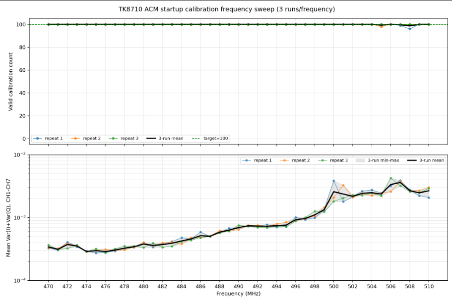

# 470–510 MHz ACM 每频点重复三次复测统计分析

## 1. 结论摘要

本轮使用同一份 RK3506 `TestTRMmain`，按 470 MHz 到 510 MHz 升频顺序、1 MHz 步进，每个频点连续运行 3 次，共完成 41 × 3 = 123 次初始化 ACM 校准测试。

| 项目 | 结果 |
|---|---:|
| 测试运行数 | 123 |
| 正常退出 | 123/123 |
| 强制退出 | 0 |
| 理论校准总数 | 12,300 |
| 有效校准总数 | 12,293 |
| 总体有效率 | 99.943% |
| 达到 100/100 的运行 | 120/123（97.56%） |
| 三次均达到 100/100 的频点 | 38/41（92.68%） |
| 出现未满额的频点 | 505、507、508 MHz |
| 三次均未达到 100/100 的频点 | 无 |
| 最低单次结果 | 508 MHz，第1次，96/100 |

结论：本轮整体校准成功率很高，470–504 MHz 全部 3/3 达到 100/100；505、507、508 MHz 各有一次轻微缺失，后续重复能够恢复到 100/100。当前数据没有表现出“频率越高、结果越差”的单调趋势，但高频段仍比 470–499 MHz 更容易出现偶发波动。

## 2. 测试条件与证据范围

| 项目 | 配置 |
|---|---|
| 板卡 IP | `192.168.100.140` |
| 本地程序 | `D:\CodexWorkSpace\tk8710_hal_v1.6\build_rk3506\TestTRMmain` |
| 板端程序 | `/userdata/TestTRMmain` |
| 本地/板端 SHA-256 | `d4f7d577d88b2227e1aaffe242464ce22c63fb9c7d04a189c4a9ed13cdc838b1` |
| 固定参数 | `6 20 20 20 400 126 <frequency_hz> 46` |
| 频率范围 | 470–510 MHz |
| 步进 | 1 MHz |
| 每个频点重复数 | 3 |
| 执行顺序 | 470 MHz 第1～3次，然后 471 MHz 第1～3次，依次升频到 510 MHz |
| 单次运行配置 | 10 秒后发送 `q` |
| 单次实际耗时 | 14～15 秒（含启动、退出和日志下载） |
| 测试时段 | 2026-08-12 10:56:18 ～ 11:28:04 |

测试工具为每次运行建立独立远端目录。通用命令形式如下：

```text
cd '/userdata/trm_run_<timestamp>_repeat3_<frequency>MHz_r<repeat>' && \
'/userdata/TestTRMmain_with_userdata_config.sh' \
'6' '20' '20' '20' '400' '126' '<frequency_hz>' '46'
```

兼容脚本只负责在独立运行目录中链接板端已有的 `/userdata/TxDC`，随后执行 `/userdata/TestTRMmain`，避免相对路径缺失导致 TXADC 配置未加载。

原始日志根目录：

```text
D:\CodexWorkSpace\tk8710_hal_v1.6\rk3506_test_logs\acm_repeat3_20260812_1056_470_510\runs
```

首个远端目录：

```text
/userdata/trm_run_20260812_105618_repeat3_470MHz_r1
```

末个远端目录：

```text
/userdata/trm_run_20260812_112754_repeat3_510MHz_r3
```

## 3. 各频点三次有效校准次数

判定规则：单次初始化目标为 100 次有效校准；`100/100` 记为满额通过。标准差使用三次结果的样本标准差。

### 3.1 470–479 MHz

| 频率/MHz | 第1次 | 第2次 | 第3次 | 均值 | 标准差 | 极差 | 满额次数 |
|---:|---:|---:|---:|---:|---:|---:|---:|
| 470 | 100 | 100 | 100 | 100.00 | 0.00 | 0 | 3/3 |
| 471 | 100 | 100 | 100 | 100.00 | 0.00 | 0 | 3/3 |
| 472 | 100 | 100 | 100 | 100.00 | 0.00 | 0 | 3/3 |
| 473 | 100 | 100 | 100 | 100.00 | 0.00 | 0 | 3/3 |
| 474 | 100 | 100 | 100 | 100.00 | 0.00 | 0 | 3/3 |
| 475 | 100 | 100 | 100 | 100.00 | 0.00 | 0 | 3/3 |
| 476 | 100 | 100 | 100 | 100.00 | 0.00 | 0 | 3/3 |
| 477 | 100 | 100 | 100 | 100.00 | 0.00 | 0 | 3/3 |
| 478 | 100 | 100 | 100 | 100.00 | 0.00 | 0 | 3/3 |
| 479 | 100 | 100 | 100 | 100.00 | 0.00 | 0 | 3/3 |

本段 30 次运行全部达到 100/100，总体有效率 100%。

### 3.2 480–489 MHz

| 频率/MHz | 第1次 | 第2次 | 第3次 | 均值 | 标准差 | 极差 | 满额次数 |
|---:|---:|---:|---:|---:|---:|---:|---:|
| 480 | 100 | 100 | 100 | 100.00 | 0.00 | 0 | 3/3 |
| 481 | 100 | 100 | 100 | 100.00 | 0.00 | 0 | 3/3 |
| 482 | 100 | 100 | 100 | 100.00 | 0.00 | 0 | 3/3 |
| 483 | 100 | 100 | 100 | 100.00 | 0.00 | 0 | 3/3 |
| 484 | 100 | 100 | 100 | 100.00 | 0.00 | 0 | 3/3 |
| 485 | 100 | 100 | 100 | 100.00 | 0.00 | 0 | 3/3 |
| 486 | 100 | 100 | 100 | 100.00 | 0.00 | 0 | 3/3 |
| 487 | 100 | 100 | 100 | 100.00 | 0.00 | 0 | 3/3 |
| 488 | 100 | 100 | 100 | 100.00 | 0.00 | 0 | 3/3 |
| 489 | 100 | 100 | 100 | 100.00 | 0.00 | 0 | 3/3 |

本段 30 次运行全部达到 100/100，总体有效率 100%。

### 3.3 490–499 MHz

| 频率/MHz | 第1次 | 第2次 | 第3次 | 均值 | 标准差 | 极差 | 满额次数 |
|---:|---:|---:|---:|---:|---:|---:|---:|
| 490 | 100 | 100 | 100 | 100.00 | 0.00 | 0 | 3/3 |
| 491 | 100 | 100 | 100 | 100.00 | 0.00 | 0 | 3/3 |
| 492 | 100 | 100 | 100 | 100.00 | 0.00 | 0 | 3/3 |
| 493 | 100 | 100 | 100 | 100.00 | 0.00 | 0 | 3/3 |
| 494 | 100 | 100 | 100 | 100.00 | 0.00 | 0 | 3/3 |
| 495 | 100 | 100 | 100 | 100.00 | 0.00 | 0 | 3/3 |
| 496 | 100 | 100 | 100 | 100.00 | 0.00 | 0 | 3/3 |
| 497 | 100 | 100 | 100 | 100.00 | 0.00 | 0 | 3/3 |
| 498 | 100 | 100 | 100 | 100.00 | 0.00 | 0 | 3/3 |
| 499 | 100 | 100 | 100 | 100.00 | 0.00 | 0 | 3/3 |

本段 30 次运行全部达到 100/100，总体有效率 100%。

### 3.4 500–510 MHz

| 频率/MHz | 第1次 | 第2次 | 第3次 | 均值 | 标准差 | 极差 | 满额次数 |
|---:|---:|---:|---:|---:|---:|---:|---:|
| 500 | 100 | 100 | 100 | 100.00 | 0.00 | 0 | 3/3 |
| 501 | 100 | 100 | 100 | 100.00 | 0.00 | 0 | 3/3 |
| 502 | 100 | 100 | 100 | 100.00 | 0.00 | 0 | 3/3 |
| 503 | 100 | 100 | 100 | 100.00 | 0.00 | 0 | 3/3 |
| 504 | 100 | 100 | 100 | 100.00 | 0.00 | 0 | 3/3 |
| 505 | 100 | 98 | 100 | 99.33 | 1.15 | 2 | 2/3 |
| 506 | 100 | 100 | 100 | 100.00 | 0.00 | 0 | 3/3 |
| 507 | 99 | 100 | 100 | 99.67 | 0.58 | 1 | 2/3 |
| 508 | 96 | 100 | 100 | 98.67 | 2.31 | 4 | 2/3 |
| 509 | 100 | 100 | 100 | 100.00 | 0.00 | 0 | 3/3 |
| 510 | 100 | 100 | 100 | 100.00 | 0.00 | 0 | 3/3 |

本段获得 3,293/3,300 次有效校准，总体有效率 99.788%；30/33 次运行达到 100/100。未满额只发生在 505 MHz 第2次、507 MHz 第1次和 508 MHz 第1次。

## 4. 重复轮次与分段统计

### 4.1 三次重复的整体表现

| 重复序号 | 有效总数/4100 | 平均值 | 标准差 | 最低值 | 100/100 运行数 |
|---:|---:|---:|---:|---:|---:|
| 第1次 | 4095 | 99.878 | 0.640 | 96 | 39/41 |
| 第2次 | 4098 | 99.951 | 0.312 | 98 | 40/41 |
| 第3次 | 4100 | 100.000 | 0.000 | 100 | 41/41 |

第3次重复全部满额，第1次的波动最大。该现象支持“重复运行后状态趋于稳定”的可能性，但测试顺序固定，重复序号同时关联了运行时间，因此不能仅凭本轮数据认定为热稳定效应。

### 4.2 分段汇总

| 频段/MHz | 运行数 | 有效数/理论数 | 有效率 | 100/100 运行数 | 最低单次 |
|---|---:|---:|---:|---:|---:|
| 470–479 | 30 | 3000/3000 | 100.000% | 30/30 | 100 |
| 480–489 | 30 | 3000/3000 | 100.000% | 30/30 | 100 |
| 490–499 | 30 | 3000/3000 | 100.000% | 30/30 | 100 |
| 500–510 | 33 | 3293/3300 | 99.788% | 30/33 | 96 |

## 5. 三个未满额运行的日志证据

| 频率 | 重复 | 有效次数 | 因子块数 | 退出状态 | 关键错误 |
|---:|---:|---:|---:|---|---|
| 505 MHz | 2 | 98 | 98 | 正常退出 | ACM 校准未达到目标次数，需要重新校准 |
| 507 MHz | 1 | 99 | 99 | 正常退出 | ACM 校准未达到目标次数，需要重新校准 |
| 508 MHz | 1 | 96 | 96 | 正常退出 | ACM 校准未达到目标次数，需要重新校准 |

三次异常运行中的“有效校准次数”与保存的校准因子块数完全一致，说明不是统计提取遗漏。程序仍正常完成初始化、进入运行态并响应 `q` 退出，因此应将其判断为“校准未满额”，而不是程序崩溃或通信中断。

## 6. 校准因子方差辅助分析

因子解析采用 18 位有符号定点数并除以 `2^15`。每个运行内按通道计算 I/Q 样本方差，复数总方差定义为 `Var(I) + Var(Q)`；CH0 为固定参考 `1+j0`，频点平均方差使用 CH1～CH7。

| 通道 | 123轮平均幅度 | 123轮平均复数方差 | 最大单轮方差 | 最大值位置 |
|---:|---:|---:|---:|---|
| CH0 | 1.000000 | 0.00000000 | 0.00000000 | 固定参考 |
| CH1 | 0.842828 | 0.00088109 | 0.00395201 | 503 MHz 第1次 |
| CH2 | 1.180029 | 0.00097742 | 0.00205568 | 504 MHz 第1次 |
| CH3 | 0.814829 | 0.00183361 | 0.01956012 | 500 MHz 第1次 |
| CH4 | 0.968195 | 0.00035196 | 0.00063387 | 493 MHz 第1次 |
| CH5 | 1.119905 | 0.00130261 | 0.00445201 | 506 MHz 第3次 |
| CH6 | 0.951191 | 0.00029939 | 0.00066249 | 492 MHz 第2次 |
| CH7 | 1.296038 | 0.00218741 | 0.01610373 | 507 MHz 第1次 |

CH7 的跨运行平均复数方差最大，CH3 次之；507 MHz 的 CH1～CH7 平均方差在所有频点中最高。507 MHz 第1次恰好出现 99/100，但 505 MHz 第2次与 508 MHz 第1次的方差并非全频段最高，因此“因子方差大”与“有效次数不足”存在局部重合，尚不能视为一一对应的原因。

## 7. 与稍早同版本 500–510 MHz 三次测试的比较

两轮均使用 SHA-256 为 `d4f7d577...38b1` 的程序和相同参数，具有直接比较价值。

| 项目 | 稍早直接测试500–510 MHz | 本轮完整升频扫频中的500–510 MHz |
|---|---:|---:|
| 有效总数 | 3207/3300（97.18%） | 3293/3300（99.79%） |
| 100/100 运行 | 21/33（63.64%） | 30/33（90.91%） |
| 三次均满额频点 | 500、501、505、506、508 MHz | 500–504、506、509、510 MHz |
| 三次均未满额频点 | 509、510 MHz | 无 |

本轮增加 86 次有效结果，满额运行增加 9 次，509 MHz 和 510 MHz 从三次均不满额变为三次均满额。这说明高频结果不是固定、不可恢复的频率缺陷。

最重要的实验差异是：稍早测试从 500 MHz 直接开始；本轮到达 500 MHz 前，设备已经完成 470–499 MHz 共 90 次运行。因而以下变量被混在一起：

1. 板卡、PA、时钟或模拟前端的温度和稳定时间；
2. 前一次频点/校准对后一次运行留下的状态；
3. 天线阵列及周围环境在两轮测试之间的变化；
4. 校准算法本身的随机波动。

因此，本轮结果支持“预热或运行历史会改善高频校准”的假设，但还不能证明该假设。

## 8. 建议的下一步验证

1. 保持当前二进制和硬件环境不变，分别做一次 510→470 MHz 降频扫频，与本次升频结果对照。如果异常跟随测试前期而不是固定频率，时间/温度因素的可能性会明显增大。
2. 冷机后只测 509、510 MHz，各连续 10 次；预热 30 分钟后再各测 10 次，同时记录板温、PA温度和 `gain.txt`。
3. 将 470、490、505、507、508、510 MHz 随机排序重复测试，消除固定升频顺序与时间的耦合。
4. 对未达到 100/100 的运行保存逐通道、逐 tone SNR，重点检查 CH7、CH3，以及 ACM0/ACM1 两组方向，确认丢失是否集中在固定通道或固定 tone。
5. 工程验收不要只看总有效率。建议暂定每频点连续 3 次均须达到 100/100；按此严格条件，本轮 505、507、508 MHz 仍需复核。

## 9. 日志与工具统计说明

| 统计项 | 123次合计 | 说明 |
|---|---:|---|
| stdout `[ERROR]` | 3 | 对应上述3个未满额运行 |
| driver log `[ERROR]` | 3 | 与 stdout 为同一组错误的文件日志副本 |
| TRM log `[ERROR]` | 0 | 无 TRM 错误 |
| stdout `[WARN]` | 246 | 每轮2条 Slot/Frame 时长提示 |
| driver log `[WARN]` | 246 | 与 stdout 为同一组提示的文件日志副本 |
| `ACM calibration requested` | 0 | 技能英文运行期模式未命中本程序中文初始化日志 |
| `ACM hidden in slot3` | 0 | 本测试统计的是初始化 ACM，不是运行期隐藏校准 |
| `valid=0` / `valid=1` | 0 / 0 | 同上；有效性以中文完成日志和因子块为准 |
| `ACM calibration has no valid result` | 0 | 未命中 |
| `ACM calibration request rejected` | 0 | 未命中 |
| RX user events | 4 | 非本轮校准判定指标 |
| sent-user events | 4 | 非本轮校准判定指标 |

最后一次 510 MHz 第3次运行的 IRQ 统计如下：

| 类型 | 次数 | 总耗时/us | 平均/us | 最大/us | 最小/us |
|---|---:|---:|---:|---:|---:|
| MD_UD | 8 | 31083 | 3885 | 4186 | 3821 |
| MD_DATA | 7 | 1063 | 151 | 214 | 130 |
| S0 | 8 | 32 | 4 | 5 | 3 |
| S1 | 8 | 3882 | 485 | 600 | 436 |
| S2 | 7 | 22 | 3 | 4 | 3 |
| S3 | 7 | 259 | 37 | 39 | 35 |

## 10. 分析产物

有效校准次数与 CH1～CH7 平均复数方差的组合图：

[查看三次重复的有效次数与方差图](../rk3506_test_logs/acm_repeat3_20260812_1056_470_510/analysis/acm_valid_count_and_variance.png)



图中上半部分保留三次有效校准次数，并以黑线表示三次均值；下半部分采用与单次扫频图一致的对数方差纵轴，三条曲线分别表示三次重复，黑线为三次均值，灰色区域为三次最小值到最大值的范围。

```text
rk3506_test_logs/acm_repeat3_20260812_1056_470_510/analysis/
├── acm_valid_count_and_variance.png
├── repeat_run_statistics.csv
├── repeat_frequency_summary.csv
├── repeat_channel_statistics.csv
├── repeat_valid_count_statistics.png
└── repeat_analysis_summary.json
```

其中 `repeat_run_statistics.csv` 可追溯到每次运行的本地目录和远端目录；`repeat_frequency_summary.csv` 为本文频点表的数据源；`repeat_channel_statistics.csv` 保存每个频点、每次重复、每个通道的因子均值和方差。
