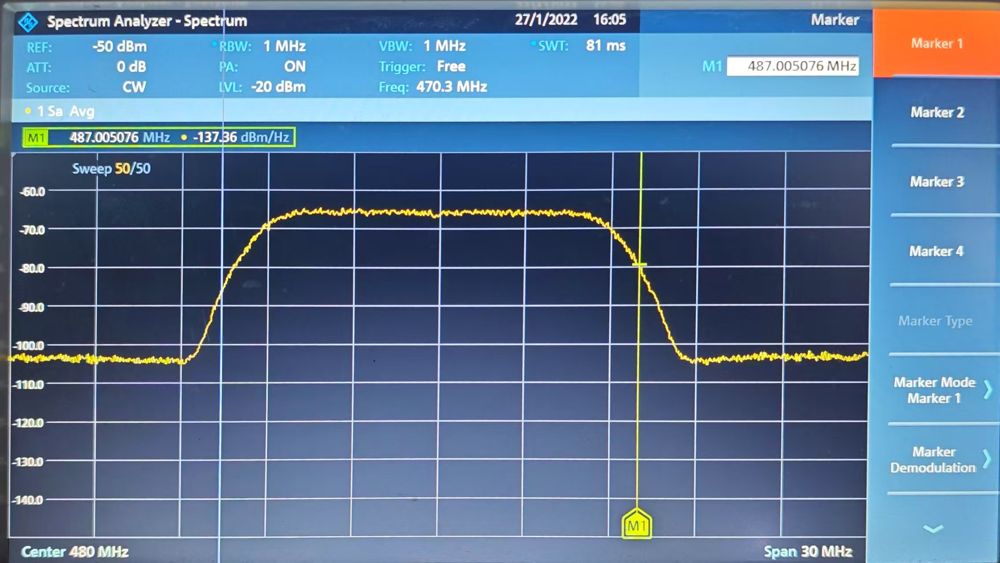
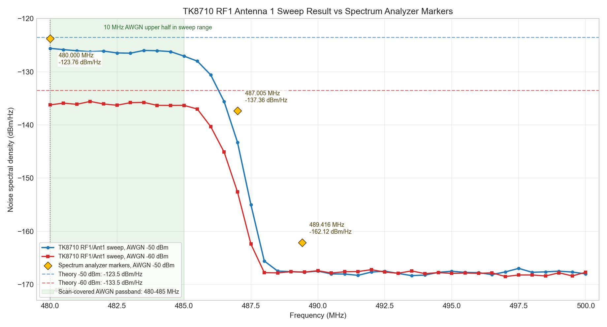

# TK8710 扫频功能验证记录

## 1. 文档目的

本文记录 TK8710 扫频功能的实现方案、测试方案和已验证的测试结果。验证重点是：在射频输入端送入已知功率、带宽和频点的 AWGN 信号后，扫频输出的噪声谱密度结果是否与理论输入噪声功率一致。

## 2. 实现方案

### 2.1 功能入口

当前扫频功能复用现有 HAL/TRM 主线实现，主要入口如下：

| 层级 | 文件 | 作用 |
|------|------|------|
| 扫频服务入口 | `src/tk8710_scan_service.c` | 提供 `TK8710ScanStart()`，完成扫频参数校验、HAL 初始化、时隙配置和扫频启动 |
| TRM 扫频状态机 | `src/trm/trm_core.c` | 提供 `TRM_StartFrequencySweep()`、`TRM_StopFrequencySweep()`、`TRM_GetSweepState()`，并在中断回调中推进扫频 |
| 噪底计算 | `inc/tk8710_noise_api.h` | 对采集数据做 FFT 噪底计算，并保存扫频结果 |
| IPC 扫频服务 | `src/tk8710_scan_ipc_server.c` | 接收扫频命令，调用 `TK8710ScanStart()`，并轮询扫频状态 |

### 2.2 启动流程

1. 上层调用 `TK8710ScanStart(start_freq, end_freq, sweep_mode)`。
2. `tk8710_scan_service.c` 中的 `DoFrequencySweep()` 校验起止频率和扫频模式。
3. 根据 `sweep_mode` 映射 TK8710 速率模式：

| sweep_mode | 扫频步进 | 对应速率模式 |
|------------|----------|--------------|
| 0 | 62.5 kHz | `TK8710_RATE_MODE_5` |
| 1 | 125 kHz | `TK8710_RATE_MODE_6` |
| 2 | 250 kHz | `TK8710_RATE_MODE_7` |
| 3 | 500 kHz | `TK8710_RATE_MODE_8` |

4. 扫频服务重新初始化 TRM/HAL，并配置 RF 初始频点为 `start_freq`。
5. 配置单速率时隙，设置 `slot_cfg.rateCount = 1`、`slot_cfg.rateModes[0] = rate_mode`，并将 S0/S1/S2/S3 的 `centerFreq` 配置为起始频点。
6. 调用 `TK8710HalStart()` 启动 HAL 主流程。
7. 调用 `TRM_StartFrequencySweep(start_freq, end_freq, sweep_mode, rate_mode)` 启动 TRM 扫频状态机。

### 2.3 扫频状态机

`TRM_StartFrequencySweep()` 负责初始化 `g_sweepState`：

- `sweep_active = 1` 表示扫频进行中。
- `start_freq`、`end_freq`、`current_freq` 记录扫频范围和当前频点。
- `step_freq` 由 `sweep_mode` 决定，分别为 62.5 kHz、125 kHz、250 kHz、500 kHz。
- `rfSel` 从当前 `slotCfg` 获取，用于后续 RF 寄存器写入。
- `rxgain`、`txgain` 使用当前实现中的默认值 `0x7E` 和 `0x2A`。

扫频推进依赖 TRM 中断回调：

1. S3 时隙结束时检查扫频状态。
2. 每 4 帧触发一次扫频采集准备。
3. `TRM_ConfigSweepCapture()` 置位采集寄存器，等待后续 RX 时隙采集数据。
4. RX 回调中执行 `TK8710DebugCtrl(TK8710_DBG_TYPE_CAPTURE_DATA, TK8710_DBG_OPT_GET, NULL, NULL)` 获取采集数据。
5. 调用 `tk8710_sweep_noise_process("8710CaptureData", rate_mode, current_freq, append_result)` 计算并保存当前频点噪底。
6. 当前频点采集完成后，`TRM_UpdateSweepFrequencyAfterCapture()` 将 `current_freq` 增加 `step_freq`。
7. 若 `current_freq > end_freq`，清除 `sweep_active`，扫频结束；否则写 RF RX/TX 频率寄存器和增益寄存器，切换到下一个频点。

### 2.4 结果输出

扫频结果由 `tk8710_sweep_noise_process()` 保存到：

```text
SweepFreqResult/Reslut.txt
```

当前输出格式为：

```text
频点 Hz
天线 1 噪声谱密度 dBm/Hz
天线 2 噪声谱密度 dBm/Hz
...
天线 8 噪声谱密度 dBm/Hz
```

其中噪声谱密度计算使用：

```text
noise_dbm = 10 * log10(noise_floor) + TK8710_ANOISE_OFFSET
```

当前 `TK8710_ANOISE_OFFSET` 为 `-140.0f`，输出单位按 dBm/Hz 记录。

## 3. 测试方案

### 3.1 测试目的

通过信号源产生固定频点、固定总功率和固定带宽的 AWGN 信号，先用频谱仪确认实际输出功率，再将同一路 AWGN 信号送入 TK8710 射频输入端，执行扫频并对比扫频结果与理论噪声谱密度是否一致。

### 3.2 测试设备和连接

| 设备/链路 | 用途 |
|-----------|------|
| 信号源 | 产生指定频点、功率、带宽的 AWGN 信号 |
| 测试线缆 | 将信号源输出送入频谱仪或 TK8710 射频输入端 |
| 频谱仪 | 测量经过线缆后的实际噪声功率 |
| TK8710 测试板 | 执行扫频并输出噪底结果 |

连接方式：

1. 信号源输出 AWGN 信号。
2. 先经过同一测试线缆接入频谱仪，确认线缆后端实际功率。
3. 再将同一路 AWGN 信号通过同一测试线缆接入 TK8710 射频输入端。
4. 启动 TK8710 扫频，观察扫频结果中对应频点的噪声谱密度。

### 3.3 判定方法

信号源设置的是指定带宽内的总噪声功率，扫频结果按 dBm/Hz 输出。因此理论噪声谱密度按下式换算：

```text
输入噪声谱密度 = 信号源总噪声功率 - 10 * log10(AWGN 带宽 Hz) - 线损
```

本次测试线损按 `3.5 dB` 计算。

若扫频输出结果与上述理论噪声谱密度接近，则说明扫频噪底结果能够反映输入 AWGN 噪声功率。

## 4. 测试结果

本章测试结果均在扫频模式 3 下获得，对应扫频步进为 500 kHz，速率模式为 `TK8710_RATE_MODE_8`。本次 AWGN 信号只送入射频 1，因此结果分析重点观察 RF1/天线 1 的扫频输出；其他天线作为未注入通道参考。

原始测试结果已归档：

| 文件 | 说明 |
|------|------|
| `docs/assets/sweep_freq/Reslut(-50).txt` | AWGN 设置为 -50 dBm 时的扫频结果 |
| `docs/assets/sweep_freq/Reslut(-60).txt` | AWGN 设置为 -60 dBm 时的扫频结果 |
| `docs/assets/sweep_freq/spectrum_awgn_50dbm_marker_480mhz.jpg` | -50 dBm AWGN 频谱仪结果，marker 位于 480 MHz |
| `docs/assets/sweep_freq/spectrum_awgn_50dbm_marker_487mhz.jpg` | -50 dBm AWGN 频谱仪结果，marker 位于 487.005076 MHz |
| `docs/assets/sweep_freq/spectrum_awgn_50dbm_marker_489mhz.jpg` | -50 dBm AWGN 频谱仪结果，marker 位于 489.416244 MHz |

### 4.1 频谱仪测试结果

频谱仪测试条件如下：

| 项目 | 参数 |
|------|------|
| 信号类型 | AWGN |
| 中心频率 | 480 MHz |
| 信号源总噪声功率 | -50 dBm |
| AWGN 带宽 | 10 MHz |
| 频谱仪 Span | 30 MHz |
| 频谱仪 RBW/VBW | 1 MHz / 1 MHz |

频谱仪测试截图如下：





从截图读取到的 marker 结果如下：

| Marker 频点 | 频谱仪读数 |
|-------------|------------|
| 480 MHz | -123.76 dBm/Hz |
| 487.005076 MHz | -137.36 dBm/Hz |
| 489.416244 MHz | -162.12 dBm/Hz |

其中 480 MHz 处的频谱仪读数 `-123.76 dBm/Hz` 与 -50 dBm、10 MHz AWGN 的理论噪声谱密度 `-123.5 dBm/Hz` 接近；频偏到 AWGN 带宽边缘和带外后，频谱仪读数逐步降低。

### 4.2 TK8710 -60 dBm AWGN 扫频测试

测试条件：

| 项目 | 参数 |
|------|------|
| 信号类型 | AWGN |
| 扫频模式 | 模式 3 |
| 扫频步进 | 500 kHz |
| 对应速率模式 | `TK8710_RATE_MODE_8` |
| 中心频率 | 480 MHz |
| 信号源总噪声功率 | -60 dBm |
| AWGN 带宽 | 10 MHz |
| 测试线损 | 3.5 dB |
| AWGN 注入通道 | 射频 1 |
| 原始结果文件 | `docs/assets/sweep_freq/Reslut(-60).txt` |

理论换算：

```text
10 * log10(10000000) = 70 dB
输入噪声谱密度 = -60 - 70 - 3.5 = -133.5 dBm/Hz
```

RF1/天线 1 扫频结果统计：

| 统计项 | 结果 |
|--------|------|
| 480 MHz 单点结果 | -136.24 dBm/Hz |
| 480 MHz ~ 485 MHz 均值 | -136.07 dBm/Hz |
| 480 MHz ~ 485 MHz 范围 | -136.33 ~ -135.58 dBm/Hz |
| 488 MHz ~ 500 MHz 带外均值 | 约 -167.63 dBm/Hz |

结果判断：RF1/天线 1 在 480 MHz ~ 485 MHz 区间明显高于带外噪底，实测均值约 `-136.07 dBm/Hz`。与理论输入噪声谱密度 `-133.5 dBm/Hz` 相比约低 2.6 dB，但相对 -50 dBm 测试结果保持约 10 dB 的功率变化关系，能够反映输入 AWGN 功率变化。

### 4.3 TK8710 -50 dBm AWGN 扫频测试

测试条件：

| 项目 | 参数 |
|------|------|
| 信号类型 | AWGN |
| 扫频模式 | 模式 3 |
| 扫频步进 | 500 kHz |
| 对应速率模式 | `TK8710_RATE_MODE_8` |
| 中心频率 | 480 MHz |
| 信号源总噪声功率 | -50 dBm |
| AWGN 带宽 | 10 MHz |
| 测试线损 | 3.5 dB |
| AWGN 注入通道 | 射频 1 |
| 原始结果文件 | `docs/assets/sweep_freq/Reslut(-50).txt` |

理论换算：

```text
10 * log10(10000000) = 70 dB
输入噪声谱密度 = -50 - 70 - 3.5 = -123.5 dBm/Hz
```

RF1/天线 1 扫频结果统计：

| 统计项 | 结果 |
|--------|------|
| 480 MHz 单点结果 | -125.60 dBm/Hz |
| 480 MHz ~ 485 MHz 均值 | -126.19 dBm/Hz |
| 480 MHz ~ 485 MHz 范围 | -127.06 ~ -125.60 dBm/Hz |
| 488 MHz ~ 500 MHz 带外均值 | 约 -167.19 dBm/Hz |

结果判断：RF1/天线 1 在 480 MHz ~ 485 MHz 区间明显高于带外噪底，实测均值约 `-126.19 dBm/Hz`。与理论输入噪声谱密度 `-123.5 dBm/Hz` 相比约低 2.7 dB；与频谱仪 480 MHz marker 读数 `-123.76 dBm/Hz` 相比约低 1.8 dB。

### 4.4 RF1/天线 1 扫频曲线对比

下图将 `Reslut(-50).txt` 和 `Reslut(-60).txt` 中第一根天线的扫频结果画成曲线，并叠加 -50 dBm AWGN 的频谱仪 marker 读数。由于当前扫频范围为 480 MHz ~ 500 MHz，而 AWGN 中心频率为 480 MHz、带宽 10 MHz，扫频数据主要覆盖 AWGN 上半带宽，即 480 MHz ~ 485 MHz。



从曲线可见：

1. -50 dBm 与 -60 dBm 两组扫频曲线在 480 MHz ~ 485 MHz 区间整体相差约 10 dB，与信号源功率设置差值一致。
2. 480 MHz ~ 485 MHz 区间为 AWGN 注入后 RF1/天线 1 的高噪声区，扫频结果随频点升高逐渐进入带宽边缘并下降。
3. 488 MHz 之后两组结果均回落到约 -167 dBm/Hz 附近，说明带外频点基本回到未注入信号时的噪底。
4. 频谱仪 marker 在 480 MHz 处读数为 `-123.76 dBm/Hz`，与 TK8710 RF1/天线 1 在 480 MHz 处的 `-125.60 dBm/Hz` 接近；在 487 MHz 和 489 MHz 附近，频谱仪和 TK8710 曲线都呈现带外下降趋势。

## 5. 结论

本次验证中，信号源分别输出 `480 MHz / 10 MHz 带宽 / -60 dBm` 和 `480 MHz / 10 MHz 带宽 / -50 dBm` 的 AWGN 信号，且 AWGN 只送入射频 1。扣除 10 MHz 带宽换算和 3.5 dB 线损后，理论输入噪声谱密度分别为 `-133.5 dBm/Hz` 和 `-123.5 dBm/Hz`。

原始扫频文件显示，RF1/天线 1 在 480 MHz ~ 485 MHz 区间的均值分别为 `-136.07 dBm/Hz` 和 `-126.19 dBm/Hz`，两组结果之间保持约 10 dB 差值，能够反映输入 AWGN 功率从 -60 dBm 提升到 -50 dBm 的变化。-50 dBm 条件下，频谱仪 480 MHz marker 读数为 `-123.76 dBm/Hz`，TK8710 RF1/天线 1 的 480 MHz 单点结果为 `-125.60 dBm/Hz`，二者接近。

由此可确认：当前扫频功能能够对射频 1 输入的 AWGN 噪声功率作出正确响应；扫频曲线在 AWGN 带内明显抬高，带外回落到噪底，趋势与频谱仪测试结果一致。

## 6. 后续建议

1. 后续若需要形成回归验证，可固定记录 `start_freq`、`end_freq`、`sweep_mode`、`rate_mode` 和 `SweepFreqResult/Reslut.txt` 原始输出。
3. 如需长期保存测试数据，建议将频谱仪截图、信号源设置截图和扫频结果文件一起归档。
