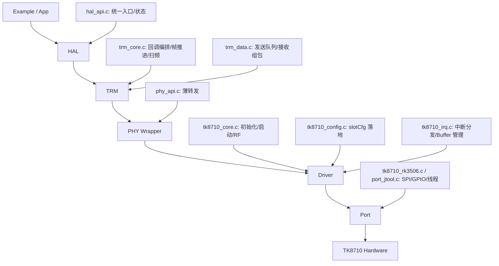

# TK8710 项目主线梳理

## 1. 目的

本文档用于沉淀当前仓库的主线结构认知，覆盖以下内容：

- 项目当前主线分层与关键目录
- 入口文件、构建入口、推荐阅读顺序
- 初始化链路
- 中断收发链路
- `slotCfg_t` 核心配置结构说明
- 模块职责图
- 当前实现中的几个重要现实约束

本文档基于当前代码仓库实际实现整理，不是理想化设计图。

---

## 2. 当前主线结论

当前仓库的推荐主线是：

`HAL -> TRM -> PHY -> Driver -> Port -> Hardware`

但代码中同时保留了较多历史直调路径，尤其是：

`Driver/TRM -> Port`

因此它不是一个完全“只剩 HAL 接口”的纯净工程，而是“新主线 + 旧实现并存”的状态。

最重要的判断有两点：

1. `src/phy/*` 当前主要是薄包装层，真正的业务组织仍在 `src/trm/*`，真正的硬件控制仍在 `src/driver/*`。
2. RK3506 的实际完整构建更接近 `cmake/build_rk3506.sh`，而不是 `cmake/Makefile.rk3506` 这类较老的构建脚本。

---

## 3. 关键目录与关键文件

### 3.1 顶层目录

- `inc/`：对外头文件与内部公共类型
- `src/`：核心实现
- `port/`：平台适配层
- `test/`：示例程序和 Driver 测试入口
- `cmake/`：构建入口
- `docs/`：设计与说明文档

### 3.2 对外 API 入口

- `inc/hal_api.h`
- `inc/phy/phy_api.h`
- `inc/trm/trm_api.h`
- `inc/driver/tk8710_driver_api.h`

### 3.3 核心实现入口

- `src/hal/hal_api.c`
- `src/trm/trm_core.c`
- `src/trm/trm_data.c`
- `src/driver/tk8710_core.c`
- `src/driver/tk8710_config.c`
- `src/driver/tk8710_irq.c`
- `port/tk8710_rk3506.c`
- `port/jtool/port_jtool.c`

### 3.4 推荐看的程序入口

#### 新主线入口

- `test/example/TestTRMmain.c`
- `test/example/TestTRMmain_IPC.c`

#### 老直调入口

- `test/example/test8710main_3506.c`
- `test/example/test8710main_jtool.c`

#### 最小编译验证

- `test/example/test_hal_phy_api.c`

---

## 4. 构建入口

### 4.1 当前最重要的构建文件

- `cmake/CMakeLists.txt`
- `cmake/build_rk3506.sh`
- `cmake/Makefile.jtool`
- `cmake/toolchain-rk3506.cmake`

### 4.2 现状判断

- `cmake/CMakeLists.txt` 会构建 `tk8710_hal` 静态库，并附带一个很轻的 `test_hal_phy_api` 冒烟示例。
- `cmake/build_rk3506.sh` 更像当前 RK3506 的实际完整构建脚本，除了 HAL/PHY/TRM/Driver，还会把 IPC、扫频相关模块一起编译进去。
- `cmake/Makefile.rk3506` 中存在较明显的旧路径残留，和当前仓库实际目录并不完全一致。

---

## 5. 推荐阅读顺序

推荐按下面顺序读代码：

1. `test/example/TestTRMmain.c`
2. `src/hal/hal_api.c`
3. `src/trm/phy_cfg.c`
4. `src/trm/trm_core.c`
5. `src/trm/trm_data.c`
6. `src/driver/tk8710_core.c`
7. `src/driver/tk8710_config.c`
8. `src/driver/tk8710_irq.c`
9. `port/tk8710_rk3506.c` 或 `port/jtool/port_jtool.c`

这样能先建立“应用怎么用”，再落到“底层具体怎么干”。

---

## 6. 主线调用总图



---

## 7. 初始化链路

推荐从 `test/example/TestTRMmain.c` 理解初始化主线。

### 7.1 调用路径图

```text
TestTRMmain.c
  -> TK8710HalInit()
    -> TK8710HalCbStore()
    -> TK8710HalCbBuildTrmConfig()
    -> TRM_PhyInit()
      -> TK8710PhyInit()
        -> TK8710Init()
          -> TK8710SpiInit()
          -> TK8710Reset(TK8710_RST_ALL)
          -> TK8710GpioInit(... default_gpio_irq_handler ...)
          -> TK8710GpioIrqEnable(0, 1)
          -> 可选 TK8710RfConfig()
          -> 写 init_0/init_5/init_9/irq_ctrl1 等基础寄存器
      -> TRM_Init()
        -> TRM_BeamInit()
        -> TRM_DataInit()
        -> TRM_RegisterDriverCallbacks()
          -> TK8710RegisterCallbacks()
  -> TK8710HalCfg()
    -> TRM_PhyConfig()
      -> TK8710PhyCfg(TK8710_CFG_TYPE_SLOT_CFG, slotCfg)
        -> TK8710SetConfig(TK8710_CFG_TYPE_SLOT_CFG, ...)
          -> 更新 g_slotCfg
          -> 把时隙/速率/长度等配置写入寄存器
  -> TK8710HalStart()
    -> TRM_PhyStart()
      -> TK8710PhyStart(TK8710_MODE_MASTER, TK8710_WORK_MODE_CONTINUOUS)
        -> TK8710Start()
          -> 按 master/slave 配置 irq_ctrl0
          -> 写 trx_trig0 / trx_trig1 启动收发
```

### 7.2 每层职责

#### HAL

- 负责统一入口
- 负责状态约束
- 负责把上层回调转换成 TRM 配置

#### TRM

- 负责 Beam 管理初始化
- 负责发送队列初始化
- 负责向 Driver 注册中断回调

#### Driver

- 负责 SPI、GPIO、RF、寄存器初始化
- 负责实际 `slotCfg_t` 配置落地
- 负责启动主从工作模式

---

## 8. 中断收发链路

### 8.1 中断总入口

中断不是从 TRM 开始，而是从 Port 层 GPIO 线程开始：

```text
RK3506 IRQ thread
  -> g_halIrqCallback()
    -> default_gpio_irq_handler()
      -> TK8710_IRQHandler()
        -> 读 irq_res
        -> 按位分发到 tk8710_handle_xxx()
        -> 根据中断类型回调 g_driverCallbacks
```

TRM 在初始化时注册的回调是：

- `onRxData -> TRM_OnDriverSlotRxAdapter`
- `onTxSlot -> TRM_OnDriverTxSlotAdapter`
- `onSlotEnd -> TRM_OnDriverSlotEndAdapter`

### 8.2 接收链路：MD_DATA

```text
GPIO IRQ
  -> TK8710_IRQHandler()
    -> tk8710_handle_md_data()
      -> tk8710_md_data_process()
      -> tk8710_md_data_read_signal_info()
    -> g_driverCallbacks.onRxData(&g_irqResult)
      -> TRM_OnDriverSlotRxAdapter()
        -> TRM_OnDriverSlotRx()
          -> TRM_ProcessRxUserDataBatch()
            -> TK8710GetRxUserInfo()
            -> TK8710GetRxUserData()
            -> TRM_SetBeamInfo()
            -> callbacks.onRxData(&rxDataList)
            -> TK8710ReleaseRxData()
```

接收链路的核心思想：

- Driver 负责从芯片里取出 CRC、数据、信道、功率、噪声信息
- TRM 负责把这些底层信息组装成业务层可消费的 `TRM_RxDataList`

### 8.3 发送链路：S1

```text
应用调用 TK8710HalSendData()
  -> TRM_PhySendData()
    -> TRM_SetTxData()
      -> 写入 TRM 发送队列 / 广播缓存

到了 S1 中断：
GPIO IRQ
  -> TK8710_IRQHandler()
    -> tk8710_handle_slot1()
    -> g_driverCallbacks.onTxSlot(&g_irqResult)
      -> TRM_OnDriverTxSlotAdapter()
        -> TRM_OnDriverTxSlot()
          -> TRM_ManageBroadcast()
          -> TRM_ProcessTxSlot()
            -> TK8710SetTxData()
            -> TK8710SetTxUserInfo()
            -> callbacks.onTxComplete(...)
```

发送链路的核心思想：

- 应用提交发送请求时，不是立刻发
- 发送请求先进入 TRM 队列
- 真正写入芯片发送 buffer 发生在 S1 时隙到来时

### 8.4 帧推进链路：S3

```text
GPIO IRQ
  -> TK8710_IRQHandler()
    -> tk8710_handle_slot3()
      -> 更新 currentRateIndex / 多速率切换
    -> g_driverCallbacks.onSlotEnd(&g_irqResult)
      -> TRM_OnDriverSlotEndAdapter()
        -> TRM_OnDriverSlotEnd()
          -> frameNo++
          -> TRM_SetCurrentFrame(frameNo)
```

S3 的两个主要作用：

1. 推进系统帧号
2. 在多速率模式下完成速率轮转

---

## 9. `slotCfg_t` 结构总览

`slotCfg_t` 定义在 `inc/driver/tk8710_types.h`，是当前项目最核心的运行时配置结构。

### 9.1 它的定位

它不是纯“显示配置”，而是：

- Driver 的寄存器配置输入
- 中断处理阶段的行为依据
- TRM 发送/接收解释逻辑的上下文
- 扫频/IPC 服务复用的时隙配置来源

### 9.2 调用链中的位置

```text
slotCfg_t
  -> TK8710HalCfg()
    -> TRM_PhyConfig()
      -> TK8710PhyCfg(TK8710_CFG_TYPE_SLOT_CFG)
        -> TK8710SetConfig(TK8710_CFG_TYPE_SLOT_CFG)
          -> 写寄存器
          -> 保存到 g_slotCfg
            -> TK8710Start() 读取
            -> tk8710_handle_md_data() 读取
            -> tk8710_handle_slot1() 读取
            -> tk8710_handle_slot3() 读取
            -> TRM_ProcessTxSlot() 读取
            -> TRM_ProcessRxUserDataBatch() 读取
```

---

## 10. `slotCfg_t` 字段说明

下面只列主线中最重要、最常改、最容易影响行为的字段。

| 字段 | 作用 | 主要生效位置 | 常见异常症状 |
|------|------|--------------|--------------|
| `msMode` | 主/从/回环模式 | `TK8710Start()`、`tk8710_md_data_process()` | 主从模式错位、收发长度解释错误、无法正常起帧 |
| `plCrcEn` | Payload CRC 开关 | `TK8710SetConfig()` 写 `mac_config_1.pl_crc_en` | 全部用户 CRC 失败，或与对端协议不一致 |
| `rateCount` | 速率模式个数 | `tk8710_handle_slot3()` | 多速率轮转异常、只工作在单速率 |
| `rateModes[]` | 每档速率模式 | `TK8710SetConfig()`、`tk8710_configure_multi_rate()`、`TRM` 接收解释 | 最大用户数错误、数据长度判断错误、S3 切换后错乱 |
| `brdUserNum` | 广播用户数 | `tk8710_s1_broadcast_tx_process()`、手动发送路径 | 广播 valid 位错误、广播用户数不对、越界或少发 |
| `brdFreq[]` | 广播用户频率 | `tk8710_s1_broadcast_tx_process()` | 广播链路频偏、广播用户不可达 |
| `antEn` | 天线使能 | `init_9`、多速率切换 | 某些天线完全不工作，收发能力下降 |
| `rfSel` | RF 选择 | `init_9`、RF 初始化、扫频 | RF 选错、扫频切到错误 RF、完全不收发 |
| `txBeamCtrlMode` | 下行发送模式：自动/外部指定 | `init_3.tx_fix_freq`、`tk8710_handle_slot1()` | 发包路径不对、TRM 队列提交了但没有按预期下发 |
| `txBcnAntEn` | BCN 天线使能 | `init_9`、`tk8710_s0_bcn_rotation_process()` | BCN 轮发失效、只在固定天线上发 |
| `bcnRotation[]` | BCN 轮发顺序 | `tk8710_s0_bcn_rotation_process()` | BCN 轮发顺序错误、某天线一直不参与 |
| `rx_delay` | 接收延迟参数 | `TK8710SetConfig()` 写 `init_1` | 接收窗口偏移、上行数据抓不到 |
| `md_agc` | 数据 AGC 长度 | `TK8710SetConfig()` 写 `init_1` | 弱信号抓取差、接收质量差 |
| `s0Cfg[].byteLen` | S0 时隙字节长度 | `mac_config_0` | 帧结构异常，S0 时长不合理 |
| `s1Cfg[].byteLen` | S1 时隙字节长度 | `mac_config_0` | 下行广播长度错误、S1 填充/截断 |
| `s2Cfg[].byteLen` | S2 时隙字节长度 | `mac_config_1`、接收长度判断 | Master 模式接收长度判断错误 |
| `s3Cfg[].byteLen` | S3 时隙字节长度 | `mac_config_1`、接收长度判断 | Slave/Loopback 接收长度错误 |
| `s0/s1/s2/s3[].da_m` | 时隙末尾空闲/间隔相关 DAC 参数 | `init_18/init_2/init_3/init_4` | 时序漂移、帧拼接问题、速率切换后时隙不稳 |
| `frameTimeLen` | 整帧时长 | 由硬件读回，不是直接输入 | 帧总时长异常通常说明 slot 配置没有真正按预期落地 |

---

## 11. `slotCfg_t` 中几个容易误判的字段

### 11.1 `centerFreq`

当前主线里，`centerFreq` 更像“上层语义配置”和“示例/服务配置载体”。

现状判断：

- 示例程序会设置它
- 打印状态时会展示它
- 扫频/IPC 场景会沿用它
- 但 `TK8710SetConfig(TK8710_CFG_TYPE_SLOT_CFG)` 当前并没有直接把它写入主线寄存器

因此：

- 改它不一定立刻改变当前正常收发频点
- 真正的 RF 频点主要还是由 `ChiprfConfig` 和 `TK8710RfConfig()` 决定

### 11.2 `FreqOffset`

当前主线几乎未见实际使用点，至少不在当前关键初始化/中断/发送主链中生效。

可以先把它视为预留字段或未完全打通字段。

### 11.3 `local_sync`

字段存在于 `slotCfg_t` 中，但当前主线没有看到 `slotCfg->local_sync` 被关键配置路径直接消费。

当前本地同步行为更接近：

- `TK8710Start()` 在 master/slave 分支里直接写 `init_12`
- 同步行为更多是工作模式分支硬编码控制，而不是从 `slotCfg_t.local_sync` 驱动

因此：

- 当前改 `local_sync` 很可能不会直接改变主线行为

### 11.4 `txBcnAntEn`

当前实现里要注意一个实现细节：

- 当 `txBcnAntEn == 0xFF` 时，S0 中断里会启用 `bcnRotation[]` 轮发
- 当 `txBcnAntEn != 0xFF` 时，轮发关闭，并把当前 BCN 天线逻辑退化为固定行为

这意味着它在当前实现中不只是“位图使能”，还带有“是否启用轮发模式”的语义。

---

## 12. `slotCfg_t` 配置落地细节

`TK8710SetConfig(TK8710_CFG_TYPE_SLOT_CFG)` 是当前最关键的配置落地点。

### 12.1 直接写入的主要寄存器

- `mac_config_0`
  - `s0_cfg`
  - `s1_cfg`
  - `mode`

- `mac_config_1`
  - `s2_cfg`
  - `s3_cfg`
  - `pl_crc_en`

- `init_1`
  - `md_agc`
  - `rx_delay`

- `init_2`
  - `da1_m`

- `init_3`
  - `da2_m`
  - `tx_fix_freq`

- `init_4`
  - `da3_m`

- `init_18`
  - `da0_m`

### 12.2 配置后做的事情

写完寄存器后，Driver 还会：

1. `memcpy` 保存一份到全局 `g_slotCfg`
2. 从硬件寄存器 `obv_1~obv_4` 读回每个时隙的实际时间长度
3. 计算 `frameTimeLen`

因此 `frameTimeLen` 是“配置结果反馈值”，不是“配置输入值”。

---

## 13. 中断阶段如何消费 `slotCfg_t`

### 13.1 S0：BCN 轮发

`tk8710_handle_slot0()` -> `tk8710_s0_bcn_rotation_process()`

主要依赖：

- `txBcnAntEn`
- `bcnRotation`

作用：

- 决定是否轮发 BCN
- 决定当前激活哪根天线发送 BCN

### 13.2 S1：发送路径选择

`tk8710_handle_slot1()`

主要依赖：

- `txBeamCtrlMode`
- `brdUserNum`
- `brdFreq`
- `rateModes[currentRateIndex]`
- `s2Cfg/s3Cfg[currentRateIndex].byteLen`

作用：

- 决定走自动发还是外部指定信息发送
- 决定广播用户数及其频率/AH/Pilot 配置
- 决定期望发送长度

### 13.3 MD_DATA：接收长度解释

`tk8710_md_data_process()`

主要依赖：

- `msMode`
- `rateModes[currentRateIndex]`
- `s2Cfg/s3Cfg[currentRateIndex].byteLen`

作用：

- 决定当前速率下最大用户数
- 决定当前中断里每个用户数据应该读多少字节

### 13.4 S3：多速率轮转

`tk8710_handle_slot3()` -> `tk8710_configure_multi_rate()`

主要依赖：

- `rateCount`
- `rateModes[]`
- `antEn`
- `rfSel`
- `txBcnAntEn`
- `plCrcEn`
- `s0/s1/s2/s3[].byteLen`
- `s0/s1/s2/s3[].da_m`

作用：

- 在每帧结束时切换到下一档速率
- 重写当前速率对应的时隙参数和部分天线/RF配置

---

## 14. 模块职责图

### 14.1 HAL

文件：

- `src/hal/hal_api.c`
- `src/hal/hal_cb.c`
- `src/hal/hal_status.c`

职责：

- 提供统一外部入口
- 维持简单状态机
- 转换上层回调配置

### 14.2 TRM

文件：

- `src/trm/trm_core.c`
- `src/trm/trm_data.c`
- `src/trm/trm_beam.c`
- `src/trm/trm_queue.c`
- `src/trm/phy_cfg.c`
- `src/trm/phy_data.c`
- `src/trm/phy_stat.c`

职责：

- 发送队列管理
- 接收数据组包
- Beam 生命周期管理
- Driver 回调编排
- 帧推进与扫频控制

### 14.3 PHY

文件：

- `src/phy/phy_api.c`
- `src/phy/phy_irq.c`
- `src/phy/phy_regs.c`
- `src/phy/phy_log.c`

职责：

- 当前主要是兼容/薄包装
- 把 `TK8710PhyXxx` 转发到 `TK8710Xxx`

### 14.4 Driver

文件：

- `src/driver/tk8710_core.c`
- `src/driver/tk8710_config.c`
- `src/driver/tk8710_irq.c`
- `src/driver/tk8710_log.c`

职责：

- 芯片初始化与启动
- RF 配置
- 运行时时隙配置落地
- 中断分发
- 收发 Buffer 管理
- 直接寄存器和 SPI 协议操作

### 14.5 Port

文件：

- `port/tk8710_rk3506.c`
- `port/jtool/port_jtool.c`

职责：

- 提供平台 SPI 读写
- 提供 GPIO 中断
- 负责 RK3506 的 IRQ 线程
- 负责 JTOOL 的 PC 调试接口

---

## 15. 当前代码现实约束

### 15.1 “新主线”和“旧逻辑”并存

当前项目虽然已经有 HAL/PHY 分层，但很多关键逻辑仍然实际驻留在：

- `src/trm/*`
- `src/driver/*`

因此阅读和修改时不能只看 HAL/PHY。

### 15.2 部分字段存在但尚未完全打通

目前至少下面几个字段在主线中没有看到完整打通：

- `slotCfg_t.local_sync`
- `SlotConfig.FreqOffset`

`centerFreq` 也更多是上层配置语义，而不是当前 `TK8710SetConfig()` 直接写硬件的主字段。

### 15.3 RK3506 完整构建入口以脚本为主

当前更接近真实全量构建的是：

- `cmake/build_rk3506.sh`

而不是旧版 `Makefile.rk3506`。

### 15.4 中断行为依赖 `g_slotCfg`

一旦 `slotCfg_t` 和实际硬件配置不一致，就会出现非常隐蔽的问题：

- Driver 会按 `g_slotCfg` 解释时隙和长度
- 但硬件已经按另一套寄存器在跑

这种情况下最常见症状不是“启动失败”，而是：

- CRC 大量错误
- 长度错乱
- 广播用户位错
- 速率轮转异常
- 某些中断时看起来“有数据但解不出来”

---

## 16. 后续建议

如果后续继续梳理，最推荐的继续方向有三个：

1. 把 `TK8710SetConfig(TK8710_CFG_TYPE_SLOT_CFG)` 进一步拆成“寄存器级别配置表”
2. 把 `TRM_ProcessTxSlot()` 和 `TRM_ProcessRxUserDataBatch()` 分别拆成时序图
3. 单独补一份“扫频 / IPC 扩展链路”文档，把 `TestTRMmain_IPC.c`、`tk8710_scan_service.c`、`tk8710_ipc_comm.c` 串起来

---

## 17. 配置修改后的高频症状速查

下面这张表更偏实战排查。

| 修改项 | 最容易看到的症状 | 优先看哪里 |
|------|------|------|
| `rateModes[]` | 最大用户数判断异常、CRC 暴涨、收发长度错位 | `tk8710_handle_md_data()`、`tk8710_configure_multi_rate()` |
| `rateCount` | 多速率切换不生效，或者 S3 每帧切换异常 | `tk8710_handle_slot3()` |
| `s1/s2/s3[].byteLen` | 写 buffer 长度不匹配、接收截断、帧内用户数据不完整 | `TK8710SetConfig()`、`tk8710_md_data_process()` |
| `s0/s1/s2/s3[].da_m` | 时隙尾部留白异常、帧时序不稳、速率切换后边界错 | `TK8710SetConfig()`、`tk8710_configure_multi_rate()` |
| `txBeamCtrlMode` | 上层提交了发送请求，但下发路径不符合预期 | `tk8710_handle_slot1()`、`TRM_ProcessTxSlot()` |
| `brdUserNum` | 广播 valid 位异常、广播用户数不对、广播相关 SPI SetInfo 长度不对 | `tk8710_s1_broadcast_tx_process()` |
| `brdFreq[]` | 广播链路频偏、广播用户不可达 | `tk8710_s1_broadcast_tx_process()` |
| `antEn/rfSel` | 某些天线完全不收不发、扫频 RF 不对 | `init_9` 写入点、`TK8710RfConfig()`、`TRM_StartFrequencySweep()` |
| `txBcnAntEn` | BCN 不轮发、只固定在一根天线上发 | `tk8710_s0_bcn_rotation_process()` |
| `bcnRotation[]` | BCN 轮发顺序不对，某些天线始终不参与 | `tk8710_s0_bcn_rotation_process()` |
| `rx_delay/md_agc` | 弱信号抓取差、接收窗口偏移、上行抓不到 | `TK8710SetConfig()` 写 `init_1` |
| `msMode` | 主从模式行为错位，接收长度解释错、触发路径错 | `TK8710Start()`、`tk8710_md_data_process()` |

---

## 18. 当前实现里几个很值得记住的事实

下面这些不是理想设计，而是当前代码实际表现出来的“实现事实”。

### 18.1 HAL 主线当前默认只走 Master + Continuous

`TK8710HalStart()` 最终走的是：

- `TRM_PhyStart()`
- `TK8710PhyStart(TK8710_MODE_MASTER, TK8710_WORK_MODE_CONTINUOUS)`

这意味着：

- 当前 HAL 主线天然偏向 master 场景
- 如果需要从 HAL 主线下直接支持 slave/loopback，需要继续扩展接口

### 18.2 `TK8710HalStart()` 当前没有强制要求先做 `TK8710HalCfg()`

当前 HAL 状态检查较宽松：

- `TK8710HalStatusRequireInit()`
- `TK8710HalStatusRequireConfigurable()`

本质都是“只要状态不是 `UNINIT` 就通过”。

因此当前行为上：

- `HalInit()` 之后即使没有显式 `HalCfg()`，`HalStart()` 也可能继续执行
- 这通常会退回使用已有 `g_slotCfg` 或默认配置

这在调试时要特别注意，不然容易误以为“当前是我新传入的配置在生效”。

### 18.3 `TK8710Init()` 中，带 `rfConfig` 时会调用两次 `TK8710RfConfig()`

当前 `src/driver/tk8710_core.c` 中，当 `cfg->rfConfig != NULL` 时，代码存在连续两次：

- `ret = TK8710RfConfig(rfCfg);`
- `ret = TK8710RfConfig(rfCfg);`

这属于当前实现现状，阅读和调试 RF 初始化链路时要知道这一点。

### 18.4 `txBcnAntEn == 0xFF` 在当前实现里不仅是“使能”，还意味着“启用轮发”

当前 S0 逻辑里：

- `txBcnAntEn == 0xFF`：进入 `bcnRotation[]` 轮发模式
- `txBcnAntEn != 0xFF`：关闭轮发，退化为固定行为

所以它在当前实现里兼具：

- 天线使能语义
- 模式开关语义

### 18.5 `centerFreq`、`FreqOffset`、`local_sync` 不是当前主线里的强落地字段

当前主线里：

- `centerFreq` 更多是上层配置语义和示例展示信息
- `FreqOffset` 几乎未进入主线关键配置路径
- `local_sync` 当前没有看到被主线配置路径系统化消费

因此这些字段即使改了，也未必会像 `byteLen`、`da_m`、`rateModes` 那样直接改变主线硬件行为。

### 18.6 `frameTimeLen` 是结果值，不是输入值

当前流程是：

1. 先用 `slotCfg_t` 写时隙寄存器
2. 再从 `obv_1 ~ obv_4` 读回各时隙时间长度
3. 最后累计成 `frameTimeLen`

所以它更适合作为：

- 配置是否真正生效的验证信息
- 帧时序排查的观察值

而不是一个“直接控制帧周期”的输入参数。

---

## 19. 本文档覆盖范围

本文档已经覆盖本次代码梳理过程中确认的主要内容，包括：

- 项目结构与关键路径
- 入口文件与构建入口
- HAL/TRM/PHY/Driver/Port 主线
- 初始化链路
- 中断收发链路
- `slotCfg_t` 字段影响与行为映射
- 模块职责划分
- 配置修改后的高频症状速查
- 当前实现里的重要行为事实

后续如果继续深入，可在本文基础上增量维护。
