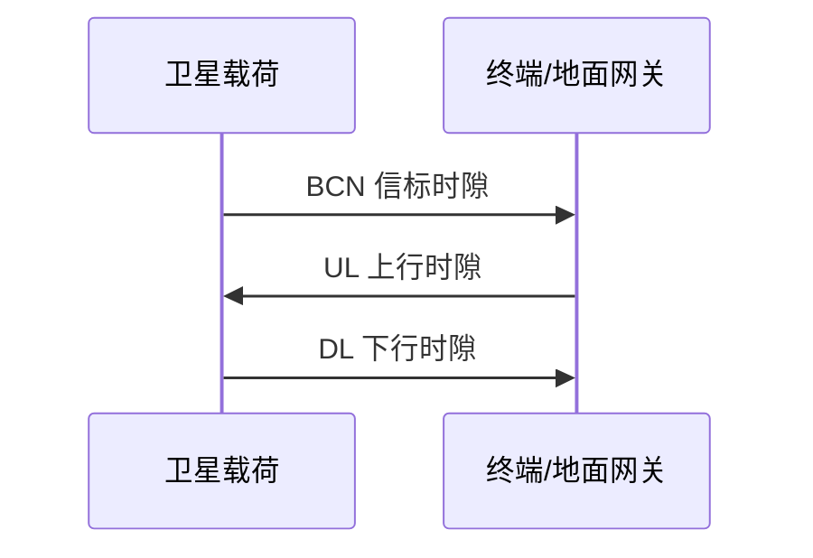
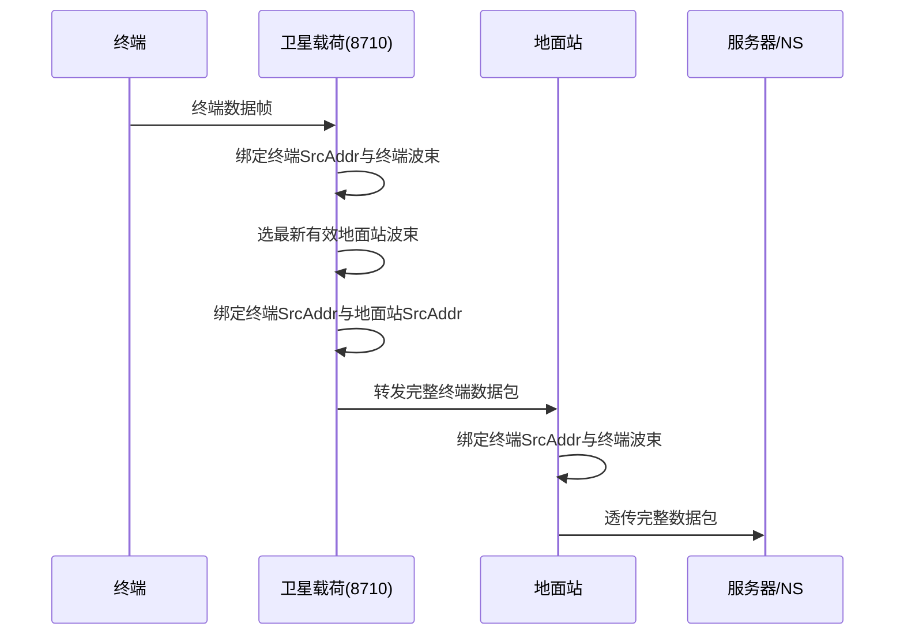
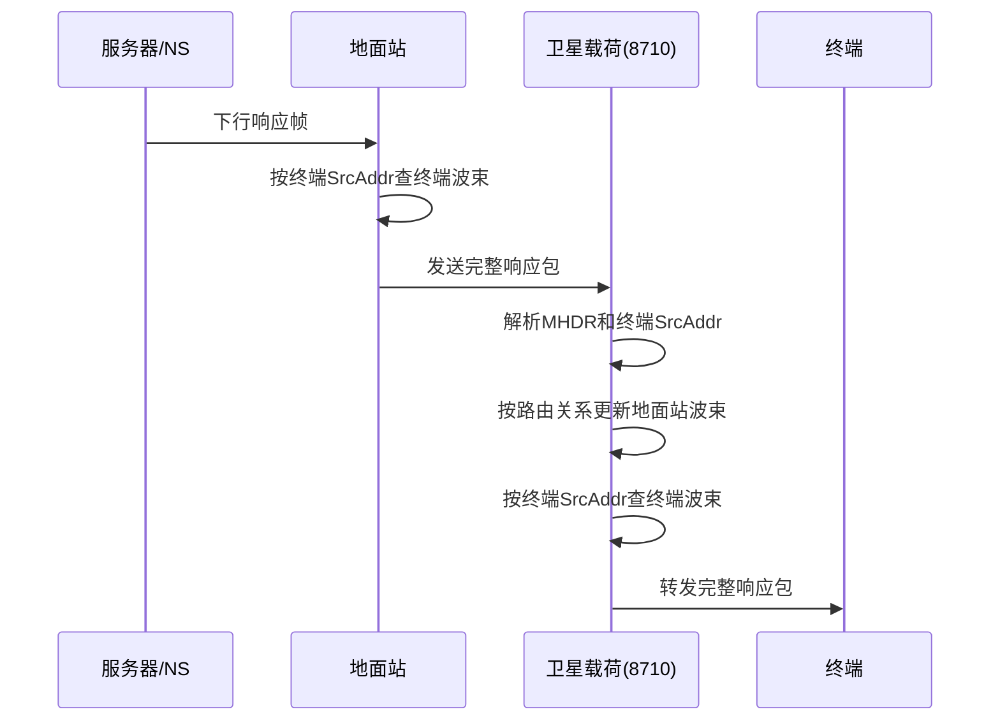
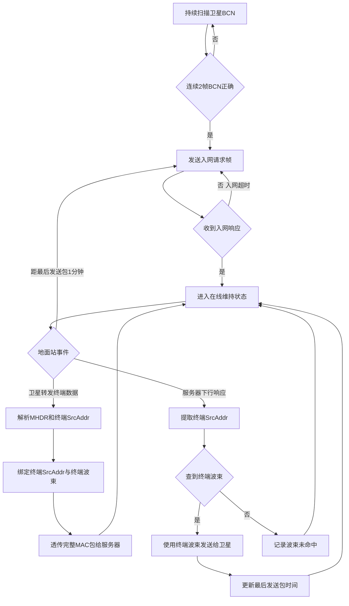

# TurMass卫星物联网演示验证方案

**文档定位**：同一套卫星物联网验证方案的地面原型验证、地面联调验证与在轨实施验证方案  
**适用阶段**：方案评审、原型开发、地面联调、在轨验证准备  
**版本**：V0.3  
**日期**：2026-06-04  

---

## 1 项目背景与验证目标

TurMass 卫星物联网演示验证项目面向低轨卫星物联网场景，目标是在现有 TurMass 无线技术、终端、网关和服务器基础上，验证终端、卫星载荷、地面网关和业务服务器之间的通信闭环能力。

本方案分为地面原型验证、地面联调验证和在轨实施验证三个部分。三个验证阶段不是三套不同设计，而是同一套卫星物联网验证方案在不同成熟度和不同环境下的逐级实施。三个阶段必须保持相同的物理层设计、MAC 层设计、上行数据链路和下行数据链路设计；差异只在于使用的硬件平台、验证深度和环境条件。

| 阶段 | 定位 | 主要目的 |
| ---- | ---- | -------- |
| 地面原型验证 | 原理和协议前置验证 | 用 8620 终端、现有 880 网关模拟卫星载荷、修改后的现有 880 网关模拟地面网关，优先验证功能、MAC 协议设计和上下行数据链路收发，并评估卫星载荷主控 TMS570 的 SPI、中断、RAM 是否满足 8710 驱动需求 |
| 地面联调验证 | 在轨硬件条件下的系统级验证 | 使用与在轨实施相同或等效的终端、载荷和地面网关硬件条件，验证系统整体能否正常工作，并验证载荷对 8710 的测试/控制接口 |
| 在轨实施验证 | 真实星地环境验证 | 使用在轨终端、TMS570 主控 + 8710 载荷、修改后的 880 地面网关，在真实低轨星地链路下验证性能和业务闭环 |

### 1.1 总体验证目标

| 目标类别 | 验证目标 | 目标值或结果 |
| -------- | -------- | ------------ |
| 单星验证 | 卫星 X、卫星 Y 分别完成单星独立验证 | 验证完成率 100% |
| 链路性能 | 仰角大于 30 度条件下的平均丢包率 | ≤5% |
| 链路余量 | 统计 RSSI/SNR 与接收灵敏度关系 | 平均链路余量 ≥10 dB |
| 并发接入 | 多终端同时上行接入和包恢复 | 32 路并发，接入成功率 ≥95% |
| 业务闭环 | 终端起源和网络起源双向业务 | 端到端成功率 ≥95% |
| 业务时延 | 端到端数据通信时延 | 平均 ≤5 秒 |
| 数据闭环 | 终端记录、卫星包级记录、网关日志、测试服务器统计 | 回传完整率 100% |
| 语音演示 | 单向语音业务链路可用 | 连通率 ≥90%，MOS ≥3.0 |

### 1.2 验证模式

| 模式 | 名称 | 终端同步方式 | 业务方向 | 验证重点 |
| ---- | ---- | ------------ | -------- | -------- |
| 模式 A | GPS 同步 + 纯上行 | GPS/1PPS | 终端上行 | 上行可达性、并发接入、上行链路余量 |
| 模式 B | 信标同步 + 广播接收 + 上行 | 卫星 BCN 信标 | 信标下行 + 终端上行 | 下行信标覆盖、信标接入可靠性 |
| 模式 C | 信标同步 + 上下行 | 卫星 BCN 信标 | 双向业务 | 终端起源和网络起源业务闭环 |

---

## 2 演示验证总体架构

演示验证系统由终端、卫星载荷、地面网关、测试系统服务器、地面控制系统和应用演示系统组成。地面原型验证、地面联调验证和在轨实施验证采用同一套逻辑架构、同一套物理层时隙设计、同一套 MAC 转发原则和同一套上下行数据链路。三阶段差异如下：

| 阶段 | 终端 | 卫星载荷 | 地面网关 | 主要差异 |
| ---- | ---- | -------- | -------- | -------- |
| 地面原型验证 | 8620 终端，A 模式可通过飞线方式验证 | 现有 880 网关模拟载荷，同时评估 TMS570 的 SPI、中断、RAM 是否满足 8710 驱动需求 | 修改现有 880 网关 | 重点验证功能、MAC 协议和上下行链路是否跑通 |
| 地面联调验证 | 使用在轨终端硬件条件 | 使用 TMS570 主控 + 8710 载荷硬件条件 | 使用修改后的 880 网关 | 重点验证在轨硬件组合下系统能否正常工作，以及载荷对 8710 的测试/控制接口 |
| 在轨实施验证 | 考虑使用目前 8620 芯片的 510 网关作为终端 | TMS570 主控 + 8710 | 修改 880 网关 | 在真实星地链路中验证通信性能、覆盖和业务闭环 |

### 2.1 系统组成和职责

| 组成 | 核心职责 | 验证作用 |
| ---- | -------- | -------- |
| 地面终端 | TurMass 收发、GPS/1PPS 或信标同步、业务数据上报、下行业务接收、本地记录、5G/Cat1 测试回传 | 验证终端空口接入、覆盖边界、上下行成功率和低功耗业务形态 |
| 卫星载荷 | BCN 发射、上行并发接收、下行业务转发、星上缓存、包级记录、回传、遥控遥测、OTA、主备切换 | 验证星上网关能力、并发处理能力、模式切换和在轨可维护性 |
| 地面网关 | 网络侧业务汇聚、TurMass 上行发送、TurMass 下行接收、协议适配、路由分发、日志记录 | 验证模式 C 双向业务闭环和业务承载网络对接 |
| 测试系统服务器 | 接收终端记录、卫星记录和网关日志，完成时间对齐、仰角计算、链路统计和报告输出 | 形成验证数据闭环和验收依据 |
| 地面控制系统 | 遥控、遥测、模式切换、参数下发、OTA、主备切换 | 支撑在轨任务控制和载荷状态监视 |
| 应用演示系统 | 数据业务展示、语音转发、业务汇聚和分发 | 支撑业务层演示 |

---

## 3 三阶段验证方案

三阶段验证的目标是逐级降低风险：先用现有硬件做原型验证，确认物理层、MAC 协议和上下行数据链路设计可行；再用接近或等同在轨状态的硬件做地面联调，确认真实硬件组合和 8710 控制接口可用；最后进入在轨实施验证。

三个阶段必须共用第 8 章和第 9 章定义的物理层、MAC 层和上下行链路设计，不允许因阶段不同而形成三套不同协议或链路。

### 3.1 地面原型验证

地面原型验证是第一阶段，重点验证终端、卫星载荷、地面网关的基本功能、MAC 协议设计、上行数据链路收发和下行数据链路收发，同时评估卫星载荷计划使用的主控 TMS570 是否具备驱动 8710 的硬件和资源条件。该阶段允许使用飞线、手动配置、现有 880 网关模拟等方式降低实现门槛，但物理层、MAC 层和上下行链路逻辑必须与后续地面联调验证、在轨实施验证保持一致。

#### 3.1.1 原型验证拓扑

#### 3.1.2 原型验证设备与重点

| 对象 | 原型阶段配置 | 重点验证 |
| ---- | ------------ | -------- |
| 终端 | 使用 8620 终端；**A 模式可通过飞线方式验证** | 终端侧发射、接收、时隙触发、A 模式链路和测试记录输出 |
| 卫星载荷 | 使用现有 880 网关模拟卫星载荷 | 载荷侧接收终端数据、转发至地面网关、接收地面网关数据、转发至终端 |
| 载荷主控评估 | 评估卫星载荷计划使用的 TMS570 主控 CPU | 确认 TMS570 的 SPI 接口、中断响应/优先级、RAM 余量、Flash/CPU 资源是否满足 8710 驱动和包级处理需求 |
| 地面网关 | 修改现有 880 网关 | 验证网关侧收发、心跳、频点转发、服务器接口和日志输出 |
| 服务器 | 复用现有服务器并适配卫星时隙 | 验证终端到服务器、服务器到终端的数据闭环 |

#### 3.1.3 原型验证内容

| 验证项 | 通过条件 |
| ------ | -------- |
| A 模式终端发送 | 8620 终端可按设计触发发送，飞线验证路径可跑通 |
| MAC 协议字段 | 终端 ID、转发方向、序号、时间戳等字段可被载荷和地面网关正确解析 |
| 上行链路收发 | 终端 -> 模拟载荷 -> 模拟地面网关 -> 服务器路径闭环 |
| 下行链路收发 | 服务器 -> 模拟地面网关 -> 模拟载荷 -> 终端路径闭环 |
| 880 模拟载荷 | 能按载荷角色完成最小收发、转发、记录和调试输出 |
| 880 地面网关 | 能按地面网关角色完成服务器接口、卫星端频点收发、心跳和日志输出 |
| TMS570 评估 | 给出 TMS570 驱动 8710 的 SPI、中断、RAM、实时性和风险评估结论 |

### 3.2 地面联调验证

地面联调验证是第二阶段，要求与在轨实施方案保持相同的硬件条件、物理层设计、MAC 协议设计和上下行数据链路设计。该阶段重点验证换成在轨终端、真实载荷硬件和正式地面网关后，系统能否在地面环境下正常工作。

| 对象 | 联调阶段配置 | 重点验证 |
| ---- | ------------ | -------- |
| 终端 | 使用在轨实施准备采用的终端硬件条件 | 终端收发、同步、记录、回传和参数配置 |
| 卫星载荷 | 使用 TMS570 主控 + 8710 的载荷硬件条件 | 载荷上对 8710 的测试接口、控制接口、收发控制、状态读取和异常处理 |
| 地面网关 | 使用修改后的 880 网关 | 与载荷互通、服务器接口、日志输出和运行稳定性 |
| 测试系统服务器 | 使用在轨测试记录和统计口径 | 终端记录、载荷记录、网关日志的时间关联和指标统计 |
| 地面控制系统 | 使用在轨控制接口或等效控制链路 | 模式切换、参数下发、调试采集、状态读取和 OTA 前置验证 |

地面联调验证必须覆盖：

- 使用在轨硬件条件后，终端、载荷、地面网关之间的上下行收发是否稳定。
- TMS570 对 8710 的复位、初始化、参数配置、收发控制、状态读取、RSSI/SNR 获取、异常恢复等测试/控制接口是否正常。
- 载荷包级记录、缓存、回传接口和调试采集是否能按测试系统要求输出。
- 地面网关与服务器之间的业务接口、日志接口和转发流程是否稳定。
- 地面联调记录格式是否可直接用于在轨测试统计。

---

## 4 在轨实施验证方案

在轨实施验证是第三阶段，在真实低轨星地环境下执行。该阶段不改变前两阶段已经验证的物理层设计、MAC 层设计和上下行数据链路，只将系统放入真实卫星平台、真实过境窗口和真实星地链路条件下验证性能、覆盖和业务闭环。

### 4.1 在轨实施验证部署

| 设备 | 数量 | 部署或用途 |
| ---- | ---- | ---------- |
| 卫星载荷 | 2 套 | 分别搭载卫星 X 和卫星 Y；卫星 X 为协作研制，卫星 Y 为完全自研 |
| 地面终端 | 32 套 | 考虑使用目前 8620 芯片的 510 网关作为终端，沿目标过境覆盖区域部署，记录发送、接收、时间、信号质量和位置相关信息 |
| 卫星载荷硬件 | 2 套 | 采用 TMS570 主控 + 8710 的载荷方案，承担星上收发、转发、记录、回传和测控接口 |
| 地面网关 | 5 套 | 修改 880 网关，承载模式 C 的网络侧上下行业务和日志输出 |
| 测试系统服务器 | 1 套 | 接收卫星测试数据、终端测试数据、网关日志和测控相关数据 |
| 地面控制系统 | 1 套 | 进行遥控、遥测、模式切换、参数下发、OTA 和主备切换 |
| 应用演示系统 | 1 套 | 提供数据业务和语音业务演示 |

### 4.2 在轨实施验证内容

| 验证项 | 对应模式 | 主要流程 | 输出指标 |
| ------ | -------- | -------- | -------- |
| 上行链路性能验证 | 模式 A | 终端 GPS/1PPS 对时后直接上行，卫星接收并回传包级记录 | 上行丢包率、RSSI/SNR、链路余量、并发接入成功率 |
| 信标和广播验证 | 模式 B | 卫星周期发送 BCN，终端接收信标后按策略上行 | 信标丢报率、下行链路余量、信标触发接入成功率 |
| 双向业务验证 | 模式 C | 终端起源业务和网络起源业务经卫星载荷交叉转发 | 两向业务成功率、端到端时延、网关链路质量 |
| 覆盖范围验证 | A/B/C | 多终端沿目标区域部署，按仰角区间统计链路表现 | 覆盖边界仰角、有效覆盖时长、仰角-链路余量曲线 |
| 语音业务演示 | 模式 C | 手机经蓝牙接终端，业务经卫星和语音转发服务器传递 | 连续语音时长、语音连通率、MOS、端到端语音时延 |

---

## 5 终端硬件实现

终端是卫星物联网业务的用户侧设备。第 5 章只描述终端需要配置的硬件模块和硬件能力；具体物理层时隙、MAC 字段和上下行业务路径见第 8、9 章。

### 5.1 硬件组成

| 模块 | 配置要求 | 作用 |
| ---- | -------- | ---- |
| 主控处理器 | 具备低功耗运行、本地任务调度、外设管理和日志缓存能力 | 管理射频、基带、定位、存储、5G/Cat1 和蓝牙等模块 |
| TurMass 射频收发模块 | 支持目标卫星物联网频段的发射、接收、频点配置和收发切换 | 完成终端侧 TurMass 空口收发 |
| 基带处理模块 | 使用 8620 或可兼容卫星时隙模式的终端基带方案 | 完成同步、调制解调、包收发和链路质量测量 |
| 射频前端 | 包含滤波、匹配、低噪声接收、功率放大和收发切换电路 | 保证弱信号接收、发射功率和带外抑制满足验证需求 |
| 终端天线 | 采用与目标频段匹配的小型化天线，需满足野外部署方向性和安装要求 | 支撑不同仰角下的星地通信验证 |
| GPS/北斗定位与 1PPS 模块 | 输出位置信息、UTC 时间和 1PPS 信号 | 提供位置记录、时间戳标定和模式 A 对时基础 |
| 本地存储 | 非易失存储，容量按多次过境记录预留 | 缓存发送记录、接收记录、异常记录和断网待上传数据 |
| 5G/Cat1 回传模块 | 支持测试数据上报和断点续传 | 将终端测试记录回传至测试系统服务器 |
| 电源与电池模块 | 支持电池供电、电量监测、低功耗待机和外部供电调试 | 支撑户外布设和长时间验证 |
| 调试与维护接口 | 预留串口、USB、下载口和必要调试引脚 | 支撑参数配置、版本升级、日志导出和现场排障 |
| 蓝牙模块 | 语音终端配置，普通数据终端可选 | 与手机语音应用进行透明数据传输 |

### 5.2 硬件能力要求

| 能力 | 要求 |
| ---- | ---- |
| 收发能力 | 具备 TurMass 上行发送和下行接收的硬件通道，支持发射、接收和待机状态切换 |
| 时间能力 | GPS/北斗与 1PPS 输出稳定，时间戳可用于终端、卫星和服务器记录关联 |
| 位置能力 | 能记录终端位置，用于测试系统服务器计算仰角、星地距离和覆盖边界 |
| 链路测量 | 能输出 RSSI、SNR、接收频点、同步状态、收发结果等基础测量信息 |
| 数据记录 | 能按包记录终端编号、序号、时间、收发结果、链路质量和异常原因 |
| 回传能力 | 5G/Cat1 模块支持测试记录上传，公网不可用时可本地缓存并恢复后续传 |
| 低功耗能力 | 支持休眠、唤醒、周期工作和电量监测，便于评估后续低功耗终端形态 |
| 现场部署 | 支持外接或内置天线固定、户外供电、状态指示和快速替换 |

### 5.3 分阶段硬件配置

| 阶段 | 终端硬件配置 | 说明 |
| ---- | ------------ | ---- |
| 地面原型验证 | 8620 终端 | 用于验证终端功能和 MAC/链路流程；A 模式可通过飞线方式验证 |
| 地面联调验证 | 使用在轨实施准备采用的终端硬件条件 | 需要与在轨方案保持相同的硬件能力、物理层配置、协议配置和记录格式 |
| 在轨实施验证 | 考虑使用目前 8620 芯片的 510 网关作为终端 | 作为在轨测试终端部署，需支持测试记录、位置/时间记录和回传 |

语音演示终端在普通终端基础上增加蓝牙透传硬件。

#### 5.3.1 地面原型验证

修改目前WAN终端物理层时隙配置及工作流程，支持地面原型验证。

---

## 6 卫星载荷硬件实现

卫星载荷在系统中承担星上网关硬件平台角色。第 6 章只描述载荷需要具备的硬件模块、接口和在轨可靠性能力；星上物理层、MAC 转发和数据链路设计见第 8、9 章。

### 6.1 硬件组成

| 模块 | 配置要求 | 作用 |
| ---- | -------- | ---- |
| 接收射频前端 | 包含低噪声放大、滤波、下变频或直接接收链路 | 接收地面终端和地面网关的上行弱信号 |
| 发射射频前端 | 包含上变频、滤波、功放和功率检测 | 发射 BCN、广播和下行业务数据 |
| 8710 基带处理模块 | 作为卫星载荷 TurMass 基带核心 | 完成星上空口收发、并发接收、链路质量测量和基带控制 |
| 载荷主控 CPU | 具备任务调度、设备控制、数据管理、异常处理和看门狗管理能力 | 管理基带、射频、缓存、回传、测控和上注流程 |
| 天线子系统 | 支持 6 或 8 根天线配置，按卫星平台实际安装方式实现 | 提供目标覆盖范围和多方向收发能力 |
| 时间基准接口 | 接收星上 PPS 或等效时间基准，预留分频和同步接口 | 为 8710 和包级记录提供统一时间基础 |
| 星上缓存 | 非易失或受保护存储，容量按过境包级记录和调试数据预留 | 在回传链路不可用时缓存测试记录 |
| 回传接口 | 接入卫星平台数传或载荷数据回传通道 | 将包级记录、状态记录和调试数据送回测试系统服务器 |
| 测控接口 | 支持 CAN-A/CAN-B 或卫星平台指定接口 | 接收遥控指令，输出遥测状态 |
| 软件上注接口 | 支持软件包接收、校验、存储和启动切换 | 支撑在轨 OTA 和版本回退 |
| 电源与健康监测 | 支持电压、电流、温度、过流、过温和功放功率监测 | 提供健康遥测和保护依据 |
| 主备切换电路 | 支持主备单机冷备或平台要求的冗余切换方式 | 提升在轨可靠性 |

### 6.2 硬件能力要求

| 能力 | 要求 |
| ---- | ---- |
| 多路接收 | 射频、基带和天线链路需支撑不少于 32 路终端并发上行的验证目标 |
| 下行发射 | 发射链路需支撑信标、广播和业务数据下行，具备功放输出监测能力 |
| 链路观测 | 能输出 RSSI、SNR、接收频率、噪底、天线校准质量和功放输出功率等观测量 |
| 时间标定 | 能把星上时间基准用于包级记录和基带同步，分频参数按后续时隙设计确定 |
| 数据缓存 | 数传或回传不可用时不丢失关键包级记录，恢复后可回传 |
| 遥控遥测 | 支持模式、频点、速率、天线、电源、调试采集、看门狗和软件引导等硬件控制项 |
| OTA 能力 | 支持基础版本和升级版本管理，具备完整性校验和加载回退能力 |
| 可靠性 | 满足卫星平台对供电、温度、结构、振动、冲击、EMC 和辐照容忍性的要求 |

### 6.3 分阶段硬件配置

| 阶段 | 载荷硬件配置 | 说明 |
| ---- | ------------ | ---- |
| 地面原型验证 | 现有 880 网关模拟卫星载荷 | 用于快速验证载荷侧收发、转发、记录和调试输出；同时评估 TMS570 的 SPI、中断、RAM 是否满足 8710 驱动需求 |
| 地面联调验证 | TMS570 主控 + 8710 星载载荷 | 重点验证 TMS570 对 8710 的测试/控制接口、收发控制、状态读取、异常恢复和包级记录 |
| 在轨实施验证 | TMS570 主控 + 8710 星载载荷 | 需补齐星上缓存、平台回传、测控接口、OTA、主备切换和环境可靠性能力 |

#### 6.3.1 地面原型验证

##### 6.3.1.1 TMS570评估结果

TMS570 评估需要覆盖 SPI 接口资源与速率、中断响应与优先级、RAM 余量、Flash/CPU 占用、8710 驱动时序、异常恢复和长期运行稳定性。目前评估进展如下：

| 评估项 | 当前验证情况 | 结论 / 后续事项 |
| ------ | ------------ | --------------- |
| SPI 能力 | 已在 TMS570 上验证 SPI 通信，一次最大传输 128 byte；当前设计采用 pingpong 结构，每次 pingpong 之间约有 2 us 中断 | SPI pingpong 结构可正常驱动 8710，读写寄存器测试通过 |
| SPI 驱动 8710 功能 | 已完成 8710 寄存器读写测试；Loopback 加载 128 用户信道信息，采集发送数据正常；通过 TMS570 配置 8710 为 Master 后可正常工作 | SPI 基础读写、批量加载和 Master 配置链路已验证通过 |
| 中断需求 | 已验证 2 个中断的配置和响应，分别作为 8710 中断和 8710 复位脚 | 当前中断数量和响应可满足已验证功能；后续需结合完整模式和异常恢复流程继续确认 |
| RAM 需求 | 纯 8710 driver 需要约 64 Kbyte，叠加 TRM 预估 128 byte 已足够；已与卫星载荷合作方确认，TMS570 片内 RAM 有 140 Kbyte 可给 8710 驱动使用，同时预留片外 SRAM | RAM 资源按当前 driver 和 TRM 需求评估满足；后续需在完整功能、日志缓存和异常场景下复核余量 |
| 处理能力 | TMS570 主频 180 MHz；相比 880 网关主控 3506（三核、1.25 GHz），实测 driver 中相同 128 用户处理约慢 9 倍 | 已验证 mode6 单包块、128 用户处理可稳定正常运行；其他模式仍需继续验证 |

##### 6.3.1.2 880网关模拟卫星载荷

修改目前880网关，模拟卫星载荷；

---

## 7 地面网关硬件实现

地面网关是网络侧 TurMass 空口设备。第 7 章只描述网关硬件组成和硬件能力；网关参与的 MAC 封装、转发规则和业务链路见第 9 章。

### 7.1 硬件组成

| 模块 | 配置要求 | 作用 |
| ---- | -------- | ---- |
| 网关主控处理器 | 具备协议处理、日志缓存、网络通信和设备管理能力 | 管理空口收发、网络接口、参数配置和日志输出 |
| TurMass 射频收发模块 | 支持与卫星载荷通信的频段、频点配置和收发切换 | 完成地面网关侧 TurMass 空口收发 |
| 基带处理模块 | 采用 8710 或与卫星载荷互通的基带方案 | 完成网关侧同步、收发、测量和状态输出 |
| 射频前端 | 包含滤波、低噪声接收、功放、收发切换和必要的频率参考 | 保证地面网关链路预算和收发稳定性 |
| 网关天线 | 可使用固定天线、多天线或定向天线，按验证场地配置 | 支撑与过境卫星的稳定通信 |
| 有线/无线网络接口 | 以太网、4G/5G 或现场可用网络 | 连接网络服务器、应用服务器和测试系统服务器 |
| 本地存储 | 用于缓存业务日志、链路日志和异常记录 | 避免网络中断导致验证数据丢失 |
| 时间参考 | 可选 GPS/北斗、NTP 或本地高稳定时钟 | 为网关日志和端到端时延统计提供时间基准 |
| 电源模块 | 支持稳定外部供电和必要的备用电源 | 满足长时间固定点验证 |
| 调试维护接口 | 预留串口、USB、网口、下载口和状态指示 | 支撑现场配置、升级和排障 |

### 7.2 硬件能力要求

| 能力 | 要求 |
| ---- | ---- |
| 星地收发 | 具备与卫星载荷之间的上行发送和下行接收硬件能力 |
| 网络接入 | 能稳定接入网络服务器、应用服务器和测试系统服务器 |
| 链路测量 | 能输出 RSSI、SNR、频点、同步状态、收发结果和异常状态 |
| 日志缓存 | 能缓存业务日志、链路日志、配置变更和异常记录 |
| 参数配置 | 支持本地或远程配置频点、功率、天线、网络地址和运行参数 |
| 现场部署 | 支持固定安装、天线调整、状态指示和长时间稳定运行 |
| 语音演示扩展 | 语音网关需具备足够网络吞吐和缓存能力，保证语音包连续转发 |

### 7.3 分阶段硬件配置

| 阶段 | 地面网关硬件配置 | 说明 |
| ---- | ---------------- | ---- |
| 地面原型验证 | 修改现有 880 网关 | 用于验证地面网关侧收发、服务器接口、心跳、频点转发和日志输出 |
| 地面联调验证 | 修改后的 880 网关 | 需要与 TMS570+8710 载荷和在轨终端硬件条件进行系统联调 |
| 在轨实施验证 | 修改后的 880 网关 | 作为正式地面网关承载网络侧上下行业务和测试日志输出 |

#### 7.3.1 地面原型验证

修改880网关驱动作为地面原型网关

---

## 8 物理层设计

### 8.1 总体物理层要求

物理层采用 TurMass 无线技术，三种通信模式 A/B/C 统一使用 BCN + UL + DL 三时隙结构。通信速率支持 1.6/3.3/6.5 kbps。

### 8.2 物理层时隙设计

**bcn携带4bit信息，可以用来区分不同的卫星；**

#### 8.2.1 时隙配置1（单包块）

首选采用模式 6 单包块配置，目标是降低时延、提升实时性，并减少多包块带来的误帧累计风险。

| 模式 | 信标时段（BCN） | 上行时段（UL） | 下行时段（DL） | 有效收发合计 | 对齐后周期 |
| ---- | --------------- | -------------- | -------------- | ------------ | ---------- |
| 6    | 36.340 ms       | 217.360 ms     | 229.132 ms     | 482.832 ms   | 500 ms     |
| 7    | 19.129 ms       | 111.328 ms     | 113.828 ms     | 244.285 ms   | 250 ms     |
| 8    | 10.732 ms       | 55.776 ms      | 58.176 ms      | 124.684 ms   | 125 ms     |

关键参数说明（以模式6为例）：

- 该配置可概括为 BCN 36.340 ms + UL/DL 217.360 ms，周期按 500 ms 对齐。
- 单个 UL 包块业务载荷长度：26 bytes。
- 单个 DL 包块业务载荷长度：26 bytes。
- 物理层净速率：约 416 bps。
- MAC 层按 12 bytes 开销估算，净载荷 14 bytes，MAC 层净速率约 224 bps。
- 应用层净速率估计约 200 bps。
- 关键确认项：UL/DL 217.360 ms 配置需由 8620 和 8710 联调确认。

#### 8.2.2 时隙配置2（两包块）

次选采用模式 6 双包块配置，用于在业务吞吐不足时评估更高净速率方案。

**补充间隙**：

**对齐周期要最小**

| 模式 | 信标时段（BCN） | 上行时段（UL） | 下行时段（DL） | 有效收发合计 | 对齐后周期 |
| ---- | --------------- | -------------- | -------------- | ------------ | ---------- |
| 6    | 36.340 ms       | 348.432 ms     | 360.204 ms     | 744.976 ms   | 800 ms     |
| 7    | 19.129 ms       | 176.864 ms     | 179.364 ms     | 375.357 ms   | 400 ms     |
| 8    | 10.732 ms       | 88.544 ms      | 90.944 ms      | 190.220 ms   | 200 ms     |

关键参数（以模式6为例）：

- 单个包块业务载荷长度：26 bytes。
- 两个包块合计业务载荷长度：52 bytes。
- 物理层净速率：约 520 bps。
- MAC 层净速率估计约 400 bps。
- 应用层净速率估计约 370 bps。
- 与首选模式相比，净速率提升约 85%，但用户容量下降约 37.5%。

### 8.3 空口传输时延补偿机制说明

低轨卫星链路中，终端到卫星、卫星到终端的空口传播距离会随终端在覆盖区内的位置变化而变化。物理层时隙设计需要保证不同位置终端的上行信号到达卫星时，仍落在 8710 可解调的上行接收窗口内。

#### 8.3.1 覆盖距离和传播时延估算

以卫星对地面最低工作仰角 25°、卫星距地面垂直高度 536 km、工作频段 506 MHz 为例进行估算。传播时延按电磁波自由空间传播速度近似为光速计算，506 MHz 主要影响链路预算和天线设计，对传播速度影响可忽略。

| 项目 | 计算值 | 说明 |
| ---- | ------ | ---- |
| 最近终端到卫星距离 | 536 km | 卫星星下点附近，近似为卫星垂直高度 |
| 最近终端单程传播时延 | 1.79 ms | 536 km / 光速 |
| 最远终端到卫星距离 | 约 1098 km | 按球面地球模型、最低仰角 25° 计算 |
| 最远终端单程传播时延 | 3.66 ms | 1098 km / 光速 |
| 最近与最远终端距离差 | 约 562 km | 1098 km - 536 km |
| 最近与最远终端单程时延差 | 约 1.87 ms | 562 km / 光速 |
| 最近与最远终端 BCN 下行 + UL 上行相对时延差 | 约 3.75 ms | 上下行各经历一次距离差 |

#### 8.3.2 A 模式时延补偿

A 模式为 GPS 同步 + 纯上行，终端不依赖卫星 BCN 校准上行时刻。因此 A 模式需要由卫星载荷侧 8710 对终端到卫星的上行单程传播延时进行补偿；与 B/C 模式不同的是，A 模式不需要叠加 BCN 下行传播延时。

处理原则：

1. 终端按 GPS/1PPS 和预配置时隙发送上行数据。
2. 卫星载荷侧根据预计覆盖区和链路传播时延，配置 8710 上行接收窗口打开时刻，补偿终端上行信号到达卫星的单程传播延时。
3. 以星下点附近最近终端为例，单程传播时延约 1.79 ms，工程上可按约 2 ms 进行接收窗口补偿。
4. 若按 25° 仰角覆盖边界估算，最近到最远终端的单程时延差约 1.87 ms，小于 8710 卫星模式可支持的最大 4 ms 抗时偏能力。
5. 因此，在该覆盖条件下，A 模式上行信号理论上可通过 8710 接收窗口补偿机制覆盖最近和最远终端的传播时延差。

#### 8.3.3 B/C 模式时延补偿

B/C 模式中，卫星下行会发送 BCN。终端检测到 BCN 后，可以以接收到的 BCN 为本地时隙参考，因此下行传播时延本身不会导致终端与卫星时隙长期失配。需要重点处理的是：终端收到 BCN 已经晚于卫星发送 BCN 的时刻，终端再按本地参考发送上行数据时，上行数据到达卫星又会经历一次传播时延。

以星下点附近最近终端为例：

1. 卫星发送 BCN 到终端接收 BCN，传播时延约 1.79 ms，可近似按 2 ms 估算。
2. 终端发送上行数据到卫星接收，上行传播时延同样约 1.79 ms，可近似按 2 ms 估算。
3. 因此相对卫星发送 BCN 的时刻，最近终端上行数据到达卫星约晚 3.58 ms，可按约 4 ms 估算。
4. 8710 提供上行接收窗口打开时刻配置寄存器，可通过该寄存器补偿上述固定传播延时，使卫星侧上行接收窗口后移。

不同终端位置到卫星的距离不同。按 25° 最低仰角、536 km 高度估算，最近终端与最远终端之间的 BCN 下行 + UL 上行相对时延差约 3.75 ms，小于 8710 卫星模式最大 4 ms 抗时偏能力。也就是说，在该覆盖条件下，只要上行接收窗口按最近终端约 4 ms 传播延时进行补偿，覆盖区内最远终端的上行信号仍应落在 8710 可解调的 4 ms 抗时偏范围内。

---

## 9 MAC层设计

### 9.1 协议架构

SAT 系统沿用 TurMass Link 的 MAC3.x 协议，帧结构沿用 `MHDR + MACPayload + MIC`：

| 字段 | 作用 |
| ---- | ---- |
| MHDR | MAC 帧头，`NwkMode = 10` 表示卫星网络 |
| MACPayload | MAC 载荷，承载终端 ID、转发方向、QoS/TTL、业务载荷等必要信息 |
| MIC | 完整性校验 |

卫星场景中不新增“地面站心跳帧”类型。地面站波束更新与在线保持复用现有 MAC 入网请求帧和入网响应帧：地面站持续扫描卫星 BCN，连续接收 2 帧 BCN 正确后发送入网请求帧；卫星载荷检测到来自地面站的入网请求帧后，更新地面站波束并回复入网响应；地面站收到入网响应后，以最后一次向卫星发送的包为计时基准，延时 1 分钟（暂定）再次发送入网请求；若未收到入网响应，则入网超时后重新发送入网请求帧。该流程用于地面站波束维持，不作为终端动态入网流程。

卫星演示验证阶段先直接沿用当前协议帧格式，不再单独设计 1 byte 紧凑 MHDR。当前数据帧固定头部开销为 13 bytes，格式如下：

| 字段 | 长度 | 所属区域 | 当前定义 / 作用 | 是否必须 | 可优化点 |
| ---- | ---- | -------- | --------------- | -------- | -------- |
| MHDR | 3 bytes | MAC 帧头 | 包含帧类型、设备类型、协议版本、QoS、跳数、安全模式、地址模式、网络模式、功控类型等信息；其中 `NwkMode = 10` 表示卫星网络；帧类型直接复用现有入网请求帧、入网响应帧和数据帧，不新增地面站心跳帧 | 当前保留 | 卫星演示中部分字段可固定隐含，例如 DevType、Version、HopNum/HopCnt、PowerControlType；但从 13 bytes 优化到约 11 bytes收益不明显，当前阶段不裁剪 |
| Src Addr | 4 bytes | FHDR | 源设备地址。上行时标识终端，便于卫星载荷、地面网关和测试系统服务器做包关联、丢包统计和回包路由；网络起源业务中用于标识网关或网络侧来源 | 必须 | 若后续确认卫星演示终端数量和地址空间较小，可评估短地址；当前为兼容 MAC3.x 和后续扩展保留 4 bytes |
| FCtrl | 1 byte | FHDR | 帧控制字段，承载 ACK、扩展域数量、重传域存在标识、分包域存在标识等控制信息 | 建议保留 | 对非确认、非分包、无扩展的普通短报文，多数 bit 为 0；后续可通过固定配置或扩展头存在标志优化，但当前保持兼容 |
| FCnt | 1 byte | FHDR | 帧序号/帧计数器，用于丢包统计、去重、重传关联、端到端记录关联 | 必须 | 1 byte 对演示验证基本可用；若单次过境或高频业务可能超过 255 包，正式版本建议扩展到 2 bytes 或结合时间窗口处理回绕 |
| FPort | 1 byte | MACPayload | 上层业务端口，用于区分普通数据、测试数据、时间同步、语音业务、MAC 测试等应用类型 | 建议保留 | 1 byte 开销小，保留有利于多业务演示和后续扩展；若仅单一测试业务，可固定隐含 |
| Payload Length | 1 byte | MACPayload | 指示业务 Payload 长度，便于接收端解析、组包、校验和测试记录统计 | 必须 | 当前单包载荷长度较小，1 byte 足够；若所有物理层包长固定且无分包，可隐含，但会降低解析鲁棒性 |
| FPayload | 0-N bytes | MACPayload | 应用层或 MAC 命令实际负载，承载传感数据、测试数据、语音分片或控制数据 | 按业务需要 | 窄带链路下应尽量短包化，避免大包分片；语音业务需单独控制包长和发送节奏 |
| MIC | 2 bytes | MIC | 对 `MHDR + MACPayload` 做完整性校验，防止误包被当成有效数据进入统计或业务处理 | 建议必须保留 | ABP 模式下缺少空口入网过程，完整性更依赖预置密钥和 MIC；如仅做极简链路调试可临时关闭，但正式演示建议保留 |

说明：

- 星上载荷只解析转发和记录所需字段，原则上不解析应用层 `FPayload`。
- 当前 13 bytes 固定开销会降低单包净载荷效率，但相比重新定义紧凑帧格式，协议兼容性和开发风险更可控，因此演示验证阶段建议沿用当前格式。
- 后续若链路预算或业务净速率压力较大，再评估短地址、固定 MHDR、可选 FCtrl、隐含 FPort 等进一步裁剪方案。

### 9.2 数据处理流程

卫星场景处理由终端、地面站、卫星载荷（8710）和服务器共同完成。卫星载荷和地面站的 8710 驱动只解析路由和波束维护所需字段，不解析应用层 payload。

#### 9.2.1 参与实体和 MAC 使用方式

| 实体 | MAC 使用方式 | 需要维护的信息 |
| ---- | ------------ | -------------- |
| 终端 | 发送终端上行数据包；接收卫星转发的下行响应包 | 本终端 `Src Addr`、发送序号、接收状态 |
| 地面站 | 持续扫描卫星 BCN，连续接收 2 帧 BCN 正确后发送入网请求帧；接收入网响应后按 1 分钟（暂定）周期维持；接收卫星转发的终端数据并透传给服务器；接收服务器下行响应并发给卫星 | 终端 `Src Addr` 与终端波束绑定关系、地面站 `Src Addr` |
| 卫星载荷（8710） | 接收终端/地面站数据包，解析 MHDR 和 Src Addr，维护波束映射并转发完整 MAC 包 | 终端 `Src Addr` 与终端波束绑定关系、最多 5 个地面站波束队列、终端 `Src Addr` 与地面站 `Src Addr` 路由关系 |
| 服务器 / NS | 接收地面站透传的终端上行包；生成下行响应包并发给对应地面站 | 终端 `Src Addr`、地面站路由、业务响应状态 |

#### 9.2.2 终端上行到服务器流程

处理流程：

1. 终端发送数据包，`MHDR.NwkMode = Satellite Network`，设备类型为终端，帧类型为数据帧，`Src Addr` 为终端地址。
2. 卫星载荷（8710）接收到数据包后先解析 MHDR。
3. 若网络模式为卫星网络、设备类型为终端、帧类型为数据帧，则 8710 驱动将当前接收波束与终端 `Src Addr` 绑定并保存。
4. 卫星载荷从最多 5 个地面站波束队列中选择最近更新的有效地面站波束。
5. 卫星载荷建立或更新路由关系：终端 `Src Addr` -> 被选中的地面站 `Src Addr`，并使用该地面站波束将终端完整 MAC 数据包转发给地面站。
6. 地面站接收到卫星转发的数据包后解析 MHDR。
7. 若网络模式为卫星网络、设备类型为终端、帧类型为数据帧，则地面站 8710 驱动将该终端 `Src Addr` 与当前终端波束绑定并保存。
8. 地面站不解析应用 payload，将完整数据包直接透传给服务器 / NS。

#### 9.2.3 服务器响应下行到终端流程

处理流程：

1. 服务器 / NS 接收到终端上行数据后生成下行响应包。
2. 下行响应包的 MHDR 中网络模式为卫星网络，设备类型为地面站，帧类型为数据帧；`Src Addr` 与接收到的终端数据包中的 `Src Addr` 保持一致，用于标识目标终端。
3. 服务器 / NS 将下行响应包发送给对应地面站。
4. 地面站提取数据包中的 `Src Addr`，查找该终端对应的波束，并使用该波束将完整数据包发送给卫星载荷。
5. 卫星载荷（8710）接收到数据包后解析 MHDR。
6. 若网络模式为卫星网络、设备类型为地面站、帧类型为数据帧，则 8710 驱动提取数据包中的终端 `Src Addr`。
7. 卫星载荷通过终端 `Src Addr` 查找“终端 `Src Addr` -> 地面站 `Src Addr`”绑定关系，并使用当前接收波束更新对应地面站 `Src Addr` 的波束队列项。
8. 卫星载荷通过终端 `Src Addr` 查找终端波束，并使用查找到的终端波束将完整数据包转发给终端。

#### 9.2.4 地面站工作流程

地面站在卫星场景中同时承担 BCN 扫描、入网请求/响应维持、卫星上行业务接收、服务器下行业务转发和本地波束队列维护。其工作流程如下：

流程说明：

1. 地面站持续扫描卫星发送的 BCN，只有连续接收 2 帧 BCN 正确后，才进入地面站入网请求流程。
2. 地面站向卫星载荷发送入网请求帧，入网请求帧携带地面站 `Src Addr`，用于卫星载荷更新地面站波束队列。
3. 卫星载荷回复入网响应后，地面站进入在线维持状态；若入网超时未收到响应，则重新发送入网请求帧。
4. 在线状态下，地面站接收到卫星转发的终端数据后，解析 MHDR 和终端 `Src Addr`，更新终端 `Src Addr` 与终端波束绑定关系，并将完整 MAC 包透传给服务器。
5. 地面站收到服务器下行响应后，提取终端 `Src Addr`，查找终端波束；查到后使用该波束将完整响应包发送给卫星载荷，同时更新“最后发送包时间”。
6. 地面站以最后一次向卫星发送的包为计时基准，延时 1 分钟（暂定）后再次发送入网请求帧；如果期间已经发送业务下行包，则计时基准更新为该业务下行包的发送时间。

#### 9.2.5 波束及队列管理

##### 卫星载荷波束管理

卫星载荷 8710 驱动需要管理两类波束：

| 波束类型 | 用途 | 更新来源 |
| -------- | ---- | -------- |
| 终端上行波束 | 卫星载荷收到地面站发送的下行终端业务数据后，使用该波束将数据转发给终端 | 终端上行业务数据到达卫星载荷时，按终端 `Src Addr` 绑定当前接收波束 |
| 地面站波束 | 卫星载荷收到终端上行业务数据后，使用最新有效地面站波束将数据发送给地面站 | 地面站入网请求帧或地面站下行业务数据到达卫星载荷时更新 |

地面站波束入队/更新有两种方式：

| 更新方式 | 触发条件 | 处理规则 |
| -------- | -------- | -------- |
| 地面站入网请求帧 | 地面站持续扫描卫星 BCN，连续接收 2 帧 BCN 正确后发送入网请求帧；后续收到入网响应后，以最后一次向卫星发送的包为计时基准，延时 1 分钟（暂定）再次发送；若未收到入网响应，则入网超时后重发 | 卫星载荷解析 MHDR，确认网络模式为卫星网络、设备类型为地面站、帧类型为入网请求帧后，使用当前接收波束更新该地面站 `Src Addr` 对应的波束队列项，并回复入网响应 |
| 地面站下行业务数据 | 卫星载荷收到地面站发来的下行业务数据包 | 卫星载荷提取数据包中的终端 `Src Addr`，查找已记录的“终端 `Src Addr` -> 地面站 `Src Addr`”绑定关系，并用当前接收波束更新对应地面站 `Src Addr` 的波束队列项 |

##### 卫星载荷队列管理

| 队列 | 规模 | 管理规则 | 用途 |
| ---- | ---- | -------- | ---- |
| 终端上行业务数据缓存队列 | 最大 128 条（暂定） | FIFO。若存在有效地面站波束，则根据最大发送终端数直接转发给地面站；若没有有效地面站波束，则先缓存，等获取地面站波束后再发送 | 缓存卫星载荷已收到但暂时无法转发给地面站的终端上行业务数据 |
| 地面站波束队列 | 最大 5 个地面站波束 | 以地面站 `Src Addr` 为索引，记录地面站波束、最近更新时间和有效状态；波束 30s（暂定） 未更新则失效 | 为终端上行业务数据选择地面站下行波束 |

卫星载荷给地面站转发终端消息时，取 5 个地面站波束中最新的有效波束。单次最多服务 16 个终端，该数量/格式按配置项控制。当前策略是 16 个终端使用同一个地面站波束，终端频率由卫星载荷 8710 驱动自行分配，暂采用平均分配策略：

| 模式 | 系统带宽 | 频率分配策略 |
| ---- | -------- | ------------ |
| 模式 6 | 125 kHz | 平均分成 16 个频点 |
| 模式 7 | 250 kHz | 平均分成 16 个频点 |
| 模式 8 | 500 kHz | 平均分成 16 个频点 |

##### 地面站波束和队列管理

地面站的波束管理与当前 880 网关保持一致：

| 场景 | 处理规则 |
| ---- | -------- |
| 地面站收到卫星发送的上行业务数据 | 从数据中提取终端 `Src Addr`，将终端波束与该 `Src Addr` 绑定 |
| 地面站收到服务器下行响应数据 | 从数据中提取终端 `Src Addr`，根据该 `Src Addr` 查找对应终端波束，并使用该波束发送数据给卫星载荷 |
| 同一终端 `Src Addr` 再次出现 | 更新该 `Src Addr` 对应的终端波束 |

地面站波束队列设置为 2048，队列管理与 880 网关一致，采用 FIFO 原则。同一个 `Src Addr` 终端再次更新时，更新对应波束，不新增重复终端项。

#### 9.2.6 MAC 处理原则

| 原则 | 说明 |
| ---- | ---- |
| 兼容现有架构 | 沿用 MAC3.x，避免为演示单独引入不可延续的协议形态 |
| 星上轻处理 | 卫星载荷只解析 MHDR、Src Addr 和必要控制字段，不处理应用层 payload |
| 地面站轻处理 | 地面站 8710 驱动解析 MHDR 和 Src Addr，用于波束维护和链路转发；业务数据透传给服务器 |
| 地面站波束队列 | 卫星载荷最多维护 5 个地面站波束队列项，波束 30s 未更新则失效 |
| 终端缓存队列 | 卫星载荷维护最大 128 条终端上行业务数据缓存队列，无有效地面站波束时先缓存，有波束后按 FIFO 转发 |
| 波束绑定 | 终端上行数据用于更新终端 `Src Addr` 与终端波束绑定；地面站入网请求帧和地面站下行业务数据用于更新地面站波束；地面站维护 2048 规模终端波束队列 |
| 路由映射 | 卫星载荷维护终端 `Src Addr` 与地面站 `Src Addr` 的映射关系，支撑终端上行落地、地面站波束更新和服务器响应下行 |
| 地面站选择 | 卫星载荷给地面站转发终端消息时，取 5 个地面站波束中最新的有效波束 |
| 可观测 | MAC 层处理结果、波束绑定、路由映射和转发结果必须进入终端记录、卫星包级记录和网关日志 |

### 9.3 需要固化的 MAC 字段和规则

| 字段 / 规则 | 用途 | 当前状态 |
| ----------- | ---- | -------- |
| 地面站入网请求/响应流程 | 复用现有入网请求帧更新卫星载荷上的地面站波束，卫星载荷回复入网响应 | 不新增地面站心跳帧类型；入网请求/响应具体 payload 可沿用或裁剪待定 |
| 终端 `Src Addr` | 标识业务所属终端，用于波束绑定、路由、统计和端到端关联 | 当前沿用 4 bytes Src Addr |
| 地面站 `Src Addr` | 标识地面站，用于终端地址到地面站地址的路由映射 | 需与地面站地址规划一致 |
| 设备类型 | 区分终端和地面站，决定卫星载荷和地面站的 MAC 处理流程 | 由 MHDR DevType 承载 |
| 帧类型 | 区分数据帧、入网请求帧、入网响应帧、广播帧、MAC Command 等 | 复用现有入网请求/入网响应和数据帧 |
| 终端波束绑定 | 将终端 `Src Addr` 与当前接收波束绑定 | 由卫星载荷和地面站 8710 驱动维护 |
| 地面站波束队列 | 维护最多 5 个地面站波束队列项 | 由卫星载荷 8710 驱动维护 |
| 地面站波束更新 | 将地面站 `Src Addr` 与入网请求帧或地面站下行业务数据的接收波束绑定 | 地面站收到入网响应后延时 1 分钟（暂定）再次发送入网请求；若未收到入网响应，则入网超时后重发；波束 30s 未更新则失效 |
| 卫星载荷终端上行缓存队列 | 无有效地面站波束时缓存终端上行业务数据 | 最大 128 条（暂定），FIFO，有地面站波束后按最大发送终端数转发 |
| 地面站终端波束队列 | 地面站维护终端 `Src Addr` 与终端波束绑定关系 | 队列规模 2048，FIFO；同一 `Src Addr` 更新对应波束 |
| 终端-地面站路由 | 将终端 `Src Addr` 与地面站 `Src Addr` 绑定 | 终端上行转发时建立/更新；地面站下行业务数据到达卫星时用于更新地面站波束 |
| 频点分配 | 单次最多服务 16 个终端，共用同一个地面站波束 | 卫星载荷 8710 驱动按系统带宽平均分配 16 个频点 |

### 9.4 语音演示数据链路

语音演示复用模式 C，语音编解码由手机应用承担，终端和网关只做透传与转发。单向 A 到 B 语音链路如下：

语音演示要求：

- 语音转发服务器按 A 到 B 固定路由或配置路由原样转发，不做重编码、混音或业务重组。
- 地面终端增加蓝牙透传硬件和软件通道。
- 测试记录需覆盖语音包序号、时间戳、转发结果和丢包情况。
- 语音时延门限仍需根据业务体验和双跳链路实测确定。

---

## 10 验证项目与指标

### 10.1 分阶段验证

| 阶段 | 验证项目 | 通过条件 |
| ---- | -------- | -------- |
| 地面原型验证 | 8620 终端 A 模式验证 | A 模式可通过飞线或等效方式跑通，终端侧收发和记录可观测 |
| 地面原型验证 | MAC 协议设计验证 | 终端 ID、转发方向、序号、时间戳等字段可被模拟载荷和模拟地面网关正确解析 |
| 地面原型验证 | 上下行链路收发 | 终端 -> 模拟载荷 -> 模拟地面网关 -> 服务器，以及反向链路均可闭环 |
| 地面原型验证 | TMS570 驱动 8710 可行性评估 | 形成 TMS570 的 SPI、中断、RAM、实时性、驱动风险和改进建议 |
| 地面联调验证 | 在轨硬件条件系统联调 | 使用在轨终端、TMS570+8710 载荷、修改 880 网关后系统可正常工作 |
| 地面联调验证 | 载荷 8710 测试/控制接口 | TMS570 可完成 8710 复位、初始化、配置、收发控制、状态读取和异常恢复 |
| 地面联调验证 | 测试记录闭环 | 终端记录、载荷记录、网关日志可按在轨统计口径关联 |
| 在轨实施验证 | 模式 A 上行链路 | 三档速率完成上行可达性和丢包率统计 |
| 在轨实施验证 | 模式 B 信标和广播 | 三档速率完成信标覆盖和接入可靠性统计 |
| 在轨实施验证 | 模式 C 双向业务 | 终端起源和网络起源业务均完成端到端闭环 |
| 在轨实施验证 | 覆盖范围 | 按仰角区间输出丢包率、链路余量和覆盖边界 |
| 应用演示 | 语音业务 | 连续语音传输可用，输出连通率、MOS 和时延统计 |

### 10.2 指标统计口径

| 指标 | 统计口径 |
| ---- | -------- |
| 丢包率 | 发送包数与成功接收包数按终端 ID、序号、时间窗口关联 |
| 链路余量 | RSSI 与接收灵敏度差值，按仰角区间统计 |
| 并发接入成功率 | 成功接入终端数 / 计划接入终端数 |
| 端到端成功率 | 完整业务闭环成功次数 / 发起业务次数 |
| 端到端时延 | 发送端产生业务包到接收端确认收到之间的时间差 |
| 覆盖边界 | 满足丢包率 ≤5% 和链路余量要求的最低仰角 |
| 有效覆盖时长 | 每次过境中满足链路可用条件的累计时长 |

---

## 11 当前需开发与未定事项

### 11.1 需开发事项

| 编号 | 事项 | 说明 | 优先级 |
| ---- | ---- | ---- | ------ |
| DEV-01 | 8620 终端原型验证 | 终端侧需支持卫星验证所需收发、记录和 A 模式飞线验证 | P0 |
| DEV-02 | 8620 支持卫星时隙模式 | 终端侧需支持 BCN + UL + DL 三时隙，按第 8 章统一物理层设计实现 | P0 |
| DEV-03 | 880 网关模拟卫星载荷软件裁剪 | 禁用服务端无关逻辑和动态配置，只保留终端侧收发、服务端频点转发和 MAC 方向解析 | P0 |
| DEV-04 | 880 网关模拟/实现地面网关软件裁剪 | 禁用终端侧无关逻辑，只保留服务器侧收发、卫星端频点转发、心跳和 MAC 方向解析 | P0 |
| DEV-05 | TMS570 驱动 8710 可行性评估 | 评估 SPI 接口、中断响应/优先级、驱动时序、实时性、RAM/Flash/CPU 资源和异常恢复能力 | P0 |
| DEV-06 | 载荷 8710 测试/控制接口开发 | 支持复位、初始化、参数配置、收发控制、状态读取、RSSI/SNR 获取和异常恢复 | P0 |
| DEV-07 | MAC 转发字段解析 | 载荷和网关需能识别转发方向、终端 ID 等必要字段 | P0 |
| DEV-08 | 服务器卫星时隙适配 | 服务器侧调整与卫星时隙相关的定时操作，支撑上下行闭环 | P0 |
| DEV-09 | 测试记录格式统一 | 终端、卫星载荷、地面网关和测试服务器统一包序号、时间戳、链路质量和处理结果字段 | P0 |
| DEV-10 | 星上包级记录与缓存 | 在轨载荷需记录 RSSI/SNR/时间/频点/方向/处理结果，并支持缓存回传 | P0 |
| DEV-11 | 510 网关终端化适配 | 若在轨终端使用 8620 芯片的 510 网关，需要完成终端模式、记录和回传适配 | P0 |
| DEV-12 | 语音演示增量 | 终端蓝牙透传、语音转发服务器、手机应用接口和语音包统计 | P1 |

### 11.2 未定事项

| 编号 | 未定项 | 当前影响 | 建议处理 |
| ---- | ------ | -------- | -------- |
| TBD-01 | GPS/1PPS 时间同步精度 | 影响时隙保护时间和收发窗口设计 | 根据帧结构和 8710/8620 实测确定，目标建议小于 0.1 ms |
| TBD-02 | N_sync 分频参数 | 影响 PPS 到 8710 的同步周期 | 结合模式 6 周期和星上任务节奏确定 |
| TBD-03 | MAC 转发方向字段来源 | 影响卫星载荷和地面网关最小解析逻辑 | 明确是否复用现有字段或新增卫星场景字段 |
| TBD-04 | MAC addr 与终端 ID 语义 | 影响上下行路由和统计关联 | 确认两个方向上的 addr 是否均表示终端 ID |
| TBD-05 | QoS/TTL 规则 | 影响语音和多业务调度 | 先预留字段，地面原型验证阶段按固定优先级处理 |
| TBD-06 | slave 8710 互通和时隙重设 | 影响地面网关物理层配置 | 用 880 网关 slave 模式和 slave 8710 做地面联调确认 |
| TBD-07 | 链路预算 | 影响覆盖边界、发射功率、丢包门限和验收指标 | 在地面测试和在轨初期数据基础上校准 |
| TBD-08 | 覆盖边界设计值 | 影响终端部署和过境窗口选择 | 先按仰角 30 度作为统计重点，再按实测修订 |
| TBD-09 | 下行/上行分仰角丢包门限 | 影响不同仰角区间验收 | 与链路预算和试验结果联合确定 |
| TBD-10 | 模式切换响应时间 | 影响在轨任务窗口编排 | 由载荷软件和测控链路联调确认 |
| TBD-11 | 语音时延和 MOS 门限 | 影响语音演示验收 | 先保留 MOS ≥3.0，端到端语音时延按实测和体验确认 |
| TBD-12 | TMS570 资源余量 | 影响载荷 8710 驱动和包级记录能力，重点关注 SPI、中断和 RAM | 地面原型验证阶段完成评估，地面联调阶段实测确认 |
| TBD-13 | 510 网关作为终端的工程形态 | 影响在轨终端部署和供电安装 | 确认外壳、供电、天线、记录、回传和现场部署方式 |
| TBD-14 | 商用阶段 MAC 头域裁剪规则 | 影响后续规模化终端兼容性 | 地面原型验证只做最小裁剪，正式协议需单独评审 |

### 11.3 当前推荐推进顺序

1. 先完成 8620 终端原型、A 模式飞线验证、880 网关模拟载荷和修改 880 地面网关的最小闭环。
2. 固化 MAC 转发方向、终端 ID、网关 ID、序号和时间戳字段。
3. 完成 TMS570 驱动 8710 的可行性评估，明确 SPI、中断、RAM、实时性和风险。
4. 搭建地面原型验证链路，完成终端到服务器和服务器到终端的上下行闭环。
5. 使用在轨硬件条件开展地面联调验证，重点验证 TMS570+8710 载荷接口和系统整体工作。
6. 将地面联调验证记录格式固化为在轨测试记录格式。
7. 完成 510 网关终端化、星上包级记录、缓存回传、遥控遥测和地面网关业务适配后，进入卫星 X/Y 单星在轨实施验证。

---

## 12 参考文档

| 文档 | 用途 |
| ---- | ---- |
| `TurMass-SAT项目章程V1.0 .md` | 项目背景、目标、成果、里程碑和验收指标 |
| `TurMass卫星物联网验证测试方案V1.0.md` | 系统组成、验证模式、在轨验证项目、指标和风险 |
| `TurMass卫星物联网演示验证方案 - 基础原理验证.md` | 地面基础原理演示、880 网关模拟载荷和网关改造思路 |
| `TurMass卫星物联网演示验证方案 - 时隙设计.md` | 模式 6 时隙、单包块/双包块净速率和待验证项 |
| `卫星基础原理演示方案.md` | 原始基础演示方案 |
| `TurMass-SAT低轨卫星物联网系统方案概要.pdf` | 系统架构、协议架构、数据流向和主要部件规格 |
