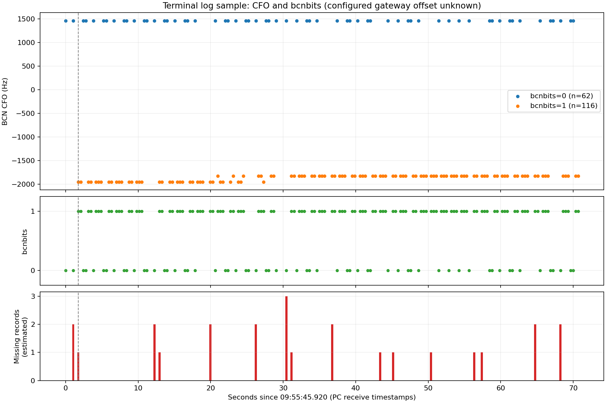

# 同频同步组网：终端日志样例分析

分析日期：2026-09-24。此报告分析用户提供的历史串口日志，未操作设备、修改网关固件或执行新的射频测试。

## 1. 输入与统计口径

- 原始附件已按字节复制到 [source.log](source.log)。SHA-256：`ce67d09451548e0d1e5447b1ea886e90cd3ecf814850ed11aea9fbc64fd91d6f`。
- 字段定义：`RX_TDD:TDD序号,广播RSSI,广播SNR,BCN_CFO_Hz,bcnbits`。
- TDD 序号按 NS 配置的 N，从 1 到 N 循环。正常连续接收不会连续出现相同序号。本样例按 N=10 解释，与日志中的 10→1 回绕一致；正式工具必须显式记录 N。
- 本次以 `{0,1}` 为允许的 bcnbits 集合。集合外的值定义为 bcnbits 错误解析。附件没有记录两台网关的实际配置快照，因此该允许集合是沿用需求示例的分析参数。
- 时间为 SSCOM 的电脑接收块时间，不是无线帧的硬件时间戳。没有单独时间戳的行继承所在接收块时间，并保存原始行号及接收块起始行号。
- 附件没有频差切换事件，也没有网关频率配置，按单个未知频差片段分析，不能据此还原配置频差。
- 不执行附件中的 AT 命令；命令和返回仅作为历史事件分析。

## 2. 主要结果

首条 RX_TDD 为 09:55:45.920，末条为 09:56:56.620，跨度 70.700 秒。共 178 条，全部完成五字段解析，无连续相同 TDD 序号。

| bcnbits | CFO / Hz | 记录数 | 对应关系 |
|---|---:|---:|---|
| 0 | +1465 | 62 | 所有 bcnbits=0 记录均为此值 |
| 1 | -1954 | 37 | bcnbits=1 的第一种 CFO 值 |
| 1 | -1832 | 79 | bcnbits=1 的第二种 CFO 值 |

以 `{0,1}` 为允许集合，错误值为 **0/178**。这表示本样例未观察到集合外的 bcnbits，不代表验证了全部广播的正确解码率。

本样例的 CFO 与 bcnbits 分组对应清晰，没有观察到两组 CFO 值交叉。但这种对应关系由同一份日志归纳，没有独立发送源标识，不能作为逐帧来源正确性的独立证明。

两个 CFO 分组的差值为 3419 Hz 或 3297 Hz；这是接收日志中的差值，不能认定为网关配置的频差。

| bcnbits | 样本数 | RSSI 范围（原始值） | SNR 范围（原始值） |
|---|---:|---:|---:|
| 0 | 62 | -93～-88 | 3～11 |
| 1 | 116 | -96～-88 | 4～16 |

### CFO 与 bcnbits 的相邻记录变化

比较全部 177 对相邻已收到的记录，缺失记录两侧的比较仍保留，不假定其间没有发生其他变化。

| 现象 | 次数 |
|---|---:|
| CFO 变化且 bcnbits 变化 | 79 |
| CFO 变化但 bcnbits 不变 | 4 |
| CFO 不变但 bcnbits 变化 | 0 |
| 两者都不变 | 94 |

合计 CFO 变化 83 次，bcnbits 变化 79 次。“变化”仅表示数值不同，没有应用跳变异常阈值。

4 次相同 bcnbits 下的 CFO 变化均发生在 bcnbits=1，变化量为 ±122 Hz：

| 前一条时间 | 当前时间 | CFO 变化 / Hz |
|---|---|---|
| 09:56:06.921 | 09:56:07.271 | -1832 → -1954 |
| 09:56:08.670 | 09:56:09.020 | -1954 → -1832 |
| 09:56:10.070 | 09:56:10.420 | -1954 → -1832 |
| 09:56:12.870 | 09:56:13.220 | -1832 → -1954 |

图中的虚线表示首次入网成功状态所在接收块；横轴起点为第一条 RX_TDD。缺失记录柱标在缺口之后第一条已收到记录的时间。另提供 [SVG 矢量图](cfo_bcnbits.svg)。

## 3. 入网、发送及广播日志缺失

日志记录一次 `AT+JOIN=0`，时间为 09:55:45.535。随后出现 `+NWKINFO:2`、`+NWKINFO:3`，并于 09:55:47.670 所在接收块出现 `+NWKINFO:4`。现有终端自动化代码使用 `+NWKINFO:4` 判定入网成功。

附件中未出现第二次 JOIN 命令或第二轮 NWKINFO 状态序列，因此未观察到重新入网证据。样例没有提供已确认的掉线事件，不能用它验证掉线识别规则。

入网后观察窗口定义为 **09:55:47.670～09:56:56.620**，包含首次 NWKINFO:4 同一个接收块中的 RX_TDD；该 RX_TDD 在文本中位于 NWKINFO:4 之前。此边界选择明确保留在 summary.json，避免误称为严格位于成功状态之后。

| 指标 | 结果 |
|---|---:|
| 窗口跨度 | 68.950 秒 |
| 实际 RX_TDD 条数 | 176 |
| 从日志间隔推断的单个 TDD 周期 | 350 ms |
| 首末样本之间预期记录位置数（含两端） | 198 |
| 推算缺失记录数 | 22 |
| 缺口区间数 | 14 |
| 缺失记录占预期位置比例 | 22/198 = 11.11% |
| 最大相邻接收间隔 | 1.400 秒，对应缺失 3 条 |

全样本窗口另含入网过程的 3 个缺失位置，总计推算缺失 25 条。它们不混进入网后窗口的 22 条统计。

示例：09:56:14.971 的 TDD=6 到 09:56:16.371 的 TDD=10，相隔 1.400 秒，缺少 TDD=7、8、9。09:56:16.371 的 TDD=10 到 09:56:17.070 的 TDD=2，跨回绕缺少 TDD=1。

缺失指缺少 RX_TDD 日志记录。期间存在 10 次 `AT+SENDB`，对应 10 次 `+TXSTATUS:7`，并有 `FREQ_OFFSET_CLOSE/OPEN` 事件。应在后续工具中保留这些事件与缺口的关联；此样例无法区分射频丢包、发送期间的接收行为及日志输出遗漏，不能将 11.11% 直接命名为频差导致的 BCN 丢包率。

附件开头的 `AT+WREG=0x08c8,0x05000900` 返回 `AT_PARAM_ERROR`，随后发生一次人工 `AT+RST`，均在 JOIN 之前。该失败写寄存器命令不属于已确认的终端自动配置流程。

## 4. 对正式分析工具的约束

1. 显式配置 TDD 数量 N，并结合广播周期及时间戳分析序号回绕。单用 `(当前序号-上一序号-1) mod N` 无法识别整圈丢失。相同序号在短间隔内可能是重复或异常，在相隔整圈时也可能是中间记录全部缺失，不能直接做唯一归因。
2. 序号缺失推算必须在同一个稳定运行段内进行，不能跨入网、重入网、切频或复位边界直接累加。时间戳与序号矛盾时保留为不确定事件。
3. CFO 与 bcnbits 变化均保存相邻原始样本，包括缺口标记。没有异常阈值时不把所有数值变化标为异常。
4. bcnbits 集合外值直接记录为错误，并保留 CFO、RSSI、SNR、TDD 和原文；集合内值与 CFO 的关联结果分为符合参考分布、疑似不匹配、无法区分。基于样本自身建立的分组关系只作描述统计。
5. 入网状态应识别完整 NWKINFO 数字，不能将业务发送的 TXSTATUS 当成网络状态。当前样例仅覆盖正常首次入网，不覆盖掉线和自动重入网。
6. 正式扫频须记录网关 POINT_START/POINT_END、GPS 状态及配置快照，才能按实际频差分段。本历史样例不补造这些事件。

## 5. 本次离线核验与后续回归样例

已执行的检查：

- 原文的 178 个 RX_TDD 标记与解析出的 178 条记录逐一对应，全部 TDD 在 1～10 内。
- CFO/bcnbits 联合分布计数之和为 178；相邻变化分类计数之和为 177。
- 全部 177 个相邻间隔的时间推算步数与 TDD 模 10 差值相符，时间相对 350 ms 整数倍的最大偏差为 5 ms。该 5 ms 是样例观测值，不作为通用串口误差阈值。
- 入网窗口的循环序号法独立得到缺失 22 条；时间栅格法得到 68.950/0.350+1=198 个位置，与 176+22 一致。
- 原始日志副本、CSV 明细、JSON 统计及图表已生成。

此目录可作为未来自动化分析器的正向回归样例，预期结果为 178 条样本、bcnbits 错误 0 条、83 次 CFO 变化、79 次 bcnbits 变化、入网窗口缺失 22 条。它不覆盖集合外 bcnbits、掉线重入网、串口半包、跨日、整圈缺失或多频点切换；这些场景仍需补充构造测试或真实日志。尚未实现并验证完整的一键扫频流程。

## 6. 交付文件

| 文件 | 用途 |
|---|---|
| [source.log](source.log) | 原始附件的字节级副本 |
| [samples.csv](samples.csv) | 178 条接收记录、源行号与接收块时间 |
| [transitions.csv](transitions.csv) | 177 对相邻记录变化及缺口标记 |
| [gaps.csv](gaps.csv) | 全窗口 16 个缺口区间及缺失 TDD 序列 |
| [events.csv](events.csv) | 配置、入网、发包及其他相关事件 |
| [summary.json](summary.json) | 统计结果、参数假设、核验结果和输入摘要 |
| [cfo_bcnbits.png](cfo_bcnbits.png) / [cfo_bcnbits.svg](cfo_bcnbits.svg) | 共用时间轴的静态分析图 |
