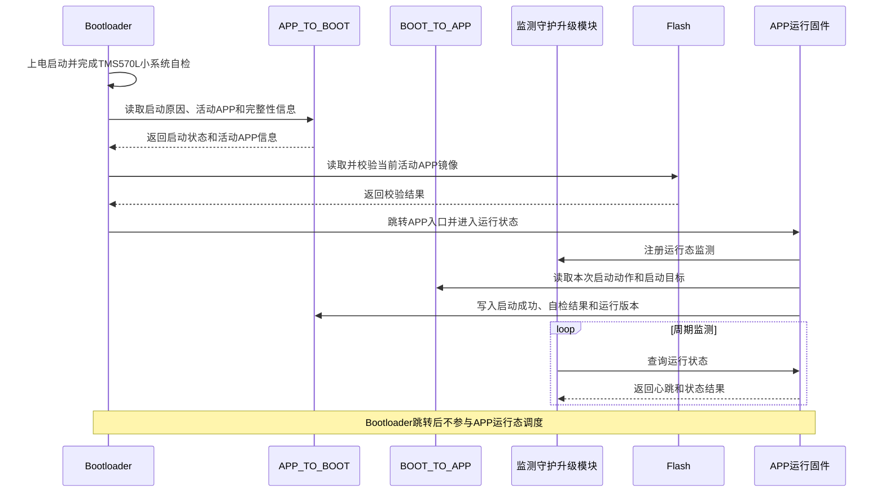
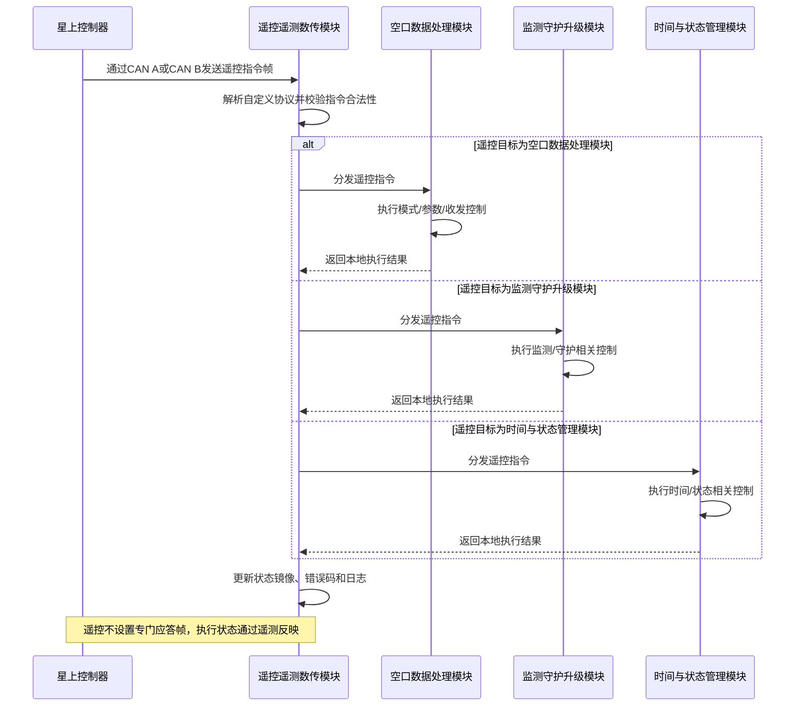
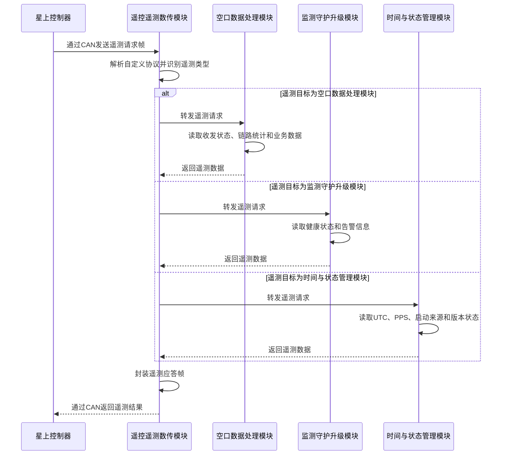
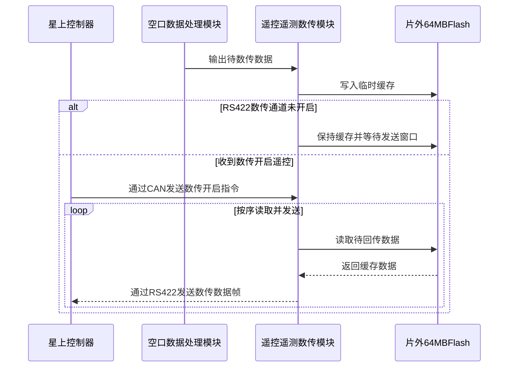
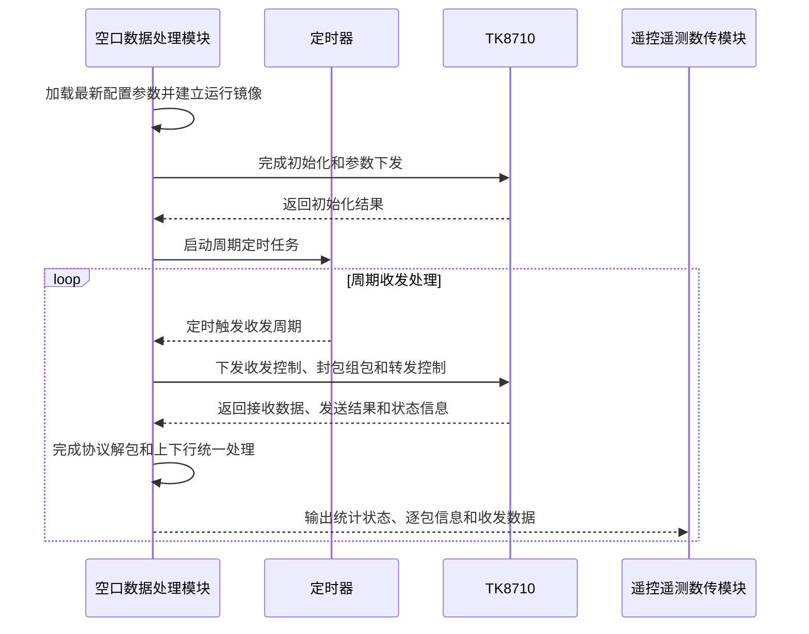
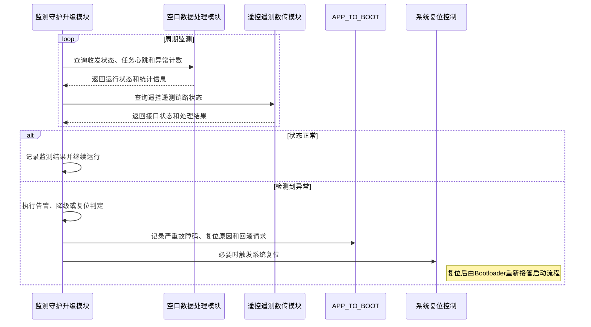
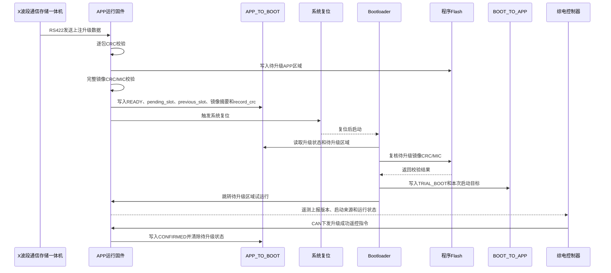
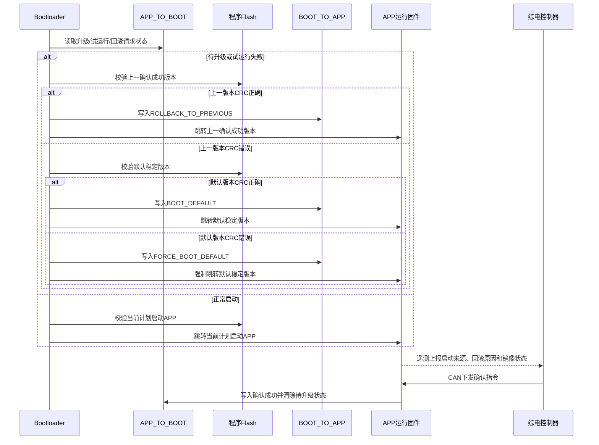
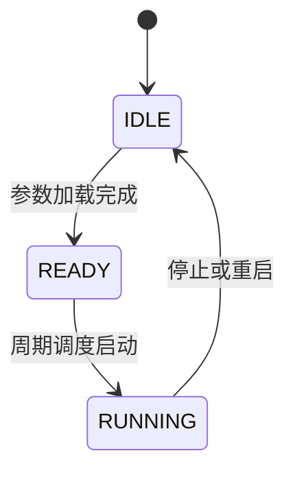
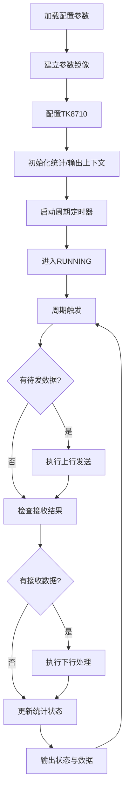

# 妙月卫星载荷概要设计方案

**版本：** V0.4  
**基于：**   
**创建日期：** 2026-06-30  
**最后更新：** 2026-09-03 

---

## 修订记录

| 修订时间   | 修订版本 | 修订描述 | 修订人 |
| ---------- | -------- | -------- | ------ |
| 2026-06-30 | V0.1 | 初始版本 |  |
| 2026-07-16 | V0.2 | 增加关于启动和bootloader的相关内容 | Dennis |
| 2026-09-01 | V0.3 | 1）删除3选2固件冗余启动的功能要求 | Dennis |
| 2026-09-02 | V0.4 | 明确系统架构以TMS570L直接处理外部CAN、RS422、PPS接口为基线；补充遥控无应答、数传缓存、PPS校时和CAN A/B接收约束；补充TMS570L软件分层、Bootloader/APP职责边界、软件架构分层图、TMS570L片内Flash划分、上注升级流程和版本回滚流程 |  |

---

## 目录

[TOC]

---


# 1 概要设计
## 1.1 主要功能规格

LEO载荷的**主要功能**如下表所示：

![img](data:image/svg+xml;base64,PHN2ZyB4bWxucz0iaHR0cDovL3d3dy53My5vcmcvMjAwMC9zdmciIHN0eWxlPSJiYWNrZ3JvdW5kOiB0cmFuc3BhcmVudDsgYmFja2dyb3VuZC1jb2xvcjogdHJhbnNwYXJlbnQ7IGNvbG9yLXNjaGVtZTogZGFyazsiIHhtbG5zOnhsaW5rPSJodHRwOi8vd3d3LnczLm9yZy8xOTk5L3hsaW5rIiB2ZXJzaW9uPSIxLjEiIHdpZHRoPSI1NjBweCIgaGVpZ2h0PSI0MTlweCIgdmlld0JveD0iMCAwIDU2MCA0MTkiPjxkZWZzLz48Zz48ZyBkYXRhLWNlbGwtaWQ9IjAiPjxnIGRhdGEtY2VsbC1pZD0iMSI+PGcgZGF0YS1jZWxsLWlkPSI4bHVjOGVxR2Q5VG1PYUVySTlPUi0xIj48Zz48aW1hZ2Ugd2lkdGg9IjU2MCIgaGVpZ2h0PSI0MTkiIHhsaW5rOmhyZWY9ImRhdGE6aW1hZ2UvcG5nO2Jhc2U2NCxpVkJPUncwS0dnb0FBQUFOU1VoRVVnQUFBakFBQUFHakNBWUFBQUF5Nnk4ZkFBQWdBRWxFUVZSNG5PemRlVmpVVjVyLy9YZHQ3UHUrYjRLQWdpdUt1Q0FTUklXNHhpMmFtS1RUbWZRODA3bjZOejA5VDg5dm5wbnA2YzVta281cFkydVNqakdkdU84TDRvYTdXZDJOK3hJMWlyZ2lJSHRCMWZmNWcvQnRpUnBCcVNvSzd0ZDF6ZFdtQXQ5elY3Y0RuenJuUHVkb0ZFVlJFRUlJSVlTd0kxcGJGeUNFRUVJSTBWSVNZSVFRUWdoaGR5VEFDQ0dFRU1MdVNJQVJRZ2doaE4yUkFDT0VFRUlJdXlNQlJnZ2hoQkIyUndLTUVFSUlJZXlPQkJnaGhCQkMyQjBKTUVJSUlZU3dPeEpnaEJCQ0NHRjNKTUFJSVlRUXd1NUlnQkZDQ0NHRTNaRUFJNFFRUWdpN0l3RkdDQ0dFRUhaSEFvd1FRZ2doN0k0RUdDR0VFRUxZSFFrd1FnZ2hoTEE3RW1DRUVFSUlZWGNrd0FnaGhCREM3a2lBRVVJSUlZVGRrUUFqaEJCQ0NMc2pBVVlJSVlRUWRrY0NqQkJDQ0NIc2pnUVlJWVFRUXRnZENUQkNDQ0dFc0RzU1lJUVFRZ2hoZHlUQUNDR0VFTUx1U0lBUlFnZ2hoTjJSQUNPRUVFSUl1eU1CUmdnaGhCQjJSd0tNRUVJSUlleU9CQmdoaEJCQzJCMEpNRUlJSVlTd094SmdoQkJDQ0dGM0pNQUlJWVFRd3U1SWdCRkNDQ0dFM1pFQUk0UVFRZ2k3SXdGR0NDR0VFSFpIQW93UUQyRTJtMjFkZ2hCQ2lKK1FBQ1BFQXlpS2dzbGtZdWV1WGRUV0dxbXROVkpYVjQraUtDaUtZdXZ5aEJDaVE5TW84cE5ZaVB1cU41a29yVFpSV21PbXJLd012NEJBZEpqUlZ0N2lxeTkyTTNyMGFQVnJEUWFERFNzVlFvaU9Sd0tNRVBkUlhsNU9hVmtaTjQwTzNMaCtsYUNRTUNySzczQ25ySlR3SUg4V3paMU5TVWtKQUk2T2preVpNZ1dBenAwNzQrSGhBWUJXcTBXajBkanNQUWdoUkhzbUFVYUluNmlxcXVKdmYvc2JseTVkNHVWLy9UMkszcG1xeWdxdVg3dEtjR0FBbFRjTGVmZlA3OXozZStQaTRuQnpjd05nM0xoeCtQajQ0T3JxcXI2bTBXZ2sxQWdoUkN1UUFDUEVYVXdtRSsrODh3NTc5KzRGSUNZbWhxNWR1NnIvdnFpb2lBTUhEclRvbVhGeGNTUWtKQURRdTNkdjljOTZ2UjZ0VnRyUWhCRGlVVWlBRWVKSFZWVlZ6Sm8xaTIrLy9kWmlZeGdNQnZSNlBRRHA2ZWwwNnRRSlgxOWZrcE9UZ1lZWkdwMU9aN0h4aFJDaXZaQUFJd1JRVVZIQjNMbHoyYjE3dDlYSGRuVjFKU1FrQkdpWXJVbFBUMGVqMGRDcFV5ZjFhMlNtUmdnaG1wSUFJenEweHEzUzc3Ly9QbDk4OFlXdHkxRnB0Vm9HRHg0TU5BU2NwNTkrV24zZHdjRkIvVHJwcHhGQ2RGUVNZRVNIWmpRYWVlZWRkMXJjMTJJcjN0N2VQUG5ra3dCa1pHU296Y0Y2dlY3Q2pCQ2lRNUVBSXpxczh2Snk1czZkeTU0OWUyeGR5aVB4OS9kWCsybW1USm1DazVNVFlXRmgrUG41QWJLTld3alJ2a21BRVIyU29pZ2NQSGlRMTE5LzNkYWx0S3JJeUVnQ0FnSUF5TXpNSkRvNkdnQlBUMDkxNlVsQ2pSQ2lQWkFBSXpxa00yZk9NSDM2ZEVwTFMyMWRpbFVNSERnUWYzOS9PblhxUkVwS0NnQTZuVTUyUEFraDdKWUVHTkdoS0lyQ3VYUG5lUFhWVjZtb3FMQjFPVlpuTUJod2NuSUNvRnUzYnZUdTNSc25KeWMxMU1nMmJpR0V2WkFBSXpvTVJWRTRlL1lzYjcvOU5yZHYzN1oxT1cyR3dXQWdOallXYU9pckdUVnFGQUJoWVdGcWo0MmNJQ3lFYUdza3dJZ080L3Z2djJmNjlPa1VGeGZidWhTN01IRGdRSnlkblFHWU5tMmFlbUhsM2R1NGhSRENWaVRBaUhaUFVSVE9uRG5EYTYrOVJtVmxwYTNMc1V1TnN5OWFyWlpwMDZZQjBLdFhMN1ZoV0xaeEN5R3NUUUtNYU5jYWUxN2VlT01OeXNyS2JGMU91K0xuNTZmTzBPVGs1QkFVRklTUGo0OTZxckJHbzVFVGhJVVFGaU1CUnJSYmplSGxuWGZlNGRhdFc3WXVwME1JQ2dwU3QyNzM3Tm1UWHIxNkFlRGk0b0tqb3lNZzI3aUZFSzFEQW94b3R6cmFWdW0yckdmUG5zVEd4dUxuNTBkR1JnYlFFR1FhbTRTRkVLS2xKTUNJZGtkUkZMNy8vbnYrOUtjL2RjaXQwbTJaWHEvSDNkMGRnSWlJQ0o1NDRna0FVbE5UMVoxT3NvMWJDTkVjRW1CRXUyTTBHcGs5ZTdiZFhoSFFFU1VsSmFIUmFEQVlERHo3N0xOQXc1YnV4ak5yWkJ1M0VPS25KTUNJZHNWc05yTjgrWEtXTGwxcTYxTEVZMHBKU2NIZjN4K0EzTnhjOVk0bmc4RWdZVVlJSVFGR3RCOW1zNW5QUHZ1TTlldlhJMyt0N1oram95TXYvOHNyQk1Ra1VWZFhoNWUzTjFXVmxRUjZPSER1K0JHOHZiM1ZobUd0VmlzN25vVG9ZS1NEVHJRTGRYVjFMRnUyakEwYk5raDRhU2NtUHowVjk2QW9DaS85UUdoWUtGZUxybkRyeGcxY2tycXdaY3NXTGx5NGdKZVhGd0Q5Ky9jbklTRUJGeGNYSWlJaUFObkdMVVI3SndGRzJMMzYrbnJXcmwzTHlwVXJiVjJLYUVVblR4NG5xV2R2bkNNaWNIRTBVRlZkUTBSb0lEY3ZmYy9GaXhjcEtTbWhwS1FFZ0FzWExnRGc1ZVZGY25JeUFOSFIwV1JtWmdJTnB3ZkxObTRoMmhkWlFoSjJ6V3cyczNEaFFsYXZYbTNyVW9TRlRKZ3dRZDJaZFByMGFRNGRPdFRpWjhUR3hwS1Nrb0tqb3lNNU9UbUFiT01Xd3Q1SmdCRjJ5MncyOC9ubm41T2ZuNC9KWkxKMU9jSU9hRFFhZkgxOUFmRDA5T1NwcDU0Q29Hdlhycmk0dUFBTi9UUXlTeU5FMnljQlJ0Z2xvOUhJdW5YcldMUm9rYTFMRWUxQWZIeThlaTNDNU1tVGNYVjFCUnBPRm03Y3dpMmhSb2kyUlFLTXNEdXlWVnBZUzA1T0RscXRsdjc5K3hNVEV3TTBITVluemNGQzJKNEVHR0ZYR3BlTjFxOWZqOWxzdG5VNW9vTXdHQXhxSDA1V1ZoYmg0ZUVFQlFXUm1KZ0lJQ2NJQzJFREVtQ0UzVkFVaFpzM2IvTGIzLzZXcXFvcVc1Y2pPamgzZDNjQ0F3T0JocE9FKy9idGkxNnZWMmRxQUptcEVjS0NKTUFJdTZBb0NtVmxaZnpwVDMvaTRzV0x0aTVIaVB0eWNIQ2dmLy8rQVBqNCtEQnUzRGlnSWNnMGJ1TUcyY290Ukd1UUFDUHN3clZyMTVnK2ZUcVhMbDJ5ZFNsQ3RGaGdZQ0JEaHc0RllOaXdZVGc0T0FBTi9UUVNab1I0TkJKZ1JKdW1LQXJYcjEvbm5YZmVVUThyRThLZUJRUUVxRXRMTDd6d0FocU5ocWlvS0x5OXZRSFp4aTFFYzBtQUVXMldvaWpjdVhPSFAvemhEekx6SXRxMW1KZ1lmSHg4QUJnK2ZEaWhvYUVBZUh0N1l6QVlBRmwyRXVLbkpNQ0lOdXZtelp1OCtlYWIwdk1pT3F5TWpBeTh2THhJVEV5a2UvZnVBT2gwT3RueEpBUVNZRVFiZGZYcVZkNTU1eDBKTDBMUXNJMjdzUW00VDU4K0pDVWw0ZWJtUnMrZVBRSFp4aTA2Smdrd29rMVJGSVhpNG1MZWVPTU5DUzlDL0F3bkp5ZWlvcUlBQ0FzTEl6czdHd0EzTnpjQ0FnSUEyY1l0MmpjSk1LSk5LU3NyNDQ5Ly9LT0VGeUVlVVZCUUVFbEpTV2kxV243eGkxK29yemZ1ZkJLaXZaQUFJOXFNYTlldThlYWJiM0w1OG1WYmx5SkV1K0xzN015a1NaTUFTRTFOVlJ1R1pSdTNzR2NTWUVTYlVGOWZ6My8vOTM5eit2UnBXNWNpUkx2bTcrK3Y5dE9NSFRzV0x5OHZBZ01EMVZPRk5ScU5MRDBKdXlBQlJ0aWNvaWpzM3IyYkR6LzhrTnJhV2x1WEkwU0hFeG9hU25oNE9BRDkrdldqYTlldVFFTS9UZVBTazh6VWlMWkdBb3l3S1VWUitQTExMNWt4WTRhdFN4RkMvRVRmdm4ySmlJZ2dKQ1NFQVFNR0FBMUJScS9YMjdneUlTVEFDQnN5bTgxczM3NmR1WFBuWWpRYWJWMk9FT0lCOUhvOWJtNXVBTVRGeFRGdzRFQzBXaTJwcWFtQWJPTVd0aUVCUnRpRW9paHMzNzZkZWZQbVVWMWRiZXR5aEJBdHBORm8xS1VtVjFkWHRVbll3Y0dCb0tBZzlXdGs2VWxZaWdRWVlYV0tvdkQxMTEvejNudnZZVEtaYkYyT0VLSVZlWGg0cURkeWp4czNEZzhQRDZEaE1ENEpNNkkxU1lBUlZtVTJtOW01Y3llelo4OUcvdW9KMGI3cGREbzF0RHo5OU5NNE9qcVNtSmlvTmd4cnRWclo4U1FlbVFRWVlUV05QUytmZnZxcExCc0owVUg1K3ZxcS9UU1ptWmxFUlVYaDRlRkJXRmdZSU51NFJmTkpnQkZXb1NnS1gzenhCWFBtekpHdDBrS0lKbng5ZlVsSVNBQWdNVEZSM2ZIazZPaW9ubGtqeTAvaXB5VEFDSXN6bTgxOCtlV1h2UGZlZTdZdVJRaGhSN3AwNlVKeWNqSnVibTdxWFUreWpWczBrZ0FqTE83UzVVSyt2M1NGd05BSWFoVWRwcW95OGxZczRmalJJNWpOWmx1WEo0Um80N1JhTGQ3ZTNnQkVSMGZ6eXYvNU44eG9jSEhRb3YxeFprYXIxY29zVFFjakFVWllWSDE5UGJlcUZTNWV1VTV0VFRVaDRSSGN2SDRORHpkWHZpbFl5NGI4ZkZ1WEtJU3dFLzNTMHVpVG5rMUViRHlLUm91akZqRFg4LzNSL1VSSFJhcE53OEhCd1lCczQyN3ZaQjVPV0l6SlpHTEJnZ1gwR2ZRRWQ4cktDQW1MNE5xVks1U1dGQlBnMDVud0g1djJoQkNpT1o3L3AzL2gwTWx6WENrc3hOL0hnMHMzYjFOVFZVM2YzdjM0OVMrbllUUWEwV3ExakJneEFvQWhRNGFvemNGNnZWNmFnOXNabVlFUkZsRlJVY0ZmL3ZJWERoNDhTRWhJQ0xsUFBrbGdXQlF1Ymg2Y1AzbUVRd2NQY2VUSVllcnI2MjFkcWhEQ1R2enlwWmVJNzk0WEYzY1BLdTZVVVZKY2pJZW5KeXNXZk1MQkF3ZnUrWHFEd2FDR2x0emNYQUlDQWdnTEM2Tno1ODZBYk9PMmR4SmdSS3U3YytjT0gzMzBFVjkvL1hXVDE3Mjh2SEIyZHVicTFhczJxa3dJWWUvQ3dzTFVuVWtBZFhWMVhMcDBxZG5mNytucGlaK2ZId0M5ZXZXaVI0OGVBQVFHQnVMbDVRVWdvY1pPU0lBUnJVWlJGT3JxNnBneFl3Wjc5KzYxZFRsQ0NORnNjWEZ4aElTRUVCd2NURzV1THRCd0VOL2RZVW42YWRvV0NUQ2kxZFRVMVBEV1cyOXg1TWdSVzVjaWhCQ1BMVHc4blBUMGRBQkdqaHlwQmhpRHdXRExzc1NQSk1DSVZuSG56aDArL1BCRHZ2bm1HMXVYSW9RUXJTNHdNQkJvdUt4eTZ0U3BRTU9zVGVOZFQ3S04yL29rd0lqSFZsbFp5Wnc1Yys3cGVSRkNpUGJzN2dBemV2Um90YmZHejg5UERUUVNhaXhIQW94NExDYVRpZGRmZjUzRGh3L2J1aFFoaEdnVGhnNGRpb3VMQ3oxNjlDQXhNUkdRYmR5V0lBRkdQREt6MmN4bm4zMUdYbDZlclVzUlFvZzJ4OEhCUWUyWEdUQmdBSjA3ZDhiYjI1dms1R1Nnb1NsWXA5UFpza1M3SmdGR1BCSkZVVGh4NGdUdnZ2c3VwYVdsdGk1SENDSHNnb3VMQytIaDRRREV4TVNRa1pFQk5OM2VMVE0xelNNQlJyU1lvaWljT1hPR3Q5OSttNUtTRWx1WEk0UVFkaThzTEl6NCtIaWNuWjNWSm1HTlJ0Tmt4NVAwMHpRbEFVYTBpS0lvbkR4NWt0ZGVlNDJhbWhwYmx5T0VFTzJXcDZjblk4YU1BV0RRb0VHNHU3c0REZjAwRW1Za3dJZ1dhQXd2YjczMUZ1WGw1Yll1UndnaE9veUFnQUIxTm1ieTVNazRPenNUR2hyYVpObXBvNFVhQ1RDaVdSckR5NHdaTTdoOSs3YXR5eEZDaUE0dk1qS1NvS0FnQUFZUEhreHNiQ3dBN3U3dU9EZzRBTzE3MlVrQ2pIZ29SVkU0ZGVvVTA2ZFBsNWtYSVlSbzR3WU1HRUJRVUJCUlVWSDA3ZHNYYUppaGFXODduaVRBaUovVjJMRDd4ei8rVVhwZWhCRENqaGdNQmx4Y1hBQklTa29pSlNVRlIwZEhVbEpTQVB2ZnhpMEJSanhRNDFicEdUTm15RzRqSVlSb0IvUjZQWjA3ZHdiQTE5ZFhiUkoyY25KU3IwdXdseE9FSmNDSUJ6cDkrclJzbFJaQ2lBN0F4OGRIblptWk9uV3FlZ3QzWXk5Tld5UUJSdHlqc2VmbDFWZGZsV1VqSVlUb1lCb1AwdE5vTkR6Ly9QTUFkTy9lWFcwWTFtcTFiZUt3UFFrdzRoNUdvNUhaczJlelo4OGVXNWNpaEJDaURmRHo4OFBGeFFWM2QzZW12ZkFpUWNFaGFGRndOT2pVSlNkcmh4cmJSeWpScHRUVjFiRml4UW9KTDBJSUlWUzNidDBpSkNTVXpDZkhvM0VQNU1LdFNvcnI5TnlvTkpHL2VTdDc5dXlocnE3T3FqVkpnQkVxazhuRTU1OS96b29WSzJ4ZGloQkNpRGJFM2QyZEYvNmYzMUJaVzhmWnM2ZXBNeG41L3R3NWpwOCtSMnBhZjg2Y09VTkZSWVZWYTVJQUk0Q0c4REp2M2p3MmJ0eG82MUtFRUVLME1SVVZGU3o1KzkrSWpnZ2xOaW9TWjYwR0IrcUppd3JsKzFQSCtQVFRUNm1zckxScVRYcXJqaWJhcE5yYVdsYXVYQ25oUlFnaHhIMHBpc0tPN2R1NWZ1MGFlbjFEZEhCMmRxWnIxNjdNbURIRDZ1RUZKTUIwZUdhem1XWExsckY2OVdwYmx5S0VFS0tOTzNIaWhQcm5uSndjM25ubkhVcExTMjFTaXdTWURzeHNOak4zN2x3MmI5NXM2MUtFRUVMWUNXZG5aekl5TXZqb280OHdHbzAycTBNQ1RBZGxOQnBac21RSm16ZHZSbmJTQ3lHRWFLNklpQWhPbmp5cGhoZXRWa3R1Ymk1dWJtNVdyVU9hZUR1Zyt2cDZWcTVjeVpvMWF5UzhDQ0dFYUxhWW1CaDBPaDNidG0wREdnNjdHekZpQkdmT25HSFpzbVdZeldhcjFTSXpNQjJNeVdUaXM4OCtJejgvMzlhbENDR0VzQ094c2JGb3RWcnk4dkxVMTU1ODhrbE9uejdObVRObkNBZ0lzT3FIWXBtQjZVQVVSZUhhdFd0ODhjVVh0aTVGQ0NHRUhZbU9qa2FuMHpYcG1SdzllalFuVDU3a3pKa3pOcWxKWm1BNkNFVlJLQzR1WnZyMDZaU1ZsZG02SENHRUVIWWlPam9hRnhjWDFxMWJCNEJPcDJQNDhPR2NPSEdDYytmTzJhd3VDVEFkeEkwYk4zampqVGU0Y3VXS3JVc1JRZ2hoSjJKalk5SHI5V3A0QVFnTEM4UFoyWm16WjgvYXNESUpNQjFDWVdFaGI3LzlOb1dGaGJZdVJRZ2hoSjJJaVlsQnE5VTJPZVEwSUNDQXRMUTBWcTVjYWNQS0drZ1BURHVtS0FvM2J0emdyYmZla3ZBaWhCQ2kyYUtqbzNGMmRtYmp4bzNxemlKdmIyOHlNakxJeTh1eitzV045eU1CcHAxU0ZJWGJ0Mi9Mc3BFUVFvZ1crV25QQzRDTGl3dGp4NDVsN2RxMU5yazI0SDVrQ2FtZEtpb3E0czAzMzZTb3FNaldwUWdoaExBVG5UcDF1cWZueGQvZm41eWNIT2JObTJmRHl1NGxNekR0aktJb0ZCVVY4ZmJiYjB0NEVVSUkwV3p1N3U1RVJFU3dhZE1tOVRWL2YzOEdEeDdNOHVYTGJWalovVW1BYVVjYWw0Mm1UNS9PNWN1WGJWMk9FRUlJTzZIVDZlalJvd2NGQlFWcXo0dUxpd3M1T1RsczJMQ0JxcW9xRzFkNEwxbENha2V1WDcvT20yKytLUTI3UWdnaFdpUTlQWjJDZ2dKKytPRUhvS0ZoZCt6WXNXMXUyZWh1RW1EYUNiUFp6TDU5KzJUbVJRZ2hSTE5wTkJveU16UEp6ODlYTjN3RUJBU1FrWkhCZ2dVTGJGemR6NU1BMHc0b2lzS1dMVnRZdkhpeHJVc1JRZ2hoSnd3R0EvMzc5MmZEaGcxcWVQSHk4bUxJa0NIazUrZXJ0MDIzVmRJRFkrY1VSV0hQbmoxOC9QSEgxTlRVMkxvY0lZUVFkbUxBZ0FIczJMR2pTZHZCeElrVDJiaHhJeFVWRlRhc3JIbGtCc2FPbWMxbUNnb0srT2lqajJ4ZGloQkNDRHVTbFpYRit2WHJtNXdUMXI5L2Y0NGVQY3FkTzNkc1dGbnpTWUN4VTJhem1VMmJOakYvL254Ymx5S0VFTUpPNlBWNkJnNGNlTi93QXZEMTExL2JxclFXa3dCamg4eG1NenQzN3VTenp6NXJFOGM1Q3lHRWFQdTBXaTFwYVdsczI3YXRTWGhKUzBzRDRLdXZ2ckpWYVk5RWVtRHNUR040K2V0Zi95cmhSUWdoUkxNTkhqeVlIVHQyY1BIaVJmVzF0TFEwTkJwTnE0U1h5NWN2VzNVbnJNekEyQkd6MmN6bXpadjU3TFBQYkYyS0VFSUlPNUtabWNtT0hUdlVjMTdnSDh0R0R3c3Y3cDVlSkNiM0FHRGNsT2R4ZEhMbXdEZGZjT2JFVWNydmxISHl1ME1BWEx4NGtZc1hMeElWRldXaGQ5R1VCQmc3b1NnS0JRVUZmUDc1NTIxK2E1c1FRb2kydzh2TGk1cWFtaWF6STgxZE5ob3kvRW5TczBiZ0Z4Q0UzbUNncXFLQyt2bzYrdlJQSnkzOUNTb3JLMWkxY0I3ZjdONXUwZmR3UHhKZzdJQ2lLSHp4eFJleTIwZ0lJVVNMK1BqNDBLMWJOejc1NUJQMXRlYk92S0RSOE14THIzRGorbFZPSERuSWpzM3JPWFhzQ0FESnZmcVFNM1lTUHY2QlBQWE1pOVFaYXpud3paY1dleC8zSXowd2R1RENoUXZNbkRuVDFtVUlJWVN3STRHQmdjVEZ4ZkhwcDUrcXI3V2tZWGRRNWpCS2JoZmo0T0RJZHdmM2N1cllFUUtDUWtoTGY0S2pCL2RSVTEydGZxMlhqMS9ydjRHSGtCbVlOcTYwdEpRbFM1YW9sMnNKSVlRUUQrUGo0ME5VVkJTclZxMVNmMyswdEdGM3o3Wk5qSjN5UElxaU1HcmlNd3dmUFFFSFIwZWNYVnpKR1RjSk53OVBGRUN2MDNIcStGRUx2cHY3a3htWU5rcFJGR3ByYTVrMWF4Yjc5KyszZFRsQ0NDSHNoSmVYRjkyNmRXUEpraVhxQ2UwNm5ZN1UxTlFXN3piNi9PTTVITjcvTFlvQ1FhRmhCSVdHRXh3YVRsQllPR2F6bVF2bnpyQnAzU3EwV3V2SENabUJhYU9xcXFwNDY2MjNPSGJzbUsxTEVVSUlZU2NDQWdLSWk0dHIwdk9pMCtsNDdybm5IdWxtNmV0WHIyQ3NyZVhzcVpPNHVybmg1T3lNd2NFQnZWNlBScVBCWkRLQlJvTkdveVVzTEl6ZzRPRFdmRHMvU3dKTUcxUmFXc3JzMmJNbHZBZ2hoR2kyZ0lBQUlpSWlXTHAwcWZxYXE2c3JvMGVQWnNXS0ZZOXhSWUR5NC8vOTR6L1UvMFNEVHFjanVYc1BIRFgxM0w1OSt4SEhhRGxaUW1wREZFV2hvcUtDT1hQbWNPREFBVnVYSTRRUXdrNTRlWG5SdVhOblZxOWVUVzF0TFFCT1RrN2s1T1N3ZGV2V1J3b3ZJOFpNWkhEV2NCU2xNYThvLzhndGQzSHo4T1RsLy9QL0VoZ1M5amh2b2NWa0JxWU5xYSt2NSsyMzM1YVpGeUdFRU0zbTYrdExVbExTUFV0RWt5ZFBKaTh2aitMaTRoWS8wOHZIbDlSQlEvQUxET0w4MmRPZ0tDZ0tnTUxkS2NiZDNZUE00YmxjdTM2RG5LZW00Ty84ZU8rbEpTVEF0QkZsWldYTW5EbFR3b3NRUW9nV3ljek01SjEzM2xILzJkblptVW1USnJGczJUS3FxcW9lNlptOWVuUW5LaUtVNmpyNDU5LytCMVdWRlJ6LzdoQUdnd042dlFHdFZrdEFVREIxUmlPbHQ0dXBxYW9rTnNBVmNHeWxkL1Z3c29UVUJwU1ZsVEZuemh3T0h6NXM2MUtFRUVMWWtUNTkrckI1OCthR1psb2FlbDV5YzNOWnYzNzlJNGVYakl3TVhGMWRtZlB1ZEdwcnFxaXFLTWZkdzVQaEk4Zmg2dWFPd2NFQkJ3Y0gzTnpkOFFzSXBNNVl5NVV6MzdGNDRZTFdmR3NQSlRNd05xUW9DdlgxOWN5Y09WUENpeEJDaUJaSlRVM2x4SWtUNnU4UGpVYkQyTEZqMmJKbEM3ZHUzWHFrWnc0ZVBKaVhYMzZaczJmUEFuQ244QXpkKzZSUmd3WlE2RGN3SGJQSmpJTENpY01IT0gzc01INWViaFJzM2toSlNRbVptWmwwNmRLbHRkN2l6NUlBWTBPS29yQnc0VUlKTDBJSUlWcWtUNTgrbkR4NVV2MzlvZGZybVRadEdzdVdMYU9pb3VLUm51bnE2a3J2M3IzNTFhOStSVTFORGZYMTlkVFUxS0FvQ2lOSGppUStQaDRBazhtRW9paTR1TGlRR0JQTzl1M2JPWG55SkFBM2J0eVFBTlBlS1lyQzBhTkgyYlp0bTYxTEVVSUlZVWRTVWxJNGMrWU1odzQxM0FMdDZ1ckt5SkVqV2JWcTFTT0hGNERLeWtyZWYvOTlkRHFkK3BwR28wRlJGUEx5OHNqTHl3T2dWNjllcEtlbk0zdjJiSktTa3ZEeThucThOL1NJcEFmR0JoUkY0YnZ2dm1QbXpKbFVWbGJhdWh3aGhCQjJRS1BScU9IbDRNR0Q2dXZqeG8xang0NGRsSmFXV3FXTzI3ZHZXMjJzbnlNek1GYW1LQXJIamgzanozLytzNFFYSVlRUXpmYlRtUmVBK1BoNFNrcEt1SDc5ZXVzUHFORzAvak5ia2N6QVdKR2lLQncvZnB3MzNuaER3b3NRUW9obVMwbEo0ZlRwMDAxbVh1TGk0b2lOaldYRGhnMDJyS3dwUlZHb3E2dXp5bGdTWUt5a2Nkbm8zWGZmVlU5SkZFSUlJUjZtVDU4K25EMTd0c25NUzJ4c0xJbUppV3pZc0VHOWJibzFLTW8vVHFscjIvTXZFbUNzNXNTSkU3ejMzbnVVbFpYWnVoUWhoQkIySWpVMTlaNlpsOWpZV0xwMjdjcTZkZXVhQkE2TGFNUExTTklEWTJHS29sQmJXOHUyTDc1bDhMQW44Zlh4NGNMWjA1VGV2c1dSdzRjZS9nQWhoQkFkVW1ob0tMVzF0ZmYwdk1URnhiRjI3VnFyMU5DUytESm8wQ0Q2OXUxcnNWcCtTZ0tNQlNtS1FxM1J5SzNLZXZvTkdZN1JXRXRnY0FoeHliMmgza2p0UnpNNWRmS0VyY3NVd21xY25aMEpEWS9FakFZTllLNnI0Y0tGQzdZdVM0ZzJ4OTNkblppWUdGYXRXcVcrRmhzYlMxeGNIQnMzYnJUczRCb050SEJtSnlBZ2dJQ0FBSTRlUFVydjNyMHRWRmhURW1Bc3BIRzMwWjR2dmlBdGN3VFhyOTBrc2xNczE2OFZVWHJyRmhIaFlSZ2NIR3hkcGhCVzA3TlhMOUl5UnhBVDM1V3k4Z3A4dkwweDFaU3pkTjZIN051MzE5YmxDV0ZWQm9NQmg3dCtCOXk5c2NOZ01OQ25UeDlXckZpaDNpSWRHeHRMVWxJU2E5YXNzV2hkam82T0pDVW5NeVFqQTBWUk1KbE1GQllXcWpNKzVlWGw5M3lQbDVjWHc0WU5ZOW15WlF3YU5NaWk5ZDFOQW95RjFOZlhNMnZXTEtxcXF2RHk5R1JJemxnVXhReVY0T1Rsd3JhMVN6aDZSRTdnRlIzSHIzN3pPdzRjTzhQbHk1Zng4L1hnd3ZudnFhNnE0cVZYZnN1aFh6eERmWDI5clVzVXdpcjY5RTFsWU5ZSUVoSVNnSVlQdkd0WExtZlA5aTNVMWRXUm1abkozTGx6cWFtcEFmNnhiR1RwOE9MczdNeVVLVk1vTEN6a0x6Tm5ZaktaTU5iV0VoQVF3TlNwVXdFd0dvMTRlM3NURlJXRnE2c3JnWUdCR0F3Ry92Q0hQMWkwdHZ1UkFHTUJkWFYxZlB6eHg5eStmUnV6MmN5S0ZTc29LQ2hBODJNelZHMXRMZFhWMVRhdVVnanIrbVRPVEVaT2ZCWkhKMmZNWmhNT0doUCtJUUY4K3VFc0NTK2l3MGhJU0dEVTVHbGN1RnpFOTFldTQrUHJUMUhoWmRKSGpLVzJxZ0xGVk1jbm4zeWloaGRyTFJ0NWVYa3hZc1FJbGl4WjByQU5XcU5SKzErS2lvcjQ0SU1QQVBEeDhTRXlNcEwrL2Z1ck5VMmNPTkdpdFQySUJKaFdWbE5UdzlLbFM5bTZkV3VUMTJYM2tlam85bjc3TGJlTGkzRnljbEpmTXhxTm5EbHp4b1pWQ1dGZFpyTVpqYUxnNyt1RGozOEFONjlkeFZoVmdaUFdUSmZFQlA3MHgvOVZQK0FHQmdiU3IxOC9GaXl3N0MzUGJtNXVaR2RuczJuVEpxcXFxakFZREEvODJ0dTNiK1BzN0V4TlRRM0Z4Y1VBUC92MWxpUUJwaFdaVENZV0xWckUrdlhyYlYyS0VHM1N1WFBuYkYyQ0VEWjE1c3daVmk3NGhNREFRRWFPbjRMV3c0bmpYKzdIaldyKzU3Ly9xMG1QU2I5Ky9mam1tMjhzV285V3EyWHk1TWtzV2JLRWlvb0t0TnFIbjY1eTVjb1ZmSHg4MEdxMXJYb0dUVXRKZ0drbEpwT0pPWFBtc0dQSERsdVhJb1FRb2cxcjNCYTlkZXRXWEYxZDZkKy9QNy8rOWE4eG1VenExNHdmUDU3OSsvZHo4ZUpGaTlYaDRlSEIrUEhqbVRkdjNnT0RpRWJPZ1duZmFtcHFXTFJvRVR0MzdyUjFLVUlJSWV5RWs1TVR5Y25Keko4L1h3MHZPcDJPa1NOSFdqeThlSHA2a3AyZHpjcVZLMjA2aS9JNDVDVGV4MVJYVjhmU3BVdFp2MzY5NVU5RUZFSUkwUzdvOVhyUzB0Sll0MjZkMmlPcDFXckp5Y25oMkxGakZnMHZBQk1tVEtDZ29PQ0IvWmthZUtSVGVJMUc0K01WMWdJU1lCNkR5V1JpN3R5NVZqc1JVUWdoaFAxemNuSmk2TkNoekpzM2o1S1NFdlgxMGFOSGMvejRjWXYzaXZYbzBZTUxGeTVRV2xwNno3OXIvQ0QrcUIvSDMzLy8vY2VvckdWa0Nla1JHWTFHUHYzMFU3WnQyMmJyVW9RUVF0aVJ5TWhJVHA0ODJXUzI0cW1ubnVMQWdRTVduM25wM3IwN3ZyNitiTisrL1lGZm85QXd1NkZCZW1EYW5kcmFXcFl1WGNybXpadHRYWW9RUWdnN0Voc2JpNklvNm9kZnZWNVBUazRPQnc4ZXRFcDRDUWdJb0tDZzRPZS9VRkhhOUNXT2pTVEF0SkRKWkdMQmdnWGs1K2ZidWhRaGhCQjJKRDQrSHBQSjFPUlF1dHpjWEU2Y09HSHhPOEY2OU9pQnI2L3Z3OE9MSFpFQTAwS0ZoWVVXMzVjdmhCQ2lmWW1MaTZPdXJxN0pJYWZXWERieTgvT3pXc3VEMld4R1VSU0xMejlKZ0drbVJWRzRmdjA2MDZkUFYwOGZGRUlJSVI0bU5qWVdqVWJUWlBaanpKZ3hIRDU4Mk9MaHBWdTNiczFiTm5xQVJ3a2hkNTluWTBrU1lKcWhNYnk4L3ZyclhMOSszZGJsQ0NHRXNCTnhjWEZvTkpvbXkwYWVucDU0ZVhueHd3OC9XSFRzYnQyNkVSZ1kySzZXamU0bUFTVWZSY2NBQUNBQVNVUkJWS1laTGwrK3pKdHZ2aW5oUlFnaFJMTjE3dHdaazhuRWxpMWIxTmVDZ29MSXlzcmk3My8vdTBYSDd0NjlPLzcrL2kwT0wvYzd6MHlqMGJUSmM4NGt3UHdNUlZHNGN1VUtiNzMxbG9RWElZUVF6UlliRzR2WmJHNFNJQUlEQXhrd1lBQXJWcXl3Nk5qZHVuWEQzOSsvM1IveklRZlpQY0RkUFM5WHIxNjFkVGxDQ0NIc1JHeHNMRHFkanMyYk42c3pGeDRlSGd3ZE9wVDgvSHhxYW1vc05uWmlZaUxoNGVGczNicjFzV1pOMU85c3c5dXBKY0E4UUZGUkVhKzk5aHBGUlVXMkxrVUlJWVNkNk55NU13QWJObXhRWC9QejgyUGN1SEVzV0xEQW91RUZHcGFPRGg4Ky9GalBVSU9QUmtQYmpTOFNZTzZoS0FxWExsM2lqVGZla1BBaWhCQ2kyYlJhTGJHeHNYejc3YmZxYThIQndRd1pNb1NGQ3hkYWRHeWRUc2ZVcVZQWnRtMGJWNjVjYVpWbnF1R2xqYzdDU0lDNWk2SW8zTHg1a3pmZmZGT1dqWVFRUWpTYmc0TURnd1lOWXNXS0Zlb2RRejQrUHFTbnA1T2ZuMDlkWFozRnhuWjBkR1RNbURGczM3NmRtemR2dHZyekh4WmZObXpZd0toUm8xcDkzSWVSQUhPWG16ZHY4dXFycjByRHJoQkNpQllaT0hBZ1c3ZHVWVC84ZW5oNE1IcjBhRmFzV0VGVlZaVkZ4eDQ5ZWpSNzkrNjE2Z2Z2Z29JQ01qSXlBTGgyN1JyQndjRldHN3VSQkpnZm1jMW12djMyMjFhYmVoTkNDTkV4REJzMmpIWHIxbkhwMGlXZ1lhdjBxRkdqK1BUVFR5MStxTnUwYWRQWXVYTW5seTlmYnJWbk5xZjU5L0Rod3lRbEpiWGFtSTlDdGxIVEVGN3k4dkpZdkhpeHJVc1JRZ2hoSnd3R0E0TUdEV0xseXBYcXpIMUFRQUFEQmd4ZzVjcVZGaDI3Y2RsbzQ4YU5GbGsyVXJYUi9oZVFHUmhNSmhOYnQyNWw0Y0tGVGE0MkYwSUlJUjVFcDlPUmxwYkdwazJibXJRZERCczJqRDE3OWxCZFhXMnhzZlY2UGJtNXVYejExVmNXQ3k5Tllrc2JEVEVkT3NBMEhqTDA0WWNmVWw5ZmIrdHloQkJDMkltTWpBeTJiTm5TWk9sbTBLQkJuRDU5bWhzM2JsaDA3QWtUSnZETk45KzA2ckxSZzJoNGVCUHYzZTdjdWNPeFk4Y3NWVTRUSFRiQU5DNGJ6WnMzejlhbENDR0VzQk02blk0bm5uaUN0V3ZYTnVtWlRFOVBwNmFtaHIxNzkxcHNiTDFlejlOUFA4MjJiZHNzZnN6SG94NkJkK2ZPSFk0ZVBkcXF0VHhJaCt5Qk1adk5iTnk0a2NXTEY4dk1peEJDaUdZeEdBeWtwYVdSbjUvZlpOa29QVDJkNnVwcTl1M2JaOUh4SjB5WXdLNWR1eXcrdzZNQXRNRzdqMzZxd3dVWXM5bk16cDA3K2VTVFQyeGRpaEJDQ0RzeWFOQWdObS9lZk0vTWl6WENTMmhvS0lCMURsaTFnL0FDSFN6QW1NMW04dlB6TFg0THFCQkNpUFlsSkNTRTh2SnlkYXMwL0dQWnlOTGhKU29xaWw2OWVyRmt5UktMam5OZmJiU0JGenBRRDR6WmJHYjkrdlVzV3JTb1RWNExMb1FRb20zeTkvY25ORFNVVmF0V3FhOVpvK2NGR3E0aTZOMjdOK3ZYcjdmSjc2Nld4cGN1WGJxUWtwSmlsVm83UklCUkZJWGR1M2N6Zi81OGFtdHJiVjJPRUVJSU8rSHI2MHRDUWdKTGxpeFJqOW9ZTkdpUTFjTExrQ0ZEV0xseXBVMlArZEEwY3hhbVM1Y3VSRVpHc24vL2ZvdGVuZENvUXl3aFZWUlVVRkJRWVBFVEVZVVFRclFmd2NIQlJFUkVOR2s3R0RSb0VFYWowZUxoSlRJeWtyNTkrN0pvMFNLTGpuTS9pcUtRbFpWRlFFQUFack1aazhtRTJXd0dZTW1TSmZlOVVUczVPWm1MRnkreWNlTkc0dUxpckZKbnV3OHd4Y1hGekpvMWk1TW5UOXE2RkNHRUVIWWlLQ2lJNE9CZ2xpOWZycjQyYU5BZ2FtdHJMUjVld3NQRDZkbXpKMnZXckxIb09QY1RFUkhCVTA4OXhlN2R1emw2OUNnbWt3bWowWWpKWkVKUkZGNSsrV1djbkp5NGNPRUNRVUZCdlBUU1MzaDZlbkwrL0hrS0NncXNXbXU3RFRDS29sQmVYczVmLy9wWHZ2dnVPMXVYSTRRUXdrNzQrdm9TSFIzTjBxVkwxYVVRRnhjWGtwT1RtVE5uamtYSERnNE9KaTB0alZXclZsbjltSStRa0JCU1UxT1pQWHQydzdLUlJvT3B2aDZqMGFqV01uUG1UQUNpbzZOSlQwOW53WUlGNkhRNnhvMGJwODdTV0V1N0RUQkdvNUczM25wTFpsNkVFRUkwVzBCQUFIRnhjWHorK2VkTlhuLzY2YWN0dnB3VEdocktvRUdEYkxMYktDd3NqQUVEQnJCMDZWSzBXaTBHZzZIaFgyZzA5KzJCdVhEaEF0ZXZYNmU2dWhvM056Y3JWOXVnWFFhWWtwSVNac3lZSWVGRkNDRkVzd1VIQnhNYUdzcUNCUXZVMTF4ZFhaazBhUkx6NTgrM2FDTnRaR1FrdlhyMVl0bXlaUlliNCtkTW1EQkJuVjFSRkFXRmxsOGpZRzN0YmhkU1NVa0pzMmJONHZqeDQ3WXVSUWdoaEozdzlmVWxQRHljTld2V3FFc2g3dTd1NU9Ua3NHYk5Hb3VHRjQxR3c1TlBQa2wrZnI3VmwyRUFSb3dZd2FaTm01cU8zWUp0MEkzOU1YcTlkZWRFMmsyQVVSU0YydHBhWnN5WXdlSERoMjFkamhCQ0NEdmg2K3RMVWxJU2l4Y3ZWby9hME9sMGpCa3podTNidDNQNzltMkxqYTNSYU1qT3ptYm56cDFXM3lxdDBXZ1lQbnc0UC96d3c4K3ZXRHhnRzdXaUtHZzBHcXFycXpHYnpYaDVlVm1vMHZ0ck53R212THljUC8zcFR6THpJb1FRb2tXeXM3T2JYT3pyNk9qSTg4OC96NG9WS3lndUxyYm8yTU9HRGVQS2xTczIrZDAxZlBod0xsKyt6SWtUSjM3MjZ4NjBqSFRpeEFtaW82TmJ2N0JtYWhjOU1MZHYzNWF0MGtJSUlWcXNYNzkrckYyN1Z2MW5kM2QzY25OeldiWnNHZFhWMVJZZGU4U0lFVnk2ZE1rbTRTVW5KNGVMRnk4K05MeTBaWFkvQTFOZlg4L3MyYk01Y3VTSXJVc1JRZ2hoSnpRYURhbXBxWHozM1hjY1BYb1VBQ2NuSjBhTUdNSFdyVnNwTHkrMzJOaGFyWmJzN0d5YmhCZXRWc3V3WWNQVThQTFFIVVNOeTBkdDhFNGt1dzR3aXFKdzdOZ3hUcDA2WmV0U2hCQkMySkcrZmZ0eTdOZ3hOYndBUFBQTU0yemV2SmxidDI1WmRPeXNyQ3l1WHIxcWs1bVhvVU9IY3VYS0ZVNmNPSUd2cjYrNjgraCtOQS80YzF0aHQwdElpcUp3K1BCaHBrK2ZicFU3RjRRUVFyUVBxYW1wSEQxNlZBMHZibTV1akI4LzNpcjM1VFgybmRnaXZJd1lNWUlmZnZoQlhUYnEyYk1ubnA2ZVAvczlHcHAvRjFLajA2ZFBXMlUzbFYzT3dDaUt3djc5Ky9uTFgvNGk0VVVJSVVTei9UUzhBTVRGeFhINThtV0xoaGVOUnNPd1ljTnNFbDd1M20zVUdGNkdEQm1DbTd1N1JWWXdObS9lYkpXN0IrMHV3Q2lLd25mZmZjZXNXYk1zdWtZcGhCQ2lmVWxMUzdzbnZDUWtKQkFTRXNLMmJkc3NPbloyZHJiTmRodGxaMmRUV0Zpb2hwZjA5SFM4dkwwNWRlb1UrL2J2SnpNejg1N3ZhZjRwTUUxNWUzdVRrcEx5R05VMm4xMEZtTWJ3OHVxcnIxSlJVV0hyY29RUVF0aUoxTlJVamh3NTBpUzhkTzNhbGVqb2FQTHo4eTA2OXZEaHc3bHk1UXJIamgyejZEajNrNWlZaUU2blU4Zk95TWpBejk5ZjNiVjc5c3daa3BLVG16VHpLb3JTN0lQc01qTXpDUXNMQXhxdVF2ak5iMzVEYkd4c0s3K0wrN09iQUtNb0NrZVBIaVV2ZnlNeG5ic1FsOWlWK1BoNFc1Y2xoQkNpalV0TlRiMm5ZVGNoSVlHSWlBZzJiOTVzMGJFYmUxNXNFVjRhRCtqYnZYczMwSEFCNDRnUkkramFwWXNhT3N5S3dwZGZmc2x6enoxMy80ZjhlS25qL1JRVUZPRGc0TUJUVHoxRmVubzZXVmxaN05pNUV4Y1hseGIzelR3S2phSzA0THhnRzJrNFpkZkk0ZFBuQ1l5SVFkSG8wV29VTlBXMXJGazRqOTI3ZG1JSGIwTUlJWVFWYVRRYSt2YnRlOTlsbzA2ZE9sbDg1c1hKeVlrWFgzeVIyYk5uVzNTYyszRjJkbWI4K1BHc1diT21TYnVGd1dCQXA5TXhkdXhZUWtKQzJGSlFRRjFkSFNtOWUzUDA2RkgxU0pMR3J6TXJDdlYxZGRUVzF0NzM5NnlucHlkVHAwNmxzTENRSzBWRjFOWFZNWG5TSkhKeWNuQjBkTFRvZTJ6ek16Q055MFlsRmRWVTFzSDU3ODlqckx6TnhRc1hPSEwwT0UvLzRsZjQrUGpZdWt3aGhCQnRqTGUzTnpxZHppYkxSbTV1Ymt5ZE9wV1BQdnJJb3VQY2o3dTdPMU9tVEdIUm9rVVA3QlZkdFdvVjgrZlBKMlB3WUFEMkh6aEFjcmR1OU9qUm84blhQV3dlcGF5c2pMbHo1OUtwVXlkME9oMEF4NDRmbDExSUFCVVZGV3pmdnAxOVgrMmhhMXdVaVhHZE1PajBPR3BNeEVWSHN1VFREeTE2VDRVUVFnajc0K25wU1hKeU1zdVhMMWRmczlheWthK3ZMeU5Iam1UQmdnWFUxOWRiZEt6N2paMmJtOHVDQlFzZXVoUG8xcTFiZlB6eHg0U0hod053NE1BQmhnMGJocnU3ZTR2R05CcU5IRGx5aEtqSVNBQ09IVHZHd2tXTExCNWkybnlBcWF1cjQrREJneXhmdm93My8rYy9LQ2s4UzAxeEVXZVA3R1hydW1XY1BuVUtyYmJOdncwaGhCQlc0dXJxU25KeU1pdFhycVNtcGdiNHg3TFJ4bzBiTGZxTDFjUERneWVlZUlMOC9IeUxueWx6djdHenNyTFlzR0hEQThmKzZUSlFaV1VsYnE2dWhJYUdvaWdLWDMzMUZibTV1ZmNzL3p5c3AyWDc5dTJVbFpYUk9TNE9nTDE3OTNMOCtIR0x0bmUwK1I2WW16ZHZrcDZlZnMvcjJkblplSHQ3QTlDbFN4Y01CZ01BaXhZdHNzcitjeUdFRUcyUFRxZGoyTEJoekpzM2o4cktTc0I2UFM4R2c0SG5ubnVPUllzV1VWVlZaZEd4ZnNyQndZRnAwNmF4Y09IQ243M0RTYS9YbzlmclVSU0Z1dnA2akxXMW1NMW1KazJlVEhsNU9ZV0ZoUVFHQmhJVkdjblNwVXNidnE2dURxUFIyS3pnbDUyZHJXN1I5dkR3NExmLytxOGtKaWEyNWx0VjJXMkF1ZHZkTXpELytxLy9pc0Znb0thbVJyMmEvT2pSb3hZL0dsb0lJWVJ0dWJ1NzA3OS9mejc0NEFQMWszK1hMbDJJakl4azQ4YU5GaDNiMjl1Yk1XUEc4UGUvLzkzcW0wcGFNdmJkQWFhK3ZwN2FId01Nd0gvOTEzK3hMaTlQZldiM2J0MzQ5Tk5QbXdTZDV2anRiMy9MemwyN3FLK3Z4MkF3OEovLzkvK1NtSmpZNmp1VDdQWXFnYnZkL1YvcXUrKytDMEJnWUNBZUhoNEFEQjQ4bU16TVRFcEtTcmg0OFNJQXBhV2wzTHg1MC9yRkNpR0VhSFVlSGg0a0p5Y3pmLzU4OVplNGo0OFBmZnIwWWY3OCtSWWQyOXZibTZ5c0xGYXNXR0gxOE9MajQ4TVRUenpSN0xGLzdpc1dMVnBFOXJCaGZQUE5ONVNVbE9EbzVFUndTQWlYTDExcVVVMmZmLzQ1a3lkUDV0dTllNm10cldYemxpM0V4TVRnNU9UVW91YzhqTzUvLy9kLy83ZFZuOWpLekdZelBqNCtuRHQzRG8xR2c2SW96VXFCbFpXVjNMNTltOXUzYjNQdzRFRjI3ZHJGcFV1WDhQZjN4MlF5RVJVVlJVWkdCdDI3ZDBldjExTldWb1pPcDdONnc1VVFRb2pIWXpBWUdEQmdBQ3RXckZCMzNlaDBPb1lPSGNyZXZYc3BLU214Mk5nT0RnNk1IeitlOWV2WFcvMTArTWF4OC9MeW1qMjJWcU5SZHd1WnpXYk1ack1hZkVwS1NpZ3JLMlBRb0VFVUZSVng3dHc1c3JPenVWcFVSRmxaV2JQRFdWVlZGVVZGUldRT0djS1ZvaUl1WDc2TXlXUWlJU0ZCSGJzMTJNMFMwdlBQUDQrcnF5dEdvMUVOR2J0MzcrYjc3NzkvN0RINjl1MUxuejU5MEdxMXVMaTRBQTNkMlY5OTlkVmpQMXNJSVlUbHVMaTRNSGp3WUQ3ODhNTW1IMERIangvUHZuMzcrT0dISHl3MnRydTdPNU1tVGVMVFR6KzFldStsaDRjSEV5ZE9aTjY4ZVMxcVN0YnBkQmdNQm5VSnlXZzAzbE43Ykd3c1E0Y081Y3NmZndlbXA2ZXpJVCtmOCtmUHQ2akd3TUJBbnA0eWhlM2J0d013TkN1TEYxNTRvZFZDak4wRW1FWnVibTVxeUVoUFQ2ZFRwMDRBbkRwMWlwS1NFcTVmdjg3cDA2Y2ZhU3lkVG9ldnJ5OEF3Y0hCakJ3NUVvQkxseTZwL3dNZlBIandrZCtMRUVLSTF1UHA2VW4zN3QxWnNtU0oycmlxMVdwNTZxbW4rUHJycnlrc0xMVFkyRDQrUGd3ZE9wUjE2OWI5Yk5Pc3BmVHIxdys5WHM4WFgzelJvdS9UNlhUb2Y5ejBZdnF4QitaKzRldkZGMS9rL0lVTEZCY1hvOWZybVR4NU1pZFBuRkFuRGM2ZE8wZFJVZEZEeDVzMGFSSmxaV1VVWGIyS1ZxdmxtYWxUeWNuSmFaVitHTHNMTUErU2tKQ0F0N2MzZ1lHQjZoVURKMCtlNU1DQkE1aE1KcTVkdS9iSU5hU2twS2k3bkVhTUdJRkdvK0hZc1dQcU0wdExTOVdHWVNHRUVKYm40dUpDU2tvS3ExYXRvcXlzREdoWVNzck56ZVhnd1lOY2FtSGZSa3RsWldWeDgrWk45ZVJhYTBwSlNjSFYxWlZkdTNhMStIdnZDVEJHSTZiN3RFNjR1TGd3ZGVwVWpwODRRVVZGQmRIUjBTUjE3Y3IzMzMrUDJXd21NREFRTHk4dnJsKy9ydTd1cXFtcG9iaTR1TWx6dEZvdFU2Wk00ZnIxNjF5L2NZUEF3RUQrdi8vOFR3SUNBaDQ3eExUNUFGTlZWY1Vycjd6eVNNczVpWW1KOU83ZEc2MVdxNTdXZS9QbVRSWXVYUGpZZFEwWU1JRG82R2dBd3NMQ2NIVjFCV0RUcGsxeXNKNFFRbGpZazA4K3laSWxTN2grL2JyNjJyaHg0emgwNkJBWExseXc2TmdwS1NtNHVibXhjK2RPaTQ1elAzMzY5TUhGeGVXUndndmNHMkR1YnN1NG4xZGVlWVZEaHc5ejU4NGRPblhxaEsrUEQxOSsrYVg2NzcyOXZlblhyNS82ejQzTFdiTm16V295cy9Qc3M4OXk0K1pOcmw2OVN2LysvZm4xdi96TFl5OGx0ZmtBb3lnS3MyYk40b01QUG5pczV6UWV5dVB2NzgvVXFWT0Joa2JmeHZYUlRaczJVVmRYOTBqUE5oZ002bGJ1cVZPbkVoZ1lTRTFOalhvT3dQbno1eTA2bFNtRUVCMUpRa0lDVlZWVjdOaXhRMzF0MHFSSmZQbmxseGIvV2R1N2QyL2MzZDF0RWw0ZVorYWxVVXNEakU2bjQzLys1MzlZdVdvVjBIQWhaR0JBQUh2MjdMbm5helVhRFhwOXcrYm1TWk1tb2RWcU1abE1mUHZ0dDJpMVdyS3lzaWpZdXBYY25Cd0dEQmdnQWVaeHVMcTZFdm5qMGNmRGh3OVhsNG55ZnR3SFgxaFl5SjA3ZHg3cDJiNit2Z1FHQmdMUXJWczNFaElTcUt5czVNU0pFMEREek5MakxHc0pJVVJIRkI4Zmo5Rm9aT3ZXclVEREI4aVJJMGV5ZCs5ZUNTL04wQ1RBbUV3WWEyc2Z1dnMyTFMyTjJOaFlqbnozSFFDalJvN2swS0ZEcEthbUF2ODRNYit5c3JMSmpCZzBoSnFvcUNnQW5ucnFLVFp0MmtSOWZUMnZ2dnFxQkJoTGFHemVEUXNMVTgrU1diVnFsZHJNKzZoYnJUMDlQZFYrSGk4dkw3cDA2UUxBRHovOHdOZGZmdzBndlRSQ0NQRUFDUWtKMU5iV3F1RkZxOVV5YXRRb3Z2dnV1eGJ2a0dtcDNyMTc0K0hoMFdUV3gxcGFLN3hBdzM5bkJvTUJOQnJNSmhPMXpRZ3cwTkEwM0RrK25zT0hEK1BzN015dlhuNlozLzM3dnplc05DZ0tRNFlNd2RQVGsrTGlZaTVmdm56UDkwZEdSdUxwNmNucTFhdkp6czdtalRmZVVDY05IcFVFbUdZYU4yNGNFUkVSMU5UVVVGRlJBVFJjV0hYNDhPSEhmblo4ZkR3alJvd0FVQk5wYlcwdDI3WnRlK3huQ3lGRWU1Q1ltRWhWVlpXNkpSZGd3b1FKN04yNzE2SmJwYUY5ekx3MGFnd3dHbzJtWVFiR2FHeDIrMFJxYWlxZDQrUFZ4dVhodzRZeGY4RUNidDY4U1UxMU5SVVZGYno1NXB1c1c3ZXV5ZmZGeE1UZzZPakkrdlhyMWRmbXpadEg3OTY5SCt1OXRJdVRlSzFoMVkvcmZ5NHVMdW9kVEVsSlNmeis5NzhIR3ZwY3JseTVRbmw1ZVpPcjI1dmo5T25UNnRidjBOQlFBSnljbkpneVpRb0FseTlmVnJmcG5UbHpScjJjVEFnaE9vTDQrSGlxcTZ1YmhKZXhZOGR5OE9EQmRoOWViTlVzZkQvZmZ2c3RBd2NPeE5YVmxjcktTbmJ1MnNXenp6N0xlek5tRUI0ZVRzK2VQZFUyaVVhUmtaRTRPVG14WWNPR1ZxOUhBa3dMVlZWVnFjMjVWNjVjVWE5bGo0bUpJVFEwbFBEd2NISnljb0NHSHByR3FjNGJOMjQwNnhUREsxZXVxSDkrOWRWWGdZWWVHazlQVHdDR0RSdUdtNXNiMEhEN1oyMXRMVlZWVlJKcWhCRHRVbng4UEhWMWRVMW1wSDE5ZlhGMmRyN3ZVa1Zyc3ZXeVVWc0tMNDArKyt3enhvOGZ6NEdEQjZtcHFlRnFVUkd2dmZZYWx5OWY1c0tGQzV3N2QwNzkyb2lJQ0hYWjZHNU9UazZQdlh3RXNvUmtVV0ZoWVdSbFpRRU5EY09OVTNhdDlWNG1UWnFFczdNelBqNCt1THU3QXcwSjJkS2ZTSVFRd2hxNmRPbENWVlZWay9BU0dCakkwS0ZEV2JCZ2dVWEh0dlhNUzJzdUc5MU5vOUhnNE9Ed2p5V2t1anJxV3RoNzZlbnB5UzlmZW9tQ2dnSUFldmJvUVZWVkZjZU9IVk8vSmpvNkdsZFhWOWF1WFh2UDk0OFlNWUpYWDMxVmVtRHNSZU01TVRxZGpuLys1MzhHb0w2K1hwMXVhN3c4NjFFNE9EaW9meEdHRFJ1bU5ycVZscFlDRGJNL2Q2ZGlJWVJvNnhJU0VxaXVybWJIamgzcTdIVm9hQ2hwYVdtc1diUEdvdmZXOWVyVkN3OFBEM2J0Mm1YMXl4a2RIQng0OXRsbldieDRzVHJiMzVwK0dtRHE2dW9lYWZPSWc0TURmL2pESDFpNmJCblFOTVJFUlVYaDdPek1oZzBiN3JubW9IUG56dnp0YjMvRHk4dnJzUSt5a3lVa0s2bXNyRlQvL05aYmJ3RU4xNW8zN2tTYU1HR0MybHV6ZGV0V3lzdkxLUzR1dnVkVXcvc3hHbzNxWDhER1hoMFBEdzkxNjFwa1pDU1RKMC9HYkRienpUZmZBQTNiNSs1ZXJtb09SMGRIL0FPRE1LTkJnNEs1enNqVnExZGI5QXdoaEhpWXhxM1NkL2U4K1BuNU1XREFBTmF0VzJmUjhPTHM3RXhhV2hxelo4KzIyQmcvTjNadWJpNTVlWGtXQ1MrdHlXZzBzbS9mUHFLaW9yaDQ4U0tIRGgvbXFYSGp1SDM3TnVIaDRYejIyV2YzaEwvRXhFUm16SmpSS3VFRlpBYW1UY3JLeXNMZDNSMWZYMS8xYnFadDI3Wng2TkFoZ0NhM2g3YUVUcWRqMUtoUlFFTjY3dG16SndDM2I5OVdqNEorMEtWZ1hicDBZVkQyU09LNzllTHk1Y3VFaDRkanJxM2l5TjZ2V1BEM3VWYi9sQ0tFc0Y5ZHUzWWxxYzlBeklBR0RYcU5tWjJiMTFOVVZFUkNRZ0pHbzFGZG5vQ0dlNGRHamh6SjU1OS9idEdmTlJxTmhrbVRKckY3OSs1bTNmUFQybU5Qbmp5Wm5UdDNXdlNEWVd2TndEUWFNMllNQ25EaHdnWDgvUHpvbDVySzZ0V3I3N2xvT1M0dWp2ZmVlNC93OFBESGZBZi9JQUhHVGp6eHhCTk5Ba2RWVlJXRmhZVXR2c2pyZmdJQ0FwZzJiUnJRc0t6VitGZGl4NDRkNnZhNmp6OWZ3cjd2VGxKYlcwTjBiR2Z1bEpWU2ZxZU03c25KdlBMQ0pKUVczSVlxaE9pNHVuYnR5Z3V2L0R0Rk40cXByNnNqSUNpWXlzb0s5Rm90ZjUvNUJrbEpTU3hldkZpZGZRNE5EU1U5UFozRml4ZGJ2TFlYWG5pQnRXdlhXdjA2R0kxR3cvUFBQOCthTldzZXVaV2dKV08xWm9BQnlNM054Y0hSa2REUVVEWnYyblJQSDJaOGZEd2ZmUENCK29HOHRVaUFzVU4rZm42NHVyb1NGaGJHd0lFREFTZ3FLdUxVcVZPWVRLYkh1akU3SkNSRTdhZVpQSGt5am82T1hMMTZsVzQ5ZWhBWjN4MWp2UW1kVHNlTjYxZng5dlpoNTRiVjdOZ3U1OVVJSVpwbitQRGg5QjgranRLeWNxTENnem4vUXlGMXRUWEVSSVZ6NDhJcC91TS8va01ORU1IQndhU2xwYkZod3dhTDdyUjBjbkppN05peGJOcTB5ZUlCNHFlY25aMFpNMmFNMWNiV2FEUVlmZ3d3WnJPWitybzZhbXRySCt1WnpzN096SjA3bDlkZmYvMmVmc3ZPblRzemUvWnMvUDM5VzJYWjZHN1NBMk9IYnQyNnhhMWJ0L2poaHgvVVM3VkNRa0pJU0VoQXA5T3BaOU9VbDVlelpNa1NBTXJLeXU1N1pmcFAzVDF0MnRpckV4OGYvK04wNEVyR2pCbERRa0lDMFFHZWJOOWV3SUg5KzNCeWNwSnQzRUtJWnRtMGFSTysvb0gwVGszRFdGR0toNzZlcXRvYXpoL2R6N3Z2dnF1R0Z4OGZIekl6TTFtK2ZMbEZUeWgzY0hBZ056ZVhYYnQyV1QyOE5JNjljK2RPcTQydEtBb29DbWcwdEZhY3FLNnVadHUyYmVyR2tVWTZuWTdubm51T2dJQ0FWaHFwS1FrdzdVUlJVWkVhUGhyWGp0M2QzWms4ZVRLQWV0a2t3S0pGaXlndkwyLzJzKzgrYU8vdXBycmMzRnk2ZGV1R3M3T3p1bzM3OU9uVEhEOSsvUEhlakJDaVhWczQvek1XenY5TS9lZWhRNGV5WnMwYTlYNjRvS0Fnc3JLeUxMNVZHbURpeElrVUZCVGNjNGVQTlV5YU5Jbk5temR6NDhZTnE0L2RoRWJURUdwYTJTOS8rVXYxWERSTGtBRFRqcFdYbC9QeHh4OEQ0T2JtcHQ0Uyt1eXp6NnFCNC9EaHc1aE1KazZlUE5uaVhVbU5qYjhPRGc2NHVMZ0FEV2NuakJzM2p2cjZldldIVVdWbHBZUWFJY1E5OUhvOVE0WU1ZZm55NVUxMlhFNmNPTkhpYlFNT0RnNU1uRGlSL1B4OHE4KzhPRG82TW1IQ0JQTHk4dTZadGJDR21KZ1lJcU9pUUZHb3I2OVhleCtQSERuQ3paczNXMldNMy96bU56ejc3TE5OUGp5M05na3dIVVRqL1UwQWMrYk1VZi9jbzBjUGREb2RRNFlNVWE4eCtPcXJyeWdzTEtTeXNySlpud3p1M3NhOWJkczJ0bTNiaHFPakkwbEpTUUI0ZTN2ejlOTlBBdzBIN1RVdU4xMjllbFYyTHduUlFUazRPTkN2WHovV3JGblRKTHhrWm1heVo4K2VadC9QOHlpY25Kekl6YzFsNjlhdFZnOHZqV01YRkJUWUpMejg2bGUvNHNrbm55UWtKT1NlZjNmNjlHbDFDVy8rL1BucVNjZUZoWVhOL3Q5RHI5Y3piZG8wcGsyYnBuNW90aFFKTUIxYzQyV1VCdzRjVUYvcjM3OC9mZnIwd2RYVkZYOS9md0FPSGp5b1hvdlFITFcxdFUyZTJmaTl1Ym01YWlkNlptWW1XcTBXczlsc2xhbGlJVVRia1o2ZXp2cjE2OVdaV21qNG1WQlNVcUllR1dFcFk4ZU9aZGV1WFUzR3RwWng0OGF4WThjT215eFpSVVZGa1pPVDg4Q3R6STNua2tIRDdkT05IekR6OHZJb0t5dmp5eSsvVlBzdUgrU1paNTdobFZkZXNlak1TeU83MklWVVYxZkhFMDg4d2ExYnQyeGRUb2ZUMkRYZXMyZFBoZzRkQ2tCSlNRbkZ4Y1dVbDVlelpjdVd4MzYyVHFmamQ3LzdIZERRRE5iWWJMeC8vMzdLeXNvZXAzd2hSQnMwWXNTSUpsdWx3VHJoUmFQUjhOeHp6N0Z1M1RxcmI1VUdpSTJOSlNrcGlUVnIxdGhrN0E4Ly9CQS9QNzhXN3dacWpBa21rMGs5UkhEejVzM3MyN2VQNHVKaWR1N2N5UzkrOFF2aTQrTjU4c2tuclJKZXdBNENERUJkWFIyWm1aa1NZTm9JYjI5dmZIMTljWGQzSnpzN0c0RFMwbEsrL2ZaYkFJNGZQLzdJMDc5QlFVSHFaWlhaMmRuNCsvdHo2OVl0dFQvbjFxMWJ6VHFkV0FqUjlqZzZPakp3NEVCV3JWclY1T2U1dFdaZW5uLytlZkx5OG16eU15UXlNcEtlUFh1eWZ2MTZpNTRrZkQ4eE1USE1tVE9Ib0tDZ1Z0dkszSGpvYVZWVkZSY3ZYc1RiMjV2ZzRHQ3JoUmVRQUNOYWlaZVhGNm1wcVVERFFWV05aOG44N1c5L1UvK2Z0U1U3bis0V0VSRkJZbUlpMFBCRG9QR0toTU9IRDNQKy9IbE1KcE5zNHhiQ0RtUmxaYkYrL1hyMUE0bEdveUVqSTRQUzBsS0xoNWZ3OEhEUzB0Slk5dVBkUGRZVUdSbEozNzU5V2I1OHVkWEg3dFNwRXpObXpGQi9iclluRW1DRVJmM1RQLzBUZXIwZVJWSFV3NUsyYk5sQ1lXSGhZejk3MEtCQkpDY25vOVBwMU1zeWk0cUsyTGR2MzJNL1d3alJ1a0pEUXdrT0RtYnAwcVhxYTBPR0RPSE9uVHROK3VVc0lTWW1odTdkdTdONjlXcUxqbk0vblRwMUlqazUyV2JMUnUrLy83NjZRYU85a1FBanJLYXhJVGc3TzV1d3NEQ2dZYm1wb3FLQ3k1Y3YzM04zUm5NWkRBYTh2THlBaGlhMVljT0dBWER4NGtXZ1lkMjJzVmxaQ0dGOUlTRWgrUHY3TjdtSU1UTXprOUxTMHNjNk9idzVvcUtpNk5hdEd4czJiTEQ2MGsxMGREVEp5Y2syR1RzbUpvYVBQdnJJSWlmZ3RoVjJFMkJXclZwRmZuNisyalYrN2RvMWkyNnpFOWJSdFd0WDNOemNDQThQcDFPblRnQWNPWEtFNDhlUFl6UWFINnRUdjIvZnZnM0haaHNNYXFpcHJxN21xNisrQXFDNHVOanFQMVNFNkdnQ0F3T0ppSWhnK2ZMbGFvUCtrQ0ZES0NzcnMzaDRDUThQcDIvZnZxeFpzNlpaSjVHM3BvaUlDUHIwNmNQcTFhc2ZlRW11cFhUcTFJbS8vT1V2aEllSHQ5dndBbllVWURJek0rbldyUnRCUVVFQStQcjZxbjBXSDMvODhTUDNWNGkycDN2Mzdtb2ZUZU9XNjB1WExyRml4WXJIZnJhcnF5dWpSNDhHR2o0ZE9UczdBN0JtelJvcUt5c2YrL2xDaUg4SUNnb2lNaktTbWsxcENnQUFJQUJKUkVGVVJZc1dxYTlaSzd6WXN1OGtLaXFLbEpTVVZ2bVoxVkxSMGRITW5EbVR5TWhJcTQ5dGJYWVZZTzVlUXRMcjlXcXlmT21sbDNCM2QrZkdqUnZxMXJoRGh3NXg2ZElsbTlRcldvZEdvMUVQUW9xSWlHRDgrUEZBUXpOd1l4UGcyclZySC9uNVAvMDc1T25wU1hWMXRkb1FmUHIwYVp1Y0V5RkVleEFXRm9hL3Z6OHJWNjVVdCtGYUs3ekV4TVNRbkp6TXVuWHJySDVZWnFkT25VaEtTckxKMkxHeHNjeVpNNGVBZ0lCMlBmUFN5RzREelAwRUJBVGc0K01ETkp4YkVoRVJ3YzJiTjltN2R5L1FzTlczTlpwSGhXMjV1N3VyVFdtTnN5bDFkWFhxbVRRWExseDQ1TmtVZjM5L2RkYW5UNTgrZE9yVWlUdDM3bkRtekJtZzRVUmpXeHhBSllROUNRd01KQ3dzak5XclY2dEwvWjZlbmt5Y09GRzkzc1JTd3NQRFNVbEpZZjM2OVZadk00aUlpS0JYcjE0MjJTcnQ1T1RFeXBVckNRME43UkRoQmRwWmdMa2ZmMzkvK3ZidEN6UnM5VzFzSGoxOCtEQzdkKzlHVVJUWmd0c09HQXdHOVV5YTZPaG9kVmZTNHNXTDFiczlhbXBxSHVrVGtaK2ZuN3BGM04vZm4vajRlQURPbmozTHdZTUhVUlRGb3JmbENtRlBBZ0lDaUkyTlpmNzgrZXByZXIyZUtWT21rSmVYWjlHais4UER3K25mdjMrVG5VN1dFaEVSUVdwcXFrMldyTFJhTFJNblR1VDN2Lys5VmM5aHNiVjJIMkFlcEVlUEhxU25wNk1vaW5yYWEybHBLZXZXcld1MU1ZVHRQZjMwMCtydXB6dDM3bUEybTltL2Z6OG5UcHg0N0dkMzY5YU5qSXdNdFZFWUdtWm9kdTNhOWRqUEZzSWVoWWFHRWhRVTFPU3NGV2RuWjZaTW1jS0NCUXZVb3hRc3daWmJwUUYrOTd2ZjhlYy8vOWttWTcvNDRvdjgrdGUvN2xEaEJUcHdnR21rMVdvSkRBd0VHbVpvUm8wYUJUVGMvVk5WVlFYQTNyMTdaY2RUT3hBUUVJQk9weU1sSlVXOTgrUHMyYk5jdjM2ZGtwS1NSdzQxUC8wNzFOaXJjK25TSmZVSDl2SGp4MlhIazJqWGdvT0RDUXdNWk4yNmRVMldqVWFNR0VGZVhwN0ZtK1IvODV2Zk1HZk9ISnY4ckI0MWFoUW5UNTdrN05telZoLzc1WmRmNXNVWFg4VFIwZEhxWTl0YWh3OHdEOUtyVnk5Y1hGeUFodTI0Qm9PQnZYdjNjdkxrU2FCaHRrYVdudXhmWEZ3Y2dZR0JlSHQ3cTZIbS9Qbno3Tm16QjBWUkhxdmZwV2ZQbnVwU1ZrWkdCazVPVGtERFFYNW1zNW1LaWdxTGZpSVZ3bHJjM2QzcDA2Y1BuM3p5aWJwbDJNWEZoWkVqUjFKUVVHRFJlNGQwT2gzRGhnM2ozTGx6YXErYXRlaDBPb1lQSDg2Wk0yZXNIbDUwT2gyVEprM2kzLzd0M3l4KzYzTmJKUUdtQmZyMjdhc2VhZS9zN0t3dUc2eGR1MVoyUExVak1URXhEQm8wQ0FBUER3OEFLaXNybVRkdlhxczgvNWxubmtHbjArSHY3Ni9lKzdSNzkyNnVYcjNhS3M4WHd0cjY5Ky9QZ1FNSDFGbE1yVmJMTDM3eEM1WXVYV3J4SXk1eWNuSzRlUEZpcXl3THQxUnViaTduejU5WFA5aGEwelBQUE1Odi8zLzJ6anN3cWpKdCs3L3BMY21rZDlJTHFRUUlFRUlIQVFPRUpncVdGZXZ1cXF2cmR0LzEyLzIrZCt2THFxdnV1K3ZxRnR1cVlLRkpFd2xnZ2lDZEVFSXFDZW05MStuei9YR1NJeEZVQ0duQS9QN1FNTW1jNTVtWlo4NjV6djNjOTNYLytNZklaTElSSDN1czRCQXdnMFNwVklxcWQ4V0tGUVFGQmRIYTJpcFdPWldXbGxKUVVEQ2FVM1F3QlBSSDRYUTZIUTg5OUJBQVJxTlJ2TlBMeXNxaXE2dHJVTWYrNmhvS0RRM0ZZRERRMGRFQkNHMFJMbDY4ZUwwdndZR0RZV1hHakJrY1AzNWNQTis1dUxpd2V2VnEzbjMzM1dIZnprbFBUNmVvcUlqQ3dzSmhIZWRLTEYrK25JS0NnaEdQK29Dd2JmVG9vNCtLTjlHM0tnNEJNNFM0dWJtSlZVNWhZV0dNSHorZTN0NWU5dTdkQ3doVk1PWGw1YU01UlFkRGdFcWxJaW9xQ29EWnMyZUxVWlE5ZS9aZ05CcXByNitucmExdFVNZDJkWFZsM0xoeGdMQzlOV0hDQkVESXA2bXVyc1prTWpraU5RN0dCQktKaE9uVHAzUHk1RWt4QXVIaTRzTGl4WXZKeU1nWTFtb2pxVlJLV2xvYUZ5NWNHSEh4MGo5MmNYSHhpSXNYcVZUSy9mZmZ6K09QUDM1TDVyeDhGWWVBR1dZMEdvMW9ZNjlXcTBWM3hQTHljdEdsMFpIY2VYT1FscGFHU3FYQ3g4ZEg3TTIwZS9kdThlUnV0Vm9IYld3Vkd4dExWRlFVV3EyV3hNUkVRR2lua1pHUklSN2JnWU9SNUVyYlJ2ZmZmei9idDI4ZlZ2RWlrVWk0L2ZiYktTc3JHL0d0RzRsRVFscGEycWhFMkNVU2lWZ3FmU3R2RzEyS1E4Q01Fc0hCd1dLMVNsMWRIVGFiRGJ2ZHpxWk5tMFo1Wmc2R2tpVkxsb2g1VTgzTnpSaU5Sa3BMU3psMjdOaDFIenNvS0lnNzc3d1RHQ2hnK2lOK0Rod01GNm1wcVFNaUwxcXRsbnZ1dVllMzNucHIyTGVObGk1ZFNrbEp5YWhzMFM5YnRvemk0dUpSMmJKNjVKRkhlT0tKSjI2NVV1bHY0b1lRTUhhN25YZmZmWmZmLy83M296MlZZU0V3TUJDcFZJcEVJbUhkdW5XQVVIYmIwTkFBUUg1K3ZxUFgwMDJBbDVjWEdvMkdzTEF3MFJpdm9xS0NrcElTakVZalo4K2VIZlN4QXdJQ3hMdXk5ZXZYSTVGSXFLcXFFdk5weXNyS0hMMmVIQXdKWHhVdklQaHFlWGg0c0gvLy9tRWRlelFGUkhwNk9vV0ZoYU9TOC9Mb280L3l5Q09QaUpXTURnUnVDQUVEUWlqK0p6LzV5V2hQWThTSWk0dkQyOXNiZ0ppWUdKeWRuUUhZc21VTExTMHQ5UGIyaWo0MURtNWNnb0tDQ0E4UFI2bFVrcFNVQkVCVFV4UGJ0bTBEaE9oanZ3aTVWbUpqWTBWL21rbVRKdUhtNWdiQW9VT0hhRzl2eDJnME9xd0FIRncxVXFtVWxKU1V5OFJMUWtJQy92Nyt3eHI1azBxbExGNjhtTkxTMGhFWEw2TlpwZzFDQWNIQmd3Y2RPUzlYd0NGZ2JqQldyMTZOdTdzN1VxbFVEQ1VlUG55WWMrZk9qZkxNSEF3Vm5wNmVyRnk1RWhEMnZmc2pLNisvL3ZxUXRDeFl0V29WSGg0ZTZIUTZVUmpuNU9RTTJzZGkrZkxsWWpYRTVzMmJyM3QrRHNZbTA2ZFA1OHlaTTV3L2YxNThMREV4RVI4ZkgvYnQyemVzWTZlbHBWRmVYajRxcGRLajJkWGExZFdWbDE5K21Ra1RKdHd5L1kydUJZZUF1VUZScVZSaU9ISEdqQmtrSkNUUTNkMHQzaUUwTmpaeTVzeVowWnlpZ3lGQUxwZUxabmdQUGZRUVNxVVNRUHhzczdPenhhM0dhK1dyYXlncEtRbXoyU3ptbXJXMnRuN3QzYTVlcnlkKzRoVG1McjBEbVV5S2k0c2VrOG1Jekc1bDZ6di81T2dYWHd4cVRnN0dKbGZhTm9xUGo4ZlB6NCtNakl4aDdicWNtcG9Ld0pFalI0WnRqSy9EMjl1YmVmUG1zWFhyMWhIdmQrYnQ3YzF6enozbkVDL2Z3QzB0WVB6SEJkUFozb2E3cHhlVlphV2lnK1NOaWs2bkU4dDd2Ynk4bURoeElnQmJ0MjdGYXJWaXM5a2N2aUkzQ2YyZmJWSlNrcmpWbUptWlNXTmpJKzN0N1lOT2VOZHF0V0t6U2g4Zkg2WlBudzVBUTBNRFJVVkYyTzEycXF1cmlZK1A1OUVmL1pLYzgzazRPYnZnNXU1QlpWa3BnVUhCR0JyTDJmQ0htek5mN1ZaRElwR1FrcExDcVZPbkxoTXZBUUVCdzU0dzd1cnF5cUpGaTlpelo4K0k1d0gyajcxNzkrNUJlejBORmpjM04xNTg4VVdTa3BJYzR1VWJ1Q1VGakZRcTViR2ZQa3QxUlRrS3BaSkZ5MWFUbTMwU2k4Vk01cWQ3eU0wK09TVGpqQlZXclZxRlRDWkRLcFVTR2hvS1FHZG5KNis4OHNvb3o4ekJVREpuemh5OHZMelE2L1Y0ZW5vQ3dsM3JvVU9IcnZ2WVFVRkJUSjA2RmFsVXlxUkprL0R3OENBbWNSSk5UVTJvUEFKb2IyOUhadW1scTZXQmpFOTJjZnIwNmVzZTA4SG9vOVZxbVRGakJxKysrcXI0MkVpSkY3VmF6YjMzM3N1Nzc3NDc0cmxhSTlXQThrcG90VnIrL3ZlL095SXZWOEV0S1dDU2tsTzQrNkh2VTVCN2xwVFpDMmhwYmhSLzUrcnVnWk9Ua0Jkd0pET0R5b3VsQUh5UmRZRG14c0gzeFJsck9Eczc4L2pqandOUVhWMHRma24zN05rejRuY2JEb2FQMU5SVXNTMUNjM096R0owNWVQRGdkUi9ieWNtSko1NTRBb0I1OCthSnBtSmZmUEdGbytMcEprQ3Yxek4xNnRRQjRpVWhJUUUvUHo4Ky9mVFRZUjNidzhPRDlQUjAzbnp6eldFZDUwcDRlbnF5ZE9sUzNucnJyUkVmMjh2TGl4ZGZmSkdFaElRUkgvdEc1SllUTUJPbnBwSThZemJ0ZlU2cFNxV0thVE5tZmZrSGZlOUdUMDgzTXBsY1RLQzAyUVFUc3FLOGMzeVJLWlFLTnRUVlVsOWJmZDF6R20zOC9mM0ZYSWkwdERTY25Kd29LU21odEZRUWJ4VVZGVGVWQjgrdGlvZUhoeGlkbVRkdkhpRGtTbVZuWndOQ1hzMWdUd2VYcnFIMDlIVDBlajBORFExaU04eitqdDhPYmd4Y1hWMkpqWTFseTVZdG9oaU5qNC9IMzkrZmZmdjJEV3ZPaTRlSEIvUG16V1BQbmowakxvUTlQVDJaTzNmdXFJMzkzSFBQTVhIaVJFZms1U3E1NVFUTU03OTdnUk5IRDEveGQwcVZpdEJ3SVlja2JzSkVOQnFoRDA1TFV5TTJtdzJiellwQ3FVU3JFNnpqMjFxYWFHbHFwS090bGZkZUYrNVNyQllMUGQwM2ZnUWpQRHljc0xBd1FOZys2TitTMkxkdkh5VWxKWmpOWmtjWjkwMkFsNWVYV0w3ZGYrSzBXQ3o4NjEvL0FzQm1zdzA2OXlBc0xJenc4SEJBYUlzUUVCQUF3TW1USjZtcXFzSmlzVGpLdU1jZ1NxV1NXYk5tOGQ1Nzc0blIySkhjTmxxN2RpMGZmZlRSaUFzSWpVYkQyclZyK2ZEREQwZDhiSzFXeTJ1dnZVWkNRb0pEdkZ3RERnRnpGVXhObllWQ3FjVEQwd3RuRjhFaXZyMnRCVU52THlENEJIajcrZ0ZndDluWXQxUHc4Tmord1R0MGQ5MWNCblFMRnk0a1BEd2N1OTB1dXIvbTUrZHorUEMxdmFjT3hpNXl1WnhISG5sRS9IZC9xNHVQUC81NDBCVlBsM0xiYmJjUkVSR0JRcUVRKzBpVmw1YzdxdWJHQUU1T1RzeWNPWk5YWG5sRmpMS01WS20wWHE5bnpabzEvUHZmL3g3V2NhNkVxNnNyZDl4eHg2aU03ZWJteGtzdnZTVGVTRGk0ZWh3QzVob0lHQmVNbDQ4dkZSZExDSXVNeHR2WEh4REtVYVZTS1NhVENaUEpLQ3BvclZZbi92eittNjloTnB1eDIyeDhrWFhndWwvSGFLTlVLa1VQa2ZIanh6Tno1a3lzVml1blRwMENvTGUzbDZOSGo0N21GQjBNQVZLcFZEVEFXNzU4dVZqeGxKT1RnOEZnb0xTMGROQU5TaTlkUXpFeE1jeVpNd2U3M1U1bFpTVWdkUDEyK0J1TkhLNnVyc1RIeC9QKysrK0xrVEdaVE1iOTk5L1A1czJiQjIyb2VEVjRlWGt4Zi81OHRtL2ZQdUpST1M4dkwrYk5tOGYyN2R0SFBHSFgyOXViRFJzMk9MYU5Cc2t0SzJEYzNEMElDZ21sdmEwVmhWTEZoY0o4N0hZN1dwMk8rWXVYSVpWS01adE5mSDR3QTVsY2psYXJKWDdDWk5RYURSSUo5TDlyeHc5bm9YZHp4MjYzNDZMWEV4WXBsS0NhVFNaTVJpTjJ1eDJUeVlpVHM0djR2S2FHT2dEMjdkeEtlYWxnSHRaWVg0ZHBoTDg4UTQxTUptUHk1TW1BRUk1TlNVa0JoT1RSL3FTLzZ1cHFSK1BCbTRERXhFVFVhalZoWVdGaWc5SVRKMDV3NGNJRkRBYkRvQ00xVXFtVTVPUmtRQWlyejU4L0h4Q3E1azZlRktvREd4c2JIV3RvaUhGeWNtTGl4SWxzM3J4WjNESlVLcFVzWGJxVTQ4ZVBVMTA5ZkxsK0xpNHVMRm15aEYyN2RvMTRxYlJlcnljdExZMmRPM2VPU3ZIQzJyVnJlZWFaWnh6OWpRYkpMU2xnT2pzN1NiOWpMUURIUHYrTW9yeGM5TzRlRkJma01YRktDbHFkRTBxbEVxbFVpa3FscHF1ckM0a0VUQ1lUYXJWNmdGTDI4UFJDS3BQUjJkRk9kOThYSUQvM0xIYTduY0NnRUJRS0pkR3g4WUFnYWhycWE4WG51dWhkVWZVbFBoYWN5NmF6bzRQYzdKTWNQbmo5b2RwN0gza0NKMmNYOGQ5YjNudVR4a3ZHSGtrOFBEeFl0R2dSSUhpTDlDZEcvK1V2ZnhuMnhtOE9SbzdrNUdRaUl5TlJxVlI0ZUhnQVVGUlV4STRkTzY3NzJPN3U3bUpYOTZpb0tOSFE3LzMzMzNlc29ldEVwVkl4Yjk0OC92V3ZmdzJJUU54NTU1MGNPM2FNaW9xS1lSdDdOTXVWUWVneDlQNzc3dzlyZE9uclNFMU41YzkvL2pNYWpXYkV4NzVadU9VRXpBdi9mQmNuRnoybHhZWGs1NXdoTG5FaU14Y3M1a0poUHFlT2ZVRkllSVFvVWl3V0N6WFZsWFMwdFJFZUdkMFhmZm42TUYvLzcxemRQWEJ5ZHVIY21aTVU1dVdLZVRET2VsZW1wZ29WVHdxRkFtZG5QUUF0elkzWTdYWWtFZ2xhblJNVnBjVjBkWGF5YjljMlNncXYzVHA3elgwUFliUFpDQTZQeE1kUFNKejA4UEpHb1ZDaTBXclovTzRiZExTMVVwUjNqdExpa2U4cjB2OCtQZlhVVXlnVUN1cnE2bWh2YndmZzZOR2oxTlhWamVpY0hBd3RsN1kvaUlxS0lqMDlIWUMydGpicTYrc3htODNzMnJWcjBNZS9kQTA5K2VTVHFGUXFlbnQ3UmFmVTNOeGNSOVhjVmFMWDYwbE9UdVpmLy9yWEFDUFArKzY3ajR5TWpHSDlMbnA2ZXJKa3lSTGVlZWVkVVRFUlRVbEpRU2FUalVyKzN2ejU4OW13WVFNS2hjS3hkWFFkM0RJQ3hzdkhqOVM1QzNqZzhSOWhNaHI1K0tPTnVMam9xYStwWXVHeVZSU2NQNGV6aXg2dFRpZUtsNmFHZWxxYW13Z09DeCtRei9KdHlHUXlsQ28xQ3FVU2s5SElaL3QyMC9XVjBLaFNxY1RWWGJoTG5UWmpEbks1SElEamh6TjU3MTkvdzI2M2M5dlNsUlNlUDBkWnlkVTFFTk5vdGF5NTcyRmNYTjFBSWlFbWZnSWdkUFB1UDBHWWpBWVVmWGV2Rm9zRnE4V0NWQ3JsYU5ZQnpwOFZ6TWVxSzhybzdHaS9xakdIQWw5ZlgvUjZRY3lscEtUZzYrdExUVTJOV043YjNOeE1UVTNOaU0zSHdmQ2cxK3Z4OWZWRm9WQ3dkT2xTQUhwNmV2anNzODhBS0M0dUhuVCtnNCtQRDY2dVFvTDl6Smt6Q1F3TUJJUUlVRmRYRiszdDdUUTJObjdUSVc0NTlIbzljWEZ4Yk4yNlZkdytVU3FWckZpeGdrT0hEZzM3amNTOGVmTm9iMjhmRmRQRDBSUXZpeFl0NHRsbm54WFhxNFBCYzhzSW1BY2UveEVUcDB3SENTaVVLdlN1YnV6ZHNSVVhWMWRLQ3ZLWW5ESkRMSSsyMld5ME5EWFMwdHhFWUZDSUtHcEF1THQwZFhQSGFEVFEyOU56bVIrQ1ZDWkQyZGMxMUd3eW8xQW9VQ2lWUXNUblhEWjJoSzJrcjhQWnhRVXZieDh5UDkxRlVWNHVUL3o4Vi96dFQ3KzlxdGNZazVERWJjdFdrM2N1ZThEamVqZDNBZ0tEa0VxbFRKd3lEUUNyMVVwVGcrRFJJWkZLY2RFTFh5YTFXa050ZFFXTmRYV1VGdWV6OStNdEFGZ3M1bStjOTFEajcrOHZadVY3ZUhqZzd5OGtUQjg3ZG96ang0OWpzOWtjSmJnM0FWcXRscmx6NXdKQ3FYVy9sOHliYjc0cDVrTmNUN2wrU2tvSzd1N3UrUG41aVNYZGVYbDVuRDkvSHJ2ZFBpcmJGbU9GaFFzWHNtZlBIakVKV3lhVHNYejVjazZmUGozb3hPeXJaZHEwYVNnVUNqNy8vUE5oSGVkS2pLWjRtVDE3TnIvLy9lOXhjWEg1OWo5MjhLM0lSM3NDSTRsYW84RnV0NU81Znk5emI3dWRleDc4TGhhem1mSzRSRG83MnNWSWhVUWl3ZHZYajdESWFEUmFvWkZlYTBzVFpwTUpkMDh2VkNvVldSbDdTSjI3Y0VDa1FpcVRvVlNxQUFsbWt4RzVUSTVFS3FHM3A0ZWdrREFtVEVyR2JyZFRtSGVlczZlUFk3ekNCYml6b3dPWlRNN1VtWE1weXNzZGt0ZmQzdHBDZTJzTEFMbG5UNk4zZFNOeDBoUUNBb09vcWE3QTI4Y1BoVUtJeWpUVTFRQVN2SHo5U0ppVXpLcTcxd05RVmxKTWJ2WXBUQVlEMno5NFowam05VTNVMU5SY01lb3liZG8wSG43NFlXdzJtM2pYV0Y5Znp5ZWZmRExzYzNJdzlQVDA5TEI3OSs3TEhuL2dnUWZFQ3FYT3prN3NkanVIRHgvbXdvVUwxM1Q4SzFYQ1Raa3loWmt6WnlLUlNGRDEzV3kwdHJiZVVsWUE4Zkh4bkQ5L2ZvQlF1ZlBPT3psMDZOQ3dKdXpDclN0ZVpzNmN5VXN2dlNSdXJ6cTRmbTZZQ015SkV5ZDQ2cW1uYU90ejBMMVdibHV5Z3NkKytpdzFsZVZjTEMzQnlka1o3SkIzTHB2Z3NBZ1NKeWFMTFFXcUs4cXBycXBnNFpMbEdJMUdMbDRvSW03Q1JOemNQS2dvSzBXbFVtUEhUbGRuaHloQ3BGSXBTcFZ3OTJpeG1KRktaY2hrc3NzaUZ3cUZFbzFPUzI5UEQ1a1plNy9XOUc3Q3BDbWNPSkpGY3NvTVh2emQvN21xMTlnZmdhbXBxbURDcEdSNmUzc3B6TXVsdmUxTEIxUzlxeHV6Rnl6Q1lyR2dWbXRRcWRYb2RFNVVsRitrc2I0T1g3OEE1QXI1QUJmaTN0NGVyQllMUnFPQlhSOXR4RzYzVTE5WFEzbEo4YlYvRUVPRVhDNFh6ZlY4Zkh5NC9mYmJBV0dkOU9kQ0hENThlRmdkUXgyTURENCtQa2drRW1iTW1FRkVSQVFnZUErMXRMVFEyTmo0dFIyenZ3MlpUSWFYbDVjNFJuK3VUbmw1dWVoOWMvYnMyWnR1RGNYRnhkSGUzazVtWmlZZ2ZKZnV1T01PTWpNemgzM2I2RllWTDRzV0xlTFh2LzYxS01vZERBMDNqSUN4V0N3ODhzZ2pIRHQyYk5ESFdQZmc5NGlPVGNCZ01LQlNheWdxT0U5WFp3ZTNwUzNIMDl1SDhvc2xmSDdnVTB3bUV3bEprM0Z5ZHVIc3FlTUVCb2NnbDhuUk9ic1FHaEdKcTVzN0pVVUZxTlJxQW9OQzZPcnNwS2VuRzZ2Rmd0bHNSaUtWSUpmTHNaZ3RmZUpGZUl2bENnVUtoUktiellySmFFUXFsYkozNXpZVUNvVVk2ZWxvRndTYVZxZGp5dlJadERZMzh1SnZuNzJxMTljdllCUktKVGFMaVhPblQ3THV3ZTlSWEZqQXFXUENselltZmdLQndTSFl2NUkwSjVQTENRNE5wNlM0a015TVQzQjJkaEZ6ZEVMQ0l2RHg5ZWZpaFVMKytmSUdHdXZybUg5N09yWFZsZVIvWmJ0cXRKa3laWXBZb1RKanhnd2tFZ2xtczVtTkd6Y0MwTkxTY2t0dkc5d3N4TVRFNE83dWpwZVhsOWc5dTZDZ2dPUEhqd05DMUdhd1piSEp5Y2xpWkdiUm9rVklwVktzVml2Nzl3c3RSRG82T2tTUmZLTVJGeGRIUjBlSG1IZlVYeXA5OHVSSjBYOW51TGhWeGN1Q0JRdjQxYTkrSmZvcE9SZzZiZ2dCWTdWYU9YejRNSzJ0cmVLMndzYU5Hd2VWbERkdjhUTFM3N3lIOXJaV3VycTZpQndmaTZHM2w3YldGcng4ZkpGSlpYejQ3aHVzdVdjOVJ6L1BwTFZacUdiUU9Uc1RGQktPVXFWQ2d0QWJ5V0lSdkNpVVNpVW1rNG5RaUVnNk96cVF5K1ZZcmRZK1g1ZXZpQmU3amQ3dWJscWFtNGlLaWFPK3Rob1BUMi9jM04zWnN2RnRQTHg5dVZDWWYxMENKdTljTmttVHB2RENiLzZMUjU3NkdlUGpKN0RuNHkzNCtnVVFuelRwc3VjWkRRYk9uRHhLVjJjbnkxYXZwVER2SE1VRmwxYy9PYnZvaVk2Slk5L09MWncrZHVTYThuTkdFNFZDd2QxMzN3MElmaGY5Q2RPYk5tMGFFbWRaQjJPRDhlUEhNM1hxVkVDd3BGZXIxYlMwdFBET085ZS81U21YeTdubm5uc0E4UFB6UTZzVjJvenMyN2VQNXVibTZ6NytTSkNRa0VCTFN3dFpXVm5pWXlOUktnMjNybmlaUG4wNkw3MzBrcGpiNVdCb0dmTTVNRmFybGVQSGp4TVZGY1d2Zi8xcjBjenE3cnZ2eHN2TGk2YW1KakhzbVorZkx6WWcvRG9PN3QzSm9RTjdXYnA2SFJFeDhYejgvanZNbUxjUVZ6ZDNURVlqZ1VHQ0taZXppeDUzRDA5YW01dHdjblpoWEVnb0hsNWVLSlZLekdZenpzNHVxRFZhMnR0YXFLK3J4ZFBiaDJPSHM1Z3lmU1k5M2QyWWpGL210OGpsL1pFWEc3MDlQYlEwTjFGYlZjbTRvQkJzTmh0bEY0cFF4TVF4NTdZMHFpdktjUFB3eEdqb3ZhNzNMU0E0aEsyWnAxRElGWncrY1pUYjAxY1RreUMwWjYrdHJzSnFFYnd6cXFzcXlENTVqTzZ1TGdLQ2dpa3J2VUJjNHNRckNwak9qblpPSGp0QzJxcDFsQlFWREhwdTBYR0pXSzBXVkNxMVdQazBuSmpOWnQ1KysyMUFFSnY5VzJQcjFxM0QyOXQ3d0JvcUtDaWdwS1JrMk9ma1lPZ3BLQ2lnb0VCWWwzSzVISVZDZ2J1N083LzR4UzhBSWQrbS8veVFrWkZ4VFpFNGk4Vnl4VFcwZHUxYVpzMmFSVzl2cjlnL3A3eThmTmlqR2RkS1hGemNaZUpseFlvVlpHZG5POFRMTURGLy9ueisrTWMvaXRFOEIwUFBtQll3Rm91RjN0NWVUcHc0d2NHREJ6R1pUUFQyOVI5Ni9mWFhBY0ZMd01mSEI0REpreWR6NTUxMzB0YldKbjVSdTdxNkxqdVpXTXhtc3ZidElYNWlNdU5DdzNucjd5L3huZTg5aVl2ZWxmeHpaNy84UTRrRXJVNUhRRkF3Ymg2ZVFsbTB5WVRWWXFHMXBSbG9SaWFUNGVQcmo2dWJPeDF0clp3OGVwajVpNWVpVnF1cHJhN0Nack5pczlteDIyMFllbnRvYjJ1aHJxWWFwVXFGVXFXaUtQODhOb3VaQTU5OHpIZWYvZ1Z6RnkrbDVNS1h1U1VYQ3M0VEVSM0xoYXZ3ZzdsNG9ZaitTdStNUFR0dzl4QnlSSHo5QTlIcWRMejN4bXNrcDh4QW85V0pqU3BqNGlkUVgxTkRWMWNuYnU2ZWZlKzdHWjJURTkxZFhjamxjbWJNdlEyL2dFQU83TjFOUTEwTkVxbGswTjRGUC9tL2YrVElaeG1FUmtZemVkcE1qRWJoOHp5ZmZZcGpud3Q3OHMyTjlXTGthNmk1TlBUL3hodHZBRUtWazYrdkx5QTBORnl6WnMyQUhJSHU3dTVoUDhrN0dGb3NGZ3NXaTRYcTZtbzJiTmdBQ0JWUG9hR2hBRHoyMkdQaWhXWEhqaDNZN1hhcXE2dXZ5dERzMGpYMDVwdHZBZ1BYVUh4OFBLbXBxUUNVbFpWUlgxK1B3V0FZTlgrajJOaFlPam82Qm9nWEh4OGZsRXJsaUlnWHBWTEpvVU9IaG5XY0s1R1Nrb0pjTGg4VjRhVFQ2VmkzYnAwajhqTE1qTmt0Skt2VmlzRmdZT1BHamJ6d3dndk1tVE1IZzhGd1ZUa3dycTZ1eko0OUd4QzJETWFOR3djSWQyaDc5dXdCaEpQUXNqWDNNRzNXUEZxYkd5bk16VUd0MVNLVksyaHBhbVRoa25RYTYrdXhBOTQrZnFqVWFpd1dNNVp2Y1AyVVNtVWNQWnhKNnV4NXhQWkZPL0p6YzNCMjF0UGMxRUJiYXlzTmRUVWtUcHBDU0ZnNENxV0twb1o2UHQyMURTOHZiOGJIVDBBcWxiSDl3L2VReVdWTW1UNkxRL3QyVTE5YlE4N3A0MWYxdmlWTlNXSGE3QVZjS013WEgxdi8zUi93NmM1dFJJNlBSU2FYYy9EVEw2cytGdHkrREpsY1RtOVBUNThvRTdweXExUXF2c2c2aUtlWEQwSEJJUmdNUFhSMWRtSXltUWtKaitEVkYzN1B1Z2UvZDAxYlNGTlNaL1BRRXorbXBDaWZoRWxUcWF1cHhtNjNZYmZiVVdzMGFIVk95R1J5dWpzN0tDMHVvS1dwZ1Uxdi9nTVFtbVQySjFhT0JIcTluamx6NWdEQ3lTZ29LQWlBd3NKQ3NXcm1SczJEY0RDUTlQUjBKQklKQVFFQllubnJsaTFieEFvZHM5azg2RVRleE1SRVFrSkMwT3YxeE1iR0FsQlJVU0ZlVklkN1RYODE1d1VFOGJKdzRjSWgyVnI3SnFaT25ZcEtwUm9WOFRLYXdra3FsZktiMy95R3BVdVhPbG9FREROalVzQllyVmFNUmlPdnZmWWEvL2lIY0FHN0ZnSHpkWXdmUDU2MHREUUFNZmRCSXBXaTlmQkhvVlRoNUtMSGJvZFR4dzR6ZWVwMDdIWWJIbDYrcURRYUxHYlRONG9YRUFSTVNYRUJacE1adVVKQllGQXdQbjcrVkZkV29OTTVrWjk3bHM3Mk5yNzd3NTl4OU5CbkZPYWZKelpoQWhPbnBKQnorZ1R0YmEzb1hkM1kvOG5PUzNKZ210aS9hOXRWQ3hpQUNja3BMRXBmamJUZkRYVjhIQnZmK2llTDAxZWhVcW1vS0x1SVRDYWpxcUtNdXBwcTdubndlN1EwTjFGVlVTWWVJekk2aGowZmI4Ykp5WVdJcUdoKy8xOVA4OWhQbmlVNElvcDl1N2FUbURRWms4bHcxUUpteW93NUpFMU5IZUQ4TzJ2K0ltUXlHYTV1N21qNmNncmEyMXJGbmxDZTNqNm8raXE3REwwOTdObjJJUUM3dG13YXRiNVIwZEhSTEZteUJQaHlEUmtNQmpadjNqd3E4M0V3UEt4ZXZWcnM4ZFRTMG9MRllpRXZMMjlJT21aSFJrYXliTm15QVkrWnpXWXhTZmhha0VxbHpGOTBPMmE3REpYRXlvV2lBbkdiTEQ0K250YlcxZ0dSbDZDZ0lGSlNVdmpnZ3crdTcwVjhDNk1wWG1ReUdldlhyK2Vqano0YThSWUJjcm1jRFJzMnNHREJBb2ZEN2dndzVyYVFiRFliaFlXRlBQMzAwd05DcmtPeEdDN2RJKzkzNnRSb05LeGV2UnFOVms1NVdRSHRiZTBzWGI2U29xSWlhaW91TW1kaElFMzF0Zmo0Qlh5cmdBRWhZWFRxOUpsVVZaYmo1T3lNeFd4bTBwUnBWRldVMDliU2pMRXZOeVl3T0lTUzRrSzZPanRvYTJuR0wyQWM5YlUxbk04WmVJS3Nycmg0emE2NFowOGVwYmE2QXExV3g1MzNQNExkYmlOK3drUmgwOERRQUFBZ0FFbEVRVlFxTHBiaTRlV0ZmOEE0WkRJWnNZbEpHSHQ3Y1hKMnhzUExhNENBNmVudXhtNnowOUxTUkdiR1JWN2YvQW1ORFhVY3lSeGNKKzNwcytkei90THRPZURRQWFIQm8xYXJFODMvRWljbEV4d2FRWHRyQzRiZVhvd0dBeWFURVp2Tnhzd0ZRaStjT1F1WFFOOXllUHZWdndCMkxCWUxPYWV1WHVRTmxzTENRckZzdDM4TnFkVnFNYy9pN05tellxbC9UazdPZFptd09SZzl0bXpaSXY3czdlMk5VcWtrTmpaVy9KeExTMHVwckt5a3U3djdtanRtRnhjWDgrS0xMd0pmcmlHVlNpVW1DZmNmRnhDYlkxNkpwS21wTEZpMkdsZFhON1RPTHBnTXZVenY3ZVh0djI1QW8xYlQzdDQrUUx3RUJBUXdlZkprdG0zYmRrM3p2VmEwV2kyVEowL203My8vKzdDT2N5VjBPaDNMbHk4Zjl1N1pYemYyTTg4ODR4QXZJOGlZaXNEWTdYYnk4L041OHNrbkx6TXhtenQzTHIyOXZkY1ZnZmsya3BLUzBPdjEySkNTUFBzMk5Cb3QxWlhsZVB2NUU1YzRDYVZTU01SdGFxd1h4VXgvZU5sbXM2RlFLR2x1ckdQdjlzMDgrdlF2eENaek1mR0pGSncveDVhTmJ4TVVFc2FVMUZsMGQzWHl4YUhQVUdzMDNKNitpc3lNdlZSWGZta3FwZFhwOEE4SUpHUG5Oa3FLOHE4NDMyL0R5OGVQZXg1NWdxNzJWamE5K1ErbXoxbkEwanZXWWVnZG1DQ3MxbWlJSEIvSHdVOTNZN0ZZc05sc2VQdjQwdExjUk03cEV3QkVSTWNBVUZkVFJWZG5KOG5UVW1scGF1Q2ZMLy9wcXVieTFILzlOK2ZQblVVbWt6Tnh5alFLenVkYzFsN0JaRFRRM0ZEUDkzLzhEQmFMQlZjM0Q4N25uTUhIMTUrQW9HQjZlN294OVBaaTZCVWNrQzBXQzNwWG9UVFJhclZRa0h1V3F2S0w3TjR5ZWczK0preVlJRnFFSnlZbWl0VXFtelp0b3Flbmg2NnVMakdQeThHTlMxaFlHT1BHalVPbjA1R1FrQUFJNW92OWhvb0dnMkhRblpVVEV4UEZrdHVVbEJUUk8rVEFnUU1ZREFaNmVub0lEQXprTzQvL2hPcmFlblE2SGE3dWZSNVZTaVd5bm1hcXF5cDUvdm5ueFdQNitQZ3diOTQ4UHZyb28ySGR0bEtwVktTbnAzUG8wQ0hxNit1SGJaeXZHM3Y1OHVWa1pXV055dGkvL09VdldiNTh1V1BiYUFRWlV4RVlxOVhLSC83d2gxSHJlOVBmZXdlZ29MQ0FPYmVsNGVNZnlJTGIwemwzNWhRcXRRbzNkMCtDUThQcDZJdUsyRzEyN0hZN2VUbG44UER5cGpEdlBGTm56dVd2Ry82YnA1LzlMV1VsUmFqVkdqbzcyc25OUHNubkdidXhtSTM0QndieDZBOSt6S25qUi9EeDg3L2lmTG82MmdjdFhnQjZlN29wS3kybXNVNklJTVVtVHJwTXZBQjlaZVROUkk2UEpUODNoK2JHZWlvdlhoaHdvYjAwcHdiQXg4K2ZOMTc1OHpYUGFmN3RTekYwZC9IWWo1N2gzZGRmbzZicXl5VENwYXZ1cEtHdVR1enEzZHhZVDF4aUVqb240UVQrNmE3dGFEUmFBb05DVUtxVUJJY0twbVltbzVFRG4remdvLy84bThDZ0VKYXNYc3YyOTRmZkxmaEtuRDM3WlpTcFB3a1loSW9uclZhTFhDNFh5N2ozNzk4L2FCTTJCNk5MYVdtcHVGWFRueFBsNys4dm11SEpaRElVQ2dWMnUvMmFJeEU1T1RuaXo1ZXVvYlZyMTZMVDZkRHI5VGc3TytPbXRPRVU3SSt6WGs5TmZSTWh2dTVVbDEvRXpkV0ZQN3oxbHZpOGdJQUFacytlTFhvaERTZnIxcTFqMTY1ZG85Sk04KzY3NzJibnpwMmpNdlp2Zi90YkZpMWE1SWk4akRCaktnSmpzVmg0NElFSE9IWHExR1cvRzRrSXpKVlFLb1Zxb1NXcjdpSW9MQUtaVEk2VGl3dVRwa3lucWFtQnd0d2NpZ3ZPTXpsbEptZFBuY0RkMHd1MVdvMUtwU1E4S3BhSzhsSktpZ3BvYTJwazUrWXZUeUF5bVV3MHJ3Tll0dVp1ZlAyRmNMTFZac05rTVBERzMvNk15VFQ0WEErSlJNSzgyOU9aT0NXRkNja3B1SHNLcnFPMTFaVllMUlo2ZTNvdzlKVnI5M1IzNGU3cHhaNXRINkZXcXdtTEZNekJMRmFibU1CWWVxRVFxOFhDNHZSVmJQalZUMm1vdlhxaDJSK0IrZTVUUCtYUHYva2xlamMzSHYvcHIvamduZGVwcjYwUmMzNFVDc1dBNXdtdEYzSXBMampQdE5SWjVHU2ZGbDliLzdhVHE1czcwVEh4dlBIS255bTdVTVNLdGQvaDVCZUhxTDVrUzJ5c29GS3BSS085QlFzV0VCMGRUVWRIaDNneHJLNnVKamQzYUZwSU9CZzk1SEk1bXI3dTlZODk5aGdnbk4vNlA5c1RKMDdRMHRJeXFHTmZ1b2FXTEZsQ1ltSWlCcU9KdHRZVzFHbzFiN3p4aHJoOUVoUVVSSEp5TWg5Ly9QRlZSVjRTSmswUkRTd0JDbkxQMGxoWCs2M1BVNnZWM0hYWFhXemR1blhRa2FmQm90Rm91T3V1dTlpOGVmT2d6UXV2Wit4Zi8vclhwS1dsT2NUTEtPQVFNSU1nUERvR3RWcERWR3dDazFObW9IZDFwNjYyR3IyVEZqOFBQUmFybGUzYnR1SGpGMER5akRuczJyYVpqeis0K3BieGZnSGpxSzBlV2grSnNNanhZcUxzL2Q5N0NoZFhWM1JPem1oMVRqUTIxSEVvNHhQR2hVYnd4bDlmNk91SEpCQWFFU1UydVZ5d1pBVkhEeDJrdTdPRGd2TTVXSzhoRkgzdkkwOVFWMWRML0lSSjVPZWNvU2p2SEE4KzhTTUs4M0pKbmJNQXBWSkZUMDgzZHJzTmk5a3NkTXEyV2ltOVVFUjU2UVUwR2kwejVpN2dTTllCZXZyeUF5NUZLcFVTT1Q2V25SKytpOVZxWVVycWJMWnQrczgxdlVjeXVSd25KMmZrQ2dYTmpTTm5jT2ZpNGtKWVdCZ2czQzNIeDhjRFFxNUVUazRPRm91RnNyS3hKOFljWEJ0eXVWejhiS2RNbVlLN3V6c2dlTkswdHdzUjNZc1hMMksxV3EvNTJNN096aVFuSnhNZUhpNzYxWGg3ZXpOMzdseTJiOS8ralo0M1VxbVVaV3Z1WWVMVTZiaTZlL2IxY3hQTU90dGFXN0NZVGJ6MTk1Y28rNXJXSVZxdGxpVkxscENabVRuaUhiOUhlK3lmLy96bnJGaXh3ckZ0TkVvNEJNd3dJSlBKV0xseUpTQ2N0RUpDUWdDaDZlQmJmYUhkc2ZDMlI4Y2xFdDZYMitMbDdVdHpVd003UHhxZU1QUDgyOU9SeUlYb1NtaEVGQzU2VjFxYm01aWNNb01MQlhsSVpUSm1MMWlFU3FXbXA3dUwzcDRlbXBzYStmaWpqZWljbkFrS0NVT2oxYUZXcXptUzlmV0p4Qk1tVHViOXQvNHhLQUZ6KzRvMUZCZWM1Lzd2L1pERytscHNWaXQvZitIMzR1OUgrak9Makl3a01URnh3QnBxYkd3VS9Xdkd3aHB5Y1AzY2R0dHQ2UFY2QUVKRFE1SEpaQnc0Y0VBMDdiemF6OW5iMjV2bHk1Zno5dHR2NCszdHplTEZpL25QZjc3OU81QzI2aTdtcHkxSDcrckc1d2MrRlNPckh0NCt6RjIwaEpxcVN1UnlPYSsrOEhzcXl5NDNDcjMzM252SnlNZ1k4YndUZ1B2dXU0OTkrL2FOeXRpLys5M3ZIS1hTbzh5WXlvRzVXYkJhclZjc3EvWHg4ZUZuUC9zWklHd1Y5Q2VhYnQyNmRWU1NUZ3ZQNTFCNFB1ZmIvM0FJT0pLWndYLzk0U1d5OXUvbDRvVWlBT0lTSjlMVzBreGVUamJkWGUzazVaekJiRFlUSGptZWtQQUliSFlicVhQbTA5RjNkMm95R1FrS0RVT2pGWnBoTGtoTHg5M05IYXZkeHZtejJSVG1YVnMxeUtVOCtNU1BjWEoySVdKOExFcVZpb0FnUVRDOC9iRWdsbVJ5T1J0ZkYzSVpEaC9jUjB2VDhOL3RGUmNYVTF3ODhLN1h5OHZyaW10bzI3WnREbCthRzVTTWpJekxIcHMvZjc3NE9UYzFOZEhWMVVWTlRjMVZtN0xkZi8vOUE1SjR2NDc0cE1uY3Z1Sk9yRFlyYjc3eUlrYytHemlYcmUrOXlVdHZmRUJQZHhlZTNyNERCTXhvbHl2ZmYvLzlmUGpoaHlPK1phVlFLUGlmLy9rZlI3WFJHTUFoWUVhUSt2cDYvdlFub1dvbk1EQlF6UGQ0OHNrblVTZ1VGQlFVVUZWVkJVQkpTY21nTzIrUFJZd0dBNGNQZmtwSVdBUkdvNUhhNmtxVUtoV3VidTc0Qlk0amF2d2lTb29MTVp2TmxCUVhVRkpjUUVoWUJPbDNyT1BndmozaWNYcDd1bkYxYzBjcWxUSXVPSVEvL2VwbnlCVUtudnF2LzZhdXBncXJ6WWFUcy82cTV5V1JTRmw1OS8yWVRHYnE2Mm9KQ1k4VWs0WWxFbWhyYmNIYTUrbzY3L2JsQU14ZHZBenNkaFJLSlZ2ZWZZT1d2cVRCdkp6VHcyNU0xdGpZZU1VMTlNUVRUNkJVS2lrc0xCU2RwMHRMUzJsdGJmM2FZemtZdXh3NGNJQURCd1R4N09YbGhaT1RFLzcrL21JWmQyMXRMZWZQbjhkbXMxM21UYk5vMFNMMjd0MTdWZVAwZEhkak1wbm82ZTVpM3VKME90cmJtRGx2RVpHeDhSek5QTUNVR2JNQk8zWVlVQUNnMVdwWnZudzVXN2R1SFpWeTVXWExsbzFLdmcwSUxzNE84VEkyR0hOYlNFOCsrU1RaMmRtWFhieHZwQzJrd1RKKy9IalJGeUk4UEZ3c3g5MnhZd2MxTlRVWWpjWWJ2Z1IzeW96WnVMcDVNR3ZCN1VTT2orWGdwM3VvckxoSVF0SWtFaWRPb2FPOWpkNCs3eFNWUm9QWlpNSnNOZzhvTVE4WUY4VGVIVnVadldBUnBVWDVaTzM3aExVUFBFcHB5UVhjUFR5cHVsaUNYQ0cvcWkwa2xVck5zeHYrUW1iR0o1Zjl6c2ZQSDcyck95NnVya1RIeEFHQ0VPdnNGRTdZTXBrTWJWOGl0b3VySy9rNTJaak5KZzRmekJDTkIzdTd1ekdiUnk0eUVoMGRMVHBQaDRXRmllVzR1M2J0b3FxcVNyaFlPYnhwYm5qOC9QeUlpNHRES3BVeWNlSkVRQkFWSVNFaC9PVXZmN2xxYnhxRlVrWHEvTnRaZS85RGRIZDFpZXRacFZiVDNkV0pSQ3FscTdPRG92enpmTHpwYlZxYUdsQXFsYXhZc1lKRGh3Nk5TbnVFMGR3MkdqOStQTTgvLzd6NEhYTXd1b3dwQVdPN3hDNytiMy83RzNhN25RTUhEbEJTVW5KTENKaXZJejA5SFg5L2YreDJ1N2dmZnViTUdYR1AvRVprNHBUcFBQREVqN2xZWEVCVFF6MUJvZUc0dW5zTVNHQ1V5eFdFUjBYVFVGOUhmdTZYVzEwVEppV3pZL1A3ZExTM2tUcG5QbUdSMFJUbG5lZjRrU3dpeDhjT21ZQzVGSXZGakp1YkIvTVdMOFZrTXRMWjNrNW9SQ1Fnck51R3Zrb05tVnlPbDdlditMemNNeWVvcTZtaXN2d2lXWmRFa2thYXBVdVhFaGdZT0dBTlpXZG5jK0xFaVZHYms0T2g1ZEljbUt0Rm9WVGg0UmVJaDRjbkM1ZXNRT2ZraEZ5aFFDcVRJWlZJcVNncnBibXBnZDZlWG81bDdxT2xxWUVISG5oZzFNcVZvNktpaUk2T1pzZU9IU00rZG5SME5ILzV5MS9FbmxjT1JwOHh0WVVrbFVyRjhzQ25uMzRhZ0FjZmZCQ0R3WUJjTGhmM2hHODErcitzS3BVS25VNjRRNW80Y1NLLytNVXZNQnFOb205RWUzdjdGUk9neHlJR1F3OGxSUVhzM2Y0aFBkMWRQUHprenk2cnZyQll6RndvekNkdXdrVEtMNWJRMWRsSnpxbmpITnIvQ1I1ZVFnUFBJNWtIT1BuRjV3UHlQL3pIQlpGOTR1ZzF6Mm5KeWpYb25KeHBhcXpuNE40diswVUZCb1Vnd1U1NFZBd21vd0VYdlN2dUhwNW9ORnB5ejU2bXNyeU14RW5KZ0NDSWVudUZDRWRuUnpzZTNyNGN5ZHhQenFuamhFZU52NjR1M3RmRHJsMjcrdWIzNVJwS1NrcTZiQTExZEhUYzBNTFl3YlZoTmhreDl2Wmd0OE94dzVsb2RVNm9OUnFVU3BYUWNWc2lRWUpFYUJJcmtSQWVIazViVzl1b2lKZUlpQWlpb3FKRTM1MlJKREl5a3RkZWUwMk1panNZRzR3cEFYTXAvZnVML1NGd3U5M092ZmZlZTB0R1lQb3hHbzFpT2VUKy9mdlp2MzgvS3BXS3hNUkVRSGl2K3ZmSWQrellJZHFSVjFSVWpMbUtsYmJXRmxScU5mYzkrZ1A4eHdVaGtVaG9heFY4TVN4bUMxYXJFSW16V3ExMHRMY2hrOGx3Y25KaTl2eEZkSFMwaXdaNEJvT0JudTR2dlI5VUtoVjdQOWxCUWU3Wnl3ZjlCanc4dlhGeWR1R1Y1MzdMb3ovOEJZdVdydURUWGRzQlllM0ZKMDBTT3h5MzlIWEtOcHROcU5ScXZMeTlPYmgzTjcyOVBYajcrcUZXYXdCSW5KaU15a1dQdTRjWHZiMDlxRFZhNWl4Y1F1YStrVDhCOTNQcEd1clBzN2gwRGVuMStnRjVGdjFHYW1OeERUbTRma0xDb3hnWEZrbFRVMlBmNTJzSHU1RHpZa2ZzMklGU3FlU2h4MzVJWFZraDcvN242aU04UTBWNGVEang4ZkZzMzc1OXhOZGhURXdNenovL1BLNnVybzY4bHpIR21CVXdYMFVpa1lqTjFSeDhpZEZvSExBTjBGL1JrSjZlTHQ1cHIxbXpCb2xFZ3NWaTRhV1hYaHFWZVg2VjJxcEtOdjM3NzB5YWxncEFZdkpVWnN4ZGlNSFFTMGxoQWI0QkFaaE5admJ0M01LSGIvK0xwWGVzNDQrLy9CRWdSRmltVEJlNmpmdjZCUkFTRVlYWmJLYXl2SlNUUjdLdVdid0FORGMxME5IZWhsUXFaY3U3YnhBV05SNkpSTUtVNlRQUmFIV1hKZWZhN1hiT25qNUpXMHN6VTZiUFl1TFVGSTVrSGhDM2tnQXEraW8yZlAwRFdKeCtCM3UyZmNCM24vNEZSejdMR05HOG1HL2pxMnVvdjZtZ241K2YySkc3ZnczWmJEYisvT2RyZDJCMk1EYVp1M2dwM242QjdOaThDUUM3WFJBdS9mL3RKekE0bE5Eb1dQeDl2ZG40N2p1RDhxb1pMT0hoNFNRa0pBeDdENmNyRVJFUndmUFBQeS9tSmpvWVc5d3dBc2JCdFhIcEhyRlVLa1Vpa1NDWHk4Vzc2NXFhR3RHMU1qTXpjOUN1b05kRFpYa3BsZVhDUmY3akQ5OUZJcFdpYzNMbWdjZWVwcnkwR0djWFBjbXBzNUhLNUp6UC9uSnJyS2F5Z3UyVlFxc0FpVVNDUkNvVmJoeXhZNzlLczhBcmtibnZFMzc0eTkvaTdldExWVVU1SzlmZFQwbFJQbEV4OFZpdEZtcXFoT29lUTI4dldmdjMwdGJTakplUEx6MDkzVVNNaTBHcjFkSFRjN25KWGwxTk5SSFJNVXljbWpxb2VhblVHdWJmdm96elowOFROMkVTdWRtbnJ1akhNZFRVMXRheWFaTndZZXRmUTFLcDlJcHJLQ3NyaStibTVtR2ZrNE9oSXpRMGxDblRaNkxTNkppL2VDbFdtNVdheWdwUnJHdTBXb0tDUTFHcDFVU09qNk8rcmdhVHljU1BmL3hqbm52dXVSR1pZMVJVRkZGUlVhTWlYcUtqb3gzYlJtTWNoNEM1QmVoM0FMWmFyV3pZc0FFUStyYjBSMmp1dU9NTzNOM2RLUzh2Sno5ZjZIbFVXMXRMUThQSXVkSGE3WGJzVml1ZDdXMzg3Ly84UDBCbzR4QVlMUGl4VkpaZC9NYm5EUmFUeVVqUitSeWNuRjNvNnV4Z3k2Yi9vTlhwOFBMeFJhVlNzKzM5ZDVrOExaWEdobnBtTDFnRUNMa3RrVEZ4bEJZWDRlWGpoMFFpd2REYmk0dXJxeWhncHFiT1FxM1IwdG5leHBtVHdyYm5ZS1BQYSs1N2tQeHoyZHo5MEdQNEJZeGp3WktWMkd6Q2F6NzR5UTdLU3k4QVVGWlNQR0E3YlNqNXRqVzBhdFVxUER3OHFLaW9JQzh2RDRDNnVycFJxUlJ4OE8zNCsvc3pmLzU4OW4zOEVYUFRWcUp6Y2thdDBUQXRkVGExTlZYSVpISnNOaXRkblowb2xTcWFHdXB3ZDNGaTk5NnRCSTBibVdoRVdGZ1kwZEhSbzVMejBwK3c2OWcyR3RzNEJNd3R5cVVOTS92TjBvS0RnNG1KRVp4NUowMmFoTGUzTnlCRWFISnpjN0ZhclNOYXhtMHlHU2t0SHQ1bWgzYTduY3g5dTBtLzZ6NktDL0xvN3Vxa3Q2ZWJCYmN2NDhEZVhlaGQzZWhvYTZXbXFvTDMzdmdISUJqd0JZV0c0K2J1UVhXbGtJdFRYVmxPMHVTcDdLM2RUbFJNTEM0dWVzNmRPY0hhOWQrbHA2ZDdVQ0YzdVVMQmQ3NzdKTW5UWjVFd2FTbytmZ0ZZTEdZeEI4ZG10WksyYWkxS3BSS3RUa2Q1YVFsdHJjM2s1NXpoczArRms3N1piTUk4VEFaM1YxcERRVUZCeE1iR0FrS2l1WStQa0d5ZGxaWEZ1WFBuUm53TjNVcGNiVzVJWUdBZ2Q5NTVKL3YyN1FNRU80QzFEejJPVXFXaXZxNVdUT0JWcWRXRVJVUmg2TzJsOVB3Wmp1WG44UDZtamZ6MHB6OGR6cGNCQ09KbHdvUUpiTjI2ZGRqSCtpcFJVVkc4OE1JTGptcWpHd0NIZ0hFZ1VsNWVUbmw1K1dXUHo1a3poL1hyMTJPejJUQVlEQUNVbFpWeDhPREJrWjdpc0ZCWlZzcjJUVyt6OW9Idm9kWm84ZmIxbzdHK251YW1SdHpjUFhEejhDQTZmb0xZSHludlhEYitnZU53OC9BVUJReUEyV0poWEhBSWhYbTVSRWJIc0d2TCt6VFUxWExYK2tmSnpOaExSSFRjTmMxcitaMzMwdEVoUklYNjBUazVNV25xZEVEb21kVnZaRmRUVllWY29jRFQyNWU3MW4rWHU5Wi9GNmxVU2sxbE9XZU9INkd6bzUzZFd6KzQzcmZxVzZtb3FLQ2lvdUt5eDJmUG5uM1pHaW92THhmTjJoeGNQNDJOaldLVldmY1Yrb1VCaElTRThLdGYvWW96Wjg0d2QrNWNyRllyVnF1VmZSKytnVnd1Wjg2aXBZVEZSbEZlWGs1TzluR2tKdUU0aFlXRjdOa3pNallBL2FYU295RmVvcU9qK2QvLy9WOVJlRHNZMjR3cEg1aHZvNmlvaUJVclZvejJORzVaRkFxRldCVVdFaExDdkhuekFQamlpeThBd1lqd3lKRWpvemEvNjhWRjc0cFNwV0xGMnU4d1oyRWFaMDRjeFdLeElKWEtHQmNjQ29CV3AwT2oxU0pYS0hGejkrQnc1bjZ4dWFTUG56K3R6VTJjUHY0RjQrTVNtVEo5SmxLcGhMT25UM0wyMUhHbXo1cEhmVTBsYi96dHhhdEs0bDE5endOSVpIS3hPdXVyNkhST0tKUktRc0lqU1owOW40YjZXZ3c5UFNqVlFqTyszdTR2RGVza1Vna3FsUnFBeHZwYVB0bitFUUN0elUwVVhVY0xobXZsMGpVVUhCek0vUG56QVRoNjlDaDJ1eDJyMWNyaHc0ZEhiRDQzRzA4ODhRVHZ2ZmZlMXdvWWxVcUZxNnNyN2UzdDJPMTJ6R1l6SnBNSm04MkdTcVVTZXpMTm56K2ZvS0FndG16WndzcVZLOW00Y2FQWUxQR25QLzNwVmJVcEdBeGhZV0hFeGNXeGUvZnVFVTBVN21mLy92MTRlSGc0dG8xdUVCd1JHQWRYamRsc0Z2TmlHaG9hT0g1Y2NKdE5TVW01TEVsNC8vNzkxTmJXaW44N0dyMmVycFdPZHNIOTJkM1Rtek1uanZMaWI1OGxLRFNjOVk4OUxRcU85allUN1cyQ1BYOVhSenRlM3I2VVh5eEJybEN3ZGVOYkJJY0o1bllGNTNQbzdHaERKbGRRY2JFRUVQcTNXSzNXYXk0RGxVZ2tUSm82bmJMU0M3UzF0SWdsNXQzZFhYaG92Smd3ZVFxMTFaVllyVllrVWlsU3FZd0xoZm1FUjBZajc0dlE5SFIzWXpRYXNGcXQ2SnljK2M1M244VFEyMFBtdnQyWVRTWWE2cXJwN2hxZS9KbEwrZW9hNnE5KzZsOURNcGxNWEVQZDNkM2lYZmlOc29iR09rYWprZWJtWm1UeXZsUC9KUmRxbzlFb2ZqWW1rNG1NakF3YUd4dS9WZ3dOTlQ0K1BxU21wdkxPTysrTXlIaVhJcGZMdWZmZWUzRjNkM2VJbHhzSWg0QnhjTjBjUGZxbGFkeWhRNGNBV0xCZ0FlUEhqd2ZBMWRVVmVkOEo4OS8vL3ZlbzlDKzVGdjd6ai84bEtDeVNtZk1YTVQ0aENhM082WXAvSjFjbzhIRjFvNnFpak9ScHFSVGxuYU8xNWN0S25FdTNsd0RVR2cyWisvWmdzVnpiaFhoaThqU2NuWjBKQ1EzRE9Xa3luMTNpNkJzZGwwQjF4VmUyL2V4MmtwS240dWJtd2RZUDNxV3NwSmlvbUhoYzlLNjR1UXU5cHdBeVA5M05qZy9mUStma3pLcTdIMkRqNjYrSzRtaWt1WFFOOVRjczFPbDByRnExQ2hpNGh0NTQ0dzNhK3hwOE9yZyt4dEtsZXRxMGFhUG04N1YrL1hwKzhJTWZPRHBMMzJBNEJJeURZYUhmU3dRRUU2eit1NXFISDM0WVoyZG5HaG9hUkRmUDdPeHNzUUhoV0tDdXBncWIxY3E5anp6T3dtVXJBYkJhck5SVUMzUHNhR3ZEWWpIVDFkbUIxV3JsMUpFcy92by8vNC8xMzM4S2pWWUxnRVFxZkxXc1ZndjV1VGxFeDhUeDJwLy9TR254dFR2eDl2VDJVSEh4QWgrKy9TK2UvOGM3SkNSTjVsejJLZHpjUGRCb3RKZjlmVk5qUFJtZjdNUm82Q1V1VVJCZ1JmbTV3cno2b2h3QTQ0SkQrZEd2ZnMvYnI3N014amRlNVpHbmZzWnJMLzd4MnQrd1lhSzd1MXU4Rzc5MERUMzQ0SVBvOWZvQmEranMyYk5YekwxeDhPMThXOFNodExTVWlJZ0ljUXRwT0ZpOWVqVm56cHpoNHNVclZ4c09KMDg5OVJUcjE2OTNpSmNiRUllQWNURHNYR3J6LzhvcnJ3QkMzeFpQVDA4QVpzMmF4Ymh4NDJoc2JCVHZ4TnZiMjZtdXJoNzV5UUxZN1RUVTFmRGk3LzRQdS9vTXZyUk96ano0aEdDa0Z4Z1VqRktsUnFGUWNDVHJBTzF0TFppTUJ2NzU4cC9FUTBUR3hDTkI2RFhqSHhUTTVuZGZwNzdtMmw1UGEzTVRUcTd1dExVME0yL3hNbExuM29aZndEanE2MnBadnVadTNEMDhNUm1OZFBVMWx6UVlldW51N3VMTWlXT1lURVo4QThZUkVCUkNRMzI5V0Y1dHQ5dEZuNCtMSmNVRUJnV1RsSnpDL2owZkkxZDg4K2xBcFZhVHR2SXVvdU1TY1hWM0IrRDAwY09jN1NzVHI2K3JvZjFyOG5XdWwwdlgwS3V2dmdvTVhFTXpac3pnN3J2dkJ1RGt5WlBVMXRiUzBkRWhkbmQzY0cyMHRyYUsrVEJIang3bEJ6LzRnWmpyTnBUSVpES1dMVnMyS3VKRkpwUHgwRU1QY2YvOTk0dlJQUWMzRm81UHpjR28wTkRRSU82MzkvdUdlSGw1a1pLU0FnaVc5Z0VCQVlBUW9mbnNzOCt3MiswRExtUWpRWC9rQXVDSER3Z244T1RVV2JpNUN4Zk8xdWJHSy9aZEtyN2tlZWZQRHE0L1ZXdHpFMXBuRitwcXFzbmEveWxlUHI3a25UdExTRmdrTlZVVjFGUlZFaEU5bnJBb1lhdXVwNnVUaG9aNlRDWVR2Z0dCUW1mdWluSW1UcG5HM2gxYnNkdnRTQ1FTVXVjc29MejBBbFVWWlZSVmxETmovaUwyNy9uNEcrY2lsVW9KalloaTZzdzU3UDE0QzJrcjc4SnV0ekZqL2lKdVd5WnM4OVJWVjlMYTNFUk5WUVhiTmdsMjh6YXI3WnEzeks2V0s2MGhnT1RrWk1MRHczRnhjUkVkVkhOeWNqaHc0TUNvcktHeHh0WGtZQjA4ZUpCbm4zMlcwNmRQRDlzOEpCSUpTNVlzSVM4dmI4VEZpMFFpNGQ1NzcrWHh4eDkzUkY1dVlCd0N4c0dZb2JHeDhZcGRacE9Ta25qc3NjZXcyV3lpWTNCN2UvdW9kS1FGT0huazBJaU1rMzN5S012WDNzZmh6QVBVMTlWUVgxZURsNDh2V3AyT2swYy9aMXh3Q0tlT2ZVRnh3WGtBa2laUFJhUFZzV1RsR29vTDg4WGptRTFteG9XRVVYR3hoR1dyNzZLcTdDSlRVMmZpb25lbHVERHY2NFlmd056Rnk1aTdlQmtIOXU3bXRxVXJNSnVOdUhsNG9lbnIrOVRhMG94U3BjYkhQNUNFU1ZOWWVzYzZBRHJiMnpqNHlVNEFOci83eGxDK1BWL0xsWnBSSmlZbVhyYUdPam82K1BqamJ4WnVOejJqbUxDNllzVUt6cDA3UjBsSnlZaVAvZGhqai9Ib280ODZ4TXNOamtQQU9CanpaR2RuazUyZGpWUXF4Yy9QRHhqWWRQRFVxVk5pcGNUSmt5ZHZxbXFWYlp2ZTVyYWxLMmx2YjZlN3MxTnNPbGxSVnNxQ3RHVWNQM3lJa1BCSXVyczZ5VDUxSEkxR3kvZWUvamtOOVhYaXRwSFJhTUNsYnp2QTNjT0xiWnZlNXExWFgrWjNMLy9qcXAxN3A4OVp3T2NIOTJHMzIvbHMzeWNBYUhWT29nL05oTWxUMGJzSzVkRzlQZDJBQktQUmdOMXVKM1hlUWdCbUwwd0RRQ3FSOHViZmhaNWNSa012dWRuRDMwRTlKeWVIbkp5Y0FXdkl4Y1ZGWEVPblQ1OFcyeUtjT25YcWxvclNYRzNWalVxbFl2WHExVU95M2JKcTFTck9uajFMYWVud3Q4UzRGSWxFd3VPUFA4NEREenpnRUM4M0FRNEI0K0NHd1dhemlYa3gxZFhWNHJiQjVNbVRSVXY3SjU5OFVyeW92dlhXVzloc05qbzZPa1R6dEJ1Tm5GUEhLVGgzbG9uVFVnbU5pR0xXdklYVTFWYmhIeGhFUVc0Ty9vRkNub3ZOYWhXRlczVmxPWjVlM2xUMGlaTzIxaFlpb21MSXpUN044U05aUFBqNGozanpsWmM0ZmV3STNkMWRsSmVWTW4zT2dtK2NoMXFqRlgwNVZDbzFSdVBBTHVCWisvZWlWbXRZa0phT1d1TkNmdTVaQXNZRjRlTVhnS0duaDk3ZWJvd0dJM2E3RFlWU3hVTlBDbTZ1RnJPWitwb3FUQ1lqSDczek9tVVhpb2JqYlJUNTZocnFiNTB4YWRJa25KeUVhck1ubm5nQ3BWSUp3TnR2dnkxMFJMK0IxOUNWY0haeVFxM1JZTFZhTVp0TVdDd1dtcHFheEpZUlgwV2xVckYwNlZLeXNySllzMllOY3JuOHNnYW5WNE5NSm1QSmtpV2pJbDdrY2puMzNITVBqenp5aUVPODNDUTRCSXlERVdQaXhJa0VCQVN3YytmT0lUM3VxVk5mM3NGblpXV0pQL2RYRmlpVlN2R3VjY2VPSFRkY3RZckpaT1RZb1lOb3RUcE9IUDJjL0p6VE9EdnJNWnVNZUhyNzBOSG5TOU9QczdNTGZ2NkJZamZzUzhuUHphR3l2SXpwYzRXb1NFVjVHUnF0Vml5dC9qYWlZdUtabWpxTDdGUEhCMFJPdERvbmJrdExwNmU3aXphYmxiakVKQURzTmh0VmxXVllMUmFzVmhzYXJSWXZIeUVDWWpEMDB0SFdpclBlbFJOSHN2RHc5TUxYUDVDaldTUHZ6bnRwcnNlbGErZzczL2tPY3JsOHdCcmF1WFBuRlIycmJ4VFMwOVB4OXZiR1lyRmdzOW13V3I4YlBBa0FBQ0FBU1VSQlZLM1liRFkwR2cwU2lZUkRodzZSazVNai92MkVDUk1JRFEzbDlkZGZwNmFtaHBLU0VpSWlJaWdvdVBhS3VxVkxsMUpRVUREaTRnVWNwZEkzSXplVWdBa0xDK1B6eno4bk96dGJ2QWlXbHBaU1ZEUzhkMjBPcnAra3BDUzh2THpJeU1qZzJWLy9OeUVoSVpTVkZKR2ZuMDlQVHc5bFpXV0RPaUYrRTIrOTlSWWczRDMyUjJYUzA5TzUrKzY3YVcxdEZZWE14WXNYS1N3YzNwNUxRMEZoM2psc2R1anViT2Y0NTVrODhQaVBNRjRoS3REYzFJQ250emMrZnY3VTE5WlFVcGhIVDllWDNqdGRuUjBjTzV3cC9sdWoxUklSSFN0V0UzMGR6aTU2cHMyWXplUDNyZVFIUC84MUR6MytOSysvSW13RlNhWFN2cTBqTUp0TTFOY0tmWkpNSmhNcWxacUFpR0ErM2JXTnVwcHFGSDNSRFM5dlh4SW1UZ2FndTZ1VHdyeHoyRzEyMWo3d1hiWnQrZzlHdytqM1RQclBmNFEyRHBldW9XWExsckZ1M2JvQmEyZzQxdTl3c0hMbFNnb0tDc2pJeU1CaXNXQ3hXREQxUldCME9oMFNpWVJaczJhUmxwWkdVbElTUC96aEQ4bk96cWF3c0hCQTc2dkJzSHIxYXJLenMwZEZ2Q3hZc0lEdmYvLzdEdkZ5azNGRENSaTVYSTZIaHdmejU4OW43dHk1Z05BMXVhcXFpdmIyZHY3MnQ3OEJncVBralhhWGZiT3plUEZpTm16WXdPU1VHWHgyNkhPQ3ErdUptekNSdFRNV2N2cm9JV0xpSi9Dam4vMkMrcHBxVGh3L0psNE1HaG9hcnR1MHpHZzBZalFhQWRpNGNTTUFibTV1QkFVRkFSQVRFOFBLbFN2cDdlMFYrNzJNeFRYVTFkbEJURUlpaHA0ZXZ2ZWpaM0R6OEtLNXNaN2VIcUZsZ05Gb3dHYXpZYmZidVZDWWowYWo1Y1RoVEtiTm5JTldxME1xazRrdXdoM3RiYUw0Q1l1SVl1ZEhHOGsvbC8yTjQzZDJ0Rk5UVllHUFh3QzVaMDR5ZGNZY2REb250RTVPaElaSElwWEtCaGpoR1kwR3NrOGVwNnV6ZzhqeGNjUW5UYWFodmc1VDMyZFJYVmxPZGFVUXlmQVBITWVhK3g3bW8vLzhHNXZWaG91cks0MTFveTlnK3JsMERXM2FKSlRXWDdxR29xT2p4VFluZVhsNUZCUVVZREtaeGt5a3BuL3I1dHk1YzF5OGVCR0ZRaUhtdnZUL3Z6K1BiTStlUGV6WnM0ZG5uMzJXdi83MXJ3QWtKQ1JjMTloTGx5NGROZkhpNGVIQnd3OC9MQXBRQnpjUE41U0E2ZWRTTTY3QXdFQUNBd094MisxaVg1V1dsaGF4MDJwcGFTbnZ2Lzgrd05mdTd6b1lmaVFTQ1pOVFp2TElVeitqNEh3T3Z2NUNlV3ZweFlzRVJzU2dVbXZRYVZTMGRobFpldGQzU0xkWitIVEhWbng4dkhGeGNhR3NyRXo4SE8xMit6WGI4WCtWMXRaV1dsdUZpL25aczJjQjBHZzBwS1VKaWFZcWxVcjBGU2t2TCtlREQ0UkdpS081aGpyYVdubjFoVDhRbnpSWmpIQ2tyYnlUeUpoWUd1cHFNUm9NT0RtN1lNZk9YemY4aG5zZWZvd2pCei9seU1GUEFZaEpTQ0lrUEFxQTZQaEV2SDM5eWR5M2h3dUZlZVRsblBuR3NmdmY3OEs4WEo3NnI5OFFIUnZQdWV4VFRFaWVSdkswVkpRcUZWMmRIYUlvYW01cW9MUzRrTTZPZHJ4OS9WR3FWTWpsQ3R6Y1BXaHFxQmVQSzVGSXNOdnQxRlJWNGhjd2pta3o1dzc1K3paY2ZIVU5iZCsrSFlEWTJGZ1NFaEpRS3BXc1d5ZFVZMVZXVm9yQ1p6VFdVRnBhR2tWRlJaU1VsQXlNUW94QUZaS0hod2V1cnE2aklsNzBlajB2di93eXNiR3hqaFlCTnlFM3BJQzVFaEtKUkZUWVBqNCszSGZmZllCd3Nuam1tV2NBZU9HRkZ6QWFqZGp0ZHZHQzVHQ0VVR2lZbkRxYmo5NTdDN1ZhZzdldnYvQ3dRb0ZHSXlUZ1ZsWFhZSmVyYU8zb0puU2NQOHZYUDRZRUNjMDFaWFNaSldRZU8wTmg3bG5PbkR3bU9yRDJpNXFob0xlM2x5MWJ0bHoyZUhCd01ELzV5VThBSWZHelA1bDFLTWUrRm5LelQ0bjVKM3UyQ2VzNFBDcUdSZW1DSDR0Q3FTSTZMcEhONzc0NTRIbjU1N0xGS0V2Lzg2Nld6L2J1eEQ4b3RNODdwb3lkVzk0bkltbzhLYlBtOFg5LytpUXIxOTFMUTEwdEFlT0NBUWlMakdiaVZCVjF0VFhvKzVvM2RuYTI0K3NmSUFxWWVZdVhrRHh0Qm1kUG4rRFRuZHZwN3Vva01EaFViSTU1bzVLWGx6ZkFsd1pnM0xoeG83YUdrcE9UNmV6c3ZPSTI2WEJmMG4xOGZGaTBhQkZ2di8zMk1JOTBPYjYrdnJ6MDBrdkV4TVNNK05nT1JvYWJSc0I4SGYxSm5JQllNbW0zMjhXNzY4MmJONHRmN1B6OGZMR1Uwc0hRMG1PQmtpSmhXOGhnNk9YQTNsMEF5R1J5OUs2dUFDU256RVRYVnduUzJOWlhBbXpvUlM1WEVScVRRRzFkSFVvWGR4Sm5Mc0xaU2NmN2IvMlRqUjl1cGJ1cmsvemNzMlJsWmRIYTJzcUZDeGVHZE83bDVlVTg5OXh6Z0hBaDZvLys5YStuM054YzBWQ3RvS0JnVkhvOWxSVGw4L2NYaElvYW5iTXpidTZlTkRjMkRObnhqMllkWU0xM0hrYm41RXgzWHo1TmJPSkVzazhlSXlvMm52REk4Wnc1Y1l6Q1BNSEE3OHpKWTB5YWtzTDh4VXNwKy8vdDNYbDRWUFhaLy9IM3pHU2RKQlBJSHJJSFFnajdKbUVSUldUZlJFUkZyV3R0dFUrclhYNXRWZG8rdGo2MXJlSmFiYlZhQmF1aUlzcStLeUpMUWxoQ0NDUmtKeUg3dnM1TVpqTEw3NCtUbkFZQjJVSkM0SDVkbDVjaEpETm55TW5NWjc3bmU5OTNnZkx6YUtpckl6d3ltb0xjYkV4R0k2R2hZYnorbC8rbFgwUVUwK2NzWU5kWFd4Z3pic0o1OStMMFJzWEZ4ZDk3RHRsc05uWHpjSFoyTmsxTlRWMXl2MEZCUVVSSFI3TnAwNll1dWIyTHZlOGJiN3lSMWF0WGQvdDlCd2NIOC9MTEw2dnoyTVMxNlpvUE1KMTFYanJ0T0xHZmZ2cHBkWGs4SlNXRnVybzZVbE5UMmI1ZFdYWTNtODJZelZmUHRmamVUcWZUNGVidWpzUGh3TkxhaXQxdW82NVdXVTNaL2ZVMlBQVjZKdHgwQ3o0R1g3SXpqeE1WMDUrK2Z2NVlyUmJLYXh1eFdpdzRuRTZzMWpabUxicVhoalpvZGJqaEVSRE9NMzlleHRxVks1ZzJiUnJMbHk5WDl5eDBwYzR6bTE1NDRRVUFoZzRkU2xCUUVLQlVyZmo0K0FCS09LNnJxK3YyYzhqWTNJeXhpME9VeWRqQ0Z4Kzl6MzJQL3BTd3FBbVVsUlRUMU5pQWo4RkEwVWtMbGVXbDlJK0xKeXd5aW9hNk90SU9wMkN6MmZBUENLVG9aTDc2TzJac2FTRXl1ajlaR2VrME50UlRtSjlMUlZrcEMrNjhqeU9IenV4b2ZDMDYyem5rNHVMQ1RUZmRCTUI5OTkySHdXQUE0TXN2djZTMnR2YVN6aUZ2YjI5bXpackY1NTkvM3UzUFlUNCtQc3ljT1pQVnExZDMrMzM3K3ZyeTZxdXZ5bVdqNjhCMUZXRE9wdU9kRUNqelZBRG16Sm5EMHFWTEFUaDQ4Q0FIRGh3QVlOKytmUncvZnZ6TUd4RVhMQ3FtUDdmZGVTOUdZd3ZMMy9vN2JXMy9iUmcyYy83dDFGUlZZclZZTUxZME0zVEVLQURxYXFySno4M0dabXZEUHlBSUx4OGZ2QTFLWXphVHNZWFdWak01SnpKNC9wbGZFaEVkaTE3dnlZTVBQc2kvLy8zdmJ0bHYwUG1jMkxuenZ5WEFkOXh4QjM1K2ZtZzBHdldKTkNrcGlXUEhqbDN4WTdvU2pDM052UFBhM3dCNDdKZFBNMlQ0S0w3NCtIMkdEQitKMld3bU1xWS9acE9SUG4zOVdMVGtmZ0Q4QTRQbzYrZXZobFN6MlVSenM3SXBlOVZIeTFueThPTVlmSld3Mm5sdnpQWEdack9wNTA3bmMyalJva1g0Ky91ZmRnN3QzNzlmM2JmMVhRY09IT0NHRzI0Z1BUMmQyMjY3amVYTHoreCtmTG43eDg3SDM5K2YrZlBuczJMRml2Ti9jUmNMQ0FqZ3RkZGVZOGlRSWQxKzM2TDdYZmNCNW14ME9wMGFiQ1pNbU1DRUNSTUFlT1NSUnpDWlRKU1VsS2dsdXRYVjFlZDhNaEZuR2pSa09DLzk2Umw4dmR4NTlHZS81Y3RQUHFLeW9neTkzb3ZHK2pwMW1uT3IyVXlGdVJTbjAwbXIyY3pnNFNNcE9WVkkwdTZkNmlvT1FGaDRGQU1UaGpCazVCZ083TjFGYVhFUnN4YmN3YURCUTlGcXRUMjY2ZmFMTDc0QXdNUERBdzhQRHdBbVRwekluRGx6TUJxTmFxVlZUVTBOYVduZlh3RjB0YW1wcm1MZDV4L3o4Yi8vU1VSMExQZis4SC9VUGlsV3E0V0s5c0dWTGMzTkJBV0hxZ0dtcWI2T01lTW1VbnFxQ0M5dkg1TDJmSVBENFRqdGpZVDRyNDQ5V2U3dTduaDZLbU1ieG84Zno2eFpzekNaVEdvanZ0cmFXbzRjT2NMQmd3ZDUvZlhYQ1FvSzR1T1BQNzZnKytqS1ZZcVFrQkFtVDU3TXlwVXJ1K3cyTCthK1gzNzVaUWt2MXhFSk1PZlIrWmZiWURCZ01CZ0lEZzVtMUtqMjFZRzZPdldGYU5teVpXcHpxS3VsZlBKcWs1V1JqdDdibTlUVWd5Um1adUR0WTJEWXFERktJeTI5RjIxV2l4bzY3SFk3Si9OektjelBKU0FvbUp1bnpjSlRyOGRzTXFtbHczazVKOGpMT1lGV3EyWGU0dnRZOTlsL09ISXdtWmpZV082NjY2NGVlU0w5cnRiV1ZyV0w2K2JObTltOGVUTmVYbDdxWmN6ZzRHQjFMMFJoWVNFSERoekE2WFJTV0ZqWVk4ZDhQcGxIVTVrOGJUYUw3bjJRbUFHRENPNFhqcTNOcW01TzdhRFJhQWdNRGlZL040dXFpbkxNeGhhT0hOeVBwOTRMczhtSXJiMTdzS1A5KzF6ZDNMQmFXbW1vcTczc1k5UjdlYkhncmg5UVZKREhyTnNXODhYSHk2bHZEMUtseFVYcWZmWUduY3U0dDI3ZHl0YXRXOUhyOWVvRzFjREFRUFVjMG1nMGJOcTBxZHZISWZUdDI1Y3BVNmF3ZnYzNkhybnZWMTU1UlM0YlhXY2t3RnlDem1YY2dZR0JCQVlHQXFpVGxHMDJtMW95MmRqWXlMLys5YStlT2RDclVFMTFGYVBIMzhpVFQvK1JiUnUrWk1KTnQxQlJYc3FZeElrQU5EYlVxMzFDa3ZkOFEyRitMbm92YndLRFFqaVpsOHZJc1lrazcvN21qTnQxT0J4a1pSN2pyZ2NlNWJNUDNxRzR1Smo0cUF2ckx0c1RqRWJqYVIyRXQyM2JCa0IwZERUanhvMURvOUZ3MTExM0FkRGMzTXhiYjczVkk4ZDVMdFZWRlpTWEZKRjQ0eFRHVHBoTVMzTVRKYWNLOFE4SXd0TGFTblZWQlFEWkdlbm9kRHFNVFkzczNyNlJZYU52b05Wc0pDSXlob2lZL3BoTVJ2WG5hZkR0UThiUlZOYXQrcWhMam5IQlhUOWcvKzZkM0hiM0E3aTVlL0Evdi80OXV2WlZvbU9wQjlYdzlOYkxmOEhwN0gwdEZrd20wMm5uVU1lK3ZhVkxsNm85WGM3RlNYc0ZVaGU5MlB2NCtIRDc3YmZ6bi8vODU1SkdERndPZzhIQTMvLytkd2t2MXlFSk1GMm9vNHpieGNXRmh4NTZTUDM4NDQ4L0RzRHk1Y3ZWT1N4YnQyNDk3NVBNdGVSRStoRkN3Nk1vTHkwbWVmYzNKTy9aeFpCaHltV2hmZDk4UldGK0xyWFZWVVRGOUNjd09BUkxheXNqeHlaaU5wbnc4ZTJEUnFQQjdyQ2oxM3VoYzNIQmJyTng2Nng1UkVURjBOWm1aZE9hejJtb3IrdnBoM25aQ2dzTDFaV1hqaWRqSHg4ZjlkMTFTVW1KdXBxemJkdTJIcXVhcTZtc1lNUG5LOW53K1VvMEdnMytnVUVzZWZoeDhzbkVQekNJeE1tM0FKQjFMSTNkWDIrak1EK0h3dmJWdEE0YWpRYmZ2bjc4NE5HZmtwbCtoTHFxQ3RaOC9QNWxINXVidXdjL2ZPTC9FUmtieDRpeDQ5Rm9OTGg3ZUtMVjZYRFlIZFRWVmhNYUhxbCsvUWZyZGdBYTl1L2VTV0dCY253SDluNUxUWHNJdTlZNG5VNXdPcnNzdkFRSEJ6TjkrblRlZi8veWYzWVhxNk5VZXRDZ1FSSmVya01TWUs2QTcvNGlkZXgvZU95eHg5VFAzWC8vL1ZpdFZyNzk5bHYyN2RzSEtOVUp0YldYdjNSK05mcHE4enBtM3JhWW9KQlFxaXJLd2VuRXpjMk52djRCbEphY1lzR2RTMGplczR1MHc4cUdhWGQzRHlaT21jcm94SW5rWlN2WCtlMDJHejYrZlhCemM4UE54MERDMEJFY1QvNEtqYjR2QysrNmp4WC9lcU1uSDJLWDY5aHMyZFRVcEZhcmhJZUhxK2ZUZ3c4K2lMZTNOM2w1ZWVUbjV3Tkt3T25va2RPZHgxbFRWY21iTC93SkFBOVBUMExDbE5XdjBMQUlxaXNyS09vVVhEcC9YME5kTFcrKytGeVhIcys5UC93SkpjV255TWs2b1g3T3c5TVRieDhEcnE2dUpFNjYrZlJqcUsvSGJESVNHNTlBM09DaEFFeWROUituMDBsdVZnYjdkaW9yR3pWVmxWU1dsM2Jwc2ZZMERhZ2JoTDl2YysrSkV5Y1lObXpZR1J2UUF3TURtVHg1OGxuN0ozV0htMisrbVlFREIwcDR1VTVKZ09sR25jdTQ0K1BqQVJneVpJaTZRcE9lbnE3dW5WbXpaZzFaV1ZuWWJMWnJvb3piNlhTeWRlM256TDNqSHFaTW13VkEvL2dFdnRtMm1YNFJrWnc0bnM3VW1mT29xVllxVWFvcks4akp6T0NlaDM1RVFXNE9Eb2V5WDZHaXJGUUpMa2RUS1RsVnlJYTFheWd0citEeFh6M1RZNCt0TzVXVWxLZ2ZkL1M3R1RCZ0FQMzc5d2VVeWR3QkFRR0Fja2toTHkrdjI4K2hWck5ablNwOXBhZExuMDFmL3dDS1Q1MitCNjNWYkthMS9kOWc3U3BsYzZ1Ym16dXhjY3J2NGVCaEk5QzNUelN2cmE1VzkySEZEeG5PNkhFVDBXZzBPQngyOG5PeWFHbHE1S04zbGJFbGRydGRuUUYxclVsTlRXWElrQ0ZrWkdSZ05wdlJ0Mit3NzJ6bXpKbnMyTEVEVS91ZXRPNDBiZG8wbm56eVNka0FmaDJUQU5QRHRGcXRHbXhHang3TjZOR2pBV1hvb01QaElEYzNsODJiTndOS2s3U2twS1FlTzlhdXNPbUxUOWoweFNlTUdKdklENS80TmRaV0U2RWhvZWhjWENndUxGQUgvUTBhTXB6QncwWmlOcG1JSHp5RUU4ZVY2Ymd0elUyRVJVUml0VmhZdStwakh2cjVNOFFPR01qNy8zeTFKeC9XQmZIeDhlSE9PKzlreFlvVlhWb2RsWmVYZDlibWZUTm16R0RDaEFuWTdYYmEydmQ3WkdkbnF5dCsxenVyMVVKV2huSmVkZndmWU56RXliaTVLNnRja2RFeGFEUWFHaHNhYURXYjhBOE1KaWlrSDI5K3FLdzRORFhXazdUckt3QXFTa3ZZdGIzN0c4WmRpZ3NwcFM0cks2Ti8vLzVrWkdTYzllOXZ2UEZHY25OenFhenMvdkwzcVZPbjh1S0xMMHA0dWM1SmdMbEtkWlNrRGg0OFdLMDBNQnFOTkRRMFlEYWJlZVdWVndDbDBWNUhuNXJlWk16NEd6bVV2SmYvdlAwNjRWRXhQUEhNbjA2ckN1bFlxbTlyc3lyN1huUTZuRTRuUmZtNWZMdDlFLzVCSVFDcy8zd2w3aDRlNnJ0cnU5M09vS0VqS0M4cEpqNnFYL2Mvc0hNWVAzNDhzYkd4SE12TVl2VzZUWmlNUm80ZVRsRi9kc2VPSGFPdXJtdjM4R3pmdnAzdDI3Zmo1dWFHcjYvU055YytQcDZubm5vS3U5M093WU1IQWFWS0tpWGwydXQrQ3hBV0VZV25YazlqZmIyNnNSZ2d1bitjK2p2VzJGQlBkV1VGV3EyV3hCdHZKaklxbHJZMksrbEhEdEhTMUVqeHFVS2lZK01JNmRjKy9zTE5EWk94QmF2VlNxdlp4TmdKa3dIUTZuVGMrY0NqQUt6NjRCMnNGZ3RPbEM3RzE1ckpreWVUbnA3ZUkrZk52SG56V0xwMHFZUVhJUUhtYXRlNWdaV1BqdzgrUGo0NG5VNTE4cmJaYkZaZmlONTc3ejMxM1ZCNWVma1pKYTFYazIzclZoTWNIc25veElrc2VmaHhwVHJFeFFWYlc5dHBxeE0xVlpVa0RCdUp1NGNIcmk0dURCdzhGRTM3aXBYSlpNUnFzYWlyQ3dDeEF4UElPbjZVbEwyN21ESXBzZHNmMTdrOCsreXp2UG1QdHhnNlpqd2xkUzNZN1hhOFEySjQ2czkzOCtueXQ1a3lkUnArL3Y1VWxCYXpaY3NXZFI5TFYvd2NyVllyMWRYVmdOSzNhTy9ldmVoME9tNjQ0UVpBR1dMWnNVbTR0cmFXclZ1M2R0bDk5NFRteGdiNjlQWGo1bW16aUl5T3hjUFRrODlXdklOL1lCQjFOZFVNSFRHYXNJZ29QRHc5Mnk4Tk9iQmFyVGdjZGxxYW02bXFMTVBGeFkxaEk4Y0FFQm5UWDEyeE9KaThCNE52WC9SZVhyaTZ1aEk3UUxrRVpiVmFzRmhhYVcwMVk3ZlpXSHovbytydjdZejVpd0Q0YXROYVRyWmZVcXV0cmxTcjdYcVVSbk5KbTNtTGk0dDdKTHpNbmoyYnA1NTZDcS8yeTMzaStxWnhYdW0yaktMYjJHdzI5WWwyMWFwVmFwWFRHMis4MGUybGpSZHF5b3k1TEZ6eUFJT0dEZ2Vnb2I0T3E4V0N5V1JVZTNZNG5FNGE2MnA0OFg5L1M4S3drUXdhT2dLQWlKaitCQWFIQXBDWm5vYW5sNTViSm8wbmRmOWVRT2w2ZTdXc0xHellzbzBUQlNYRXhBK2xwcnJ5dEQ0bi9nR0JhSFU2QXZzYTJMWmxNN2ZlZWl0OSsvVGh2VGRmeHQvZkg1MU94NzU5KzdwbHBjM2YzNTlaczJhcEgzZTh5MzN6elRkUEM0cFhzNzUrL255eWRTODVKNDVUMVQ2MU96UThra1BKZTNDaVlVQzhzcUxaOGRqTVpqUEZoUVhvdmJ3SkRRdi8zbmYySFQ4cmdNcnlNcG9hR3ppMGZ4OUJJZjJJakk0QklDZ2tsTUNnRU5yYXJNcUc5WFlHM3o2NHQyL0FQbkVzamViR0J0NTU3WVV1Zi94TGx5N2xwWmRlK3Q2dmNYVjFSYWZUNFhBNnNiVzFxVU51T3hzeFlnVDkrL2ZuNjYrL1p1TEVpYlMwdEpDU2tzSzhlZlBVeTVhSmlZbmRka255cHB0dTRwVlhYbEdyUFlXUUFIT042dnhqTlJxTk9KMU9ObXpZb0hZTlRrbEo2WkZyMTJlajA3bWcxU21yS25OdnY1dVl1SGhDd3NJWk5rcFpJU2d1TEdEN3hqVjg4ZEg3My9rK25mcGlNbjN1UW9ZTVR1QlVmamJ1Ym03azVlVmRWZnVGL3ZUSzIrejdWcm1VMEM4OGdvVDJFT2JoNllHSHB4NkgzVTVqZlIxb05IaTR1eEhkTDVENlZpY1JJWUZzWExlR2tPQWd4bzBieDRHOTMzSWk4emoxOWZYVTFOUmMwY2ZvNnVxcXJpTDg3R2MvdzlYVmxmTHljaG9hR2dDbGJYMUZ4ZFZWYXV3WEVNak4wMmZ6MkMrZllmWEhLNmdvUFlXeHVabnhrMitoLzZBaHBCNU1wbDlZaExydnpHS3hVRngwRW05dkh3S0RROVRMU2hmQzNjTVRkdzhQNm1xcTJiVmppL3A1alViWjErYnQ0Nk5XUExtNHV1RHRvOHczS3NqSjRqOXZ2MDVOZFNWM1BmQWoxbjMySVMzTlhUTzhFUzR1d0RpZFR0b3VNc0JvdFZyKytNYy8wdERRZ01WaVVWZURyNlRaczJmejNIUFBuWFpPQ2lHWGtLNVJuWC9KdmRzblBDOVpzb1M3Nzc0YlVQcU5ORFkya3BHUndicDE2d0RsOGtGUHZDRFo3VFk2cmxTcy9leERBSHdNdmdUM0MxZS9wcWpnekRKY3U5MnVYdUxZdkdZVm05ZGMrV085VkU2bkU3dGRXUVVyTGpwSmNkRkpBUFJlM3ZnWURMaDdlREkyY1NJaC9jSm9hMnVqcUgwUFVGWmpIYkh4UTNDZ3dXS3g0QlVVd2RTNFlkUlhsWktSbHNxUGZ2SlRhcW9xT1hZMFRXMXFWbGRYUjNsNStka1A1Q0owWG5IcDJITVZHaHBLbi9icDRUTm56aVFrSklTeXNqSlNVMU83OUw0dlJSOC9mMzYrOURtT0h6a0VRUHpnb2VpOXZmSDI4bWJRMEJFVUY1MGtKTFNmK3NKdHRWZ29MeTFCci9jaUlDajR0UERpNXVhT0V5ZHQ1K2dvNitybWhsYXJwZFZzeHVEcnk4U2JwM0l5TjRlNnVwcjJJYVVPR2h2cTJiNXByZnIxZnY1S2RWaFFjQ2hUNXl4ZzB4ZWZzbkgxU2hZdWVZQ1AzbjN6Q3YvcmRCMkh3NEZHbzJGL1NncWpSbzY4NHZjM2QrNWNubnJxS2R6YU4vZ0wwVUVDekhXa2N4bDNSOW50eUpFanVlZWVld0NsbWlVOVhhbkcyTDE3Ti92MjdjUHBkRjZScWM3bjA5elVTSE5UWTdmZjc1V20xZW1ZTm1zZUIvZnZvNkcrRHBPeEJaTlJhVWFuMSt1SmpJbkZaREl5SUg0d29Hd3c3WGhuZkN5M0VLZkRnYW0xa2dDL0FNWk9tVVZna0I5V3B3dkR4dmZodGlVUDhzbjdiK1BuNzBkSWNBaU5qUTFxRjJobGo4ZmxWejZWbDVlckFhVmpEaysvZnYzVTZya3hZOFlRR3FwYzFrdEpTV0gvL3YzZGRnNzVHSHp4RHdnaWJ0QVFjazVrWUxQWm1EcHpMbm5aSjBqZTh3MmhZUkc0dXJxcHF3NDFOVlc0dUxnUTBpOE1WMWRYOWQvSHc5T1RQbjM5K2ZqZE43bjkzb2RvYW13NDdYNWNYRjF4Y1hIRjRiQXIvem0xaElhRkV4NFpqYW1saGJhMk5pb3J5amllZGxpOWROdG10VkxaZmptcnNyd01kM2QzSHY3cHIzajEvMzZQdDhIUTNtU3YrL1liZlhlMTVYeDlZTDdMWXJWMlN5UE9XMjY1aGQvOTduZXk1MFdjbFFTWTYxem5NdTVCZ3dhcDgzbnV1T01PN0hZN05UVTE2bFRaeXNwS3RWMjV1SGp1SGg2TXYvRm13aU5qaUkyTEp6Y3JrNiszYmdTVUY5K2drSDRjU3Q2SHU0Y0hKVVZLTjE1M2R3LzhBNE1BR0RwaU5GcXRGcWZUU1ZuSktWeUFuSUpUV0N5dGdJWVdvNUg1OXlzOWhXcXJxeWpZdjRjZGUxSW9QVlhFNmsvK3crclZxNi9JNHlvcks2T3NyT3lNenljbUp2TFlZNDlodDl0cGJGVENhRlZWbFRvMm9hc1ZGeGJRMkZCUGJId0NoZmw1dExXMVliVlk4Zll4RUJvV1FWQklLSzZ1cmppZHltUnRyVlpMUkhRTUlhRmhORGMxVVZGV292YUNhV3lvNS83SG5xU3NwUGkwKzNCeGRWUERqczFtVnk1cG9LRzVzVW50VmFUUmFPZy9jQkNEaDQxa3grWjFWRmVldWFwcHNWZ3dtVXhNbVRtWEEzdDNNZm5XbVh5N2ZmTVYrWGM1cjB1OEpHT3oyZERwZEhoNWVWMlJNSFBycmJleWJOa3lxVFlTNXlRQlJweFZ4MFR1ME5CUW5uNzZhVUFwdC8zNXozOE93R3V2dmFZMnI1SytJaGZHMDFQUDhORTNrSk9aUVdSMExFRWgvUmczNlNiU0RoMGdNRGdFbTYwTlQwLzlhWmYvTEpaV3lrcE9BY3I4SVEwYXREb2RFVkV4TkRiVzAycHBWUnVNTlpuYjBGcWFzRm9zV0swV1JpWGV5SUcwREFweXN4ZzU4UlpDK29Yemp6ZGV2NmgzMnBjakpTV0ZsSlFVWEZ4Y0NBcFNRbGhRVUpCYThYVGd3QUYxNkY5U1VsS1hITmZKL0J3T0plL0J0NjhmY1FsREtTMHVaUHZHZGN4YmRCY1JVVEVjTzNLSWxIMjdBUWdJRENJNmRnQXIzbjREZzY4dncwZmZnTlBoSkMvbkJJT0dES2VQbng5TmpRMXFhRFNiVEdwNHNkdHM2bVpTcTlWeVduaHhjM2ZIYXJGZ2JHbmgxbG56K1BTRGY1LzFXUE95VHpEM2ppWHMyTGdHUzJ2UE5hdTgxQjBsZHJ1ZFBYdjM4c2dqai9ER0cxM2JCYnVqWjVLRUYvRjlKTUNJNzlXNWpGdXYxeE1iR3d2QXE2Lyt0M0hjenAwN2NUcWRyRnUzanN6TVRFRFpDOUhkRTJtdmRnNkhnOGI2ZWx6ZFhLbXZxOFV2SUlEaG84WVNFeHVIWjN0WmJsbnhLUnp0Z3dXL3UvK2l6V3BGbzlYaXF0RlFXbHlFVnF2RDNkMmRiUnZYWXJWWTZCY2VnWWVubnVDUVVLSmlCd0NRZnZnQTc3ejJONEpDK3ZIdWlnLzUrTU1QcUsrdjc5YkhiYlBaMUJXYXNySXkwdExTQUJnM2JweTZyK0Uzdi9rTkdvMEdtODNHeHg4cm5YSXY1UnhhdGVJZFJvK2Z4SlFaY3drS0NTVnA5emNNaUI5RWMzTVR4NDRjeHJldkg5R3hBemlXZHBoeEV5ZHpxckFBczhtRXlkaENaVVU1d1NIOWlJeUpKVDMxSUJhcmhVR0RoeEVZSEVKaGZoNWhrVkhVMWRiUVpqYWhjM0ZCbzlGZ3RWcXh0MThtMG1nMHVMcTVvOVBwc0ZxdHREUTEwYWR2WDN3TXZ2ajVCekFtY1NMR2xtYVNkdStrdWVtL20zWmpCc1NUZFR6dHN2K2RlNExaYkthdXJvNVJvMFp4NU1pUkxybE5UMDlQbGk1ZFNtTGkxZE1HUVZ5ZEpNQ0lTOUw1bmRIMDZkTUJwVHRteDd2b0xWdTJxRzN2UC8zMFU3VVB5ZlVxSi9NWU9wMk9YVHUyTUdmaFlud012dFJVVmRMUzNFUnpVeE5CSWFIcXlzQ29HeEx4TWZoU1ZhRzg2TnZ0ZGlyTHk1UVhTRmMzZEM0dTdmdEtXbkU2SFl4Sm5Fank3bS9VeXgwRnVka2s3OWtGUUwvd1NHNmVQb2Y2dWxyKzlhOTMrUEdQZjZ6T1ZlcHBuY3ZDOSs1VlN0OWRYRnk0Nzc3N0FDVXdkMnlzWGJWcTFRVlZ6VFUxTnJCcjJ5YXFLeXNJRFl0Z3hBMFQ4UEx5SWlnb2hJcUtNbHJOWmthT1RTUXZKK3UwNzlOb3RBUUVCdEV2SWhKUHZSZURoNFhSMU5oQVhXMDFkYlhWT093TzhuT3lzTFcxRVJ6YWp6YWJjbm5LYnV2WTZLeUVGeGNYRjlyYXJMUTBOMU5UWFlWZlFDRFRaczlYUzdlUHB4MG1NREFZclZaSFk0TVNKR01HRE94MUFjYmZ6NCtvcUNpS2lvbzRuSnJLbURGS3o1eXVDREYvKzl2ZnVQbm1tNlhhU0p5WEJCalJaVHBYY2N5ZlAxLzkrQWMvK0FFMm00M2s1R1IyN2xSS2liT3lzaWdvS09qMlkrd3BKM096R0R4eUxJVUZlYnovejlmdzFIc3hjOTVDUHZ0d09RTUdEaUl5SnBZRFNVcUFTVDJZakZhajdFdWFOT1ZXUFBWNitvVkg0dTNqUTMxZExTMHR6ZGp0TnF5V1Zrd21FeUdoWVhoNGVxcmRpQWNQRzBsK1RwWjYrV25HdkVVY1N6dEVjMFAzcnJ4Y0Nwdk54Z2NmZkFDQXU3dTdHcFR2dXVzdWdvT0RxYW1wVVRjUloyZG5BZEk2OFFBQUdkZEpSRUZVcTBNc3Z5c2o3VEJaeDlJWW5UZ0pOM2NQM25yNWVSNzUyZjlUVjA2VTIvZEE3K1dGVnF2Rkx5Q0FzTWhvZkF5K2FEUWFkU2FYaDRjbkFJWStmZkgyOWlGcDkwNHNWZ3Zoa1ZFWWZIMngyMncwTlRiZzFuNnNhbmhwSC93WU15Q09sdVpXbnZ2dGt3UUVCZUVYRUVUQzBCSEUyTzE4dlUwWk8zRHFaTmYrSGh3OWVwVEJnd2VycTZGbmM4Ymx1b3NNQ3hVVkZiaTV1aElWR1VuUnFWT2twcWF5NlBiYnljckt1dVM1VzE1ZVhqejMzSE1TWHNRRmt3QWpyb2pPVDBBR2c5TC9ZdmJzMldxVHRKS1NFaW9yS3lrdkwyZjU4dVdBMHErbTg3RENhNG14cFFVM2QzYzg5VjZZVFViOEE0TUlEWXRBcTlIUVVGOUhaVVVaZWk4dlRFWWp0azdseTkrMGIrejBNZmppWXpDUU9PbG1mUHYwcGJ5MEJMUEpwSFNkN2RNWGc2RVBiVzF0akJoOUEzTm16YUs0dklJRHlVbWNPSDZVOHRKaWdrUENla1dBNmF4ejVWTEhSdktBZ0FDMXltblVxRkVzWHJ3WWdMUzBOQW9MQzA4N2greDJPNXZYZk1hY1JVdTRkYzV0YkZtN0NwUFJ5T2pFaVRnY0R1cnJhc2pKUElaZlFBQ2g0UkVZZkgzUmFyVllXbHZWRi9pTy96ZlUxZEpRVjB0OHdsQU9wU1JoTVBneWV0d0VIQTRIWnBPSm11cEtqQzFLUlZsZFRUVjJ1NDNKVTJjUUVSVkQwY2w4eHQwNGhmVERLUmg4K3pCbzZBaDJkdHF3MjFGZTMxVWNEc2RGN3gyNTJMaGd0OXZadUhFajgrZlBKenc4bkpLU0VuYnQyc1h0dDkvT2wxOStTV3RyNjBYZG5yZTNOMHVYTHVYV1cyK1Y4Q0l1bUFRWTBXMDZsM0ZIUlVVUkZSV0YwK2xrN3R5NWdQS3U3dHR2dndVZ016T1Q5ZXZYQTF5MVhZUXZSbnJxQWR6YzNSbDM0eFRDbzJMUWV5bTllZHc5UEFnS0NhV3BzWkVaY3hleWFjM24yTzAySEU0bmRIcVgzRkZXdm1YOUZ5eFlmQTllM3Q1VWxaZFRYbHFDYjUrK0pONTRNMG03ZDVJd2JBVEhzM09JamdobjJNalJ0Rm10dExhYThmTUw2S21IM3FWcWFtclVNUXZIamgxVFB6OXk1RWdTRWhMdzh2SWlQRnpwSDVTZG5jM0dqUnZSYWpRc2VlUW4zRHJuTnRLUEhLYXN0SlJXczdJQjNlR3dFeFlSaGFGUEgzUXVMdTNoNWZ2THpSc2I2bWxxYkdUdk4xOFJHQkpDYUw4SWNrNGNKem8yanJyYVdpckx5N2hseGh4eXNqSW9Lc2dqUERLYVNWT21vZmYySmlQdE1GYXJSV2xhMk1QVXMrdFNBa1A3Q0liVnExZXpaTWtTTmNUb1hGeTQ0NDQ3V0xseTVRVnZ5dFpxdFR6NzdMTk1uejVkd291NEtCSmdSSS9TYURUcXBhZnc4SEIxLzRQRDRlRFpaNS9GNFhEdzRvc3ZBa29WMUpvMVYzRzN1dk00bEx5SFE4bDdBR1hhOXEvLytBS3hjZkVFaC9aRHI5ZGp0OW00NTZFZjRlcm1SbVY1cWJxbkpUOG5TOTB2MFdvMjgvbEh5M25rZjM3Qi9qM2ZVbHRUcGQ1K3E4bUVpNHNMR28yV1U2WGxoRWRHRTl6djFHbnQ3SzlWYVdscDZ1YmdEdkh4OFdyVjNMRjlPd2dOaitUdU94Znp4UmRmRXRNL2pycmFHcjdhdkk0WC92a0JGV1VsbUl3dE9DK2dWMDcvZ1lNWW1EQ0U3TXpqbUl4R3lrdUxpWXlPcGFteGdaYm1KbHFhbTlCb05Rd2JPWnFkMnpaek5QVWdqL3prNTl3MGRRWURCZzVpN3pkZnFZME1yd2FYRWhrMC9IZVZOU1VsaFRsejVsQlNVa0pWVlJWdGJXMzg4TkZIK2ZlNzc1NzNkdHpkM1hueHhSZmxzcEc0SkJKZ3hGVkpxOVhpNXFZMEhmdjk3MzhQS012V0R6MzBFQUFmZmZRUlJVVkZnUEpPL0ZLdnUvZWt2djcrQkFhSG9QZnlScVBSWXJGYUtDczVwWlRpdXJrVDJpK2MwTEJ3RW9hT2FOOWIwVVRHMFNOb05CcjgvQU93dFNrVk9zZVBwcEk0NldhTXhoYU9wUjVpZE9KRXZMeThxYTZxb09FcWVLZmZVN0t6czhuT3pnWWdNaklTMk1lR3RWK3lhTkVpK2dTR1VsQlN3ZXpiNytZL2I3K09wNWNYQys2OGo0WjZaVWFWdytIQTJOSnkydTA1SEE2Y2dLM05TbXJLWG1JSEpxRFJhckhaMnZEeTlxRzRxQkFQRHcrc1ZndjVPVm4wOWZOSG85RVFFUlhEeWZ4Y0tpdksrWHJyQm5XdkVvQzN0dy9waHc5Z2JPbTZVUUlYd3ZtZEZiN3phV2hvSURBd0VGQXU0M1dVN2dPY1BIbVN6WnMzTTN2MmJKS1NrNm12cjhmRHc0T0lpQWlLaTR2UGRaUDQrUGl3ZE9sU0NTL2lra21BRVZlMXptWGNXcTJXZ1FNSEFzcDA1NDRsNm4zNzl0SFMvbUx6eGh0djBOTFNndEZvdk9qcjhOMnBwTGlROU1NSGlPby9rSmJtSmxyTkpyVVRhMGVGRVVCaFFaNzZQUWJmUG93ZFB3bU5Sb1BkYnVPbVcyZHk1T0IrUFBWNk10S1ZWdjZwQi9mVDNENVh4MjYzVTVDYlRkeWd3ZDM4Nks0K3AwNmRVai91cU1JYU4rbG01dDV4RHg2ZWVvYU5ISTJidXp0Ky9vRzBXbHJSYWpRRUJBYmpjRGhvYTdOU1UxV0ZScU5CcTlWU1hGU0kzdE1UcTBYWkpHeTFXdEY3S2kvb0ZXV2xGR1JuTW0zMmZJSkNRdEc1dUxCMzV3NTBnNGRTZXFyd3RQQUN5bFRxbzRmMnE5MlllOHI1QWtSbVppWlBQUEVFdTNmdlp2YnMyYWRkRGdZbHhHemJ0bzNwMDZlVGN1QUFYMy85TlhQbXptWFR4bzFuM2RmbTRlSEIwcVZMbVRWcmxvUVhjY2wwZi96akgvL1kwd2NoeE1YcTZDQ3MxV3FKam81bTRNQ0JEQnc0a0x2dnZwdUhIbnFJaElRRUlpSWlHRHQyTEkyTmpkVFZYVjByRVZhTGhYM2Y3R0RzaE1uRUpReEdxOVBoYlRCZ2JHays1L2RZTEsxWVdsdHBiVFhqc0Rzd0dwdHBhMnRqNklqUkhOeS9UMjJGWDFkVFRWMU5OZlh0RTYvOUF3THg5TlJUWFZsT1FCOGZhVHpZcnJTNGlGM2JOaElWMDUrQzNDeHlNbzhURWg1QlJHUTBSUVg1dExhYThmRDBSS3ZWY3Vwa0h0NCtQbVJsSEtPaXJCVC93R0JhVzgxVWxwZmk1dXJLdGsxckNRb09aZXZhenlqS3orV3JUV3RaOTltSE5OVFZFaG9XUmxWNUtkNCt2Z3lJVHlBeU9sYjliK1BxVDg0NjUrdHl4TVhGWVRRYXFhcXFPdWZYYURRYWREb2RJYUdoM0hYbm5UaWRUa3BMUzgvNHVsR2pScEdSa1FFbzdSTEN3OFA1OE1NUEdUTm1ERWxKU2Vvc01vRDYrbnFDZzRQeDgvZW52cjZlb3FJaXBrMmJSazFOamRxSnVlTytYMzc1WmFaTm0zWkdFQkxpWXNnMGFuRk42bnhhTnpVMTBkcmFTbTV1THF0V3JRS1VobW9kVDh3OXljM2RIWGNQVCtZdnZvZW8yRGpzdGpaR2pwdUlqOEZBU2ZzbE1tTkwwMm1ERloxT0ozMzkvREVaamZ6ZlUwOWd0OXU1NzlIL3djTkRyd3k0YkE4eVpTV25hRzVxSkc3UVlEUldFNmNLY25CMWNXSHQyclU5OGxoN0F4OWZaVkRsckFWM0VEMWdJQzR1cm5oNmVaRXdkQVQ3OTM2THdjZWJHOGFPQmFDc3ZKemMzRndjVHFleU4rbURkNmtvTzNjVm5hZGVqNHZyNlFNSm03OHpaNmtyeko0OW02cXFxdE0yT1hmbTVlWEZ4SWtUR1QxNk5CVVZGV3pjdUpGaHc0WXhldlJvbkU2bnVwY0ZZT0hDaGVyNGtGdHV1WVhmLy83M1dLMVdmdk9iMzdEc3BaZXdmbWZHbGF1cksvZmVleS9GSlNYVTFOU2cwK2xZdUhBaHovLzV6K3JYSkNRazhORkhIMTNVNUc4aHprWUNqTGh1T0oxT2RaV2l1cnFhL1B4ODJ0cmFXTFpzR2FCVU8zVysxTkJUK3Njbm9OZDdNZktHQ1V5NlpUcXRaak0rQmdPR1BuNVVWWmJSM05SRVNHZ1lmLy9yLzVLYWtuVGE5L1lMajFSbko0MmRlQk5oRVZINGVIa1NGZHlYblYvdDRKMTMzdW1KaDlTckRZZ2ZqR2Y3bmc4TjRLSlJ6cUhRMEZDR0RoMUtlRlFNV1ZrbjJMSnhBM2E3WGQyYjFWUE9GMkFlZXVnaDB0UFQxUUJ2ZHppd1dpeHF0Vjk0ZUxnNit1RysrKzVUQSsrOGVmUDR3eC8rQUNpZGsxOTY2YVd6RHVuMDlQVGtubnZ1SVNjM2w2YW1KcUtpb25CMWNXSHo1czBNR3phTUYxNTRRUzJGRitKeVNJQVIxelduMDZrK2NadE1KclhLcWJLeVV1MDljalVZTkdRNEF4S0dxSDgrbVp0Tnh0SFVIandpMFZsY1hCd2pSNDVFcDlNUkZSVUZLQ0g1L2ZmZjcvWmorYjRBRXg4ZlQxeGNISnMzYjFabU9XazBPT3gyckZicmFhdDhIWjUrK21uZWV1c3RBSjU0NGdtMUl2RDdBZ3dvbDNoLyt0T2ZrbnJrQ00zTnpjVEd4cEl3YUJEVHAwK1g4Q0s2akt6aGlldWEwcDVmR2Nwbk1CaDQ4TUVIQVNYWS9PSVh2d0RncmJmZW9yWlcyVSt5ZnYzNkhwbnhsSldSVGxaR2VyZmZyN2d3dWJtNTVPYWV2cGNsTURCUUhWeFpYRnlzbmpjYk5tdzQ1d3YvbFpTUWtFQk1USXpTRytjeTk1NFVGUlVSR1JsSlhsN2VXZnU5T0J3Tzl1L2ZUOExnd2FTbHBWRlFVSURENFdEMjdObVhkYjlDZENZQlJvaDJuYXNoTkJvTjd1N3VBRHo1NUpQcTUrKzc3ejdzZGp0YnRtd2hOVlZaQVRsNThpUU5EVjIvbDBIMGJ0WFYxV3JGVTBSRWhEcTQ4aWMvK1FudTd1NWtaV1dwbHl3TEN3dXY2SkROK1BoNFltSmkyTHAxSzNDV1VRSVg2Zmp4NHd3Wk1vUzh2THh6ZnMzQmd3ZlJhcldNSERHQ3RLTkhLU3dzSkMwdGpXblRwa25sa2VnU0VtQ0VPSS9PNzFZSERScWsvci9qUmVEdzRjUHFmSjZWSzFkU1ZGU0UxV3E5cXN1NFJmZnEzQS9sdGRkZUE1UnpTT2xQQXpmY2NBTjkrL1lGWU9QR2pSUVhGOVBXMXRZbC9ZM2k0K01aT0hBZ0d6WnNPT1B2MUJoeGhRSkZTa29LQUtOR2p1UklXaG9mcjF5SnQ3YzM0OGVQbHhBakxwc0VHQ0V1UWVkWk00bUppZXJIOCtiTncrRndjUHo0Y1hWd1pWcGFHb2NQSCs3Mll4Ulh0NnlzTExLeXNzNzQvTHg1ODdqcHBwdHdPQnpxL3F6MDlIUU9Iang0MGZjeGVQQmdvcU9qenhwZW5FNm5HaUt1WkpSSVNVbGh6Smd4NlBWNlRDWVRyNzMrT3I5MmNXSHMyTEVTWXNSbGtRQWpSQmZxS0EwZE5Xb1VvMGFOQXFDNXVabm01bWJxNnVyNDV6Ly9DU2lsM1IyWG9JVG9iT1BHallEU1p0L0h4d2VBNGNPSDg5UlRUMkd4V05TUkNjM056ZDhiak9QajQ0bU9qbFl2RzUxVE40U0lGU3RXOFBBamo1Q2Ftb3JSYU9UdmI3ekI4My8rczdvQ0pjU2xrQUFqeEJYdzNXbmNCb09CZnYzNjhlYWJid0xLaTAvSEM5RS8vdkVQbXBxVTdybkZ4Y1dYdlQ5QlhCc3NGb3U2MlhmbnpwM3MzTGtUZDNkM1Jvd1lBVURmdm4zVlRjTGw1ZVhzMnJVTFVNNjkrUGg0TEJiTFdWZGVlb0xKWk9MVFR6N2hqc1dMT1hyMEtHYXptWFhyMS9QSXd3L2o1ZVhWMDRjbmVpa0pNRUowazQ3dXB3QjkrdlJoeXBRcEFOeDQ0NDFxYVBuNDQ0K3gyV3pZYkRaZWYvMzFIanRXY1hXeVdDd2NPSEJBL2ZOWFgzMEZLRDFwT3M2bjhlUEhrNUdSd2VyVnF5L29OanNQWnJ5U2FtdHJXZlhaWi96dzBVZlpzV01IZS9mdXBjMXE1ZWMvLy9scGwyU0Z1RkFTWUlUb1laMDdrbmFVY1FQY2YvLzlBS3hhdFlxY25Cd0FkdS9lZmRXTlJSQTlyN3k4bkU4KytRUlFWdmM2TnBXZlMxZXM4djN5bDc5ay9mcjFGM1ZiRFEwTm5Nak1wSC8vL3VUbjU1Tnk0QUNmcjE3TjNYZmRKZnRoeEVXVEFDUEVWYVR6azNqSDBucm5VSk9YbDRmSlpPTGd3WVBzMkxFRFVKcnVmZC9jRzNGOTJiMTdOL2ZmZi84NU8vRjJsYTkzN3VTMTExNmp1Ym1aWGJ0MlVWRlJBU2puNlBkVlQyM2V2Sm41OCtjVEV4UER5Wk1uMmJseko2TkhqU0l1TGs1Q2pMZ29FbUNFdU1wMUx1UHVtTVk5ZlBod0huNzRZUUJPbkRpaFZyTnMzNzZkMU5SVTdIWjdqelJMRXoydnFha0pnOEZ3MGQrbjBXZ3VhRFZGcDlNeGV2Um85dTNiaDZ1cksvMWpZK25UcDQvYWdYaldyRmxxYzhnVksxYlEwTkNBMVdwVks2cEFhZWEzWU1FQ1ltTmpLU2dvNExYWFgrZTN2L2tOVVZGUkVtTEVCWk1BSTBRdjFER0pHMkRZc0dFTUd6WU1nTnR2dngySHcwRkpTWWs2dUxLb3FFamQ0Q2xFWjJwY3VZalE4TU1mL3BCang0K3JqZmNjRGdlREV4TFl0bTNiR1Y5Nzc3MzM0dTN0VFgxOXZkcnNNVGs1bVp5Y0hOYXZYOC92ZnZjN0Nnb0txSzJ0cGJhdWpyQ3dNRFg4Q0hFK0VtQ0V1SVowN0tlSmlZbmh0Ny85TFFCbXM1bnE2bW9BL3ZyWHY2cjlSZmJ2Mzk5anh5bDZudFBwVlBxL1hFUjRtVEpsQ3RIUjBmZ1lEQ1FsSlZGZlgwOUZSUVhEaHc4bktDam9qRXVabXpadEFrQ3YxK1BwNlFrb1U2MGZlT0FCYW10cnljbko0ZjRmL0lEOC9IeldmUGtsdzl1RHVCQVhRZ0tNRU5jZ2pVYWpMc1Y3ZVhtcCsyazYrdERZYkRaMjc5NE5LQnNyT3diMjFkVFVuSFdvbjdpMlhVaUVNWmxNSERwMGlLU2tKQXdHQTRzWEw2YTF2U3JxbTIrKzRaWXBVNGlLaWxKYkFqaWRUbXBxYWpoNDhDQjFkWFdZVENZQTlieno5dlltTGk0T1YxZFhVbE5UWlJ5SHVHZ1NZSVM0am5TVXErcDBPcVpQbnc0b0x6UUxGeTRFWU8zYXRkVFUxQURLL29XT0Z5Tng3YnJROVpjdFc3WXdmLzU4dnZqaUMxcGFXbmovL2ZlSmk0dGozTGh4N04rL24rMDdkakJ0MmpUV3JWMUxXVmtaVnFzVlB6OC9waytmVGtoSUNKbVptYWZkWGt0TEMrN3U3bno0NFljY08zYU02T2pvcm45dzRwcDJlU05KaFJDOVhzZEVibGRYVnhZdlhzempqei9PNDQ4L3pvNGRPMGhPVHViNTU1OW43dHk1ekowN2w0aUlpSjQrWE5HTi92V3ZmL0hBQXcrYy9TODFHakl6TTNGeGNWSG5PTzNjdVZNdC93Y29MUzFsOWVyVkRCZ3c0SXh2SHo5K1BFZVBIcjNpMVZMaTJpVXJNRUlJMVhjN0NBTXNYTGlRMjI2N0RZQlRwMDVSVTFQRHlaTW4xYjRqVFUxTmxKV1ZkZi9CaWl1dXJhM3QremZWYWpSODlPR0hMRjY4bUp6Y1hKcWFta2cvZG93Wk0yYVFsSlNFcjY4djQ4YU5ZOCtlUGFkOVcwZDRPWDc4K0JWK0JPSmFKZ0ZHQ1BHOU9wZHh4OFRFRUJNVHc1Z3hZMWkwYUJHZ2hKcU9EY0dwcWFsczM3NGRRUGJTOUNidGU2WXVwaWxkUjlSdGJtN21rMDgrNFVjLytoSEorL2VUbDVmSHdMZzRIbnp3UVl4R0k4ZU9IVk1ybGdBbVRKaEFXbHFhaEJkeDJTVEFDQ0V1V3VjeTd0allXR0pqWXdHNCsrNjcrY3RmL29MSlpPS05OOTRBbEJXYWpnR0Y0dXFpb1ZNcDlRVndPcDJuaFp5T0VHTTJtL243My8vTzMxNTRnWlVyVjVLVG00dEdxOFZMcjZlMnRsYjkrdkhqeDU4enZJd2RPL2Ewc0N6RStVaUFFVUowR1oxT2gwNm53OVhWbGQvOTduY0FXSzFXZnZ6akh3UHc3cnZ2cXFXMnFhbXBza3JUZzV4T3B4cGV1cXAxM0piTm14azhlRENabVpsa1oyZXpZUDU4TWpNemFXNXVadno0OGFTbnA1ODF2Tnh6enowOCtlU1RNaE5KWEJRSk1FS0lMdGU1ak52RHc0TzR1RGhBNlVQVDhRNSs5KzdkdExhMkFyQnMyVEpzTmh2TnpjM1NRYmlYNlh6cDZkdHZ2MlhLbENrTUdUS0VqSXdNdnRtMWk1dHV1b25hMnRxejdublJhRFFzV0xDQVgvemlGM2g0ZVBURTRZdGVUQUtNRUtMYmRINkhQWFhxVlBYampwTHVyNy8rV2gxY3VXblRKazZkT3RXOUIzaTk2WHc1cUl0YStPL2F0WXZKa3ljemJOZ3daZjlMUXdQSGpoMDc2OHJMdkhuemVQYlpaMlhsUlZ3U0NUQkNpQjdYVWVreWMrWk1aczZjQ1NoRExLMVdLK25wNmF4ZnZ4NVF4aUprWjJmMzJIRUt4ZmxHRUNRbEpURng0a1FxS3l2eDl2SWlQVDM5aks5WnNtUUp2L3psTHlXOGlFc21BVVlJY2RYb3ZBcmc2K3NMS0NzMVU2Wk1BYUNpb29LaW9pSkFlYWVmbkp5TXhXS2h1TGk0K3crMmx6dXQ0dWdTVjEvTzlWMTJ1NTMzMzMrZlJ4NTVoUGZlZSsrTXY3L3p6anQ1OHNrbjViS1J1Q3dTWUlRUVZ6V05ScU8rU3c4TEN5TXNMQXlBeE1SRUhBNEhEUTBOYk5teUJZREN3a0krL2ZSVGdJc3FDYjdlWFluNXo5WFYxV2kxMmpPNk9jK1lNWU5ubm5sR1ZsN0VaWk1BSTRUb2xUb3FuZ0lEQTlWdXNRNkhnNmVmZmhxQVYxNTVCYlBaREtCTzVoYVg3M0tDb2Erdkw0c1hMNWJ3SXJxRUJCZ2h4RFZEcTlYaTV1WUdvRTdqQnFVL0RjQ2FOV3M0Y2VJRUFEazVPVFEzTjNmL1FYYUQ2dXBxL1AzOVQrdkJjcVZjNk9iZnZuMzc4dHh6enpGdTNMZ3JmRVRpZWlFQlJnaHhUZXJjRkczdzRNRUF4TWZIcXlzSUtTa3A2Z3Y4ZSsrOVIxVlZGYTJ0cldwcGQyKzJlL2R1SmsyYXBHNSt2aEFYVllWMGthc3dIaDRlUFAvODgweWNPTEhMcXAyRWtBQWpoTGh1ZEw1ME1XblNKUFhqMmJObjQzUTZPWHo0TU1uSnlRRHMzNy8vK2hnMGVKR0J3dWwwRWhBUXdOeTVjM0U0SE5qdGRwcWFtdFRaV04rbDErdDU5ZFZYU1V4TWxQQWl1cFFFR0NIRWRhK2pqSHY4K1BHTUh6OGVVRVlnR0kxR3lzcktXTDU4T1lEYWtPMWE0SFE2OGUzVGh4SERoK053T0xEWmJOanRkbkp5Y2lncEtUbnI5d3dZTUlDZi9leG5MRml3QUg5L2YvWHpkcnVkUng5OUZJQVZLMVpRV2xvS0tKdXVseTFiSnVGRlhCRVNZSVFRb3QxM3k3aDlmWDBKRFExbDFLaFJBTlRYMTVPUmtRSEE4ZVBIMmJCaEEwNm5zMWMyM0Z1d1lBR0xGeTlXTDY5MUtDZ29vS3lzakpLU0VyNzg4a3NNQmdNUkVSRXNXYktFT1hQbTRPN3Vmc2JNSWhjWEYvcjE2d2ZBVTA4OXBYN2VaclBoNXVZbTRVVmNFUnFuMUJvS0ljUkY2N2g4NG5BNCtPaWpqd0JvYVduaDdiZmY3dUVqZzRFREJ6SjgrUEJ6N29HWk9uVXFMNzMwMHZkV0F6bWRUbXcybS9wbm5VNG53eGJGVlVVQ2pCQkNYSWJPVDZGT3AxUGRCUHpCQngrb0RmYSsrdXFyYnExNCtyNEFzM0RoUXY3d2h6L2c0aUlMOEtKM2t6TllDQ0V1UStmTEl4cU5CcjFlRDhCamp6Mm1mdjZCQng3QVlyR3daODhlOXV6WkEwQnBhV20zbERsM3RtalJJbjcxcTE5SmVCSFhCRm1CRVVLSWJ1SndPSEE0SEFDa3A2ZHo4dVJKQU5hdFcwZG1aaVoydTcxTHlyaS91d0tqMFdpWU1XTUdmL3JUbi9EMDlMenMyeGZpYWlBQlJnZ2hlcGpOWnNQaGNKQ2ZuNitHanB5Y0hKS1NraTdwOXI0YllPYk1tY09mLy94bjZZQXJyaW15amlpRUVEMnM0NUxPb0VHRGlJK1BCOEJvTkZKWFY0ZlZhbVhac21VQXRMYTJjdkRnd1l1NjdVV0xGdkhyWC85YXdvdTQ1c2dLakJCQ1hNV2NUcWQ2MmNsc05wT1NrZ0pBZVhtNTJwK21zcklTdTkydWZzL0FnUU1aTVdLRU9odksyOXU3K3c5Y2lDdE1Bb3dRUXZSQ25jdWNQLy84YzNYcTgxdHZ2VVYwZERTalI0L21tV2VlVVdkRENYR3RrUUFqaEJDOVhPZW44ZWJtWmpRYURWcXRGcjFlTDAza3hEVkxBb3dRUWdnaGVoMXBxeWlFRUVLSVhrY0NqQkJDQ0NGNkhRa3dRZ2doaE9oMUpNQUlJWVFRb3RlUkFDT0VFRUtJWGtjQ2pCQkNDQ0Y2SFFrd1FnZ2hoT2gxSk1BSUlZUVFvdGVSQUNPRUVFS0lYa2NDakJCQ0NDRjZIUWt3UWdnaGhPaDFKTUFJSVlRUW90ZVJBQ09FRUVLSVhrY0NqQkJDQ0NGNkhRa3dRZ2doaE9oMUpNQUlJWVFRb3RlUkFDT0VFRUtJWGtjQ2pCQkNDQ0Y2SFFrd1FnZ2hoT2gxSk1BSUlZUVFvdGVSQUNPRUVFS0lYa2NDakJCQ0NDRjZIUWt3UWdnaGhPaDFKTUFJSVlRUW90ZVJBQ09FRUVLSVhrY0NqQkJDQ0NGNkhRa3dRZ2doaE9oMUpNQUlJWVFRb3RlUkFDT0VFRUtJWGtjQ2pCQkNDQ0Y2SFFrd1FnZ2hoT2gxSk1BSUlZUVFvdGVSQUNPRUVFS0lYa2NDakJCQ0NDRjZIUWt3UWdnaGhPaDFKTUFJSVlRUW90ZVJBQ09FRUVLSVhrY0NqQkJDQ0NGNkhRa3dRZ2doaE9oMS9qKzZKcXRjVDNFZ0V3QUFBQUJKUlU1RXJrSmdnZz09IiBwcmVzZXJ2ZUFzcGVjdFJhdGlvPSJub25lIiB4PSIwIiB5PSIwIi8+PC9nPjwvZz48L2c+PC9nPjwvZz48L3N2Zz4=)


| 项目               | 规格或要求                                                   |
| ------------------ | ------------------------------------------------------------ |
| 数量               | 卫星Y，2套                                                   |
| 类型               | 自研（卫星Y）                                                |
| 设计寿命           | 在轨工作时间不低于3年                                        |
| 工作频段           | 504 ~ 508MHz                                                 |
| 天线数量           | 8通道                                                        |
| 天线极化方式       | RHCP（圆极化）                                               |
| 天线半功率波束宽度 | 120°                                                         |
| 天线轴比           | ＜ 3dB（法向）                                               |
| 天线驻波比         | ＜ 1.5                                                       |
| 天线增益           | 典型值 3 dBi                                                 |
| 系统带宽           | 125/250/500KHz                                               |
| 发射功率           | ≥ 27 dBm （每通道，降额后）                                  |
| 频率稳定度         | ≤ 10ppm                                                      |
| 带内平坦度         | 典型值 1 dB                                                  |
| 噪声系数           | 典型值 1.6 dB                                                |
| 接收灵敏度         | 典型值 -132 dBm@1.6kbps（不含多天线增益）                    |
| 通信模式           | 模式A/B/C，对应 `TK8710` 与空口处理的不同工作模式，主要由 `TK8710` 驱动/HAL完成配置和执行 |
| 通信速率           | 1.6/3.3/6.5 kbps                                             |
| 并发能力           | ≥ 32路并发                                                   |
| 对外接口           | CAN A/B、RS422、PPS                                          |
| 硬件功能           | 1）8 通道射频收发能力<br />2）多通道基带处理<br />3）支持主备机切换<br />4）支持射频主备机切换<br />5）支持片外 64 MB Flash 数传数据临时存储<br />6）支持硬件看门狗<br />7）PPS同步<br />8）支持温度、电压、电流检测 |
| 软件功能           | 1）时间同步功能（UTC/PPS）<br />2）协议处理与空口转发<br />3）遥控指令解析与执行（速率、模式、功率、射频通道、校准等，遥控不设置专门应答）<br />4）遥测指令解析与执行（测温、测电压、测电流、收发包统计、底噪等）<br />5）OTA上注升级、版本回滚<br />6）数传数据临时缓存与回传<br />7）上电自检功能<br />8）运行状态检测、记录<br />9）异常状态告警与处理 |
| 硬件冗余设计       | 射频、主控、电源均采用主备设计                               |
| 软件冗余设计       | 看门狗；APP A/B升级区；默认稳定版本；Bootloader主导的版本回滚 |
| 抗SEE设计          | flash、ram均具备硬件ECC功能                                  |
| 抗辐照设计         | 金属屏蔽加固、钽片保护、关键器件辐射实验筛选                 |
| 最大功耗           | ≤ 25 W                                                       |
| 待机功耗           | 典型值 5 W                                                   |
| 工作环境           | 舱内 -20℃ ~ + 55℃<br />舱外 -90℃ ~ +90℃                      |
| 供电方式           | 一次电源，输入电压范围39.6 ~ 48.6V，主备电源输入切换由外部设备完成，TMS570L不接入主备切换控制 |
| 尺寸               | 不超过 250mm x 250mm x 70mm（含外壳）                        |
| 重量               | ≤ 3.0kg（不含天线），≤ 8kg（含天线）                         |


载荷的主要**对外接口**如下表所示：

| 分类     | 指标名称     | 详细性能说明                                                |
| -------- | ------------ | ----------------------------------------------------------- |
| 硬件接口 | 射频天线接口 | 8路，SMA                                                    |
|          | CAN          | CAN A、CAN B 两路，与综电控制器连接，用于遥控、广播、遥测；TMS570L同时监听两路，同一时刻仅一路有有效业务数据 |
|          | RS422        | 1路，DB9插座，与X波段通信存储一体机连接，用于上注和数传数据传输 |
|          | PPS          | 1路，DB9插座，采用RS422差分形式                             |
|          | 供电接口     | 1次母线供电；主备切换控制由外部设备完成，不作为TMS570L接口 |
|          | 模拟量       | 6路，电压、温度模拟测量量，主备各3路                        |
| 软件接口 | 上注接口     | 采用RS422，协议自定义，参考《设备遥控遥测数传上注接口协议》 |
|          | 数传接口     | 采用RS422，协议自定义，参考《设备遥控遥测数传上注接口协议》 |
|          | 遥控广播遥测接口 | 采用CAN，协议自定义，参考《设备遥控遥测数传上注接口协议》   |


## 1.2 系统架构

LEO载荷的系统架构如下图所示。载荷内部主要由TMS570L主控小系统、TK8710基带处理芯片、8通道射频电路组成；其中TMS570L主控小系统包含TMS570L主控、片外1 MB RAM和片外64 MB Flash，8通道射频电路外接天线。载荷外部主要包括综电控制器和X波段通信存储一体机；综电控制器通过CAN完成遥控、广播和遥测交互，X波段通信存储一体机通过RS422完成上注和数传数据传输。TMS570L软件架构分层见2.1节。

![系统架构图](data:image/svg+xml;base64,PHN2ZyB4bWxucz0iaHR0cDovL3d3dy53My5vcmcvMjAwMC9zdmciIHdpZHRoPSIxMjIwIiBoZWlnaHQ9IjcyMCIgdmlld0JveD0iMCAwIDEyMjAgNzIwIiByb2xlPSJpbWciIGFyaWEtbGFiZWxsZWRieT0icGF5bG9hZC1zeXN0ZW0tdGl0bGUgcGF5bG9hZC1zeXN0ZW0tZGVzYyI+CiAgPHRpdGxlIGlkPSJwYXlsb2FkLXN5c3RlbS10aXRsZSI+5aaZ5pyI5Y2r5pif6L296I2357O757uf5p625p6E5Zu+PC90aXRsZT4KICA8ZGVzYyBpZD0icGF5bG9hZC1zeXN0ZW0tZGVzYyI+6L296I235YaF6YOo55SxVE1TNTcwTOS4u+aOp+Wwj+ezu+e7n+OAgVRLODcxMOWfuuW4puWkhOeQhuiKr+eJh+WSjDjpgJrpgZPlsITpopHnlLXot6/nu4TmiJDvvIzlpJbpg6jov57mjqXnu7znlLXmjqfliLblmajlkoxY5rOi5q616YCa5L+h5a2Y5YKo5LiA5L2T5py6PC9kZXNjPgogIDxkZWZzPgogICAgPHN0eWxlPgogICAgICAuYmcgeyBmaWxsOiAjZmZmZmZmOyB9CiAgICAgIC50aXRsZSB7IGZvbnQ6IDcwMCAyN3B4ICJNaWNyb3NvZnQgWWFIZWkiLCAiTm90byBTYW5zIENKSyBTQyIsIEFyaWFsLCBzYW5zLXNlcmlmOyBmaWxsOiAjMTgyNjNhOyB9CiAgICAgIC5zdWJ0aXRsZSB7IGZvbnQ6IDQwMCAxNHB4ICJNaWNyb3NvZnQgWWFIZWkiLCAiTm90byBTYW5zIENKSyBTQyIsIEFyaWFsLCBzYW5zLXNlcmlmOyBmaWxsOiAjNWE2ODdjOyB9CiAgICAgIC5ib3VuZGFyeSB7IGZpbGw6ICNmOGZhZmM7IHN0cm9rZTogIzVmNzM4Yjsgc3Ryb2tlLXdpZHRoOiAyOyByeDogMTI7IHJ5OiAxMjsgfQogICAgICAuYm94IHsgcng6IDg7IHJ5OiA4OyBzdHJva2Utd2lkdGg6IDEuODsgfQogICAgICAuZXh0ZXJuYWwgeyBmaWxsOiAjZmZmNGRjOyBzdHJva2U6ICNjNThhMmE7IH0KICAgICAgLm1jdSB7IGZpbGw6ICNlYWYyZmY7IHN0cm9rZTogIzRmNzhiODsgfQogICAgICAubWVtIHsgZmlsbDogI2Y0ZjBmZjsgc3Ryb2tlOiAjNzk2NGI4OyB9CiAgICAgIC5iYXNlYmFuZCB7IGZpbGw6ICNlYWY3ZjM7IHN0cm9rZTogIzNmOGQ3OTsgfQogICAgICAucmYgeyBmaWxsOiAjZmZmMWVhOyBzdHJva2U6ICNjNDZmM2E7IH0KICAgICAgLmFudGVubmEgeyBmaWxsOiAjZjNmNGY2OyBzdHJva2U6ICM4NzkwOWQ7IH0KICAgICAgLmxhYmVsIHsgZm9udDogNzAwIDE4cHggIk1pY3Jvc29mdCBZYUhlaSIsICJOb3RvIFNhbnMgQ0pLIFNDIiwgQXJpYWwsIHNhbnMtc2VyaWY7IGZpbGw6ICMxNTIyMzg7IH0KICAgICAgLnRleHQgeyBmb250OiA0MDAgMTRweCAiTWljcm9zb2Z0IFlhSGVpIiwgIk5vdG8gU2FucyBDSksgU0MiLCBBcmlhbCwgc2Fucy1zZXJpZjsgZmlsbDogIzM5NDk1ZjsgfQogICAgICAuc21hbGwgeyBmb250OiA0MDAgMTJweCAiTWljcm9zb2Z0IFlhSGVpIiwgIk5vdG8gU2FucyBDSksgU0MiLCBBcmlhbCwgc2Fucy1zZXJpZjsgZmlsbDogIzY2NzU4YTsgfQogICAgICAubGluayB7IGZpbGw6IG5vbmU7IHN0cm9rZTogIzUzNjU3YTsgc3Ryb2tlLXdpZHRoOiAyLjI7IG1hcmtlci1lbmQ6IHVybCgjcGF5bG9hZC1zeXN0ZW0tYXJyb3cpOyB9CiAgICAgIC5iaWRpciB7IGZpbGw6IG5vbmU7IHN0cm9rZTogIzUzNjU3YTsgc3Ryb2tlLXdpZHRoOiAyLjI7IG1hcmtlci1zdGFydDogdXJsKCNwYXlsb2FkLXN5c3RlbS1hcnJvd1N0YXJ0KTsgbWFya2VyLWVuZDogdXJsKCNwYXlsb2FkLXN5c3RlbS1hcnJvdyk7IH0KICAgICAgLnRoaW4geyBmaWxsOiBub25lOyBzdHJva2U6ICM2YjdkOTI7IHN0cm9rZS13aWR0aDogMS43OyBtYXJrZXItZW5kOiB1cmwoI3BheWxvYWQtc3lzdGVtLWFycm93KTsgfQogICAgPC9zdHlsZT4KICAgIDxtYXJrZXIgaWQ9InBheWxvYWQtc3lzdGVtLWFycm93IiBtYXJrZXJXaWR0aD0iMTAiIG1hcmtlckhlaWdodD0iOCIgcmVmWD0iOSIgcmVmWT0iNCIgb3JpZW50PSJhdXRvIj4KICAgICAgPHBhdGggZD0iTTAsMCBMMTAsNCBMMCw4IFoiIGZpbGw9IiM1MzY1N2EiLz4KICAgIDwvbWFya2VyPgogICAgPG1hcmtlciBpZD0icGF5bG9hZC1zeXN0ZW0tYXJyb3dTdGFydCIgbWFya2VyV2lkdGg9IjEwIiBtYXJrZXJIZWlnaHQ9IjgiIHJlZlg9IjEiIHJlZlk9IjQiIG9yaWVudD0iYXV0byI+CiAgICAgIDxwYXRoIGQ9Ik0xMCwwIEwwLDQgTDEwLDggWiIgZmlsbD0iIzUzNjU3YSIvPgogICAgPC9tYXJrZXI+CiAgPC9kZWZzPgoKICA8cmVjdCBjbGFzcz0iYmciIHdpZHRoPSIxMjIwIiBoZWlnaHQ9IjcyMCIvPgogIDx0ZXh0IGNsYXNzPSJ0aXRsZSIgeD0iNjEwIiB5PSI0NCIgdGV4dC1hbmNob3I9Im1pZGRsZSI+5aaZ5pyI5Y2r5pif6L296I2357O757uf5p625p6E5Zu+PC90ZXh0PgogIDx0ZXh0IGNsYXNzPSJzdWJ0aXRsZSIgeD0iNjEwIiB5PSI3MCIgdGV4dC1hbmNob3I9Im1pZGRsZSI+6L296I235YaF6YOo5LiJ6YOo5YiG77yaVE1TNTcwTOS4u+aOp+Wwj+ezu+e7n+OAgVRLODcxMOWfuuW4puWkhOeQhuiKr+eJh+OAgTjpgJrpgZPlsITpopHnlLXot6/vvJvlpJbpg6jpgJrov4dDQU7lkoxSUzQyMuaOpeWFpeaVtOaYn+iuvuWkhzwvdGV4dD4KCiAgPHJlY3QgY2xhc3M9ImJveCBleHRlcm5hbCIgeD0iNTUiIHk9IjE0MCIgd2lkdGg9IjI0NSIgaGVpZ2h0PSIxMjIiLz4KICA8dGV4dCBjbGFzcz0ibGFiZWwiIHg9IjE3NyIgeT0iMTc3IiB0ZXh0LWFuY2hvcj0ibWlkZGxlIj7nu7znlLXmjqfliLblmag8L3RleHQ+CiAgPHRleHQgY2xhc3M9InRleHQiIHg9IjkyIiB5PSIyMTUiPkNBTiBBIC8gQ0FOIEI8L3RleHQ+CiAgPHRleHQgY2xhc3M9InNtYWxsIiB4PSI5MiIgeT0iMjM5Ij7pgaXmjqfjgIHlub/mkq3jgIHpgaXmtYs8L3RleHQ+CgogIDxyZWN0IGNsYXNzPSJib3ggZXh0ZXJuYWwiIHg9IjU1IiB5PSI0MzAiIHdpZHRoPSIyNDUiIGhlaWdodD0iMTIyIi8+CiAgPHRleHQgY2xhc3M9ImxhYmVsIiB4PSIxNzciIHk9IjQ2NyIgdGV4dC1hbmNob3I9Im1pZGRsZSI+WOazouautemAmuS/oeWtmOWCqOS4gOS9k+acujwvdGV4dD4KICA8dGV4dCBjbGFzcz0idGV4dCIgeD0iOTIiIHk9IjUwNSI+UlM0MjI8L3RleHQ+CiAgPHRleHQgY2xhc3M9InNtYWxsIiB4PSI5MiIgeT0iNTI5Ij7kuIrms6jjgIHmlbDkvKDmlbDmja7kvKDovpM8L3RleHQ+CgogIDxyZWN0IGNsYXNzPSJib3VuZGFyeSIgeD0iMzc1IiB5PSIxMDUiIHdpZHRoPSI2NTAiIGhlaWdodD0iNDk1Ii8+CiAgPHRleHQgY2xhc3M9ImxhYmVsIiB4PSI0MDUiIHk9IjE0MiI+5aaZ5pyI5Y2r5pif6L296I23PC90ZXh0PgoKICA8cmVjdCBjbGFzcz0iYm94IG1jdSIgeD0iNDIwIiB5PSIxODAiIHdpZHRoPSIyMzUiIGhlaWdodD0iMjMwIi8+CiAgPHRleHQgY2xhc3M9ImxhYmVsIiB4PSI1MzciIHk9IjIxNiIgdGV4dC1hbmNob3I9Im1pZGRsZSI+VE1TNTcwTOS4u+aOp+Wwj+ezu+e7nzwvdGV4dD4KICA8dGV4dCBjbGFzcz0idGV4dCIgeD0iNDU1IiB5PSIyNTUiPlRNUzU3MEzkuLvmjqc8L3RleHQ+CiAgPHRleHQgY2xhc3M9InRleHQiIHg9IjQ1NSIgeT0iMjg0Ij5DQU4gLyBSUzQyMuaOpeWPo+WkhOeQhjwvdGV4dD4KICA8dGV4dCBjbGFzcz0idGV4dCIgeD0iNDU1IiB5PSIzMTMiPumBpeaOpy/lub/mkq0v6YGl5rWL5aSE55CGPC90ZXh0PgogIDx0ZXh0IGNsYXNzPSJ0ZXh0IiB4PSI0NTUiIHk9IjM0MiI+56m65Y+j5o6n5Yi244CB55uR5rWL5a6I5oqkPC90ZXh0PgogIDx0ZXh0IGNsYXNzPSJzbWFsbCIgeD0iNDU1IiB5PSIzNzQiPuebtOaOpeWkhOeQhuWklumDqENBTuOAgVJTNDIy562J5o6l5Y+jPC90ZXh0PgoKICA8cmVjdCBjbGFzcz0iYm94IG1lbSIgeD0iNDMwIiB5PSI0MzgiIHdpZHRoPSIxMDIiIGhlaWdodD0iNzgiLz4KICA8dGV4dCBjbGFzcz0idGV4dCIgeD0iNDgxIiB5PSI0NjciIHRleHQtYW5jaG9yPSJtaWRkbGUiPueJh+WkllJBTTwvdGV4dD4KICA8dGV4dCBjbGFzcz0ic21hbGwiIHg9IjQ4MSIgeT0iNDkzIiB0ZXh0LWFuY2hvcj0ibWlkZGxlIj4xIE1CPC90ZXh0PgoKICA8cmVjdCBjbGFzcz0iYm94IG1lbSIgeD0iNTUzIiB5PSI0MzgiIHdpZHRoPSIxMDIiIGhlaWdodD0iNzgiLz4KICA8dGV4dCBjbGFzcz0idGV4dCIgeD0iNjA0IiB5PSI0NjciIHRleHQtYW5jaG9yPSJtaWRkbGUiPueJh+WklkZsYXNoPC90ZXh0PgogIDx0ZXh0IGNsYXNzPSJzbWFsbCIgeD0iNjA0IiB5PSI0OTMiIHRleHQtYW5jaG9yPSJtaWRkbGUiPjY0IE1CPC90ZXh0PgoKICA8cmVjdCBjbGFzcz0iYm94IGJhc2ViYW5kIiB4PSI3MzUiIHk9IjIxMCIgd2lkdGg9IjE5MCIgaGVpZ2h0PSIxNDAiLz4KICA8dGV4dCBjbGFzcz0ibGFiZWwiIHg9IjgzMCIgeT0iMjQ3IiB0ZXh0LWFuY2hvcj0ibWlkZGxlIj5USzg3MTA8L3RleHQ+CiAgPHRleHQgY2xhc3M9InRleHQiIHg9Ijc3MCIgeT0iMjgxIj7ln7rluKblpITnkIboiq/niYc8L3RleHQ+CiAgPHRleHQgY2xhc3M9InNtYWxsIiB4PSI3NzAiIHk9IjMwOSI+5qih5byPQS9CL0Pnm7jlhbPlpITnkIY8L3RleHQ+CgogIDxyZWN0IGNsYXNzPSJib3ggcmYiIHg9IjczNSIgeT0iNDA1IiB3aWR0aD0iMTkwIiBoZWlnaHQ9IjExNSIvPgogIDx0ZXh0IGNsYXNzPSJsYWJlbCIgeD0iODMwIiB5PSI0NDIiIHRleHQtYW5jaG9yPSJtaWRkbGUiPjjpgJrpgZPlsITpopHnlLXot688L3RleHQ+CiAgPHRleHQgY2xhc3M9InRleHQiIHg9Ijc3MCIgeT0iNDc3Ij7lsITpopHmlLblj5HpgJrpgZM8L3RleHQ+CiAgPHRleHQgY2xhc3M9InNtYWxsIiB4PSI3NzAiIHk9IjUwMCI+5aSW5o6lOOi3r+Wkqee6vzwvdGV4dD4KCiAgPHJlY3QgY2xhc3M9ImJveCBhbnRlbm5hIiB4PSIxMDY1IiB5PSI0MDUiIHdpZHRoPSIxMDAiIGhlaWdodD0iMTE1Ii8+CiAgPHRleHQgY2xhc3M9ImxhYmVsIiB4PSIxMTE1IiB5PSI0NDgiIHRleHQtYW5jaG9yPSJtaWRkbGUiPuWkqee6vzwvdGV4dD4KICA8dGV4dCBjbGFzcz0ic21hbGwiIHg9IjExMTUiIHk9IjQ3OCIgdGV4dC1hbmNob3I9Im1pZGRsZSI+OOi3r+WkluaOpTwvdGV4dD4KCiAgPHBhdGggY2xhc3M9ImJpZGlyIiBkPSJNMzAwIDIwMSBIMzY1IFYyNTUgSDQyMCIvPgogIDx0ZXh0IGNsYXNzPSJzbWFsbCIgeD0iMzM1IiB5PSIxODgiIHRleHQtYW5jaG9yPSJtaWRkbGUiPkNBTiBBL0I8L3RleHQ+CgogIDxwYXRoIGNsYXNzPSJiaWRpciIgZD0iTTMwMCA0OTEgSDM2NSBWMzQ1IEg0MjAiLz4KICA8dGV4dCBjbGFzcz0ic21hbGwiIHg9IjMzNSIgeT0iNTIzIiB0ZXh0LWFuY2hvcj0ibWlkZGxlIj5SUzQyMjwvdGV4dD4KCiAgPHBhdGggY2xhc3M9InRoaW4iIGQ9Ik01MzcgNDEwIFY0MjQgSDQ4MSBWNDM4Ii8+CiAgPHBhdGggY2xhc3M9InRoaW4iIGQ9Ik01NDUgNDEwIFY0MjQgSDYwNCBWNDM4Ii8+CgogIDxwYXRoIGNsYXNzPSJiaWRpciIgZD0iTTY1NSAyODAgSDczNSIvPgogIDx0ZXh0IGNsYXNzPSJzbWFsbCIgeD0iNjgyIiB5PSIyNjYiPuaOp+WIti/nirbmgIEv56m65Y+j5pWw5o2uPC90ZXh0PgoKICA8cGF0aCBjbGFzcz0iYmlkaXIiIGQ9Ik04MzAgMzUwIFY0MDUiLz4KICA8dGV4dCBjbGFzcz0ic21hbGwiIHg9Ijg0OCIgeT0iMzgzIj7ln7rluKbliLDlsITpopE8L3RleHQ+CgogIDxwYXRoIGNsYXNzPSJsaW5rIiBkPSJNOTI1IDQ2MiBIMTA2NSIvPgogIDx0ZXh0IGNsYXNzPSJzbWFsbCIgeD0iOTYyIiB5PSI0NDUiPjjpgJrpgZPlsITpopHmjqXlj6M8L3RleHQ+Cjwvc3ZnPg==)


## 1.3 硬件架构

载荷硬件主要包括：TMS570L主控小系统、TK8710基带处理芯片、8通道射频电路，具体如下图所示。

- **TMS570L主控小系统**：包含TMS570L主控、片外1 MB RAM、片外64 MB Flash

- **TK8710基带处理芯片**：负责基带处理和空口模式相关处理

- **8通道射频电路**：外接8路天线，完成射频收发通道相关处理

  

![硬件架构图](data:image/svg+xml;base64,PHN2ZyB4bWxucz0iaHR0cDovL3d3dy53My5vcmcvMjAwMC9zdmciIHdpZHRoPSIxMjIwIiBoZWlnaHQ9Ijc2MCIgdmlld0JveD0iMCAwIDEyMjAgNzYwIiByb2xlPSJpbWciIGFyaWEtbGFiZWxsZWRieT0icGF5bG9hZC1oYXJkd2FyZS10aXRsZSBwYXlsb2FkLWhhcmR3YXJlLWRlc2MiPgogIDx0aXRsZSBpZD0icGF5bG9hZC1oYXJkd2FyZS10aXRsZSI+5aaZ5pyI5Y2r5pif6L296I2356Gs5Lu25p625p6E5Zu+PC90aXRsZT4KICA8ZGVzYyBpZD0icGF5bG9hZC1oYXJkd2FyZS1kZXNjIj7ovb3ojbfnoazku7bnlLFUTVM1NzBM5Li75o6n5bCP57O757uf44CBVEs4NzEw5Z+65bim5aSE55CG6Iqv54mH5ZKMOOmAmumBk+WwhOmikeeUtei3r+e7hOaIkO+8jOWklumDqOaOpeWPo+i/m+WFpVRNUzU3MEzkuLvmjqflsI/ns7vnu588L2Rlc2M+CiAgPGRlZnM+CiAgICA8c3R5bGU+CiAgICAgIC5iZyB7IGZpbGw6ICNmZmZmZmY7IH0KICAgICAgLnRpdGxlIHsgZm9udDogNzAwIDI3cHggIk1pY3Jvc29mdCBZYUhlaSIsICJOb3RvIFNhbnMgQ0pLIFNDIiwgQXJpYWwsIHNhbnMtc2VyaWY7IGZpbGw6ICMxODI2M2E7IH0KICAgICAgLnN1YnRpdGxlIHsgZm9udDogNDAwIDE0cHggIk1pY3Jvc29mdCBZYUhlaSIsICJOb3RvIFNhbnMgQ0pLIFNDIiwgQXJpYWwsIHNhbnMtc2VyaWY7IGZpbGw6ICM1YTY4N2M7IH0KICAgICAgLmJvdW5kYXJ5IHsgZmlsbDogI2Y4ZmFmYzsgc3Ryb2tlOiAjNWY3MzhiOyBzdHJva2Utd2lkdGg6IDI7IHJ4OiAxMjsgcnk6IDEyOyB9CiAgICAgIC5zdWItYm91bmRhcnkgeyBmaWxsOiAjZmZmZmZmOyBzdHJva2U6ICM4YWEwYjg7IHN0cm9rZS13aWR0aDogMS44OyByeDogMTA7IHJ5OiAxMDsgfQogICAgICAuYm94IHsgcng6IDg7IHJ5OiA4OyBzdHJva2Utd2lkdGg6IDEuNzsgfQogICAgICAucG9ydCB7IGZpbGw6ICNmZmY0ZGM7IHN0cm9rZTogI2M1OGEyYTsgfQogICAgICAubWN1IHsgZmlsbDogI2VhZjJmZjsgc3Ryb2tlOiAjNGY3OGI4OyB9CiAgICAgIC5tZW0geyBmaWxsOiAjZjRmMGZmOyBzdHJva2U6ICM3OTY0Yjg7IH0KICAgICAgLmJhc2ViYW5kIHsgZmlsbDogI2VhZjdmMzsgc3Ryb2tlOiAjM2Y4ZDc5OyB9CiAgICAgIC5yZiB7IGZpbGw6ICNmZmYxZWE7IHN0cm9rZTogI2M0NmYzYTsgfQogICAgICAuYW50ZW5uYSB7IGZpbGw6ICNmM2Y0ZjY7IHN0cm9rZTogIzg3OTA5ZDsgfQogICAgICAubGFiZWwgeyBmb250OiA3MDAgMThweCAiTWljcm9zb2Z0IFlhSGVpIiwgIk5vdG8gU2FucyBDSksgU0MiLCBBcmlhbCwgc2Fucy1zZXJpZjsgZmlsbDogIzE1MjIzODsgfQogICAgICAuc3ViLWxhYmVsIHsgZm9udDogNzAwIDE1cHggIk1pY3Jvc29mdCBZYUhlaSIsICJOb3RvIFNhbnMgQ0pLIFNDIiwgQXJpYWwsIHNhbnMtc2VyaWY7IGZpbGw6ICMyNDM2NGQ7IH0KICAgICAgLnRleHQgeyBmb250OiA0MDAgMTRweCAiTWljcm9zb2Z0IFlhSGVpIiwgIk5vdG8gU2FucyBDSksgU0MiLCBBcmlhbCwgc2Fucy1zZXJpZjsgZmlsbDogIzM5NDk1ZjsgfQogICAgICAuc21hbGwgeyBmb250OiA0MDAgMTJweCAiTWljcm9zb2Z0IFlhSGVpIiwgIk5vdG8gU2FucyBDSksgU0MiLCBBcmlhbCwgc2Fucy1zZXJpZjsgZmlsbDogIzY2NzU4YTsgfQogICAgICAubGluZSB7IGZpbGw6IG5vbmU7IHN0cm9rZTogIzUyNjE3NTsgc3Ryb2tlLXdpZHRoOiAyOyBtYXJrZXItZW5kOiB1cmwoI3BheWxvYWQtaGFyZHdhcmUtYXJyb3cpOyB9CiAgICAgIC5iaWRpciB7IGZpbGw6IG5vbmU7IHN0cm9rZTogIzUyNjE3NTsgc3Ryb2tlLXdpZHRoOiAyOyBtYXJrZXItc3RhcnQ6IHVybCgjcGF5bG9hZC1oYXJkd2FyZS1hcnJvd1N0YXJ0KTsgbWFya2VyLWVuZDogdXJsKCNwYXlsb2FkLWhhcmR3YXJlLWFycm93KTsgfQogICAgICAudGhpbiB7IGZpbGw6IG5vbmU7IHN0cm9rZTogIzZiN2Q5Mjsgc3Ryb2tlLXdpZHRoOiAxLjY7IG1hcmtlci1lbmQ6IHVybCgjcGF5bG9hZC1oYXJkd2FyZS1hcnJvdyk7IH0KICAgIDwvc3R5bGU+CiAgICA8bWFya2VyIGlkPSJwYXlsb2FkLWhhcmR3YXJlLWFycm93IiBtYXJrZXJXaWR0aD0iMTAiIG1hcmtlckhlaWdodD0iOCIgcmVmWD0iOSIgcmVmWT0iNCIgb3JpZW50PSJhdXRvIj4KICAgICAgPHBhdGggZD0iTTAsMCBMMTAsNCBMMCw4IFoiIGZpbGw9IiM1MjYxNzUiLz4KICAgIDwvbWFya2VyPgogICAgPG1hcmtlciBpZD0icGF5bG9hZC1oYXJkd2FyZS1hcnJvd1N0YXJ0IiBtYXJrZXJXaWR0aD0iMTAiIG1hcmtlckhlaWdodD0iOCIgcmVmWD0iMSIgcmVmWT0iNCIgb3JpZW50PSJhdXRvIj4KICAgICAgPHBhdGggZD0iTTEwLDAgTDAsNCBMMTAsOCBaIiBmaWxsPSIjNTI2MTc1Ii8+CiAgICA8L21hcmtlcj4KICA8L2RlZnM+CgogIDxyZWN0IGNsYXNzPSJiZyIgd2lkdGg9IjEyMjAiIGhlaWdodD0iNzYwIi8+CiAgPHRleHQgY2xhc3M9InRpdGxlIiB4PSI2MTAiIHk9IjQ0IiB0ZXh0LWFuY2hvcj0ibWlkZGxlIj7lppnmnIjljavmmJ/ovb3ojbfnoazku7bmnrbmnoTlm748L3RleHQ+CiAgPHRleHQgY2xhc3M9InN1YnRpdGxlIiB4PSI2MTAiIHk9IjcwIiB0ZXh0LWFuY2hvcj0ibWlkZGxlIj7lhoXpg6jnoazku7bvvJpUTVM1NzBM5Li75o6n5bCP57O757uf44CBVEs4NzEw5Z+65bim5aSE55CG6Iqv54mH44CBOOmAmumBk+WwhOmikeeUtei3r++8m+WklumDqOaVsOWtl+aOpeWPo+eUsVRNUzU3MEznm7TmjqXmjqXlhaU8L3RleHQ+CgogIDxyZWN0IGNsYXNzPSJib3VuZGFyeSIgeD0iNDAiIHk9IjEwNSIgd2lkdGg9IjExNDAiIGhlaWdodD0iNTcwIi8+CiAgPHRleHQgY2xhc3M9ImxhYmVsIiB4PSI3MCIgeT0iMTQwIj7lppnmnIjljavmmJ/ovb3ojbfnoazku7bnu4TmiJA8L3RleHQ+CgogIDxyZWN0IGNsYXNzPSJib3ggcG9ydCIgeD0iODUiIHk9IjE5MCIgd2lkdGg9IjE3MCIgaGVpZ2h0PSI1NCIvPgogIDx0ZXh0IGNsYXNzPSJzdWItbGFiZWwiIHg9IjE3MCIgeT0iMjEyIiB0ZXh0LWFuY2hvcj0ibWlkZGxlIj5DQU4gQSAvIENBTiBCPC90ZXh0PgogIDx0ZXh0IGNsYXNzPSJzbWFsbCIgeD0iMTcwIiB5PSIyMzMiIHRleHQtYW5jaG9yPSJtaWRkbGUiPumBpeaOp+OAgeW5v+aSreOAgemBpea1izwvdGV4dD4KCiAgPHJlY3QgY2xhc3M9ImJveCBwb3J0IiB4PSI4NSIgeT0iMjgwIiB3aWR0aD0iMTcwIiBoZWlnaHQ9IjU0Ii8+CiAgPHRleHQgY2xhc3M9InN1Yi1sYWJlbCIgeD0iMTcwIiB5PSIzMDIiIHRleHQtYW5jaG9yPSJtaWRkbGUiPlJTNDIyPC90ZXh0PgogIDx0ZXh0IGNsYXNzPSJzbWFsbCIgeD0iMTcwIiB5PSIzMjMiIHRleHQtYW5jaG9yPSJtaWRkbGUiPuS4iuazqOOAgeaVsOS8oOaVsOaNruS8oOi+kzwvdGV4dD4KCiAgPHJlY3QgY2xhc3M9ImJveCBwb3J0IiB4PSI4NSIgeT0iMzcwIiB3aWR0aD0iMTcwIiBoZWlnaHQ9IjU0Ii8+CiAgPHRleHQgY2xhc3M9InN1Yi1sYWJlbCIgeD0iMTcwIiB5PSIzOTIiIHRleHQtYW5jaG9yPSJtaWRkbGUiPlBQUzwvdGV4dD4KICA8dGV4dCBjbGFzcz0ic21hbGwiIHg9IjE3MCIgeT0iNDEzIiB0ZXh0LWFuY2hvcj0ibWlkZGxlIj5VVEPmoKHml7bln7rlh4Y8L3RleHQ+CgogIDxyZWN0IGNsYXNzPSJib3ggcG9ydCIgeD0iODUiIHk9IjQ2MCIgd2lkdGg9IjE3MCIgaGVpZ2h0PSI2OCIvPgogIDx0ZXh0IGNsYXNzPSJzdWItbGFiZWwiIHg9IjE3MCIgeT0iNDg1IiB0ZXh0LWFuY2hvcj0ibWlkZGxlIj7mqKHmi5/ph4/mo4DmtYs8L3RleHQ+CiAgPHRleHQgY2xhc3M9InNtYWxsIiB4PSIxNzAiIHk9IjUwOCIgdGV4dC1hbmNob3I9Im1pZGRsZSI+5rip5bqm44CB55S15Y6L6YeH6ZuGPC90ZXh0PgoKICA8cmVjdCBjbGFzcz0ic3ViLWJvdW5kYXJ5IiB4PSIzMzAiIHk9IjE2NSIgd2lkdGg9IjMxMCIgaGVpZ2h0PSIzOTUiLz4KICA8dGV4dCBjbGFzcz0ibGFiZWwiIHg9IjQ4NSIgeT0iMTk4IiB0ZXh0LWFuY2hvcj0ibWlkZGxlIj5UTVM1NzBM5Li75o6n5bCP57O757ufPC90ZXh0PgoKICA8cmVjdCBjbGFzcz0iYm94IG1jdSIgeD0iMzkwIiB5PSIyMzgiIHdpZHRoPSIxOTAiIGhlaWdodD0iMTM1Ii8+CiAgPHRleHQgY2xhc3M9InN1Yi1sYWJlbCIgeD0iNDg1IiB5PSIyNzAiIHRleHQtYW5jaG9yPSJtaWRkbGUiPlRNUzU3MEzkuLvmjqc8L3RleHQ+CiAgPHRleHQgY2xhc3M9InRleHQiIHg9IjQyMCIgeT0iMzA1Ij4xODAgTUh6PC90ZXh0PgogIDx0ZXh0IGNsYXNzPSJ0ZXh0IiB4PSI0MjAiIHk9IjMzMyI+54mH5YaFUkFNIC8g54mH5YaFRmxhc2g8L3RleHQ+CiAgPHRleHQgY2xhc3M9InNtYWxsIiB4PSI0MjAiIHk9IjM1NiI+Q0FO44CBUlM0MjLjgIFQUFPjgIFBREM8L3RleHQ+CgogIDxyZWN0IGNsYXNzPSJib3ggbWVtIiB4PSIzNjAiIHk9IjQyNSIgd2lkdGg9IjExNiIgaGVpZ2h0PSI3MiIvPgogIDx0ZXh0IGNsYXNzPSJzdWItbGFiZWwiIHg9IjQxOCIgeT0iNDU0IiB0ZXh0LWFuY2hvcj0ibWlkZGxlIj7niYflpJZSQU08L3RleHQ+CiAgPHRleHQgY2xhc3M9InNtYWxsIiB4PSI0MTgiIHk9IjQ3OCIgdGV4dC1hbmNob3I9Im1pZGRsZSI+MSBNQjwvdGV4dD4KCiAgPHJlY3QgY2xhc3M9ImJveCBtZW0iIHg9IjQ5NCIgeT0iNDI1IiB3aWR0aD0iMTE2IiBoZWlnaHQ9IjcyIi8+CiAgPHRleHQgY2xhc3M9InN1Yi1sYWJlbCIgeD0iNTUyIiB5PSI0NTQiIHRleHQtYW5jaG9yPSJtaWRkbGUiPueJh+WklkZsYXNoPC90ZXh0PgogIDx0ZXh0IGNsYXNzPSJzbWFsbCIgeD0iNTUyIiB5PSI0NzgiIHRleHQtYW5jaG9yPSJtaWRkbGUiPjY0IE1CPC90ZXh0PgoKICA8cmVjdCBjbGFzcz0iYm94IGJhc2ViYW5kIiB4PSI3MjUiIHk9IjI0NSIgd2lkdGg9IjE5MCIgaGVpZ2h0PSIxMjAiLz4KICA8dGV4dCBjbGFzcz0ibGFiZWwiIHg9IjgyMCIgeT0iMjg0IiB0ZXh0LWFuY2hvcj0ibWlkZGxlIj5USzg3MTA8L3RleHQ+CiAgPHRleHQgY2xhc3M9InRleHQiIHg9Ijc2MiIgeT0iMzE4Ij7ln7rluKblpITnkIboiq/niYc8L3RleHQ+CiAgPHRleHQgY2xhc3M9InNtYWxsIiB4PSI3NjIiIHk9IjM0MiI+5qih5byPQS9CL0Pnm7jlhbPlpITnkIY8L3RleHQ+CgogIDxyZWN0IGNsYXNzPSJib3ggcmYiIHg9IjcyNSIgeT0iNDQwIiB3aWR0aD0iMTkwIiBoZWlnaHQ9IjEyMCIvPgogIDx0ZXh0IGNsYXNzPSJsYWJlbCIgeD0iODIwIiB5PSI0NzgiIHRleHQtYW5jaG9yPSJtaWRkbGUiPjjpgJrpgZPlsITpopHnlLXot688L3RleHQ+CiAgPHRleHQgY2xhc3M9InRleHQiIHg9Ijc2MiIgeT0iNTEyIj446Lev5bCE6aKR5pS25Y+R6YCa6YGTPC90ZXh0PgogIDx0ZXh0IGNsYXNzPSJzbWFsbCIgeD0iNzYyIiB5PSI1MzYiPui/nuaOpeWklumDqOWkqee6vzwvdGV4dD4KCiAgPHJlY3QgY2xhc3M9ImJveCBhbnRlbm5hIiB4PSIxMDEwIiB5PSI0NDAiIHdpZHRoPSIxMTAiIGhlaWdodD0iMTIwIi8+CiAgPHRleHQgY2xhc3M9ImxhYmVsIiB4PSIxMDY1IiB5PSI0ODQiIHRleHQtYW5jaG9yPSJtaWRkbGUiPuWkqee6v+aOpeWPozwvdGV4dD4KICA8dGV4dCBjbGFzcz0ic21hbGwiIHg9IjEwNjUiIHk9IjUxMiIgdGV4dC1hbmNob3I9Im1pZGRsZSI+OOi3r+WkluaOpeWkqee6vzwvdGV4dD4KCiAgPHBhdGggY2xhc3M9ImJpZGlyIiBkPSJNMjU1IDIxNyBIMzMwIi8+CiAgPHBhdGggY2xhc3M9ImJpZGlyIiBkPSJNMjU1IDMwNyBIMzAwIFYyNzAgSDM5MCIvPgogIDxwYXRoIGNsYXNzPSJsaW5lIiBkPSJNMjU1IDM5NyBIMzIwIFYzMjUgSDM5MCIvPgogIDxwYXRoIGNsYXNzPSJsaW5lIiBkPSJNMjU1IDQ5NCBIMzUwIFYzNTAgSDM5MCIvPgoKICA8cGF0aCBjbGFzcz0idGhpbiIgZD0iTTQ1MiAzNzMgVjQyNSIvPgogIDxwYXRoIGNsYXNzPSJ0aGluIiBkPSJNNTIyIDM3MyBWNDI1Ii8+CgogIDxwYXRoIGNsYXNzPSJiaWRpciIgZD0iTTU4MCAzMDUgSDcyNSIvPgogIDx0ZXh0IGNsYXNzPSJzbWFsbCIgeD0iNjQyIiB5PSIyOTAiIHRleHQtYW5jaG9yPSJtaWRkbGUiPuaOp+WItiAvIOeKtuaAgSAvIOaVsOaNrjwvdGV4dD4KCiAgPHBhdGggY2xhc3M9ImJpZGlyIiBkPSJNODIwIDM2NSBWNDQwIi8+CiAgPHRleHQgY2xhc3M9InNtYWxsIiB4PSI4MzgiIHk9IjQwNyI+5Z+65bim5Yiw5bCE6aKRPC90ZXh0PgoKICA8cGF0aCBjbGFzcz0ibGluZSIgZD0iTTkxNSA1MDAgSDEwMTAiLz4KICA8dGV4dCBjbGFzcz0ic21hbGwiIHg9Ijk0MiIgeT0iNDg1Ij446YCa6YGTPC90ZXh0PgoKICA8cmVjdCBjbGFzcz0iYm94IGFudGVubmEiIHg9IjMzMCIgeT0iNjA1IiB3aWR0aD0iNzkwIiBoZWlnaHQ9IjQwIi8+CiAgPHRleHQgY2xhc3M9InNtYWxsIiB4PSI3MjUiIHk9IjYzMCIgdGV4dC1hbmNob3I9Im1pZGRsZSI+6K+05piO77yaNjQgTUIgRmxhc2jnlKjkuo7mlbDkvKDmlbDmja7kuLTml7bnvJPlrZjvvJvkuLvlpIfliIfmjaLnlLHlpJbpg6jorr7lpIflrozmiJDvvIxUTVM1NzBM5LiN5o6l5YWl5Li75aSH5YiH5o2i5o6n5Yi2PC90ZXh0Pgo8L3N2Zz4=)


## 1.4 软件功能划分

载荷软件功能基于TMS570L处理器平台。负责载荷主要对外控接口通信，核心控制、空口协议处理和转发，具体如下图所示：

![TMS570L软件架构分层图](data:image/svg+xml;base64,PHN2ZyB4bWxucz0iaHR0cDovL3d3dy53My5vcmcvMjAwMC9zdmciIHdpZHRoPSIxMTgwIiBoZWlnaHQ9Ijg4MCIgdmlld0JveD0iMCAwIDExODAgODgwIiByb2xlPSJpbWciIGFyaWEtbGFiZWxsZWRieT0ic29mdHdhcmUtZnVuY3Rpb24tdGl0bGUgc29mdHdhcmUtZnVuY3Rpb24tZGVzYyI+CiAgPHRpdGxlIGlkPSJzb2Z0d2FyZS1mdW5jdGlvbi10aXRsZSI+VE1TNTcwTOi9r+S7tuaetuaehOWIhuWxguWbvjwvdGl0bGU+CiAgPGRlc2MgaWQ9InNvZnR3YXJlLWZ1bmN0aW9uLWRlc2MiPkJvb3Rsb2FkZXLni6znq4vlkK/liqjmrrXkuI5BUFDov5DooYzmgIHlm5vlsYLova/ku7bmnrbmnoTlhbPns7s8L2Rlc2M+CiAgPGRlZnM+CiAgICA8c3R5bGU+CiAgICAgIC5iZyB7IGZpbGw6ICNmZmZmZmY7IH0KICAgICAgLnRpdGxlIHsgZm9udDogNzAwIDI4cHggIk1pY3Jvc29mdCBZYUhlaSIsICJOb3RvIFNhbnMgQ0pLIFNDIiwgQXJpYWwsIHNhbnMtc2VyaWY7IGZpbGw6ICMxNTIyMzg7IH0KICAgICAgLnN1YnRpdGxlIHsgZm9udDogNDAwIDE1cHggIk1pY3Jvc29mdCBZYUhlaSIsICJOb3RvIFNhbnMgQ0pLIFNDIiwgQXJpYWwsIHNhbnMtc2VyaWY7IGZpbGw6ICM1NjY1Nzk7IH0KICAgICAgLnNlY3Rpb24tdGl0bGUgeyBmb250OiA3MDAgMTlweCAiTWljcm9zb2Z0IFlhSGVpIiwgIk5vdG8gU2FucyBDSksgU0MiLCBBcmlhbCwgc2Fucy1zZXJpZjsgZmlsbDogIzE1MjIzODsgfQogICAgICAubGF5ZXItdGl0bGUgeyBmb250OiA3MDAgMjBweCAiTWljcm9zb2Z0IFlhSGVpIiwgIk5vdG8gU2FucyBDSksgU0MiLCBBcmlhbCwgc2Fucy1zZXJpZjsgZmlsbDogIzE0MjAyZjsgfQogICAgICAubGFiZWwgeyBmb250OiA1MDAgMTVweCAiTWljcm9zb2Z0IFlhSGVpIiwgIk5vdG8gU2FucyBDSksgU0MiLCBBcmlhbCwgc2Fucy1zZXJpZjsgZmlsbDogIzI3MzY0YTsgfQogICAgICAuc21hbGwgeyBmb250OiA0MDAgMTNweCAiTWljcm9zb2Z0IFlhSGVpIiwgIk5vdG8gU2FucyBDSksgU0MiLCBBcmlhbCwgc2Fucy1zZXJpZjsgZmlsbDogIzRiNWQ3MzsgfQogICAgICAudGlueSB7IGZvbnQ6IDQwMCAxMnB4ICJNaWNyb3NvZnQgWWFIZWkiLCAiTm90byBTYW5zIENKSyBTQyIsIEFyaWFsLCBzYW5zLXNlcmlmOyBmaWxsOiAjNjQ3NDhiOyB9CiAgICAgIC5ib3ggeyBzdHJva2U6ICM4ZGEwYjg7IHN0cm9rZS13aWR0aDogMS41OyByeDogODsgcnk6IDg7IH0KICAgICAgLm91dGVyIHsgZmlsbDogI2Y4ZmFmYzsgc3Ryb2tlOiAjNjA3NThlOyBzdHJva2Utd2lkdGg6IDI7IHJ4OiAxMDsgcnk6IDEwOyB9CiAgICAgIC5ib290IHsgZmlsbDogI2ZmZjRkNjsgc3Ryb2tlOiAjYzQ5MTJkOyBzdHJva2Utd2lkdGg6IDI7IHJ4OiAxMDsgcnk6IDEwOyB9CiAgICAgIC5hcHAgeyBmaWxsOiAjZWVmN2YxOyBzdHJva2U6ICM0ZThjNjY7IHN0cm9rZS13aWR0aDogMjsgcng6IDEwOyByeTogMTA7IH0KICAgICAgLmJ1c2luZXNzIHsgZmlsbDogI2VhZjJmZjsgc3Ryb2tlOiAjNGY3OGI4OyB9CiAgICAgIC5wcm90b2NvbCB7IGZpbGw6ICNlYWY3ZjM7IHN0cm9rZTogIzNmOGQ3OTsgfQogICAgICAuc2VydmljZSB7IGZpbGw6ICNmZmYzZTY7IHN0cm9rZTogI2M0N2EzMTsgfQogICAgICAuZHJpdmVyIHsgZmlsbDogI2YyZWVmYzsgc3Ryb2tlOiAjNzY2MmI3OyB9CiAgICAgIC5oYXJkd2FyZSB7IGZpbGw6ICNmM2Y0ZjY7IHN0cm9rZTogIzg3OTA5ZDsgfQogICAgICAuc3RhdGUgeyBmaWxsOiAjZmZmZmZmOyBzdHJva2U6ICM3ODkwOWM7IHN0cm9rZS1kYXNoYXJyYXk6IDUgNDsgfQogICAgICAuYXJyb3cgeyBmaWxsOiBub25lOyBzdHJva2U6ICM0ODU3NmE7IHN0cm9rZS13aWR0aDogMjsgbWFya2VyLWVuZDogdXJsKCNzb2Z0d2FyZS1mdW5jdGlvbi1hcnJvd2hlYWQpOyB9CiAgICAgIC50aGluLWFycm93IHsgZmlsbDogbm9uZTsgc3Ryb2tlOiAjNmI3YTkwOyBzdHJva2Utd2lkdGg6IDEuNjsgbWFya2VyLWVuZDogdXJsKCNzb2Z0d2FyZS1mdW5jdGlvbi1hcnJvd2hlYWQpOyB9CiAgICAgIC5kYXNoZWQtYXJyb3cgeyBmaWxsOiBub25lOyBzdHJva2U6ICM3ODkwOWM7IHN0cm9rZS13aWR0aDogMS42OyBzdHJva2UtZGFzaGFycmF5OiA1IDQ7IG1hcmtlci1lbmQ6IHVybCgjc29mdHdhcmUtZnVuY3Rpb24tYXJyb3doZWFkKTsgfQogICAgPC9zdHlsZT4KICAgIDxtYXJrZXIgaWQ9InNvZnR3YXJlLWZ1bmN0aW9uLWFycm93aGVhZCIgbWFya2VyV2lkdGg9IjEwIiBtYXJrZXJIZWlnaHQ9IjgiIHJlZlg9IjkiIHJlZlk9IjQiIG9yaWVudD0iYXV0byI+CiAgICAgIDxwYXRoIGQ9Ik0wLDAgTDEwLDQgTDAsOCBaIiBmaWxsPSIjNDg1NzZhIi8+CiAgICA8L21hcmtlcj4KICA8L2RlZnM+CgogIDxyZWN0IGNsYXNzPSJiZyIgeD0iMCIgeT0iMCIgd2lkdGg9IjExODAiIGhlaWdodD0iODgwIi8+CgogIDx0ZXh0IGNsYXNzPSJ0aXRsZSIgeD0iNTkwIiB5PSI0NiIgdGV4dC1hbmNob3I9Im1pZGRsZSI+VE1TNTcwTOi9r+S7tuaetuaehOWIhuWxguWbvjwvdGV4dD4KICA8dGV4dCBjbGFzcz0ic3VidGl0bGUiIHg9IjU5MCIgeT0iNzMiIHRleHQtYW5jaG9yPSJtaWRkbGUiPkJvb3Rsb2FkZXLotJ/otKPlkK/liqjpmLbmrrXkuqTmjqXvvIxBUFDotJ/otKPov5DooYzmgIHkuJrliqHlpITnkIbvvJtBUFDlhoXpg6jph4fnlKjoh6rpobblkJHkuIvlm5vlsYLnu5PmnoQ8L3RleHQ+CgogIDxyZWN0IGNsYXNzPSJib290IiB4PSI4MCIgeT0iMTEwIiB3aWR0aD0iMTAyMCIgaGVpZ2h0PSIxMTYiLz4KICA8dGV4dCBjbGFzcz0ic2VjdGlvbi10aXRsZSIgeD0iMTEwIiB5PSIxNDUiPkJvb3Rsb2FkZXLvvIjni6znq4vlkK/liqjmrrXvvIk8L3RleHQ+CiAgPHRleHQgY2xhc3M9ImxhYmVsIiB4PSIxMTAiIHk9IjE3OCI+5pyA5bCP56Gs5Lu25Yid5aeL5YyWIHwg5Z+656GA6Ieq5qOAIHwg5ZCv5Yqo54q25oCB6K+75Y+WIHwgQVBQ5a6M5pW05oCn5qCh6aqMIHwg6Lez6L2sQVBQ5YWl5Y+jPC90ZXh0PgogIDx0ZXh0IGNsYXNzPSJzbWFsbCIgeD0iMTEwIiB5PSIyMDQiPui+ueeVjO+8muWPquWcqOS4iueUteaIluWkjeS9jeWQjueahOWQr+WKqOmYtuautei/kOihjO+8m+i3s+i9rOWQjuS4jeWPguS4jkFQUOi/kOihjOaAgeiwg+W6puWSjOS4muWKoeWkhOeQhjwvdGV4dD4KCiAgPHJlY3QgY2xhc3M9InN0YXRlIiB4PSI3NjAiIHk9IjEzOCIgd2lkdGg9IjMwMCIgaGVpZ2h0PSI2MiIgcng9IjgiIHJ5PSI4Ii8+CiAgPHRleHQgY2xhc3M9ImxhYmVsIiB4PSI5MTAiIHk9IjE2MyIgdGV4dC1hbmNob3I9Im1pZGRsZSI+54mH5YaFNjRLQueKtuaAgS/lj4LmlbDljLo8L3RleHQ+CiAgPHRleHQgY2xhc3M9InRpbnkiIHg9IjkxMCIgeT0iMTg0IiB0ZXh0LWFuY2hvcj0ibWlkZGxlIj5CT09UX1RPX0FQUCAvIEFQUF9UT19CT09UPC90ZXh0PgogIDx0ZXh0IGNsYXNzPSJ0aW55IiB4PSI5MTAiIHk9IjE5OCIgdGV4dC1hbmNob3I9Im1pZGRsZSI+5Y+C5pWw44CB5qCh5YeG44CB6aKE55WZPC90ZXh0PgoKICA8cGF0aCBjbGFzcz0iZGFzaGVkLWFycm93IiBkPSJNNzYwIDE2OSBMNjIwIDE2OSIvPgogIDxwYXRoIGNsYXNzPSJhcnJvdyIgZD0iTTU5MCAyMjYgTDU5MCAyNjUiLz4KICA8dGV4dCBjbGFzcz0idGlueSIgeD0iNjEwIiB5PSIyNTAiPuagoemqjOmAmui/h+WQjui3s+i9rDwvdGV4dD4KCiAgPHJlY3QgY2xhc3M9ImFwcCIgeD0iODAiIHk9IjI2NSIgd2lkdGg9IjEwMjAiIGhlaWdodD0iNDQyIi8+CiAgPHRleHQgY2xhc3M9InNlY3Rpb24tdGl0bGUiIHg9IjExMCIgeT0iMzAzIj5BUFDvvIjovb3ojbfkuJrliqHov5DooYzlm7rku7bvvIk8L3RleHQ+CiAgPHRleHQgY2xhc3M9InNtYWxsIiB4PSIzNTAiIHk9IjMwMyI+6L+Q6KGM5oCB5o6l566h5aSW6K6+44CB5Lu75Yqh6LCD5bqm44CB5Y2P6K6u5aSE55CG44CB56m65Y+j5Lia5Yqh44CB5pWw5Lyg57yT5a2Y44CB6YGl5rWL54q25oCB5ZKM5byC5bi45aSE55CGPC90ZXh0PgoKICA8Zz4KICAgIDxyZWN0IGNsYXNzPSJib3ggYnVzaW5lc3MiIHg9IjEzMCIgeT0iMzMwIiB3aWR0aD0iOTIwIiBoZWlnaHQ9Ijc2Ii8+CiAgICA8dGV4dCBjbGFzcz0ibGF5ZXItdGl0bGUiIHg9IjE2MCIgeT0iMzYzIj7kuJrliqHlupTnlKjlsYI8L3RleHQ+CiAgICA8dGV4dCBjbGFzcz0ibGFiZWwiIHg9IjM1MCIgeT0iMzU2Ij7nm5HmtYvlrojmiqQgfCDpgaXmjqfpgaXmtYvmlbDkvKDlpITnkIYgfCDnqbrlj6PmlbDmja7lpITnkIYgfCDml7bpl7TkuI7nirbmgIHnrqHnkIY8L3RleHQ+CiAgICA8dGV4dCBjbGFzcz0ic21hbGwiIHg9IjM1MCIgeT0iMzgzIj7pnaLlkJHovb3ojbflip/og73nu4Tnu4fkuJrliqHmtYHnqIvvvIzlrozmiJDpgaXmjqfmiafooYzjgIHpgaXmtYvnu4Tnu4fjgIHmlbDkvKDnvJPlrZjosIPluqblkoznqbrlj6PmqKHlvI/mjqfliLY8L3RleHQ+CiAgPC9nPgoKICA8Zz4KICAgIDxyZWN0IGNsYXNzPSJib3ggcHJvdG9jb2wiIHg9IjEzMCIgeT0iNDI2IiB3aWR0aD0iOTIwIiBoZWlnaHQ9Ijc2Ii8+CiAgICA8dGV4dCBjbGFzcz0ibGF5ZXItdGl0bGUiIHg9IjE2MCIgeT0iNDU5Ij7ljY/orq7pgILphY3lsYI8L3RleHQ+CiAgICA8dGV4dCBjbGFzcz0ibGFiZWwiIHg9IjM1MCIgeT0iNDUyIj5DQU7pgaXmjqfpgaXmtYvljY/orq4gfCBSUzQyMuaVsOS8oC/kuIrms6jkvKDovpPljY/orq4gfCDnqbrlj6NNQUPpgILphY08L3RleHQ+CiAgICA8dGV4dCBjbGFzcz0ic21hbGwiIHg9IjM1MCIgeT0iNDc5Ij7lrozmiJDluKflsIHoo4XjgIHop6PmnpDjgIHlrZfmrrXmoKHpqozjgIHot6/nlLHliIblj5HlkozljY/orq7nirbmgIHnu7TmiqTvvIzlkJHkuJrliqHlsYLmj5Dkvpvnu5PmnoTljJbmlbDmja48L3RleHQ+CiAgPC9nPgoKICA8Zz4KICAgIDxyZWN0IGNsYXNzPSJib3ggc2VydmljZSIgeD0iMTMwIiB5PSI1MjIiIHdpZHRoPSI5MjAiIGhlaWdodD0iNzYiLz4KICAgIDx0ZXh0IGNsYXNzPSJsYXllci10aXRsZSIgeD0iMTYwIiB5PSI1NTUiPuezu+e7n+acjeWKoSAvIOi1hOa6kOeuoeeQhuWxgjwvdGV4dD4KICAgIDx0ZXh0IGNsYXNzPSJsYWJlbCIgeD0iNDEwIiB5PSI1NDgiPuS7u+WKoeiwg+W6piB8IOS6i+S7tumYn+WIlyB8IOe8k+WtmOeuoeeQhiB8IFVUQ+aXtumXtOacjeWKoSB8IOWPguaVsOmFjee9riB8IOiviuaWreaXpeW/lyB8IOaVhemanOWkhOeQhjwvdGV4dD4KICAgIDx0ZXh0IGNsYXNzPSJzbWFsbCIgeD0iNDEwIiB5PSI1NzUiPue7n+S4gOeuoeeQhui/kOihjOaAgeWFrOWFsei1hOa6kO+8jOmalOemu+S4muWKoemAu+i+keWSjOW6leWxguWkluiuvuiuv+mXru+8jOaOp+WItuS7u+WKoeiKguaLjeWSjOaVsOaNrueUn+WRveWRqOacnzwvdGV4dD4KICA8L2c+CgogIDxnPgogICAgPHJlY3QgY2xhc3M9ImJveCBkcml2ZXIiIHg9IjEzMCIgeT0iNjE4IiB3aWR0aD0iOTIwIiBoZWlnaHQ9IjY0Ii8+CiAgICA8dGV4dCBjbGFzcz0ibGF5ZXItdGl0bGUiIHg9IjE2MCIgeT0iNjU3Ij5IQUwgLyDpqbHliqjlsYI8L3RleHQ+CiAgICA8dGV4dCBjbGFzcz0ibGFiZWwiIHg9IjM1MCIgeT0iNjQ2Ij5DQU4gQS9CIHwgUlM0MjIgfCBQUFPmjZXojrcgfCBGbGFzaCB8IOeci+mXqOeLlyB8IOS4suWPoyB8IEFEQyB8IFRLODcxMCBIQUw8L3RleHQ+CiAgICA8dGV4dCBjbGFzcz0ic21hbGwiIHg9IjM1MCIgeT0iNjY4Ij7lsIHoo4VUTVM1NzBM54mH5LiK5aSW6K6+44CB54mH5aSW5a2Y5YKo6K6/6Zeu5ZKMVEs4NzEw5o6n5Yi25o6l5Y+j77yM5ZCR5LiK5o+Q5L6b56iz5a6a6amx5Yqo5o6l5Y+jPC90ZXh0PgogIDwvZz4KCiAgPHBhdGggY2xhc3M9InRoaW4tYXJyb3ciIGQ9Ik01OTAgNDA2IEw1OTAgNDI2Ii8+CiAgPHBhdGggY2xhc3M9InRoaW4tYXJyb3ciIGQ9Ik01OTAgNTAyIEw1OTAgNTIyIi8+CiAgPHBhdGggY2xhc3M9InRoaW4tYXJyb3ciIGQ9Ik01OTAgNTk4IEw1OTAgNjE4Ii8+CgogIDxyZWN0IGNsYXNzPSJoYXJkd2FyZSIgeD0iODAiIHk9Ijc0NiIgd2lkdGg9IjEwMjAiIGhlaWdodD0iNzQiIHJ4PSIxMCIgcnk9IjEwIi8+CiAgPHRleHQgY2xhc3M9InNlY3Rpb24tdGl0bGUiIHg9IjExMCIgeT0iNzg5Ij7noazku7botYTmupA8L3RleHQ+CiAgPHRleHQgY2xhc3M9ImxhYmVsIiB4PSIyNjAiIHk9Ijc3OSI+VE1TNTcwTOeJh+S4iuWkluiuviB8IFRLODcxMCB8IOeJh+WkljY0IE1CIEZsYXNoIHwgQ0FOIEEvQiB8IFJTNDIyIHwgUFBTIHwg5qih5ouf6YeP6YeH6ZuG5o6l5Y+jPC90ZXh0PgogIDx0ZXh0IGNsYXNzPSJzbWFsbCIgeD0iMjYwIiB5PSI4MDQiPlRNUzU3MEznm7TmjqXmjqXmlLblpJbpg6hDQU7jgIFSUzQyMuOAgVBQU+etieaOpeWPo++8jOW5tumAmui/h0hBTC/pqbHliqjlsYLlkJFBUFDmj5Dkvpvorr/pl67og73lips8L3RleHQ+CgogIDxwYXRoIGNsYXNzPSJhcnJvdyIgZD0iTTU5MCA2ODIgTDU5MCA3NDYiLz4KICA8dGV4dCBjbGFzcz0idGlueSIgeD0iNjEwIiB5PSI3MjIiPumpseWKqOiuv+mXruehrOS7tjwvdGV4dD4KCiAgPHBhdGggY2xhc3M9ImRhc2hlZC1hcnJvdyIgZD0iTTkxMCAyMDAgQzkxMCAyNDUgOTA1IDI1MCA4NzAgMjY1Ii8+CiAgPHRleHQgY2xhc3M9InRpbnkiIHg9IjkwMiIgeT0iMjQwIiB0ZXh0LWFuY2hvcj0ibWlkZGxlIj7mnIDlsI/nirbmgIHkuqTmjqU8L3RleHQ+CgogIDxyZWN0IGNsYXNzPSJzdGF0ZSIgeD0iODAiIHk9Ijg0MCIgd2lkdGg9IjEwMjAiIGhlaWdodD0iMjYiIHJ4PSI2IiByeT0iNiIvPgogIDx0ZXh0IGNsYXNzPSJ0aW55IiB4PSI1OTAiIHk9Ijg1OCIgdGV4dC1hbmNob3I9Im1pZGRsZSI+6LCD55So5Y6f5YiZ77ya5LiK5bGC6YCa6L+H5o6l5Y+j6LCD55So5LiL5bGC77yb5Lit5pat5ZKM6amx5Yqo5LqL5Lu257uP57O757uf5pyN5Yqh5rGH6IGa5ZCO6YCa55+l5Lia5Yqh5bGC77ybQm9vdGxvYWRlcuS4jkFQUOS4jei/m+ihjOi/kOihjOaAgeWHveaVsOe6p+S6kuiwgzwvdGV4dD4KPC9zdmc+)


# 2 TMS570L 小系统

**硬件平台：**
- 主控芯片：TMS570L，主频180MHz
- RAM：256 KB（片内）+ 1 MB（片外）
- Flash：3 MB（片内程序Flash）+ 64 KB（片内数据Flash）+ 64 MB（片外Flash）

**软件平台：**
- 操作系统：none，裸机
- 开发语言：C/C++

  

## 2.1 软件架构框图

TMS570L小系统软件采用“Bootloader独立启动段 + APP载荷业务运行固件”的总体架构。Bootloader只在上电或复位后的启动阶段运行；APP进入运行态后承担载荷常规业务处理。APP内部自顶向下分为业务应用层、协议适配层、系统服务/资源管理层、HAL/驱动层。

![TMS570L软件架构分层图](data:image/svg+xml;base64,PHN2ZyB4bWxucz0iaHR0cDovL3d3dy53My5vcmcvMjAwMC9zdmciIHdpZHRoPSIxMTgwIiBoZWlnaHQ9Ijg4MCIgdmlld0JveD0iMCAwIDExODAgODgwIiByb2xlPSJpbWciIGFyaWEtbGFiZWxsZWRieT0ic29mdHdhcmUtYXJjaC10aXRsZSBzb2Z0d2FyZS1hcmNoLWRlc2MiPgogIDx0aXRsZSBpZD0ic29mdHdhcmUtYXJjaC10aXRsZSI+VE1TNTcwTOi9r+S7tuaetuaehOWIhuWxguWbvjwvdGl0bGU+CiAgPGRlc2MgaWQ9InNvZnR3YXJlLWFyY2gtZGVzYyI+Qm9vdGxvYWRlcueLrOeri+WQr+WKqOauteS4jkFQUOi/kOihjOaAgeWbm+Wxgui9r+S7tuaetuaehOWFs+ezuzwvZGVzYz4KICA8ZGVmcz4KICAgIDxzdHlsZT4KICAgICAgLmJnIHsgZmlsbDogI2ZmZmZmZjsgfQogICAgICAudGl0bGUgeyBmb250OiA3MDAgMjhweCAiTWljcm9zb2Z0IFlhSGVpIiwgIk5vdG8gU2FucyBDSksgU0MiLCBBcmlhbCwgc2Fucy1zZXJpZjsgZmlsbDogIzE1MjIzODsgfQogICAgICAuc3VidGl0bGUgeyBmb250OiA0MDAgMTVweCAiTWljcm9zb2Z0IFlhSGVpIiwgIk5vdG8gU2FucyBDSksgU0MiLCBBcmlhbCwgc2Fucy1zZXJpZjsgZmlsbDogIzU2NjU3OTsgfQogICAgICAuc2VjdGlvbi10aXRsZSB7IGZvbnQ6IDcwMCAxOXB4ICJNaWNyb3NvZnQgWWFIZWkiLCAiTm90byBTYW5zIENKSyBTQyIsIEFyaWFsLCBzYW5zLXNlcmlmOyBmaWxsOiAjMTUyMjM4OyB9CiAgICAgIC5sYXllci10aXRsZSB7IGZvbnQ6IDcwMCAyMHB4ICJNaWNyb3NvZnQgWWFIZWkiLCAiTm90byBTYW5zIENKSyBTQyIsIEFyaWFsLCBzYW5zLXNlcmlmOyBmaWxsOiAjMTQyMDJmOyB9CiAgICAgIC5sYWJlbCB7IGZvbnQ6IDUwMCAxNXB4ICJNaWNyb3NvZnQgWWFIZWkiLCAiTm90byBTYW5zIENKSyBTQyIsIEFyaWFsLCBzYW5zLXNlcmlmOyBmaWxsOiAjMjczNjRhOyB9CiAgICAgIC5zbWFsbCB7IGZvbnQ6IDQwMCAxM3B4ICJNaWNyb3NvZnQgWWFIZWkiLCAiTm90byBTYW5zIENKSyBTQyIsIEFyaWFsLCBzYW5zLXNlcmlmOyBmaWxsOiAjNGI1ZDczOyB9CiAgICAgIC50aW55IHsgZm9udDogNDAwIDEycHggIk1pY3Jvc29mdCBZYUhlaSIsICJOb3RvIFNhbnMgQ0pLIFNDIiwgQXJpYWwsIHNhbnMtc2VyaWY7IGZpbGw6ICM2NDc0OGI7IH0KICAgICAgLmJveCB7IHN0cm9rZTogIzhkYTBiODsgc3Ryb2tlLXdpZHRoOiAxLjU7IHJ4OiA4OyByeTogODsgfQogICAgICAub3V0ZXIgeyBmaWxsOiAjZjhmYWZjOyBzdHJva2U6ICM2MDc1OGU7IHN0cm9rZS13aWR0aDogMjsgcng6IDEwOyByeTogMTA7IH0KICAgICAgLmJvb3QgeyBmaWxsOiAjZmZmNGQ2OyBzdHJva2U6ICNjNDkxMmQ7IHN0cm9rZS13aWR0aDogMjsgcng6IDEwOyByeTogMTA7IH0KICAgICAgLmFwcCB7IGZpbGw6ICNlZWY3ZjE7IHN0cm9rZTogIzRlOGM2Njsgc3Ryb2tlLXdpZHRoOiAyOyByeDogMTA7IHJ5OiAxMDsgfQogICAgICAuYnVzaW5lc3MgeyBmaWxsOiAjZWFmMmZmOyBzdHJva2U6ICM0Zjc4Yjg7IH0KICAgICAgLnByb3RvY29sIHsgZmlsbDogI2VhZjdmMzsgc3Ryb2tlOiAjM2Y4ZDc5OyB9CiAgICAgIC5zZXJ2aWNlIHsgZmlsbDogI2ZmZjNlNjsgc3Ryb2tlOiAjYzQ3YTMxOyB9CiAgICAgIC5kcml2ZXIgeyBmaWxsOiAjZjJlZWZjOyBzdHJva2U6ICM3NjYyYjc7IH0KICAgICAgLmhhcmR3YXJlIHsgZmlsbDogI2YzZjRmNjsgc3Ryb2tlOiAjODc5MDlkOyB9CiAgICAgIC5zdGF0ZSB7IGZpbGw6ICNmZmZmZmY7IHN0cm9rZTogIzc4OTA5Yzsgc3Ryb2tlLWRhc2hhcnJheTogNSA0OyB9CiAgICAgIC5hcnJvdyB7IGZpbGw6IG5vbmU7IHN0cm9rZTogIzQ4NTc2YTsgc3Ryb2tlLXdpZHRoOiAyOyBtYXJrZXItZW5kOiB1cmwoI3NvZnR3YXJlLWFyY2gtYXJyb3doZWFkKTsgfQogICAgICAudGhpbi1hcnJvdyB7IGZpbGw6IG5vbmU7IHN0cm9rZTogIzZiN2E5MDsgc3Ryb2tlLXdpZHRoOiAxLjY7IG1hcmtlci1lbmQ6IHVybCgjc29mdHdhcmUtYXJjaC1hcnJvd2hlYWQpOyB9CiAgICAgIC5kYXNoZWQtYXJyb3cgeyBmaWxsOiBub25lOyBzdHJva2U6ICM3ODkwOWM7IHN0cm9rZS13aWR0aDogMS42OyBzdHJva2UtZGFzaGFycmF5OiA1IDQ7IG1hcmtlci1lbmQ6IHVybCgjc29mdHdhcmUtYXJjaC1hcnJvd2hlYWQpOyB9CiAgICA8L3N0eWxlPgogICAgPG1hcmtlciBpZD0ic29mdHdhcmUtYXJjaC1hcnJvd2hlYWQiIG1hcmtlcldpZHRoPSIxMCIgbWFya2VySGVpZ2h0PSI4IiByZWZYPSI5IiByZWZZPSI0IiBvcmllbnQ9ImF1dG8iPgogICAgICA8cGF0aCBkPSJNMCwwIEwxMCw0IEwwLDggWiIgZmlsbD0iIzQ4NTc2YSIvPgogICAgPC9tYXJrZXI+CiAgPC9kZWZzPgoKICA8cmVjdCBjbGFzcz0iYmciIHg9IjAiIHk9IjAiIHdpZHRoPSIxMTgwIiBoZWlnaHQ9Ijg4MCIvPgoKICA8dGV4dCBjbGFzcz0idGl0bGUiIHg9IjU5MCIgeT0iNDYiIHRleHQtYW5jaG9yPSJtaWRkbGUiPlRNUzU3MEzova/ku7bmnrbmnoTliIblsYLlm748L3RleHQ+CiAgPHRleHQgY2xhc3M9InN1YnRpdGxlIiB4PSI1OTAiIHk9IjczIiB0ZXh0LWFuY2hvcj0ibWlkZGxlIj5Cb290bG9hZGVy6LSf6LSj5ZCv5Yqo6Zi25q615Lqk5o6l77yMQVBQ6LSf6LSj6L+Q6KGM5oCB5Lia5Yqh5aSE55CG77ybQVBQ5YaF6YOo6YeH55So6Ieq6aG25ZCR5LiL5Zub5bGC57uT5p6EPC90ZXh0PgoKICA8cmVjdCBjbGFzcz0iYm9vdCIgeD0iODAiIHk9IjExMCIgd2lkdGg9IjEwMjAiIGhlaWdodD0iMTE2Ii8+CiAgPHRleHQgY2xhc3M9InNlY3Rpb24tdGl0bGUiIHg9IjExMCIgeT0iMTQ1Ij5Cb290bG9hZGVy77yI54us56uL5ZCv5Yqo5q6177yJPC90ZXh0PgogIDx0ZXh0IGNsYXNzPSJsYWJlbCIgeD0iMTEwIiB5PSIxNzgiPuacgOWwj+ehrOS7tuWIneWni+WMliB8IOWfuuehgOiHquajgCB8IOWQr+WKqOeKtuaAgeivu+WPliB8IEFQUOWujOaVtOaAp+agoemqjCB8IOi3s+i9rEFQUOWFpeWPozwvdGV4dD4KICA8dGV4dCBjbGFzcz0ic21hbGwiIHg9IjExMCIgeT0iMjA0Ij7ovrnnlYzvvJrlj6rlnKjkuIrnlLXmiJblpI3kvY3lkI7nmoTlkK/liqjpmLbmrrXov5DooYzvvJvot7PovazlkI7kuI3lj4LkuI5BUFDov5DooYzmgIHosIPluqblkozkuJrliqHlpITnkIY8L3RleHQ+CgogIDxyZWN0IGNsYXNzPSJzdGF0ZSIgeD0iNzYwIiB5PSIxMzgiIHdpZHRoPSIzMDAiIGhlaWdodD0iNjIiIHJ4PSI4IiByeT0iOCIvPgogIDx0ZXh0IGNsYXNzPSJsYWJlbCIgeD0iOTEwIiB5PSIxNjMiIHRleHQtYW5jaG9yPSJtaWRkbGUiPueJh+WGhTY0S0LnirbmgIEv5Y+C5pWw5Yy6PC90ZXh0PgogIDx0ZXh0IGNsYXNzPSJ0aW55IiB4PSI5MTAiIHk9IjE4NCIgdGV4dC1hbmNob3I9Im1pZGRsZSI+Qk9PVF9UT19BUFAgLyBBUFBfVE9fQk9PVDwvdGV4dD4KICA8dGV4dCBjbGFzcz0idGlueSIgeD0iOTEwIiB5PSIxOTgiIHRleHQtYW5jaG9yPSJtaWRkbGUiPuWPguaVsOOAgeagoeWHhuOAgemihOeVmTwvdGV4dD4KCiAgPHBhdGggY2xhc3M9ImRhc2hlZC1hcnJvdyIgZD0iTTc2MCAxNjkgTDYyMCAxNjkiLz4KICA8cGF0aCBjbGFzcz0iYXJyb3ciIGQ9Ik01OTAgMjI2IEw1OTAgMjY1Ii8+CiAgPHRleHQgY2xhc3M9InRpbnkiIHg9IjYxMCIgeT0iMjUwIj7moKHpqozpgJrov4flkI7ot7Povaw8L3RleHQ+CgogIDxyZWN0IGNsYXNzPSJhcHAiIHg9IjgwIiB5PSIyNjUiIHdpZHRoPSIxMDIwIiBoZWlnaHQ9IjQ0MiIvPgogIDx0ZXh0IGNsYXNzPSJzZWN0aW9uLXRpdGxlIiB4PSIxMTAiIHk9IjMwMyI+QVBQ77yI6L296I235Lia5Yqh6L+Q6KGM5Zu65Lu277yJPC90ZXh0PgogIDx0ZXh0IGNsYXNzPSJzbWFsbCIgeD0iMzUwIiB5PSIzMDMiPui/kOihjOaAgeaOpeeuoeWkluiuvuOAgeS7u+WKoeiwg+W6puOAgeWNj+iuruWkhOeQhuOAgeepuuWPo+S4muWKoeOAgeaVsOS8oOe8k+WtmOOAgemBpea1i+eKtuaAgeWSjOW8guW4uOWkhOeQhjwvdGV4dD4KCiAgPGc+CiAgICA8cmVjdCBjbGFzcz0iYm94IGJ1c2luZXNzIiB4PSIxMzAiIHk9IjMzMCIgd2lkdGg9IjkyMCIgaGVpZ2h0PSI3NiIvPgogICAgPHRleHQgY2xhc3M9ImxheWVyLXRpdGxlIiB4PSIxNjAiIHk9IjM2MyI+5Lia5Yqh5bqU55So5bGCPC90ZXh0PgogICAgPHRleHQgY2xhc3M9ImxhYmVsIiB4PSIzNTAiIHk9IjM1NiI+55uR5rWL5a6I5oqkIHwg6YGl5o6n6YGl5rWL5pWw5Lyg5aSE55CGIHwg56m65Y+j5pWw5o2u5aSE55CGIHwg5pe26Ze05LiO54q25oCB566h55CGPC90ZXh0PgogICAgPHRleHQgY2xhc3M9InNtYWxsIiB4PSIzNTAiIHk9IjM4MyI+6Z2i5ZCR6L296I235Yqf6IO957uE57uH5Lia5Yqh5rWB56iL77yM5a6M5oiQ6YGl5o6n5omn6KGM44CB6YGl5rWL57uE57uH44CB5pWw5Lyg57yT5a2Y6LCD5bqm5ZKM56m65Y+j5qih5byP5o6n5Yi2PC90ZXh0PgogIDwvZz4KCiAgPGc+CiAgICA8cmVjdCBjbGFzcz0iYm94IHByb3RvY29sIiB4PSIxMzAiIHk9IjQyNiIgd2lkdGg9IjkyMCIgaGVpZ2h0PSI3NiIvPgogICAgPHRleHQgY2xhc3M9ImxheWVyLXRpdGxlIiB4PSIxNjAiIHk9IjQ1OSI+5Y2P6K6u6YCC6YWN5bGCPC90ZXh0PgogICAgPHRleHQgY2xhc3M9ImxhYmVsIiB4PSIzNTAiIHk9IjQ1MiI+Q0FO6YGl5o6n6YGl5rWL5Y2P6K6uIHwgUlM0MjLmlbDkvKAv5LiK5rOo5Lyg6L6T5Y2P6K6uIHwg56m65Y+jTUFD6YCC6YWNPC90ZXh0PgogICAgPHRleHQgY2xhc3M9InNtYWxsIiB4PSIzNTAiIHk9IjQ3OSI+5a6M5oiQ5bin5bCB6KOF44CB6Kej5p6Q44CB5a2X5q615qCh6aqM44CB6Lev55Sx5YiG5Y+R5ZKM5Y2P6K6u54q25oCB57u05oqk77yM5ZCR5Lia5Yqh5bGC5o+Q5L6b57uT5p6E5YyW5pWw5o2uPC90ZXh0PgogIDwvZz4KCiAgPGc+CiAgICA8cmVjdCBjbGFzcz0iYm94IHNlcnZpY2UiIHg9IjEzMCIgeT0iNTIyIiB3aWR0aD0iOTIwIiBoZWlnaHQ9Ijc2Ii8+CiAgICA8dGV4dCBjbGFzcz0ibGF5ZXItdGl0bGUiIHg9IjE2MCIgeT0iNTU1Ij7ns7vnu5/mnI3liqEgLyDotYTmupDnrqHnkIblsYI8L3RleHQ+CiAgICA8dGV4dCBjbGFzcz0ibGFiZWwiIHg9IjQxMCIgeT0iNTQ4Ij7ku7vliqHosIPluqYgfCDkuovku7bpmJ/liJcgfCDnvJPlrZjnrqHnkIYgfCBVVEPml7bpl7TmnI3liqEgfCDlj4LmlbDphY3nva4gfCDor4rmlq3ml6Xlv5cgfCDmlYXpmpzlpITnkIY8L3RleHQ+CiAgICA8dGV4dCBjbGFzcz0ic21hbGwiIHg9IjQxMCIgeT0iNTc1Ij7nu5/kuIDnrqHnkIbov5DooYzmgIHlhazlhbHotYTmupDvvIzpmpTnprvkuJrliqHpgLvovpHlkozlupXlsYLlpJborr7orr/pl67vvIzmjqfliLbku7vliqHoioLmi43lkozmlbDmja7nlJ/lkb3lkajmnJ88L3RleHQ+CiAgPC9nPgoKICA8Zz4KICAgIDxyZWN0IGNsYXNzPSJib3ggZHJpdmVyIiB4PSIxMzAiIHk9IjYxOCIgd2lkdGg9IjkyMCIgaGVpZ2h0PSI2NCIvPgogICAgPHRleHQgY2xhc3M9ImxheWVyLXRpdGxlIiB4PSIxNjAiIHk9IjY1NyI+SEFMIC8g6amx5Yqo5bGCPC90ZXh0PgogICAgPHRleHQgY2xhc3M9ImxhYmVsIiB4PSIzNTAiIHk9IjY0NiI+Q0FOIEEvQiB8IFJTNDIyIHwgUFBT5o2V6I63IHwgRmxhc2ggfCDnnIvpl6jni5cgfCDkuLLlj6MgfCBBREMgfCBUSzg3MTAgSEFMPC90ZXh0PgogICAgPHRleHQgY2xhc3M9InNtYWxsIiB4PSIzNTAiIHk9IjY2OCI+5bCB6KOFVE1TNTcwTOeJh+S4iuWkluiuvuOAgeeJh+WkluWtmOWCqOiuv+mXruWSjFRLODcxMOaOp+WItuaOpeWPo++8jOWQkeS4iuaPkOS+m+eos+WumumpseWKqOaOpeWPozwvdGV4dD4KICA8L2c+CgogIDxwYXRoIGNsYXNzPSJ0aGluLWFycm93IiBkPSJNNTkwIDQwNiBMNTkwIDQyNiIvPgogIDxwYXRoIGNsYXNzPSJ0aGluLWFycm93IiBkPSJNNTkwIDUwMiBMNTkwIDUyMiIvPgogIDxwYXRoIGNsYXNzPSJ0aGluLWFycm93IiBkPSJNNTkwIDU5OCBMNTkwIDYxOCIvPgoKICA8cmVjdCBjbGFzcz0iaGFyZHdhcmUiIHg9IjgwIiB5PSI3NDYiIHdpZHRoPSIxMDIwIiBoZWlnaHQ9Ijc0IiByeD0iMTAiIHJ5PSIxMCIvPgogIDx0ZXh0IGNsYXNzPSJzZWN0aW9uLXRpdGxlIiB4PSIxMTAiIHk9Ijc4OSI+56Gs5Lu26LWE5rqQPC90ZXh0PgogIDx0ZXh0IGNsYXNzPSJsYWJlbCIgeD0iMjYwIiB5PSI3NzkiPlRNUzU3MEzniYfkuIrlpJborr4gfCBUSzg3MTAgfCDniYflpJY2NCBNQiBGbGFzaCB8IENBTiBBL0IgfCBSUzQyMiB8IFBQUyB8IOaooeaLn+mHj+mHh+mbhuaOpeWPozwvdGV4dD4KICA8dGV4dCBjbGFzcz0ic21hbGwiIHg9IjI2MCIgeT0iODA0Ij5UTVM1NzBM55u05o6l5o6l5pS25aSW6YOoQ0FO44CBUlM0MjLjgIFQUFPnrYnmjqXlj6PvvIzlubbpgJrov4dIQUwv6amx5Yqo5bGC5ZCRQVBQ5o+Q5L6b6K6/6Zeu6IO95YqbPC90ZXh0PgoKICA8cGF0aCBjbGFzcz0iYXJyb3ciIGQ9Ik01OTAgNjgyIEw1OTAgNzQ2Ii8+CiAgPHRleHQgY2xhc3M9InRpbnkiIHg9IjYxMCIgeT0iNzIyIj7pqbHliqjorr/pl67noazku7Y8L3RleHQ+CgogIDxwYXRoIGNsYXNzPSJkYXNoZWQtYXJyb3ciIGQ9Ik05MTAgMjAwIEM5MTAgMjQ1IDkwNSAyNTAgODcwIDI2NSIvPgogIDx0ZXh0IGNsYXNzPSJ0aW55IiB4PSI5MDIiIHk9IjI0MCIgdGV4dC1hbmNob3I9Im1pZGRsZSI+5pyA5bCP54q25oCB5Lqk5o6lPC90ZXh0PgoKICA8cmVjdCBjbGFzcz0ic3RhdGUiIHg9IjgwIiB5PSI4NDAiIHdpZHRoPSIxMDIwIiBoZWlnaHQ9IjI2IiByeD0iNiIgcnk9IjYiLz4KICA8dGV4dCBjbGFzcz0idGlueSIgeD0iNTkwIiB5PSI4NTgiIHRleHQtYW5jaG9yPSJtaWRkbGUiPuiwg+eUqOWOn+WIme+8muS4iuWxgumAmui/h+aOpeWPo+iwg+eUqOS4i+Wxgu+8m+S4reaWreWSjOmpseWKqOS6i+S7tue7j+ezu+e7n+acjeWKoeaxh+iBmuWQjumAmuefpeS4muWKoeWxgu+8m0Jvb3Rsb2FkZXLkuI5BUFDkuI3ov5vooYzov5DooYzmgIHlh73mlbDnuqfkupLosIM8L3RleHQ+Cjwvc3ZnPg==)

### 2.1.1 Bootloader与APP关系

Bootloader与APP不是并行运行关系，也不设计运行态函数级互调。系统上电或复位后先执行Bootloader，由Bootloader完成最小硬件初始化、基础自检、启动状态读取、APP完整性校验和跳转；跳转后APP接管外设、任务调度和载荷业务处理。

Bootloader与APP之间通过片内64 KB数据Flash进行最小信息交接。为避免互操作误擦写，交互区按16 KB sector划分为两个方向隔离的区域：`BOOT_TO_APP`由Bootloader写入、APP读取；`APP_TO_BOOT`由APP写入、Bootloader读取。两个区域均采用固定记录头、序号和记录CRC保护。

| 软件实体 | 主要角色 | 主要功能 | 边界约束 |
|------|------|------|------|
| Bootloader | 启动管理者和基础保护层 | 最小硬件初始化、基础自检、读取`APP_TO_BOOT`、APP完整性校验、启动选择、回滚裁决、写入`BOOT_TO_APP`、APP入口跳转 | 不承担空口、遥控遥测、数传缓存、时间同步等运行态业务；跳转APP后不参与运行态调度 |
| APP | 载荷业务运行体 | CAN A/B、RS422、PPS、TK8710、数传缓存、遥控遥测、空口数据处理、监测守护、时间与状态管理、参数配置、遥测状态组织、写入`APP_TO_BOOT`、读取`BOOT_TO_APP` | 不直接调用Bootloader运行函数；需要影响下一次启动的状态通过`APP_TO_BOOT`记录，并通过系统复位进入下一轮启动流程 |


### 2.1.2 APP软件分层定义

**业务应用层**：业务应用层按四个主要模块展开，与软件架构分层图保持一致。

- **监测守护升级模块**：负责APP运行状态监控、异常处理、日志记录、启动状态注册、看门狗协同，以及升级/回滚相关运行态状态管理
- **遥控遥测数传处理模块**：负责与CAN A/B和RS422通信，通过定制协议的解析，完成对TMS570L小系统的遥控、广播、遥测、数传控制、上注数据接收和数传数据发送；上注数据可用于升级镜像接收及其他后续定义的上注业务
- **空口数据处理模块**：负责TurMass无线收发统一调度、协议组包和解析、上下行转发控制、运行状态输出以及收发数据输出等功能；模式A/B/C由 `TK8710` 驱动/HAL和空口处理流程共同实现
- **时间与状态管理模块**：负责UTC时间状态、PPS锁定状态、本地守时状态、启动来源、当前运行版本、升级/回滚状态、主要业务状态和遥测状态镜像的统一组织；其底层时间计数、PPS捕获和参数读写能力由系统服务/资源管理层和HAL/驱动层提供

  

**协议适配层**：

- 遥控广播遥测协议：自定义协议，TMS570L与综电控制器之间遥控、广播、遥测等数据的组包与解析；遥控不设置专门应答，执行结果通过遥测状态反映

- 上注传输协议：自定义协议，用于整星上注数据的帧解析、完整性检查和数据交付，支持升级镜像上注接收

- 空口转发协议：TurMass MAC 3.1协议

  

**系统服务/资源管理层**：运行态公共资源和基础服务

- 任务调度服务：提供主循环任务调度、周期任务节拍、事件触发和任务运行状态记录
- 事件与消息服务：提供模块间事件分发、消息队列、异步处理和异常事件上报能力
- 数据缓存服务：管理CAN/RS422收发缓存、空口数据缓存和片外64 MB Flash数传临时缓存
- 时间服务：维护UTC时间、PPS锁定状态、本地守时状态、时间戳和周期调度基准
- 参数配置服务：负责参数加载、参数更新、配置生效、参数校验和默认参数恢复
- 诊断日志服务：记录启动、自检、遥控执行、链路状态、异常状态和关键运行计数
- 故障处理服务：进行异常分类、降级处理、复位请求、看门狗喂狗条件判断和恢复状态记录

  

**HAL/驱动层**：硬件抽象和外设访问

- CAN驱动：为上层提供CAN接口访问的能力

- RS422驱动：为上层提供RS422接口访问的能力

- PPS捕获驱动：为UTC校时和空口周期调度提供PPS下降沿时间基准

- Flash驱动：为片内固件区/参数区和片外数传缓存区提供读写访问能力

- 看门狗驱动：为运行态监测和异常恢复提供复位保护能力

- 串口驱动：为设备调试提供底层串口访问能力

- 模拟量采集驱动：为电压、温度等采集和状态判断提供底层能力

- TK8710 HAL驱动：TK8710芯片驱动、收发队列处理等

  

### 2.1.3 分层调用原则

1. 上层只通过明确接口访问下层能力，业务应用层不直接操作底层寄存器和硬件资源。
2. 协议适配层只负责帧级封装、解析、校验、路由和协议状态维护，不承载具体载荷业务决策。
3. 系统服务/资源管理层统一管理任务节拍、缓存生命周期、时间基准、参数状态、日志和故障处理，避免各业务模块重复管理公共资源。
4. HAL/驱动层屏蔽TMS570L片上外设、片外存储和TK8710控制细节，向上提供稳定、可测试的驱动接口。
5. 中断服务程序只完成数据搬运、时间戳捕获、错误状态记录和事件置位；协议解析和业务处理放在主循环任务或调度任务中执行。
6. Bootloader与APP通过`BOOT_TO_APP`和`APP_TO_BOOT`进行启动阶段信息交接，APP运行态不直接调用Bootloader函数。


### 2.1.4 TMS570L片内Flash划分

本节单独描述TMS570L内部Flash的使用划分，包括3 MB片内程序Flash和64 KB片内数据Flash。片外64 MB Flash仅作为数传数据临时缓存使用，不纳入本节固件和状态分区规划。

**3 MB片内程序Flash划分：**

3 MB片内程序Flash用于Bootloader、APP A区、APP B区和默认稳定版本镜像存储，建议按如下方式划分。下表地址以程序Flash基地址`0x00000000`为假定基准，详细地址需在链接脚本和实际Flash sector表中最终确认。

| 分区 | 大小 | 建议地址范围 | 用途 | 写入/更新原则 |
|------|------|------|------|------|
| Bootloader区 | 128 KB | `0x00000000` ~ `0x0001FFFF` | 启动、自检、镜像校验、启动选择、回滚裁决 | 出厂烧录，原则上不在轨更新 |
| APP A区 | 896 KB | `0x00020000` ~ `0x000FFFFF` | APP运行区A | 可作为当前运行区或待升级区 |
| APP B区 | 896 KB | `0x00100000` ~ `0x001DFFFF` | APP运行区B | 可作为当前运行区或待升级区 |
| 默认稳定版本区 | 896 KB | `0x001E0000` ~ `0x002BFFFF` | 出厂默认稳定APP | 出厂烧录，作为最终兜底启动目标 |
| 机动备用区 | 256 KB | `0x002C0000` ~ `0x002FFFFF` | 后续扩展 | 暂不定义固定用途 |

**64 KB片内数据Flash划分：**

64 KB片内数据Flash用于Bootloader与APP状态交互、参数和校准数据存储。该区域按16 KB sector划分，每个sector固定一种主要用途，并固定写入职责，降低Bootloader和APP互操作时误擦写对方区域的风险。

| Sector | 大小 | 名称 | 写入方 | 读取方 | 主要内容 |
|------|------|------|------|------|------|
| Sector 0 | 16 KB | `BOOT_TO_APP` | Bootloader | APP | 本次启动原因、实际启动目标、启动动作、镜像校验结果、回滚原因、默认版本强制启动状态 |
| Sector 1 | 16 KB | `APP_TO_BOOT` | APP | Bootloader | 上注升级状态、当前运行区、待升级区、上一确认版本区、镜像CRC/MIC、升级成功确认、APP健康状态、APP复位/回滚请求 |
| Sector 2 | 16 KB | 参数区 | APP | APP，Bootloader可只读 | 运行参数、通信参数、空口参数；建议逻辑使用约12 KB，剩余空间作为记录滚动和扩展余量 |
| Sector 3 | 16 KB | 校准/预留区 | APP或地检流程 | APP，Bootloader可只读 | 校准数据和预留数据；建议校准数据逻辑使用约8 KB，剩余空间预留 |

`BOOT_TO_APP`和`APP_TO_BOOT`均采用记录式存储，每条记录至少包含如下字段：

| 字段 | 含义 |
|------|------|
| `magic` | 记录有效标识 |
| `record_version` | 状态记录结构版本 |
| `sequence` | 记录序号，用于选择最新记录 |
| `payload_length` | 有效载荷长度 |
| `payload` | 具体状态字段 |
| `record_crc` | 记录CRC，用于判断掉电写坏或误写 |

Bootloader和APP读取状态区时，应选择`sequence`最新且`record_crc`正确的记录。若最新记录CRC错误，应回退到上一条有效记录；若无有效记录，Bootloader按出厂默认启动策略处理。


## 2.2 业务逻辑与流程

### 2.2.1 设备启动

**流程说明：**

1. Bootloader启动，完成TMS570L小系统的最小硬件初始化和基础自检
2. Bootloader读取片内64 KB数据Flash中的`APP_TO_BOOT`，获取启动原因、活动APP信息、升级/回滚请求和完整性校验信息
3. Bootloader校验当前活动APP完整性，校验通过后跳转APP入口
4. APP进入运行状态后，完成外设接管、运行态初始化和监测守护注册
5. APP读取`BOOT_TO_APP`获取本次启动动作，并将启动成功、自检结果和运行版本等状态写入`APP_TO_BOOT`，供后续复位启动时读取

**时序图：**



 

### 2.2.2 遥控

**流程说明：**

1. 星上控制器，通过CAN A或CAN B接口，发送按照自定义协议封装的遥控指令
2. TMS570L同时监听CAN A和CAN B，同一时刻仅处理当前有有效业务数据的CAN通道
3. 遥控遥测数传模块，协议解析后，确认遥控指令内容，并分发给相应模块，例如空口数据处理模块、监测守护升级模块、时间与状态管理模块
4. 被遥控模块接收遥控指令并执行，执行结果写入运行状态、错误码、日志或遥测状态镜像
5. 遥控指令不设置专门应答帧，星上控制器通过后续遥测获取指令执行状态

**时序图：**




### 2.2.3 遥测

**流程说明：**

1. 星上控制器，通过CAN接口，发送按照自定义协议封装的遥测指令
2. 遥控遥测数传模块，协议解析后，确认遥测指令内容，并分发给相应模块，例如空口数据处理模块、监测守护升级模块、时间与状态管理模块
3. 被遥测模块，接收遥测指令，并正确执行后，将反馈返回遥控遥测数传模块
4. 遥控遥测数传模块，将遥测结果或反馈，封装自定义协议后，发给星上控制器

**时序图：**




### 2.2.4 数传

**流程说明：**

1. 空口数据处理模块持续输出待数传数据，遥控遥测数传处理模块将其写入片外64 MB Flash作为临时缓存
2. RS422数传通道未开启或不可发送时，待数传数据继续保存在片外64 MB Flash中
3. 星上控制器通过CAN发送数传开启/关闭遥控指令
4. 数传开启后，遥控遥测数传模块从片外64 MB Flash中按序读取待回传数据，并通过RS422接口封装发送
5. 数传数据发送完成或收到关闭指令后，停止RS422数传发送；已确认完成发送的数据可按缓存管理策略释放或覆盖

**时序图：**




### 2.2.5 无线收发

**流程说明：**

1. 进入正常工作流程后，空口数据处理模块，根据flash中保存的最新参数，进行模块初始化
2. 模式A/B/C作为 `TK8710` 与空口处理的不同工作模式，由 `TK8710` 驱动/HAL完成主要配置和执行
3. 初始化完成后，空口数据处理模块启动定时器，按参数配置周期统一实现无线数据的收发、协议封包/解包、空口上下行转发等功能
4. 空口数据处理模块持续生成运行统计状态、逐包分析信息以及待数传数据输出，其中待数传数据交由遥控遥测数传模块写入片外64 MB Flash临时缓存

**时序图：**




### 2.2.6 监测守护

**流程说明**：

1. 设备进入运行状态，监测守护升级模块定期监测运行状态
2. 监测到异常状态后，进行告警、降级、复位判定和故障状态记录；涉及版本回退时，APP只写入`APP_TO_BOOT`请求并触发复位，由Bootloader判断和执行

**时序图：**




### 2.2.7 设备升级

设备升级采用APP与Bootloader协同方式完成。APP负责RS422上注接口处理、上注包接收、逐包CRC校验、待升级区域写入、完整升级包CRC/MIC校验和`APP_TO_BOOT`状态写入；Bootloader负责复位后的升级状态判读、待升级镜像复核、启动区域切换和试运行启动。升级是否成功不由APP或Bootloader自行判定，由综电平台在新版本运行后通过遥控指令确认。

**设计原则：**

1. 上注包接收和待升级区域写入在APP运行态完成，Bootloader不承担RS422上注通信协议处理。
2. 待升级区域只允许选择当前运行区以外的APP A区或APP B区，升级接收过程不覆盖当前确认可用版本和默认稳定版本。
3. APP对每个上注包进行包CRC校验，校验通过后才写入待升级区域；完整镜像接收完成后再进行整包CRC和MIC校验。
4. APP完整校验通过后写入`APP_TO_BOOT`，标识存在上注升级指令、新版本可试运行、待升级区域、上一确认版本区域、镜像长度、镜像CRC和MIC。
5. APP写完`APP_TO_BOOT`后触发系统复位，复位后由Bootloader接管升级生效流程。
6. Bootloader读取`APP_TO_BOOT`并独立复核待升级区域镜像完整性，复核通过后写入`BOOT_TO_APP`并跳转待升级区域试运行。
7. 新APP运行后，只有收到综电平台下发的“升级成功”遥控指令，APP才写入升级成功确认状态并清除待升级状态。

**`APP_TO_BOOT`主要状态字段：**

| 字段 | 写入方 | 读取方 | 含义 |
|------|------|------|------|
| `upgrade_state` | APP | Bootloader/APP | 升级状态，建议取值为`IDLE`、`RECEIVING`、`READY`、`TRIAL`、`CONFIRMED` |
| `current_slot` | APP | Bootloader | APP当前认为自身运行区域，取值为`APP_A`、`APP_B`、`DEFAULT` |
| `confirmed_slot` | APP | Bootloader | 最近一次由综电确认成功的APP区域 |
| `pending_slot` | APP | Bootloader | 待升级区域，取值为`APP_A`或`APP_B` |
| `previous_slot` | APP | Bootloader | 本次升级前的上一确认成功版本区域 |
| `new_image_version` | APP | Bootloader/APP | 待升级镜像版本号 |
| `image_size` | APP | Bootloader | 待升级镜像长度 |
| `image_crc` | APP | Bootloader | 待升级镜像CRC |
| `image_mic` | APP | Bootloader | 待升级镜像MIC |
| `app_confirmed_flag` | APP | Bootloader | 是否已收到综电平台升级成功确认 |
| `app_health_state` | APP | Bootloader | APP自检、运行健康和关键任务状态 |
| `app_request` | APP | Bootloader | APP向Bootloader提出的下次启动请求，如正常启动、请求回滚、请求复位后试运行 |
| `last_fault_code` | APP | Bootloader/APP | APP记录的最近严重故障码 |
| `record_crc` | APP | Bootloader/APP | `APP_TO_BOOT`记录CRC |

**流程说明：**

1. X波段通信存储一体机通过RS422向载荷发送上注升级数据。
2. APP进入升级接收状态，保留RS422上注接收、CAN遥控遥测、看门狗和必要监测功能；空口收发和数传缓存调度可根据升级策略暂停或降载。
3. APP根据当前运行区选择待升级区：当前运行APP A时待升级区为APP B，当前运行APP B时待升级区为APP A；默认稳定版本区不作为普通待升级区。
4. APP逐包接收上注包，检查包序号、包长度和包CRC，校验通过后写入待升级区域；校验失败的包不写入待升级区域，错误处理和重传策略由上注协议详细设计定义。
5. APP完成全部上注包接收后，对待升级区域内完整镜像进行CRC和MIC校验。
6. 完整校验通过后，APP写入`APP_TO_BOOT`：`upgrade_state=READY`、`pending_slot=待升级区`、`previous_slot=上一确认成功版本区`、`image_size`、`image_crc`、`image_mic`、`app_confirmed_flag=0`，并写入记录CRC。
7. APP触发系统复位，Bootloader在下一次启动时读取`APP_TO_BOOT`。
8. 若Bootloader发现`upgrade_state=READY`且记录CRC正确，则对`pending_slot`对应镜像进行CRC和MIC复核。
9. Bootloader复核通过后，写入`BOOT_TO_APP`：`boot_action=TRIAL_BOOT`、`boot_target=pending_slot`、`pending_crc_status=OK`、`trial_boot_count=1`，并跳转待升级区域启动。
10. 新APP运行后，通过遥测状态向综电平台提供版本、启动来源、升级状态、链路状态和主要业务状态。
11. 综电平台确认遥控、广播、遥测和数传等功能正确后，通过CAN下发“升级成功”遥控指令。
12. APP收到“升级成功”遥控指令后，写入`APP_TO_BOOT`：`upgrade_state=CONFIRMED`、`confirmed_slot=current_slot`、`pending_slot=NONE`、`app_confirmed_flag=1`，并清除待升级状态。

**时序图：**



### 2.2.8 版本回滚

版本回滚由Bootloader判断、决策和执行。APP不直接执行回滚，只能在`APP_TO_BOOT`中写入健康状态、故障码或回滚请求，并通过系统复位进入Bootloader启动流程。Bootloader优先回滚到上一确认成功版本；如果上一确认成功版本不可用，则启动默认稳定版本；如果默认稳定版本CRC校验错误，仍记录异常并强制跳转默认稳定版本。

**回滚触发条件：**

| 触发条件 | 判断方 | 处理策略 |
|------|------|------|
| 待升级区域镜像CRC/MIC复核失败 | Bootloader | 不启动待升级版本，回滚到上一确认成功版本 |
| `TRIAL`状态下APP未收到综电升级成功确认即发生复位 | Bootloader | 判定试运行失败，回滚到上一确认成功版本 |
| `TRIAL`状态下发生看门狗复位或异常复位 | Bootloader | 判定试运行失败，回滚到上一确认成功版本 |
| APP写入严重故障或回滚请求 | Bootloader | 根据`APP_TO_BOOT`请求进行回滚 |
| 上一确认成功版本CRC校验失败 | Bootloader | 启动默认稳定版本 |
| 默认稳定版本CRC校验失败 | Bootloader | 记录`FORCE_BOOT_DEFAULT`状态，仍强制跳转默认稳定版本 |

**`BOOT_TO_APP`主要状态字段：**

| 字段 | 写入方 | 读取方 | 含义 |
|------|------|------|------|
| `boot_reason` | Bootloader | APP | 本次启动原因，如上电复位、软件复位、看门狗复位、异常复位 |
| `boot_target` | Bootloader | APP | 本次实际跳转目标，取值为`APP_A`、`APP_B`、`DEFAULT` |
| `boot_action` | Bootloader | APP | 本次启动动作，建议取值为`NORMAL_BOOT`、`TRIAL_BOOT`、`ROLLBACK_TO_PREVIOUS`、`BOOT_DEFAULT`、`FORCE_BOOT_DEFAULT` |
| `active_crc_status` | Bootloader | APP | 当前计划启动区域完整性检查结果 |
| `pending_crc_status` | Bootloader | APP | 待升级区域完整性检查结果 |
| `previous_crc_status` | Bootloader | APP | 上一确认成功版本完整性检查结果 |
| `default_crc_status` | Bootloader | APP | 默认稳定版本完整性检查结果 |
| `rollback_reason` | Bootloader | APP | 回滚原因，如试运行未确认、镜像校验失败、APP严重故障请求 |
| `force_default_flag` | Bootloader | APP | 默认稳定版本CRC错误但仍强制启动的标志 |
| `trial_boot_count` | Bootloader | APP | 试运行启动计数或试运行失败计数 |
| `record_crc` | Bootloader | APP | `BOOT_TO_APP`记录CRC |

**回滚目标选择：**

```text
if trial_or_pending_app_failed:
    if previous_confirmed_app_crc_ok:
        boot previous_confirmed_app
    else:
        if default_app_crc_ok:
            boot default_app
        else:
            force_boot default_app
```

Bootloader不设置长期驻留等待流程。由于Bootloader不与综电控制器进行业务通信，停留在Bootloader无法形成有效外部处置闭环；默认稳定版本即使CRC异常，也作为最终兜底启动目标尝试运行。

**流程说明：**

1. Bootloader上电或复位后读取`APP_TO_BOOT`，检查记录CRC、升级状态、待升级区域、上一确认成功版本区域、APP健康状态和APP请求。
2. 若无升级标志且无回滚请求，Bootloader按正常启动流程校验当前计划启动区域，校验正确后跳转APP运行。
3. 若处于`READY`状态但待升级区域CRC/MIC复核失败，Bootloader写入`BOOT_TO_APP`记录失败原因，并选择上一确认成功版本启动。
4. 若处于`TRIAL`状态且`app_confirmed_flag=0`，说明上一轮试运行尚未被综电确认成功；Bootloader判定试运行失败，选择上一确认成功版本启动。
5. 若APP写入严重故障或回滚请求，Bootloader根据请求和启动记录选择上一确认成功版本启动。
6. Bootloader校验上一确认成功版本；若CRC正确，则写入`BOOT_TO_APP`：`boot_action=ROLLBACK_TO_PREVIOUS`、`boot_target=previous_slot`、`rollback_reason`，并跳转上一确认成功版本。
7. 若上一确认成功版本CRC错误，则Bootloader校验默认稳定版本；若默认稳定版本CRC正确，则写入`BOOT_TO_APP`：`boot_action=BOOT_DEFAULT`、`boot_target=DEFAULT`、`previous_crc_status=ERROR`，并跳转默认稳定版本。
8. 若默认稳定版本CRC也错误，则Bootloader写入`BOOT_TO_APP`：`boot_action=FORCE_BOOT_DEFAULT`、`boot_target=DEFAULT`、`default_crc_status=ERROR`、`force_default_flag=1`，并强制跳转默认稳定版本。
9. 回滚后的APP运行后读取`BOOT_TO_APP`，将启动来源、回滚原因、镜像校验状态和强制启动标志纳入遥测状态。
10. 综电平台确认回滚后版本功能可用后，可通过CAN下发确认指令；APP收到后写入`APP_TO_BOOT`，将当前区域标记为确认成功版本，并清除待升级状态。

**时序图：**



**约束与风险控制：**

1. `BOOT_TO_APP`和`APP_TO_BOOT`均必须带`record_crc`，并通过`sequence`选择最新有效记录，降低断电写坏和误写风险。
2. 升级成功只接受综电平台下发的确认遥控指令，Bootloader和APP均不自行确认升级成功。
3. 默认稳定版本CRC错误时仍强制启动；入口地址、栈地址等合法性检查暂不作为本版基线启动阻断条件，可在详细设计阶段结合镜像头格式再评估是否增加非阻断检查。

### 2.2.9 时间同步

**流程说明：**

1. UTC时间采用PPS下降沿进行校准，PPS下降沿作为整秒对齐基准
2. TMS570L接收星上UTC时间后，结合PPS下降沿维护本地UTC时间
3. 当PPS信号短时丢失时，TMS570L继续基于本地计时器维护UTC时间，时间仍视为有效
4. 时间与状态管理模块基于时间服务输出，统一维护UTC有效性、PPS锁定状态、本地守时状态和时间相关遥测镜像
5. PPS锁定状态、PPS丢失计数、UTC更新时间和本地守时状态应纳入遥测状态

### 2.2.10 主备与接口工作约束

**流程说明：**

1. 载荷主备切换由外部设备决定，TMS570L不接入主备切换控制，对切换控制过程无感知
2. TMS570L提供1路RS422接口，用于数传数据发送和上注数据接收
3. TMS570L提供CAN A和CAN B两路接口，同时监听两路CAN数据
4. 正常情况下同一时间仅一个CAN通道存在有效业务数据，TMS570L按有效帧来源更新当前CAN工作通道状态
5. CAN A/B通道状态、最近有效通道和通道错误计数应纳入遥测状态


## 2.3 接口定义

### 2.3.1 监测守护设备升级模块接口

**接口总表：**

| 接口名称 | 调用方/被调用方 | 功能说明 |
|------|------|------|
| `msu_query_boot_policy` | APP启动初始化 -> `BOOT_TO_APP` | 读取Bootloader写入的启动原因、实际启动目标、启动动作、镜像校验状态和回滚原因 |
| `msu_register_runtime_state` | APP运行固件 -> 监测守护设备升级模块 | 注册运行态心跳、版本和任务状态 |
| `msu_monitor_runtime_state` | 监测守护设备升级模块 -> 各运行模块 | 周期查询模块运行状态和异常信息 |
| `msu_trigger_recovery_action` | 监测守护设备升级模块 -> 系统复位控制/`APP_TO_BOOT` | 发生严重异常时记录复位原因、故障码和回滚请求，并请求系统复位 |
| `msu_write_upgrade_ready` | 遥控遥测数传处理模块/APP运行固件 -> `APP_TO_BOOT` | 上注镜像接收、逐包CRC、整包CRC/MIC均通过后，写入待升级区域和镜像摘要 |
| `msu_write_upgrade_confirmed` | APP运行固件 -> `APP_TO_BOOT` | 收到综电平台升级成功确认遥控后，写入确认成功状态并清除待升级状态 |

**参数定义：**

**1. `msu_query_boot_policy`**

| 参数名（英文） | 类型 | 说明 |
|------|------|------|
| `boot_reason` | `uint8_t` | 启动原因，区分上电、软件复位、异常复位 |
| `boot_target` | `uint8_t` | 本次实际启动目标，区分APP A、APP B、默认稳定版本 |
| `boot_action` | `uint8_t` | 本次启动动作，区分正常启动、试运行启动、回滚到上一版本、启动默认版本、强制启动默认版本 |
| `rollback_reason` | `uint16_t` | 回滚原因或启动异常原因 |
| `status_code` | `int32_t` | 接口执行状态码 |

**2. `msu_register_runtime_state`**

| 参数名（英文） | 类型 | 说明 |
|------|------|------|
| `fw_version` | `uint32_t` | 当前运行固件版本号 |
| `module_bitmap` | `uint32_t` | 当前注册模块位图 |
| `heartbeat_token` | `uint32_t` | 运行态心跳标识 |
| `runtime_state` | `uint8_t` | 当前运行状态 |
| `status_code` | `int32_t` | 注册结果状态码 |

**3. `msu_monitor_runtime_state`**

| 参数名（英文） | 类型 | 说明 |
|------|------|------|
| `module_id` | `uint8_t` | 被监测模块编号 |
| `monitor_mask` | `uint32_t` | 监测项掩码 |
| `heartbeat_value` | `uint32_t` | 模块返回心跳值 |
| `fault_counter` | `uint16_t` | 模块异常计数 |
| `state_word` | `uint32_t` | 模块状态字 |
| `status_code` | `int32_t` | 查询结果状态码 |

**4. `msu_trigger_recovery_action`**

| 参数名（英文） | 类型 | 说明 |
|------|------|------|
| `fault_type` | `uint16_t` | 异常类型编号 |
| `fault_level` | `uint8_t` | 异常等级 |
| `recovery_action` | `uint8_t` | 恢复动作，区分告警、降级、复位请求、回滚请求 |
| `action_result` | `uint8_t` | 恢复动作受理结果 |
| `status_code` | `int32_t` | 接口执行状态码 |

**5. 上注升级和版本回滚接口**

| 接口名称 | 方向 | 关键参数 | 功能说明 |
|------|------|------|------|
| `msu_write_upgrade_ready` | APP -> `APP_TO_BOOT` | `pending_slot`、`previous_slot`、`image_size`、`image_crc`、`image_mic`、`new_image_version` | 写入待升级版本已接收完成并通过APP侧完整性校验 |
| `msu_write_upgrade_confirmed` | APP -> `APP_TO_BOOT` | `current_slot`、`confirmed_slot`、`app_confirmed_flag` | 收到综电平台确认后，标记当前版本升级成功并清除待升级状态 |
| `msu_write_app_fault_request` | APP -> `APP_TO_BOOT` | `last_fault_code`、`reset_request_reason`、`app_request` | APP运行态发生严重故障时，记录故障和下次启动请求 |
| `msu_read_boot_result` | `BOOT_TO_APP` -> APP | `boot_reason`、`boot_target`、`boot_action`、`rollback_reason`、`force_default_flag` | APP启动后读取Bootloader裁决结果，用于运行处理和遥测上报 |

### 2.3.2 遥控遥测数传处理模块接口

**接口总表：**

| 接口名称 | 调用方/被调用方 | 功能说明 |
|------|------|------|
| `tts_receive_can_rs422_command` | 星上控制器 -> 遥控遥测数传处理模块 | 接收来自CAN A/B的遥控、遥测轮询和数传控制指令，以及来自RS422的上注数据 |
| `tts_parse_and_dispatch_command` | 遥控遥测数传处理模块 -> 内部模块 | 解析自定义协议并分发到对应业务模块 |
| `tts_record_remote_control_result` | 各业务模块 -> 遥控遥测数传处理模块 | 接收遥控执行结果并更新状态镜像、错误码和日志，不封装遥控应答 |
| `tts_pack_telemetry_ack` | 各业务模块 -> 遥控遥测数传处理模块 | 接收遥测数据并封装应答 |
| `tts_handle_data_transfer_request` | 星上控制器 -> 遥控遥测数传处理模块 | 接收数传开启、关闭和缓存回传控制请求 |
| `tts_read_transfer_cache_data` | 遥控遥测数传处理模块 -> Flash | 根据地址和长度读取片外64 MB Flash中的待数传缓存数据 |
| `tts_send_can_rs422_response` | 遥控遥测数传处理模块 -> 星上控制器 | 通过CAN返回遥测/恢复类响应，通过RS422发送数传数据 |

**参数定义：**

**1. `tts_receive_can_rs422_command`**

| 参数名（英文） | 类型 | 说明 |
|------|------|------|
| `frame_header` | `uint16_t` | 协议帧头标识 |
| `cmd_type` | `uint8_t` | 命令类型，区分遥控、遥测、数传控制、上注数据 |
| `payload_len` | `uint16_t` | 载荷长度 |
| `payload_data` | `uint8_t*` | 载荷数据指针 |
| `frame_crc` | `uint16_t` | 帧校验值 |
| `status_code` | `int32_t` | 接收结果状态码 |

**2. `tts_parse_and_dispatch_command`**

| 参数名（英文） | 类型 | 说明 |
|------|------|------|
| `cmd_type` | `uint8_t` | 命令类型 |
| `target_module` | `uint8_t` | 目标模块编号 |
| `seq_id` | `uint16_t` | 命令序号 |
| `param_len` | `uint16_t` | 参数区长度 |
| `param_data` | `uint8_t*` | 参数区数据指针 |
| `dispatch_result` | `uint8_t` | 分发结果 |
| `status_code` | `int32_t` | 接口执行状态码 |

**3. `tts_record_remote_control_result`**

| 参数名（英文） | 类型 | 说明 |
|------|------|------|
| `seq_id` | `uint16_t` | 对应遥控命令序号 |
| `exec_result` | `uint8_t` | 遥控执行结果 |
| `target_module` | `uint8_t` | 遥控目标模块 |
| `state_word` | `uint32_t` | 更新后的状态字 |
| `status_code` | `int32_t` | 记录结果状态码 |

**4. `tts_pack_telemetry_ack`**

| 参数名（英文） | 类型 | 说明 |
|------|------|------|
| `tm_id` | `uint16_t` | 遥测项编号 |
| `tm_len` | `uint16_t` | 遥测数据长度 |
| `tm_data` | `uint8_t*` | 遥测数据指针 |
| `timestamp` | `uint32_t` | 数据时间标记 |
| `status_code` | `int32_t` | 封装结果状态码 |

**5. `tts_handle_data_transfer_request`**

| 参数名（英文） | 类型 | 说明 |
|------|------|------|
| `transfer_enable` | `uint8_t` | 数传开启/关闭标志 |
| `data_type` | `uint8_t` | 数传缓存数据类型 |
| `record_id` | `uint16_t` | 记录编号或查询标识 |
| `request_len` | `uint32_t` | 期望读取长度 |
| `status_code` | `int32_t` | 请求受理状态码 |

**6. `tts_read_transfer_cache_data`**

| 参数名（英文） | 类型 | 说明 |
|------|------|------|
| `flash_addr` | `uint32_t` | 片外64 MB Flash缓存起始地址 |
| `data_len` | `uint32_t` | 读取长度 |
| `data_buf` | `uint8_t*` | 数据缓冲区指针 |
| `read_result` | `uint8_t` | 读取结果 |
| `status_code` | `int32_t` | 读取状态码 |

**7. `tts_send_can_rs422_response`**

| 参数名（英文） | 类型 | 说明 |
|------|------|------|
| `resp_type` | `uint8_t` | 响应或数传帧类型 |
| `resp_len` | `uint16_t` | 响应或数传载荷长度 |
| `resp_data` | `uint8_t*` | 响应或数传数据指针 |
| `resp_crc` | `uint16_t` | 响应或数传帧校验值 |
| `status_code` | `int32_t` | 发送结果状态码 |

### 2.3.3 空口数据处理模块接口

**接口总表：**

| 接口名称 | 调用方/被调用方 | 功能说明 |
|------|------|------|
| `adp_init_if` | 遥控遥测数传处理模块 -> 空口数据处理模块 | 完成参数加载、参数更新和配置生效 |
| `adp_tm_tc_if` | 遥控遥测数传处理模块 -> 空口数据处理模块 | 完成特定遥控、遥测请求及结果返回 |
| `adp_status_if` | 监测守护设备升级模块/遥控遥测数传处理模块 -> 空口数据处理模块 | 输出空口运行统计状态 |
| `adp_data_if` | 空口数据处理模块 -> 遥控遥测数传处理模块 | 输出接收数据、转发数据和逐包分析数据 |

**参数定义：**

**1. `adp_init_if`**

| 参数名（英文） | 类型 | 说明 |
|------|------|------|
| `init_type` | `uint8_t` | 初始化类型，区分首次加载或运行中更新 |
| `mode_id` | `uint8_t` | 无线工作模式编号 |
| `freq_cfg` | `uint32_t` | 工作频点配置 |
| `rate_cfg` | `uint8_t` | 速率配置 |
| `cycle_cfg` | `uint32_t` | 无线收发周期配置 |
| `slot_cfg` | `uint32_t` | 时隙和时序配置 |
| `calib_cfg` | `uint32_t` | 校准参数 |
| `apply_flag` | `uint8_t` | 配置是否立即生效 |
| `status_code` | `int32_t` | 初始化状态码 |

**2. `adp_tm_tc_if`**

| 参数名（英文） | 类型 | 说明 |
|------|------|------|
| `cmd_type` | `uint8_t` | 指令类型，区分遥控或遥测 |
| `cmd_id` | `uint16_t` | 指令编号 |
| `param_len` | `uint16_t` | 参数区长度 |
| `param_data` | `uint8_t*` | 参数区数据指针 |
| `resp_len` | `uint16_t` | 返回数据长度 |
| `resp_data` | `uint8_t*` | 返回数据缓冲区指针 |
| `status_code` | `int32_t` | 接口执行状态码 |

**3. `adp_status_if`**

| 参数名（英文） | 类型 | 说明 |
|------|------|------|
| `status_mask` | `uint32_t` | 状态项掩码 |
| `rx_total_count` | `uint32_t` | 收包总数 |
| `tx_total_count` | `uint32_t` | 发包总数 |
| `avg_snr` | `int16_t` | 平均信噪比 |
| `avg_rssi` | `int16_t` | 平均信号强度 |
| `max_concurrency` | `uint16_t` | 最大并发数 |
| `avg_concurrency` | `uint16_t` | 平均并发数 |
| `run_time` | `uint32_t` | 累计运行时间 |
| `status_code` | `int32_t` | 接口执行状态码 |

**4. `adp_data_if`**

| 参数名（英文） | 类型 | 说明 |
|------|------|------|
| `data_type` | `uint8_t` | 数据类型 |
| `data_dir` | `uint8_t` | 数据方向，区分接收或转发输出 |
| `data_len` | `uint16_t` | 输出数据长度 |
| `data_buf` | `uint8_t*` | 输出数据缓冲区指针 |
| `packet_timestamp` | `uint32_t` | 数据对应时间戳 |
| `packet_rssi` | `int16_t` | 数据对应逐包RSSI |
| `packet_snr` | `int16_t` | 数据对应逐包SNR |
| `concurrency_value` | `uint16_t` | 当前并发数 |
| `status_code` | `int32_t` | 接口执行状态码 |

### 2.3.4 时间与状态管理模块接口

**接口总表：**

| 接口名称 | 调用方/被调用方 | 功能说明 |
|------|------|------|
| `tsm_update_utc_time` | 时间服务 -> 时间与状态管理模块 | 接收UTC时间、PPS校准状态和本地守时状态更新 |
| `tsm_update_boot_status` | APP启动初始化/`BOOT_TO_APP` -> 时间与状态管理模块 | 读取并更新本次启动来源、启动动作、启动目标和回滚原因 |
| `tsm_update_runtime_state` | 各业务模块 -> 时间与状态管理模块 | 汇总空口、遥控遥测数传、监测守护、数传缓存等运行状态 |
| `tsm_get_telemetry_snapshot` | 遥控遥测数传处理模块 -> 时间与状态管理模块 | 获取时间、版本、启动、升级/回滚和主要业务状态遥测镜像 |
| `tsm_record_command_result` | 遥控遥测数传处理模块/各业务模块 -> 时间与状态管理模块 | 记录遥控执行结果、错误码和状态变化，供遥测查询 |
| `tsm_sync_app_to_boot_state` | 时间与状态管理模块 -> `APP_TO_BOOT` | 在启动成功、升级确认、严重异常或复位请求时，更新APP侧状态记录 |

时间与状态管理模块不直接操作PPS捕获寄存器和Flash擦写细节；PPS捕获、时间计数和Flash读写由系统服务/资源管理层及HAL/驱动层提供。


## 2.4 空口数据处理模块详细设计

### 2.4.1 模块定位

空口数据处理模块是 `TMS570L` 小系统中的无线业务主控模块，负责无线参数初始化、`TK8710` 控制、基于PPS的周期收发统一调度，以及运行状态与收发数据输出。

本模块采用偏控制型边界，不负责物理层调制解调、多天线底层算法和统一存储管理。

本模块与其他模块的边界如下：

- 与 `遥控遥测数传处理模块` 的边界：接收初始化、遥控遥测请求，并输出收发数据、逐包分析数据和执行结果。
- 与 `监测守护升级模块` 的边界：接受运行状态监测，返回收发统计、异常计数和运行状态。
- 与 `TK8710 HAL` 的边界：通过抽象控制接口完成芯片初始化、收发控制、状态读取和数据收发。
- 与 `Flash` 的边界：仅读取配置参数，不负责统一存储管理。
- 与 `PPS` 同步接口的边界：接收外部同步基准，用于周期调度和时间对齐。

### 2.4.2 接口设计

| 接口 | 作用 | 关键输入 | 关键输出 |
|------|------|------|------|
| `adp_init_if` | 参数加载、参数更新、配置生效 | `init_type` `mode_id` `freq_cfg` `rate_cfg` `cycle_cfg` `slot_cfg` `apply_flag` | `status_code` |
| `adp_tm_tc_if` | 特定遥控、遥测请求及结果返回 | `cmd_type` `cmd_id` `param_len` `param_data` | `resp_len` `resp_data` `status_code` |
| `adp_status_if` | 输出空口运行统计状态 | `status_mask` | `rx_total_count` `tx_total_count` `avg_snr` `avg_rssi` `max_concurrency` `avg_concurrency` `run_time` `status_code` |
| `adp_data_if` | 输出接收数据、转发数据和逐包分析数据 | `data_type` `data_dir` `data_len` `data_buf` `packet_timestamp` `packet_rssi` `packet_snr` `concurrency_value` | `status_code` |

| 内部接口 | 作用 |
|------|------|
| `adp_config_tk8710` | 完成 `TK8710` 初始化和参数下发 |
| `adp_start_rf_cycle` | 启动无线收发周期调度 |
| `adp_run_rf_cycle` | 响应一次周期触发并执行完整收发处理 |
| `adp_process_uplink_tx` | 执行上行业务数据发送处理 |
| `adp_process_downlink_rx` | 执行下行数据接收处理 |

### 2.4.4 状态设计



| 状态 | 含义 | 进入条件 | 退出条件 | 对上输出 |
|------|------|------|------|------|
| `IDLE` | 未初始化 | 上电或复位后 | 参数加载完成 | 无 |
| `READY` | 已完成参数生效和芯片配置 | 初始化成功 | 周期调度启动 | 初始化结果 |
| `RUNNING` | 周期收发运行中 | 定时器启动成功 | 停止调度或重启 | 统计状态、收发数据、逐包分析数据 |

| 数据对象 | 作用 |
|------|------|
| 无线参数镜像 | 保存当前生效的模式、频点、速率、周期和校准配置 |
| 周期调度上下文 | 保存当前周期编号、周期起始时刻、当前阶段状态 |
| 上行发送上下文 | 保存当前待发业务、载荷长度、发送结果和错误码 |
| 下行接收上下文 | 保存当前接收包、链路质量和接收时间戳 |
| 统计状态上下文 | 保存收包总数、发包总数、平均 `SNR`、平均 `RSSI`、最大并发数、平均并发数、累计运行时间 |
| 数据输出上下文 | 保存接收数据、转发数据及逐包分析结果的当前输出信息 |

### 2.4.5 核心流程设计

**图：初始化与周期收发流程**



| 流程 | 关键动作 | 输出 |
|------|------|------|
| 初始化流程 | 加载参数、配置 `TK8710`、启动周期调度 | 初始化结果 |
| 周期收发流程 | 统一调度上行发送、下行接收、统计更新 | 状态输出、数据输出 |
| 上行处理流程 | 协议封包、发送控制下发、发送结果回读 | 转发数据、发送结果 |
| 下行处理流程 | 接收结果读取、协议解包、业务转发 | 接收数据、逐包分析数据 |


### 2.4.6 异常处理设计

| 异常场景 | 检测方式 | 处理动作 |
|------|------|------|
| 参数初始化失败 | 参数校验失败或缺失 | 记录错误码，不进入 `RUNNING` |
| `TK8710` 配置失败 | 配置结果异常 | 执行重试，重试失败则返回初始化失败 |
| 周期处理超时 | 周期计时超限 | 记录超时计数，必要时停止当前周期并等待下一周期 |
| 发送失败或接收异常 | 收发结果异常 | 更新统计计数并生成异常数据输出 |
| 状态输出或数据输出失败 | 输出结果异常 | 记录失败次数并上报监测守护模块 |


## 3 后续重点设计项

1. 版本回滚机制已形成概要流程，后续需细化回滚触发阈值、复位原因判据、默认稳定版本强制启动后的遥测字段和状态区记录格式。

2. 上注升级机制已形成概要流程，后续需细化升级接收状态下的保留任务集合、关闭任务顺序、上注超时策略、断点续传能力、升级状态遥测、上注包格式和镜像头格式。

3. 片外64 MB Flash仅用于数传数据临时缓存，需要进一步定义缓存记录格式、写指针/读指针、满盘覆盖策略、发送完成释放策略和掉电恢复策略。

4. 遥控参数表需要进一步定稿，包括工作模式、速率、时隙、功率、频率、射频通道、复位、升级、回滚和直流参数配置等命令参数定义。

5. 遥测数据字段可暂缓定稿，后续需要补充背景噪声编码、异常告警、终端用户接收状态、复位来源、PPS/UTC状态和CAN A/B通道状态等字段。

6. 裸机任务调度需要进一步细化，包括主循环任务优先级、中断只置标志原则、DMA与Flash写入互斥、RAM缓存规划和看门狗喂狗窗口。
