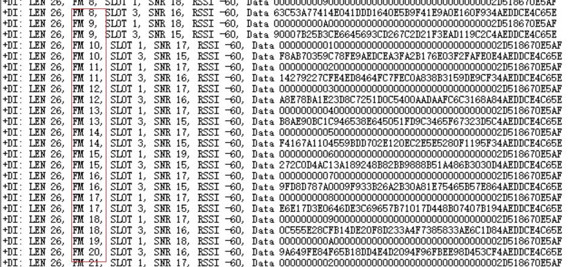
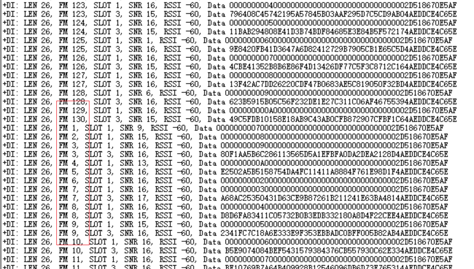
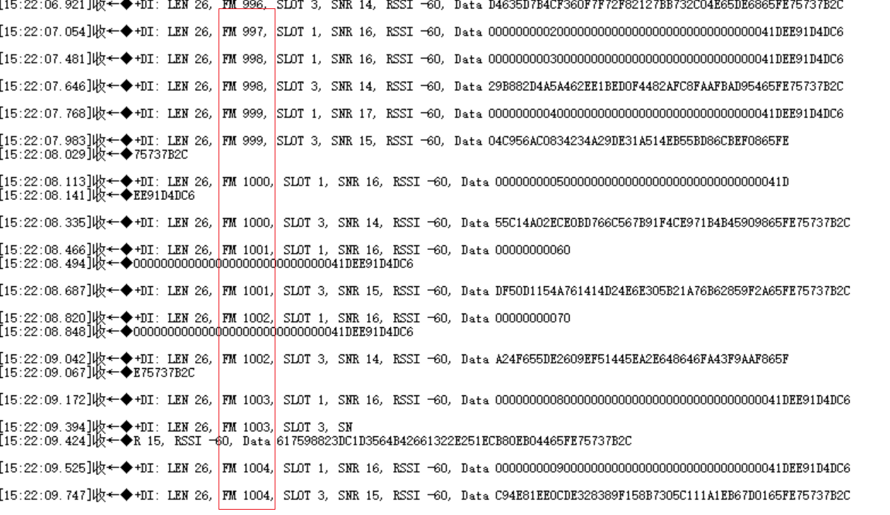
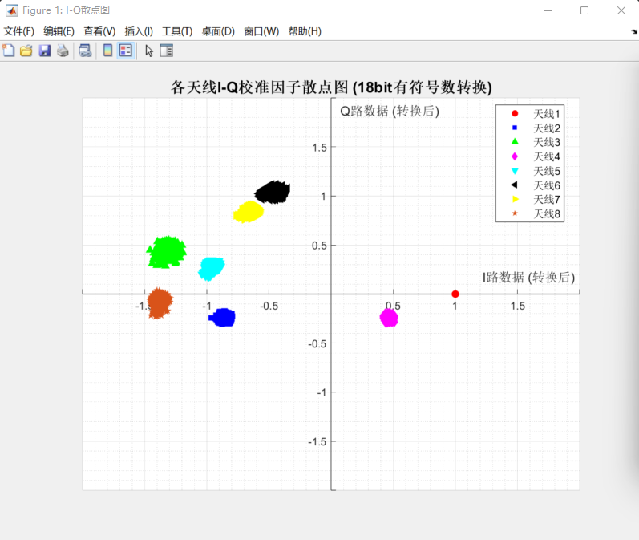
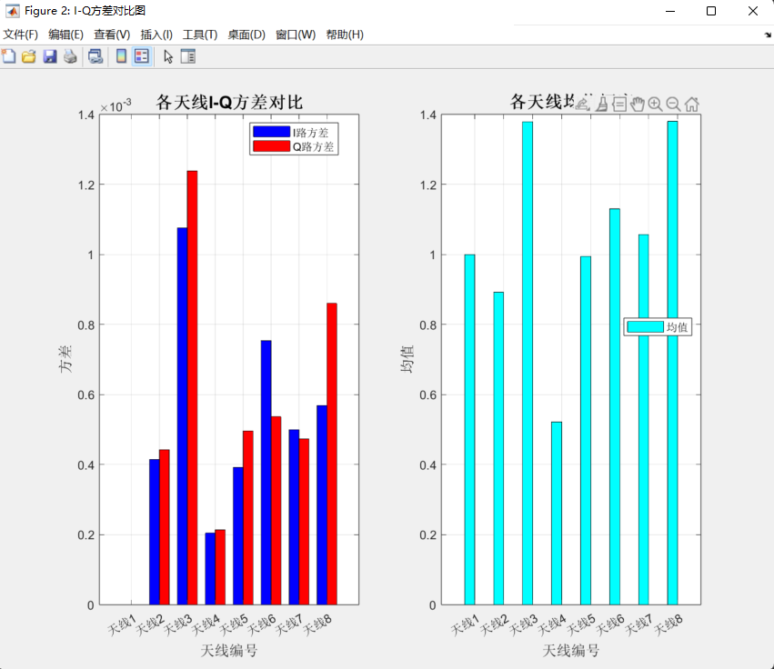

# 工作中 ACM 校准测试报告

## 1. 测试目标

在网关 TRM 工作过程中触发 ACM 校准，要求终端侧尽量无感知：校准前后终端仍按原有超帧和时隙周期与网关通信，终端接收帧号保持连续，不因网关校准导致时隙重新对不齐。

本轮测试重点验证：

- ACM 校准能否隐藏在 slot3 或后续 slot3 恢复点中。
- 校准后 slot 配置是否保持不变。
- 不同速率模式下，校准后终端接收帧号是否连续。
- 高频短时隙模式下，校准后是否仍能保持 0 失步。

## 2. 当前实现方案

### 2.1 触发方式

外部命令或测试程序调用：

```c
TRM_RequestAcmCalibration(&request);
```

TRM 收到请求后只置位 pending 状态，不立即执行校准。若已有 pending 或 running 校准请求，则拒绝新的请求，避免重复校准重入。

当前工作中测试使用的主要参数：

| 参数 | 当前测试值 | 说明 |
| --- | ---: | --- |
| `calibCount` | 1 | 单次运行中只做 1 次 ACM 校准，降低校准耗时 |
| `snrThreshold` | 28 | ACM SNR 判定门限 |
| `restartAdvanceUs` | 400 us | 相对目标 slot3 结束点提前触发 fast start |
| `guardUs` | 1000 us | 判断是否还有足够恢复窗口的保护时间 |
| `TRM_ACM_BUSY_WAIT_US` | 150 us | 高精度等待最后阶段忙等时间 |
| `TRM_ACM_CALIB_TIME_BUDGET_US` | 28000 us | 运行中 ACM 校准耗时预算 |

### 2.2 执行时机

ACM 校准固定放在超帧最后一帧的 S2 结束处执行：

- `TRM_GetSuperFramePosition() == g_trmMaxFrameCount`
- 当前中断为 S2 结束
- TRM 当前处于 master slot 工作流程
- 当前未处于扫频状态

这样校准从 slot3 开始处切入，优先利用 slot3 窗口隐藏校准过程。

### 2.3 校准流程

执行 ACM 前，TRM 会记录当前 slot 配置、slot3 窗口、帧周期和 S0 周期统计。

随后执行：

```c
TK8710Ctrl(TK8710_CTRL_TYPE_ACM_CALIBRATE_ONLY, &acmParam);
```

校准返回后记录：

- `elapsed`：本次 ACM 实际耗时。
- `valid`：有效校准次数。
- `irqAfterCalib`：校准后 IRQ 状态。
- `slot3AfterCalibUs`：校准后硬件观测到的 slot3 长度。

若 `valid == 0`，当前认为这不是一次可靠校准结果，日志打印 WARN，并设置下一轮超帧重试。

### 2.4 slot 配置刷新

前期定位发现，ACM 校准后可能导致硬件观测寄存器中的 slot3 长度恢复为默认短值，典型现象是：

- 配置寄存器未变。
- `obv_4.s3_len` 发生变化。
- 后续 S0 周期从加长后的周期回退到短周期。

因此当前实现中，ACM 结束后会重新刷新 ACM 前保存的 slot 配置：

```c
TK8710SetConfig(TK8710_CFG_TYPE_SLOT_CFG, &slotCfgBeforeAcm);
```

刷新后会再次读取 slot3 长度，若刷新前后不一致则打印 WARN；一致则打印：

```text
TRM: ACM slot refreshed: before=... afterCalib=... afterRefresh=...
```

保留 `Slot time lengths` 和 `Frame total time length` 的 CONFIG WARN 日志，用于现场确认实际 slot 配置。

### 2.5 定时恢复与 fast start

当前恢复逻辑分两类，并使用双 anchor 计算 fast start 目标点。

当 slot3 足够长，且校准结束后仍有充足窗口时：

- 同时计算两个 slot3 结束目标：

  ```text
  target_by_s0 = S0_anchor 推导的 slot3_end - restartAdvanceUs
  target_by_s2 = S2_callback + slot3_len - restartAdvanceUs
  final_target = min(target_by_s0, target_by_s2)
  ```

- 最终选择更早的恢复目标点，避免单一路软件时间戳或回调延迟把 fast start 推晚。
- 日志中使用 `anchor=min-s0` 或 `anchor=min-s2` 标识本次选择的目标来源，并打印 `targetByS0`、`targetByS2`。
- 先执行 `TK8710FastStartPrepare()`。
- 使用 `TK8710SleepUntilUs()` 睡眠到目标点前 `TRM_ACM_BUSY_WAIT_US`。
- 最后 150 us 使用忙等，提高触发精度。
- 到点后执行 `TK8710FastStartTrigger()`。

当 slot3 小于 28 ms，或当前 slot3 已经不足以安全恢复时：

- 不再强行在当前 slot3 恢复。
- 将恢复点延后到后续 slot3 结束前 `restartAdvanceUs`。
- 根据 `framePeriod` 计算需要跨过的虚拟 S3 数量。
- fast start 后调用速率推进和虚拟 S3 完成逻辑，保持 TRM 软件帧号与硬件调度一致。

### 2.6 校准后监测

fast start 后会监测后续 S0 周期：

- 记录校准前 `s0PeriodBefore`。
- 校准后连续观察 4 个 S0 周期。
- 若周期偏差超过 `TRM_ACM_S0_PERIOD_WARN_US`，打印 `ACM post S0 period mismatch`。

该监测用于判断校准后硬件 slot 周期是否仍和校准前一致。

### 2.7 调试过程和问题收敛

本轮工作中 ACM 校准经历了以下问题定位和收敛过程。

1. **slot3 长度被恢复为短值**

   在加长 slot3 的模式下，校准前后配置寄存器值看起来未变，但硬件观测寄存器 `obv_4.s3_len` 会从加长值恢复为默认短值，导致后续 S0 周期从加长后的周期回退到短周期。该问题通过 ACM 后刷新校准前保存的 slot 配置解决。

2. **校准耗时与高精度等待**

   将工作中 ACM 设置为 `calibCount=1` 后，单次校准耗时通常稳定在约 22 ms 到 27 ms。恢复等待改为 `TK8710SleepUntilUs()` 加最后 150 us 忙等，减少软件延时方式带来的触发抖动。

3. **S2 callback 目标点存在软件调度抖动**

   在早期实现中，恢复目标完全基于 S2 结束回调进入时刻计算：

   ```c
   startUs = TK8710GetTimeUs();   // S2 回调进入时刻
   slot3EndUs = startUs + slot3Us;
   restartTargetUs = slot3EndUs - restartAdvanceUs;
   ```

   该方式的问题是：`startUs` 是 Linux 软件线程收到并处理 S2 结束中断后的时间，不一定等于真实硬件 S2 结束边界。如果某次 IRQ 或线程调度晚了 100 us 到 300 us，则 `restartTargetUs` 也会整体晚同样的时间。`triggerLate=0` 只能说明软件准确等到了“自己算出来的目标时间”，不能证明这个目标时间和真实硬件 slot3 边界对齐。

   一份 mode8、`restartAdvanceUs=300us` 的运行日志中共解析到 88 次 ACM：

   | 项目 | 统计结果 |
   | --- | ---: |
   | ACM 次数 | 88 |
   | `valid=1` | 88/88 |
   | slot3 刷新一致 | 88/88 |
   | `irqAfterCalib/irqAfterStart` | 全部为 0 |
   | `triggerLate` | 全部为 0 |
   | 明显未对齐次数 | 5 次 |
   | 轻微多丢 1 帧 | 1 次 |

   该日志的 mode8 参数如下：

   | 参数 | 数值 |
   | --- | ---: |
   | `slot3 window` | 55776 us |
   | `framePeriod` | 178060 us |
   | `restartAdvanceUs` | 300 us |
   | `targetOffset` | 55476 us |

   抖动统计如下：

   | 指标 | 正常样本 | 异常样本 |
   | --- | ---: | ---: |
   | `elapsed` 平均值 | 22637 us | 23516 us |
   | `triggerCost` 平均值 | 83 us | 113 us |
   | `s0DeltaToStart` 平均值 | 167132 us | 167319 us |

   异常样本的共同点不是 `valid=0`，而是 `s0DeltaToStart` 明显偏大。正常样本大多在 167.13 ms 左右，异常样本在 167.26 ms 到 167.47 ms，比正常晚约 120 us 到 330 us。其中 5 次明显异常的表现都是：

   ```text
   校准前 RX: frame=N
   校准后下一次 RX: frame=N+18
   ```

   也就是校准后额外丢了约 16 个上行帧，后续又恢复接收。这说明问题不是永久配置错误，而是校准后 fast start 启动相位偏离了终端期望窗口，终端经过若干帧后重新跟上。

   从这份日志可以排除以下原因：

   - ACM 修改 slot 长度：`before=55776 afterCalib=55776 afterRefresh=55776`。
   - ACM 无有效结果：全部 `valid=1`。
   - IRQ 状态异常：`irqAfterCalib=0x00000000`，`irqAfterStart=0x00000000`。
   - 等待函数超时：`triggerLate=0`。

   因此，该阶段判断失步主因是 S2 callback 软件进入时间存在几十到数百微秒抖动，`restartAdvanceUs=300us` 被调度抖动和 fast start trigger 成本吃掉后，实际相位裕量只剩几十微秒，最差样本已经晚于理想 slot3 边界。

4. **只使用 S0 anchor 仍存在偶发贴边**

   mode8 下，`restartAdvanceUs=400us`、单 S0 anchor 方案曾出现 1/90 次失步。异常样例中校准本身 `valid=1`，IRQ 正常，slot refresh 正常，但 `s2CbOffset=-157us`，`phaseMarginToS3End=327us`，折算有效余量约 170 us，已经接近边界。说明只依赖 S0 软件时间戳时，仍可能因时间戳偏差把 fast start 推晚。

5. **双 anchor 取更早目标**

   最终改为同时计算 S0 anchor 和 S2 callback 两个目标点，并取更早的 `final_target`。修改后，mode8 在 `restartAdvanceUs=400us` 下复测 100 次，`anchor=min-s0` 出现 87 次，`anchor=min-s2` 出现 13 次，说明双 anchor 确实覆盖了 S0 推导目标偏晚的场景；100 次中未再出现校准后帧号大跳。

6. **短 slot3 模式延后恢复**

   对 mode9、mode10、mode11、mode18 等 slot3 短于 28 ms 的模式，不强行在当前 slot3 结束前恢复，而是延后到后续 slot3 结束点，并通过虚拟 S3 和速率推进保持 TRM 软件状态与硬件调度一致。

## 3. 测试方法

测试程序运行后，每运行 10 帧触发一次 ACM 校准。终端侧统计接收帧号是否连续：

- 若终端接收帧号连续递增，认为校准后时隙仍然对齐。

  

- 若终端接收帧号回退到 1，认为校准后网关与终端时隙未对齐。

  

- 每个速率模式统计 100 次 ACM 校准。

- 统计项为 100 次校准中的帧号回退次数。

## 4. 测试结果

优化软件定时方案，采用双 anchor fast start 恢复后所有模式，终端均未出现帧号回退到1的情况：



| 速率模式 | ACM 校准次数 | 帧号回退次数 | 失步率 | 通过率 |
| --- | ---: | ---: | ---: | ---: |
| mode5 | 100 | 0 | 0% | 100% |
| mode6 | 100 | 0 | 0% | 100% |
| mode7 | 100 | 0 | 0% | 100% |
| mode8 | 100 | 0 | 0% | 100% |
| mode9 | 100 | 0 | 0% | 100% |
| mode10 | 100 | 0 | 0% | 100% |
| mode11 | 100 | 0 | 0% | 100% |
| mode18 | 100 | 0 | 0% | 100% |
| 合计 | 800 | 0 | 0% | 100% |

## 5. 结果分析

最新方案下，mode5、mode6、mode7、mode8、mode9、mode10、mode11、mode18 均完成 100 次工作中 ACM 校准触发，终端接收帧号均未出现回退，失步率均为 0%。这说明当前 ACM 隐藏、slot 刷新、双 anchor fast start 恢复、短 slot3 延后恢复流程在已测模式下均能保持终端侧时隙对齐。

优化前的阶段性测试中，短时隙模式曾存在失步：mode8 为 2/100，mode9 为 3/100，mode10 为 6/100，mode11 为 2/100，mode18 为 3/100。结合日志分析，失步并不是由 ACM 校准结果无效、IRQ 未清除或 slot 配置刷新失败导致，而是恢复触发点相对真实 slot3 结束边界的余量不足，短时隙模式对此更加敏感。

最终收敛后的关键措施包括：

- ACM 后刷新 slot 配置，防止硬件观测 slot3 长度回退。
- `calibCount=1`，将单次工作中 ACM 耗时控制在约 22 ms 到 27 ms。
- 使用 `TK8710SleepUntilUs()` 加 150 us busy wait，减少恢复触发抖动。
- 同时计算 S0 anchor 与 S2 callback 两个恢复目标，取更早目标，避免单一路时间戳延迟推晚 fast start。
- 对 slot3 小于 28 ms 或当前 slot3 窗口不足的模式，延后到后续 slot3 结束点恢复，并通过虚拟 S3 保持软件状态一致。

从最新 800 次累计测试看，所有被测模式均为 0/100 失步，说明上述措施已经覆盖前期暴露的主要失步路径。

## 6. 工作中校准结果验证

除终端帧号连续性外，本轮还对工作中 ACM 校准结果本身做了长期稳定性验证。验证目标是确认运行中反复触发 ACM 后，各天线 I/Q 校准因子是否集中，是否存在明显漂移或离散异常。

验证方案如下：

- 系统启动后先执行 100 次初始化 ACM 校准，作为初始校准状态。
- 进入正常 TRM 工作流程后，每运行 30 帧触发一次 ACM 校准。
- 挂机运行一晚上，总运行 136250 帧。
- 期间共得到 4541 次工作中 ACM 校准结果。
- 汇总所有工作中 ACM 校准结果，按天线统计 I/Q 校准因子散点分布和方差。

长期运行统计如下：

| 项目 | 数值 |
| --- | ---: |
| 初始化 ACM 校准次数 | 100 |
| 工作中 ACM 触发间隔 | 30 帧/次 |
| 总运行帧数 | 136250 |
| 工作中 ACM 校准结果总数 | 4541 |
| 参与方差统计的数据块数 | 4534 |
| 天线数 | 8 |
| 统计对象 | 所有工作中 ACM 校准结果 |
| 统计指标 | 各天线 I/Q 校准因子散点、I/Q 方差、均值幅度 |

方差统计结果如下。除天线 1 Q 路无有效数据外，其余每路有效数据点数均为 4534。

| 天线 | I 均值 | I 方差 | I 标准差 | I 数据范围 | Q 均值 | Q 方差 | Q 标准差 | Q 数据范围 |
| --- | ---: | ---: | ---: | --- | ---: | ---: | ---: | --- |
| 天线1 | 1.000000 | 0.000000 | 0.000000 | [1.000000, 1.000000] | - | - | - | / |
| 天线2 | -0.858200 | 0.000415 | 0.020366 | [-0.963684, -0.791656] | -0.242931 | 0.000443 | 0.021043 | [-0.309113, -0.171021] |
| 天线3 | -1.308584 | 0.001076 | 0.032801 | [-1.457275, -1.195038] | 0.435377 | 0.001239 | 0.035193 | [0.286682, 0.550140] |
| 天线4 | 0.462082 | 0.000205 | 0.014303 | [0.419525, 0.510437] | -0.242740 | 0.000214 | 0.014621 | [-0.294373, -0.189575] |
| 天线5 | -0.953377 | 0.000392 | 0.019806 | [-1.040375, -0.886322] | 0.284563 | 0.000496 | 0.022279 | [0.172882, 0.348572] |
| 天线6 | -0.450443 | 0.000754 | 0.027453 | [-0.582672, -0.352112] | 1.036461 | 0.000537 | 0.023167 | [0.959595, 1.119446] |
| 天线7 | -0.640057 | 0.000500 | 0.022360 | [-0.765015, -0.577972] | 0.841444 | 0.000474 | 0.021762 | [0.760010, 0.910828] |
| 天线8 | -1.378655 | 0.000569 | 0.023853 | [-1.456787, -1.292084] | -0.058862 | 0.000860 | 0.029329 | [-0.231110, 0.037537] |

总体统计结果如下：

| 统计项 | 数据点数 | 均值 | 方差 | 标准差 | 数据范围 |
| --- | ---: | ---: | ---: | ---: | --- |
| I 路总体 | 36272 | -0.515904 | 0.619925 | 0.787353 | [-1.457275, 1.000000] |
| Q 路总体 | 31738 | 0.293330 | 0.225175 | 0.474526 | [-0.309113, 1.119446] |

I_Q散点图和方差对比图如下：





从 I-Q 散点图看，8 根天线的校准因子分别聚集在各自区域内，没有出现大范围离散。单天线单通道方差整体较小，其中 I 路最大方差为天线 3 的 0.001076，Q 路最大方差为天线 3 的 0.001239。总体 I/Q 方差较大主要来自不同天线校准均值位置不同，不能直接作为单天线稳定性判断依据。

本项验证说明，在长时间挂机和高频触发 ACM 的条件下，工作中校准结果整体具备可统计的稳定分布。后续若需要形成定量判定门限，建议将每根天线的 I 路方差、Q 路方差、均值幅度导出为表格，并给出最大允许方差阈值，用于自动判断校准结果是否异常。

## 7. 当前结论

当前方案已经解决了 ACM 校准后 slot3 长度被恢复成短值的问题，也解决了短时隙（BCN同步精度高）模式下 fast start 恢复点偶发贴边导致的失步问题。

按最新 800 次累计测试看，整体失步率为 0%，所有被测模式均达到 100% 通过率。当前结果可以作为工作中 ACM 校准功能的阶段性验证依据：

- mode5、mode6、mode7：长 slot3 模式下稳定。
- mode8：双 anchor 后 `restartAdvanceUs=400us` 复测 100 次未失步。
- mode9、mode10、mode11、mode18：短 slot3 模式下，通过延后到后续 slot3 恢复和虚拟 S3 推进后，100 次测试均未失步。
- 长期挂机 136250 帧、得到 4541 次工作中 ACM 校准结果后，校准因子散点整体保持聚集；参与方差统计的 4534 个数据块中，单天线 I/Q 方差整体处于较小水平。
