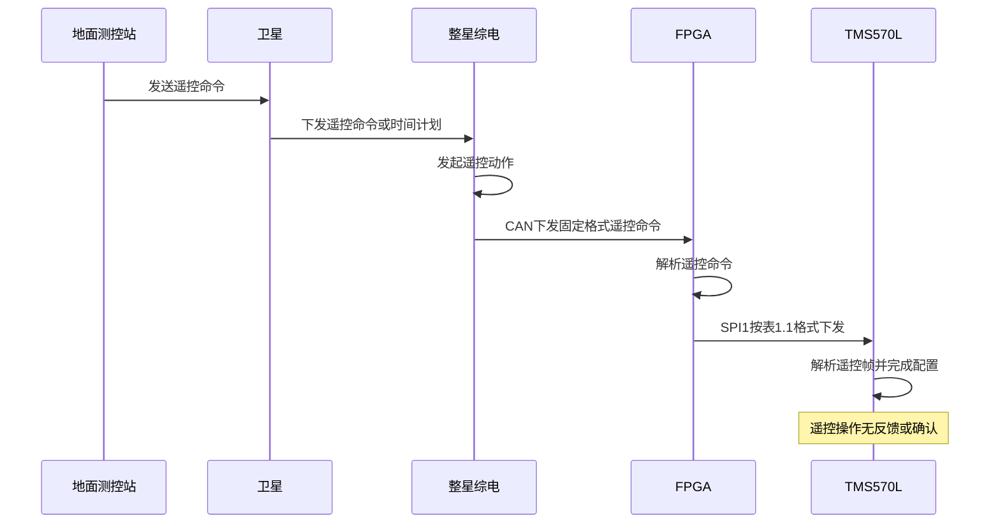
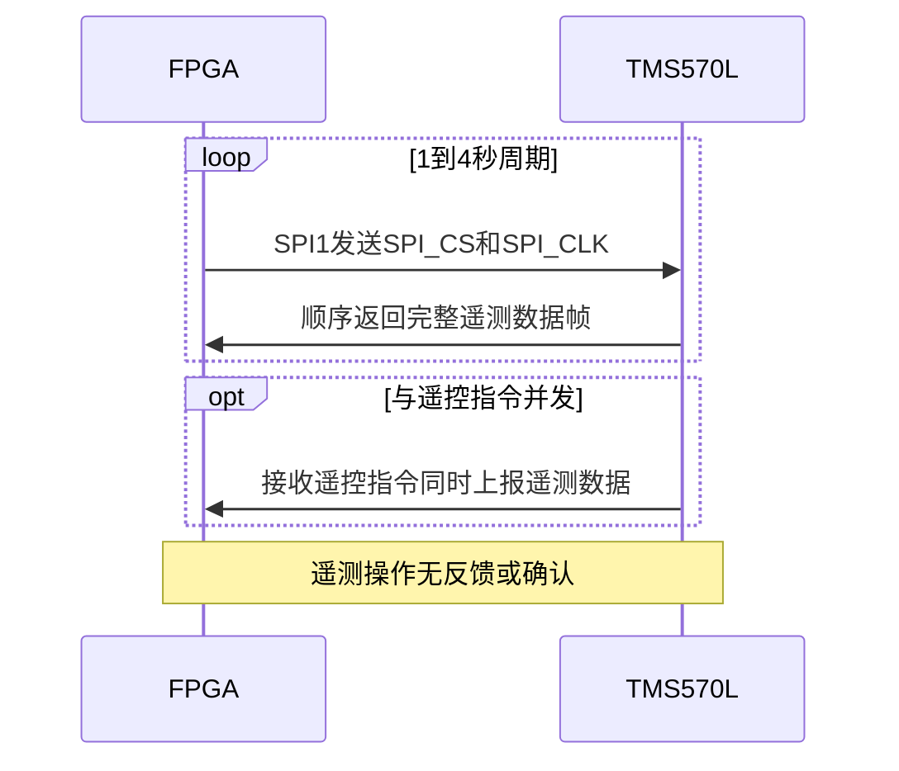
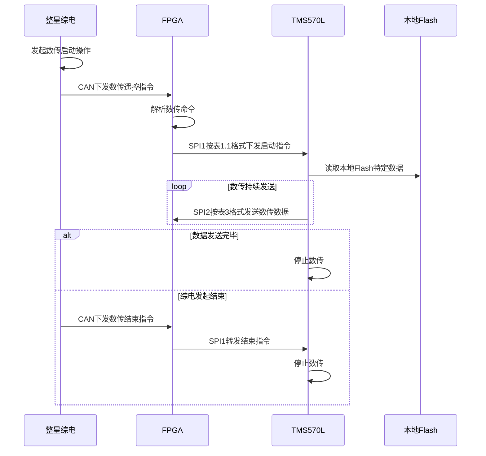
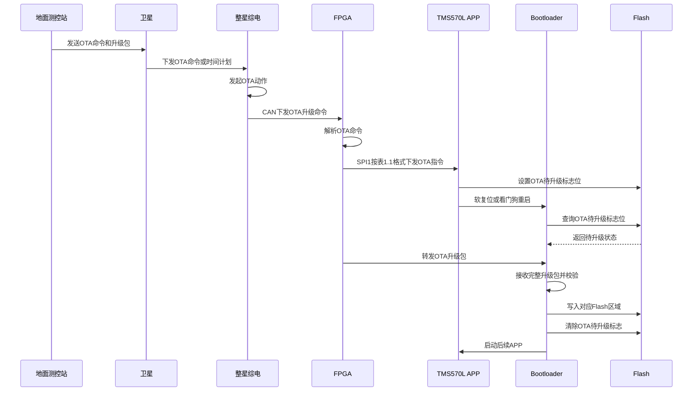
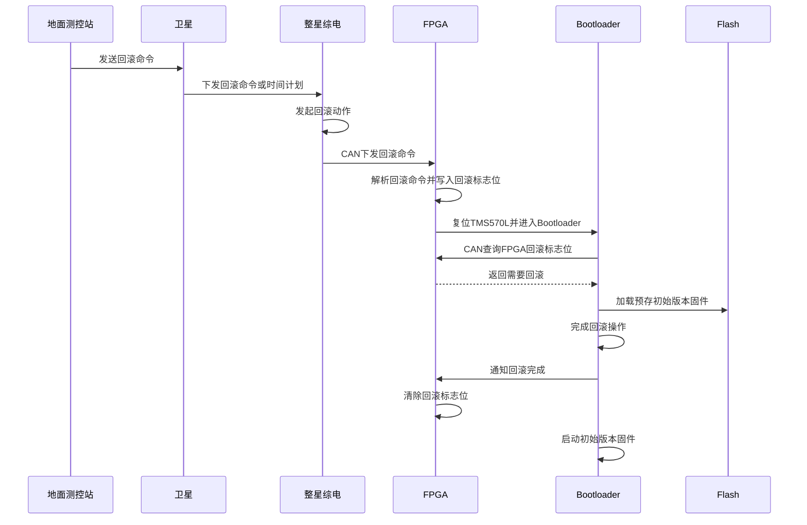

# TMS570L与FPGA接口和协议定义


## 修订记录

| 修订时间   | 修订版本 | 修订描述                                                     | 修订人 |
| ---------- | -------- | ------------------------------------------------------------ | ------ |
| 2026-8-31  | V0.5     | 1）遥控指令中，寄存器写入指令作为保留项<br />2）遥测中，增加ADC1~4的具体定义和说明<br />3）遥测中，数据源DATA18~19的定义，修改为当前频率索引<br />4）遥控指令中，数传指令，定义参数1用于指示开启或关闭数传<br />5）增加了1.2.1章节，定义了遥测的error字段<br />6）增加1.3章节，定义了数传数据的格式<br />7）补充遥测帧中DATA53~60的定义 | Dennis |
| 2026-08-05 | V0.4     | 1）修改遥测数据中，通道1~通道8的ACM校准值，原定义是每通道4个字节，现修改为8字节每通道，<br />因此数据总长变为144字节；<br />2）增加EEPROM中，bootloader与app之间关于升级、回滚、正常启动的定义说明<br />3）版本归滚遥控指令中的参数，暂时作为预留<br />4）修订2.2中，关于遥测的工作流程，FPGA持续在SPI1上发送SPI_CS和SPI_CLK，而非所谓全0的指令 | Dennis |
|            |          |                                                              |        |
|            |          |                                                              |        |

---


[TOC]

## 一、接口帧定义

### 1.1 遥控帧结构

遥控指令通过SPI1，FPGA作为SPI master，具体帧结构如下：

|  | Byte0 | Byte1 | Byte2 | Byte3 | Byte4 | Byte5 | Byte6 | Byte7 | Byte8 | Byte9 | 备注 |
| --- | --- | --- | --- | --- | --- | --- | --- | --- | --- | --- | --- |
| 指令内容 | 帧头1 | 帧头2 | 命令字 | 内容1 | 内容2 | 内容3 | 内容4 | 内容5 | 内容6 | 校验 |  |
| 工作模式 | 76H | 25H | 01H | 参数1 | AAH | AAH | AAH | AAH | AAH | B2~B8累加和 | 参数1有效范围0~6，越界拒绝执行并输出错误日志 |
| 设置速率 | 76H | 25H | 02H | 参数1 | AAH | AAH | AAH | AAH | AAH | B2~B8累加和 | 参数1有效范围0~2；DUT内部映射为TK8710 rateMode 6/7/8，遥测仍显示0/1/2 |
| 设置时隙 | 76H | 25H | 03H | 参数1 | AAH | AAH | AAH | AAH | AAH | B2~B8累加和 |  |
| 发射功率 | 76H | 25H | 04H | 参数1 | AAH | AAH | AAH | AAH | AAH | B2~B8累加和 |  |
| 设置频率 | 76H | 25H | 05H | 参数1 | 参数2 | 参数3 | 参数4 | AAH | AAH | B2~B8累加和 |  |
| 设置射频通道 | 76H | 25H | 06H | 参数1 | AAH | AAH | AAH | AAH | AAH | B2~B8累加和 |  |
| 单机复位 | 76H | 25H | 07H | 参数1 | AAH | AAH | AAH | AAH | AAH | B2~B8累加和 |  |
| 固件升级 | 76H | 25H | 08H | 参数1 | 参数2 | 参数3 | 参数4 | 参数5 | 参数6 | B2~B8累加和 |  |
| 数据传送 | 76H | 25H | 09H | 参数1 | 参数2 | AAH | AAH | AAH | AAH | B2~B8累加和 | 参数1：0—关闭数传，1—开启数传 |
| 写入寄存器 | 76H | 25H | 0AH | 参数1 | 参数2 | 参数3 | 参数4 | 参数5 | 参数6 | B2~B8累加和 | 保留 |
| 读取寄存器 | 76H | 25H | 0BH | 参数1 | 参数2 | 参数3 | 参数4 | AAH | AAH | B2~B8累加和 |  |
| 版本回滚 | 76H | 25H | 0CH | 参数1 | 参数2 | 参数3 | 参数4 | 参数5 | 参数6 | B2~B8累加和 | 归滚指令中的参数作为预留 |
| UTC时间 | 76H | 25H | 0DH | 参数1 | 参数2 | 参数3 | 参数4 | AAH | AAH | B2~B8累加和 | 无符号整型，以UTC时间2009年1月1日0时0分0秒为起点的累积秒值整秒 |
| 配置直流参数 | 76H | 25H | 0EH | 参数1 | 参数2 | 参数3 | 参数4 | 参数5 | 参数6 | B2~B8累加和 | 参数1为天线编号1~8；参数2~3为I DC big-endian i16；参数4~5为Q DC big-endian i16 |

​                                                                                                            表1 遥控指令表(MIBSPI1)

### 1.2 遥测帧结构

遥测数据指令通过SPI1，FPGA作为SPI master，FPGA发送全0数据，TMS570L作为SPI slave设备，回复完整遥测数据帧，具体帧结构如下：

| 遥测帧格式: | 遥测帧格式: | 遥测帧格式: | 遥测帧格式: | 遥测帧格式: | 遥测帧格式: |
| --- | --- | --- | --- | --- | --- |
| **数据域** | DATA0-1 | bit15~0 | 帧头 | EB90H | 备注 |
| **数据域** | DATA2-3 |  | 通道1背景噪声水平 | -255 ~0 单位dBm |  |
| **数据域** | DATA4-5 |  | 通道2背景噪声水平 | -255 ~0 单位dBm |  |
| **数据域** | DATA6-7 |  | 通道3背景噪声水平 | -255 ~0 单位dBm |  |
| **数据域** | DATA8-9 |  | 通道4背景噪声水平 | -255 ~0 单位dBm |  |
| **数据域** | DATA10-11 |  | 通道5背景噪声水平 | -255 ~0 单位dBm |  |
| **数据域** | DATA12-13 |  | 通道6背景噪声水平 | -255 ~0 单位dBm |  |
| **数据域** | DATA14-15 |  | 通道7背景噪声水平 | -255 ~0 单位dBm |  |
| **数据域** | DATA16-17 |  | 通道8背景噪声水平 | -255 ~0 单位dBm |  |
| **数据域** | DATA18-19 |  | 当前扫频频率索引 | 0~31，一共32个频率索引 |  |
| **数据域** | DATA20 |  | 工作模式 | 0-底噪检测、1-模式A、2-模式B、3-模式C、4-单tone模式、5-ACM校准、6-信号采集 |  |
| **数据域** | DATA21 |  | 速率配置 | 0-速率0、1-速率1、2-速率2 | 该字段显示协议速率值0~2，不显示内部TK8710 rateMode 6~8 |
| **数据域** | DATA22 |  | 时隙配置 | 8bit，范围1~255，代表时隙数量 |  |
| **数据域** | DATA23 |  | 发射功率 | 8bit，范围0~255<br />例如：15-发射功率27dBm、14-发射功率24dBm、13-发射功率21dBm |  |
| **数据域** | DATA24-27 |  | 工作频率 | 32bit，范围0 ~ 4294967295（0~0xFFFFFFFF）<br />例如：503300000-代表频率506.3MHz |  |
| **数据域** | DATA28 |  | 射频通道 | 8bit，每bit对应射频通道1~8，bit=1，表示对应射频通道开启；bit=0，表示对应射频通道关闭 |  |
| **数据域** | DATA29-31 |  | 版本号 | 按照x.x.x规则定义版本号，<br>主版本号.次版本号.流水号 |  |
| **数据域** | DATA32-35 |  | 上电运行时间 | 32bit，范围0 ~ 4294967295，运行时间，单位秒 |  |
| **数据域** | DATA36-39 |  | 收包总数 | 32bit，范围0 ~ 4294967295，收包总数 |  |
| **数据域** | DATA40-43 |  | 发包总数 | 32bit，范围0 ~ 4294967295，发包总数 |  |
| **数据域** | DATA44 |  | 复位次数 | 8bit，范围0 ~ 255，复位次数 |  |
| **数据域** | DATA45 |  | 复位来源 | 8bit，范围0~255 |  |
| **数据域** | DATA46 |  | RAM占用率 | 8bit，范围0~99，RAM占用率（%） |  |
| **数据域** | DATA47 |  | Flash占用率 | 8bit，范围0~99，Flash占用率（%） |  |
| **数据域** | DATA48 |  | CPU占用率 | 8bit，范围0~99，CPU占用率（%） |  |
| **数据域** | DATA49-52 |  | 异常告警次数/类型 | 32bit，复位后清零；DATA49为bit31..24，DATA50为bit23..16，DATA51为bit15..8，DATA52为bit7..0 |  |
| **数据域** | DATA53-60 |  | 终端用户接收状态 | DATA53——RSSI，最近一次接收<br />DATA54——SNR，最近一次接收<br />DATA55-56——频偏<br />DATA57——帧序号<br />DATA58-60——保留 |  |
| **数据域** | DATA61-62 |  | TK8710终端计数器 | 16bit，范围0~65535，中断次数 |  |
| **数据域** | DATA63-70 |  | 寄存器读取结果 | 8bytes，包含设备（2B）、寄存器地址（2B）、寄存器内容（4B） |  |
| **数据域** | DATA71-78 |  | 通道1 ACM校准结果 | 8bytes，通道1 ACM校准结果 |  |
| **数据域** | DATA79-86 |  | 通道2 ACM校准结果 | 8bytes，通道2 ACM校准结果 |  |
| **数据域** | DATA87-94 |  | 通道3 ACM校准结果 | 8bytes，通道3 ACM校准结果 |  |
| **数据域** | DATA95-102 |  | 通道4 ACM校准结果 | 8bytes，通道4 ACM校准结果 |  |
| **数据域** | DATA103-110 |  | 通道5 ACM校准结果 | 8bytes，通道5 ACM校准结果 |  |
| **数据域** | DATA111-118 |  | 通道6 ACM校准结果 | 8bytes，通道6 ACM校准结果 |  |
| **数据域** | DATA119-126 |  | 通道7 ACM校准结果 | 8bytes，通道7 ACM校准结果 |  |
| **数据域** | DATA127-134 |  | 通道8 ACM校准结果 | 8bytes，通道8 ACM校准结果 |  |
| **数据域** | DATA135-136 |  | ADC1采集数据 | int16，范围-55 ~ + 125℃，基带板温度 |  |
| **数据域** | DATA137-138 |  | ADC2采集数据 | int16，范围-55 ~ + 125℃，射频板温度 |  |
| **数据域** | DATA139-140 |  | ADC3采集数据 | uint16，范围0 ~ 5000mV，TK8710 3.3V电源电压 | 外部硬件电路会有1/2分压，上报结果已自动乘以2补偿 |
| **数据域** | DATA141-142 |  | ADC4采集数据 | uint16，范围0 ~ 5000mV，TK8710 1.2V电源电压 | 外部硬件电路会有1/2分压，上报结果已自动乘以2补偿 |
| **数据域** | DATA143 |  | 遥测数据校验和 | DATA2-142的校验和 |  |

​                                                                                                                        表2 遥测信息表（MIBSPI1）


### 1.2.1 遥测异常告警bitmap

DATA49-52 异常告警bitmap定义：

|    bit | 含义                                |
| -----: | ----------------------------------- |
|      0 | 启动自检异常或外设访问失败          |
|      1 | 遥控参数保存区 CRC/checksum 异常    |
|      2 | ECC 告警                            |
|      3 | TK8710 初始化或底层通信失败         |
|      4 | TK8710 工作模式配置失败             |
|      5 | TK8710 速率、频率或 RF 参数配置失败 |
|      6 | TK8710 时隙配置失败                 |
|      7 | TK8710 发射功率配置失败             |
|      8 | TK8710 DC 参数配置失败              |
|      9 | ADC1 异常                           |
|     10 | ADC2 异常                           |
|     11 | ADC3 异常                           |
|     12 | ADC4 异常                           |
|     13 | boot flag 写入或读回验证失败        |
| 14..31 | 预留                                |

异常告警bitmap仅表示本次 APP 运行期已经发生过的异常，采用 latch 语义：对应 bit 置位后持续上报到本次复位结束，不写入 Flash。


### 1.3 数传帧结构

数传帧固定最长512字节，数据内容最长502字节，具体格式如下：

| 包头       | 包头                           | 包头          | 数据域                                                      | 包尾                                          |
| ---------- | ------------------------------ | ------------- | ----------------------------------------------------------- | --------------------------------------------- |
| 数传包头   | 数据长度                       | 包序号        | 数据                                                        | 和校验                                        |
| 32bit      | 16bit                          | 16bit         | 长度可变，字节数为双字节，不足填充0x5A，一包数据最长502字节 | 16bit                                         |
| 0x1ACFFC1D | 0x0001~0xFFFF                  | 0x0000~0xFFFF | 长度可变，字节数为双字节，不足填充0x5A，一包数据最长502字节 | 0x0000~0xFFFF                                 |
| 固定值     | 数据域长度字节，不包含填充字节 | /             | 长度可变，字节数为双字节，不足填充0x5A，一包数据最长502字节 | 包含包头、数<br>据域，双字节<br>求和取低16bit |

​                                                                                                                    表3 数传信息表（MIBSPI2）

说明：正式数传链路中，TMS570L 仍作为 SPI2 master，FPGA 作为 SPI2 slave。PC/JTOOL bench 验证使用 `-DataTransferSpi2SlaveTest` 临时固件时，TMS570L SPI2 会切换为 DMA 支持的 regular SPI slave，由 PC/JTOOL 作为 master 逐字节 clock 512 字节测试帧；该模式不代表正式星上接口方向。

数传 `data` 域承载连续 record stream。每条 record 使用大端格式：

```text
timestamp[4] + format[1] + type[1] + length[2] + payload[length]
```

`format=0x01` 表示字符串记录，`format=0x02` 表示 hex/二进制记录。单条 record 可跨多个 512 字节 SPI2 frame，例如 512 字节 payload 加 8 字节 record header 时会拆成至少 2 个 SPI2 frame。中途停止、掉电或重启时，未确认清理的 pending 数据保留；重新打开数传允许重传和重复接收，但不允许丢失 pending 数据。


## 二、协议交互流程

### 2.1 遥控流程

遥控基本流程，按照如下步骤进行：

（1）遥控命令，初始由地面测控站，发送给卫星

（2）接收到遥控命令/时间计划后，整星综电发起遥控动作

（3）综电通过CAN总线，按照固定格式下发给载荷的FPGA（格式在其他文档中另行定义）

（4）FPGA收到遥控命令解析后，按照本文表1.1定义的格式通过SPI1下发

（5）TMS570L作为SPI1的slave设备，接收遥控指令

（6）TMS570L解析遥控帧后，按照命令和参数进行相应配置，完成遥控操作

（7）遥控操作没有反馈或确认




### 2.2 遥测流程

遥测基本流程，按照如下步骤进行：

（1）FPGA根据预定的时间周期，例如1~4秒，启动遥测

（2）FPGA通过SPI1向TMS570L发送SPI_CS和SPI_CLK

（3）作为SPI slave设备，TMS570L定时将遥测数据，发送到SPI1的MISO上，顺序发送给FPGA

（4）若此时正好有遥控指令操作，TMS570L也会在接收遥控指令的同时，将遥测数据上报

（5）遥测操作没有反馈或确认



### 2.3 数传流程

数传基本流程，按照如下步骤进行：

（1）整星综电发起数传启动操作

（2）综电通过CAN总线，按照固定格式（格式在其他文档中另行定义），下发数传遥控指令给FPGA

（3）FPGA收到数传命令解析后，按照本文表1.1定义的格式通过SPI1下发

（4）TMS570L作为SPI1的slave设备，接收到数传启动指令

（5）TMS570L按照本文表3定义的格式，持续将本地flash中存储的特定数据，通过SPI2发送给FPGA

（6）SPI2上，TMS570L作为master，FPGA作为slave

（7）数传的结束，可以由TMS570L决定（全部数据发送完毕，即可停止）；也可以由整星综电发起数传结束操作




### 2.4 OTA升级流程

OTA基本流程，按照如下步骤进行：

（1）OTA命令，初始由地面测控站，发送给卫星（OTA升级包，也同时上传给卫星）

（2）接收到OTA命令/时间计划后，整星综电发起OTA动作

（3）综电通过CAN总线，按照固定格式（格式在其他文档中另行定义），下发OTA升级命令给载荷的FPGA

（4）FPGA收到OTA命令解析后，按照本文表1.1定义的格式通过SPI1下发

（5）TMS570L作为SPI1的slave设备，接收OTA指令

（6）TMS570L正确解析OTA指令后，在内部flash特定标志位上，标明OTA待升级标志位，并重启TMS570L（可通过软复位或是看门狗）

（7）重启后，TMS570L的bootloader，查询flash上的标志位，获知OTA待升级后，通过CAN（TMS570L与FPGA之间），接收OTA升级包

（8）bootloader接收完整OTA升级包，并校验通过后，写入对应flash区域，然后清除OTA待升级标志，启动后续app




### 2.5 回滚流程

回滚基本流程，按照如下步骤进行：

（1）回滚命令，初始由地面测控站，发送给卫星

（2）接收到回滚命令/时间计划后，整星综电发起回滚动作

（3）综电通过CAN总线，按照固定格式（格式在其他文档中另行定义），下发回滚命令给载荷的FPGA

（4）FPGA收到回滚命令解析后，写入一个标志位，标明需要回滚（供bootloader通过CAN查询）

（5）FPGA复位TMS570L

（6）重启后，TMS570L的bootloader，通过CAN，查询FPGA上的标志位，获知需要回滚操作

（7）bootloader完成回滚操作，并通知FPGA回滚完成，清除标志位；加载flash中预存的初始版本固件启动，完成回滚



### 2.6 UTC时间下发

TUC时间下发基本流程，按照如下步骤进行：

（1）整星综电，每秒钟通过CAN下发UTC遥控命令

（2）FPGA通过CAN总线，按照固定格式，接收到UTC遥控命令，通过SPI1转发给TMS570L

（3）TMS570L接收到UTC时间后，持续维护本地时间定时器

（4）TMS570L每接收到一包空口数据包，会按照特定格式，加入UTC时间、接收RSSI/SNR等信息，存入片外flash


## 三、资源定义

本章节主要定义TMS570L的硬件资源，包括与FPGA之间的接口资源分配，也包含TMS570L内部和外部flash等资源的分配。

### 3.1 对外接口

![img](data:image/svg+xml;base64,PHN2ZyB4bWxucz0iaHR0cDovL3d3dy53My5vcmcvMjAwMC9zdmciIHN0eWxlPSJiYWNrZ3JvdW5kOiB0cmFuc3BhcmVudDsgYmFja2dyb3VuZC1jb2xvcjogdHJhbnNwYXJlbnQ7IGNvbG9yLXNjaGVtZTogbGlnaHQ7IiB4bWxuczp4bGluaz0iaHR0cDovL3d3dy53My5vcmcvMTk5OS94bGluayIgdmVyc2lvbj0iMS4xIiB3aWR0aD0iNDMycHgiIGhlaWdodD0iMjEzcHgiIHZpZXdCb3g9IjAgMCA0MzIgMjEzIiBpZD0iZ2Utc3ZnLUp1bUY1OUp6NW9RRzhRd2lmQS1yIj48c3R5bGUgdHlwZT0idGV4dC9jc3MiPkBzdXBwb3J0cyAoY29sb3I6IGxpZ2h0LWRhcmsoIzAwMCwgI2ZmZikpIHsgI2dlLXN2Zy1KdW1GNTlKejVvUUc4UXdpZkEtciB7IC0tZ2UtYWRhcHRpdmUtYmc6IGxpZ2h0LWRhcmsoI2ZmZmZmZiwgdmFyKC0tZ2UtZGFyay1jb2xvciwgIzEyMTIxMikpOyB9IH08L3N0eWxlPjxkZWZzLz48Zz48ZyBkYXRhLWNlbGwtaWQ9IjAiPjxnIGRhdGEtY2VsbC1pZD0iMSI+PGcgZGF0YS1jZWxsLWlkPSJubFZOY0tuTkpURnR1QWZlV0dBQi00Ii8+PGcgZGF0YS1jZWxsLWlkPSJubFZOY0tuTkpURnR1QWZlV0dBQi0xIi8+PGcgZGF0YS1jZWxsLWlkPSJubFZOY0tuTkpURnR1QWZlV0dBQi0yIi8+PGcgZGF0YS1jZWxsLWlkPSJubFZOY0tuTkpURnR1QWZlV0dBQi0zIi8+PGcgZGF0YS1jZWxsLWlkPSJubFZOY0tuTkpURnR1QWZlV0dBQi01Ii8+PGcgZGF0YS1jZWxsLWlkPSJubFZOY0tuTkpURnR1QWZlV0dBQi02Ii8+PGcgZGF0YS1jZWxsLWlkPSJubFZOY0tuTkpURnR1QWZlV0dBQi03Ii8+PGcgZGF0YS1jZWxsLWlkPSJubFZOY0tuTkpURnR1QWZlV0dBQi04Ii8+PGcgZGF0YS1jZWxsLWlkPSJubFZOY0tuTkpURnR1QWZlV0dBQi0xMCIvPjxnIGRhdGEtY2VsbC1pZD0ibmxWTmNLbk5KVEZ0dUFmZVdHQUItMjAiPjxnIGRhdGEtY2VsbC1pZD0ibmxWTmNLbk5KVEZ0dUFmZVdHQUItMjEiLz48L2c+PGcgZGF0YS1jZWxsLWlkPSJubFZOY0tuTkpURnR1QWZlV0dBQi0yMiI+PGcgZGF0YS1jZWxsLWlkPSJubFZOY0tuTkpURnR1QWZlV0dBQi0yMyIvPjwvZz48ZyBkYXRhLWNlbGwtaWQ9Im5sVk5jS25OSlRGdHVBZmVXR0FCLTI0Ij48ZyBkYXRhLWNlbGwtaWQ9Im5sVk5jS25OSlRGdHVBZmVXR0FCLTI1Ii8+PC9nPjxnIGRhdGEtY2VsbC1pZD0ibmxWTmNLbk5KVEZ0dUFmZVdHQUItMzAiPjxnIGRhdGEtY2VsbC1pZD0ibmxWTmNLbk5KVEZ0dUFmZVdHQUItMzEiLz48L2c+PGcgZGF0YS1jZWxsLWlkPSJubFZOY0tuTkpURnR1QWZlV0dBQi0zMiI+PGcgZGF0YS1jZWxsLWlkPSJubFZOY0tuTkpURnR1QWZlV0dBQi0zMyIvPjwvZz48ZyBkYXRhLWNlbGwtaWQ9Im5sVk5jS25OSlRGdHVBZmVXR0FCLTM0Ij48ZyBkYXRhLWNlbGwtaWQ9Im5sVk5jS25OSlRGdHVBZmVXR0FCLTM1Ii8+PC9nPjxnIGRhdGEtY2VsbC1pZD0icERkSGNhSWd3anVET18zNWd0bW0tMSIvPjxnIGRhdGEtY2VsbC1pZD0icERkSGNhSWd3anVET18zNWd0bW0tMiIvPjxnIGRhdGEtY2VsbC1pZD0icERkSGNhSWd3anVET18zNWd0bW0tMyI+PGcgZGF0YS1jZWxsLWlkPSJwRGRIY2FJZ3dqdURPXzM1Z3RtbS00Ii8+PC9nPjxnIGRhdGEtY2VsbC1pZD0icERkSGNhSWd3anVET18zNWd0bW0tNSIvPjxnIGRhdGEtY2VsbC1pZD0icERkSGNhSWd3anVET18zNWd0bW0tNiI+PGcgZGF0YS1jZWxsLWlkPSJwRGRIY2FJZ3dqdURPXzM1Z3RtbS03Ii8+PC9nPjxnIGRhdGEtY2VsbC1pZD0icERkSGNhSWd3anVET18zNWd0bW0tOCIvPjxnIGRhdGEtY2VsbC1pZD0icERkSGNhSWd3anVET18zNWd0bW0tMTAiLz48ZyBkYXRhLWNlbGwtaWQ9InBEZEhjYUlnd2p1RE9fMzVndG1tLTEzIi8+PGcgZGF0YS1jZWxsLWlkPSJwRGRIY2FJZ3dqdURPXzM1Z3RtbS0xNCIvPjxnIGRhdGEtY2VsbC1pZD0icERkSGNhSWd3anVET18zNWd0bW0tMTUiLz48ZyBkYXRhLWNlbGwtaWQ9InBEZEhjYUlnd2p1RE9fMzVndG1tLTE2Ii8+PGcgZGF0YS1jZWxsLWlkPSJwRGRIY2FJZ3dqdURPXzM1Z3RtbS0xNyIvPjxnIGRhdGEtY2VsbC1pZD0icERkSGNhSWd3anVET18zNWd0bW0tMTgiLz48ZyBkYXRhLWNlbGwtaWQ9InBEZEhjYUlnd2p1RE9fMzVndG1tLTE5Ii8+PGcgZGF0YS1jZWxsLWlkPSJwRGRIY2FJZ3dqdURPXzM1Z3RtbS0yMCIvPjxnIGRhdGEtY2VsbC1pZD0icERkSGNhSWd3anVET18zNWd0bW0tMjEiLz48ZyBkYXRhLWNlbGwtaWQ9InBEZEhjYUlnd2p1RE9fMzVndG1tLTIyIj48ZyBkYXRhLWNlbGwtaWQ9InBEZEhjYUlnd2p1RE9fMzVndG1tLTIzIi8+PC9nPjxnIGRhdGEtY2VsbC1pZD0icERkSGNhSWd3anVET18zNWd0bW0tMjQiPjxnIGRhdGEtY2VsbC1pZD0icERkSGNhSWd3anVET18zNWd0bW0tMjUiLz48L2c+PGcgZGF0YS1jZWxsLWlkPSJwRGRIY2FJZ3dqdURPXzM1Z3RtbS0yNiI+PGcgZGF0YS1jZWxsLWlkPSJwRGRIY2FJZ3dqdURPXzM1Z3RtbS0yNyIvPjwvZz48ZyBkYXRhLWNlbGwtaWQ9InBEZEhjYUlnd2p1RE9fMzVndG1tLTI4Ij48ZyBkYXRhLWNlbGwtaWQ9InBEZEhjYUlnd2p1RE9fMzVndG1tLTI5Ii8+PC9nPjxnIGRhdGEtY2VsbC1pZD0icERkSGNhSWd3anVET18zNWd0bW0tMzAiPjxnIGRhdGEtY2VsbC1pZD0icERkSGNhSWd3anVET18zNWd0bW0tMzEiLz48L2c+PGcgZGF0YS1jZWxsLWlkPSJwRGRIY2FJZ3dqdURPXzM1Z3RtbS0zMiI+PGcgZGF0YS1jZWxsLWlkPSJwRGRIY2FJZ3dqdURPXzM1Z3RtbS0zMyIvPjwvZz48ZyBkYXRhLWNlbGwtaWQ9InBEZEhjYUlnd2p1RE9fMzVndG1tLTM0Ii8+PGcgZGF0YS1jZWxsLWlkPSJwRGRIY2FJZ3dqdURPXzM1Z3RtbS0zNSIvPjxnIGRhdGEtY2VsbC1pZD0icERkSGNhSWd3anVET18zNWd0bW0tMzYiPjxnIGRhdGEtY2VsbC1pZD0icERkSGNhSWd3anVET18zNWd0bW0tMzciLz48L2c+PGcgZGF0YS1jZWxsLWlkPSJwRGRIY2FJZ3dqdURPXzM1Z3RtbS0zOCIvPjxnIGRhdGEtY2VsbC1pZD0icERkSGNhSWd3anVET18zNWd0bW0tMzkiPjxnIGRhdGEtY2VsbC1pZD0icERkSGNhSWd3anVET18zNWd0bW0tNDAiLz48L2c+PGcgZGF0YS1jZWxsLWlkPSJwRGRIY2FJZ3dqdURPXzM1Z3RtbS00MSIvPjxnIGRhdGEtY2VsbC1pZD0icERkSGNhSWd3anVET18zNWd0bW0tNDIiLz48ZyBkYXRhLWNlbGwtaWQ9InBEZEhjYUlnd2p1RE9fMzVndG1tLTQzIi8+PGcgZGF0YS1jZWxsLWlkPSJwRGRIY2FJZ3dqdURPXzM1Z3RtbS00NCIvPjxnIGRhdGEtY2VsbC1pZD0icERkSGNhSWd3anVET18zNWd0bW0tNDUiLz48ZyBkYXRhLWNlbGwtaWQ9InBEZEhjYUlnd2p1RE9fMzVndG1tLTQ2Ii8+PGcgZGF0YS1jZWxsLWlkPSJwRGRIY2FJZ3dqdURPXzM1Z3RtbS00NyIvPjxnIGRhdGEtY2VsbC1pZD0iZzBxbmJfUFphdG1CVVFTckgtYWYtMSI+PGcgdHJhbnNmb3JtPSJ0cmFuc2xhdGUoMC41LDAuNSkiPjxyZWN0IHg9Ijc4LjM1IiB5PSIwLjA1IiB3aWR0aD0iMTIwIiBoZWlnaHQ9IjEyNiIgZmlsbD0iI2ZmZmZmZiIgc3Ryb2tlPSIjMDAwMDAwIiBwb2ludGVyLWV2ZW50cz0iYWxsIiBzdHlsZT0iZmlsbDogdmFyKC0tZ2UtYWRhcHRpdmUtYmcsICNmZmZmZmYpOyBzdHJva2U6IGxpZ2h0LWRhcmsocmdiKDAsIDAsIDApLCByZ2IoMjU1LCAyNTUsIDI1NSkpOyIvPjwvZz48Zz48ZyB0cmFuc2Zvcm09InNjYWxlKDAuOTk5OTk5OTk5OTk5OTk5OSkiPjxzd2l0Y2g+PGZvcmVpZ25PYmplY3Qgc3R5bGU9Im92ZXJmbG93OiB2aXNpYmxlOyB0ZXh0LWFsaWduOiBsZWZ0OyIgcG9pbnRlci1ldmVudHM9Im5vbmUiIHdpZHRoPSIxMDElIiBoZWlnaHQ9IjEwMSUiIHJlcXVpcmVkRmVhdHVyZXM9Imh0dHA6Ly93d3cudzMub3JnL1RSL1NWRzExL2ZlYXR1cmUjRXh0ZW5zaWJpbGl0eSI+PGRpdiB4bWxucz0iaHR0cDovL3d3dy53My5vcmcvMTk5OS94aHRtbCIgc3R5bGU9ImRpc3BsYXk6IGZsZXg7IGFsaWduLWl0ZW1zOiB1bnNhZmUgY2VudGVyOyBqdXN0aWZ5LWNvbnRlbnQ6IHVuc2FmZSBjZW50ZXI7IHdpZHRoOiAxMThweDsgaGVpZ2h0OiAxcHg7IHBhZGRpbmctdG9wOiA2M3B4OyBtYXJnaW4tbGVmdDogNzlweDsiPjxkaXYgc3R5bGU9ImJveC1zaXppbmc6IGJvcmRlci1ib3g7IGZvbnQtc2l6ZTogMDsgdGV4dC1hbGlnbjogY2VudGVyOyBjb2xvcjogIzAwMDAwMDsgIj48ZGl2IHN0eWxlPSJkaXNwbGF5OiBpbmxpbmUtYmxvY2s7IGZvbnQtc2l6ZTogMTJweDsgZm9udC1mYW1pbHk6IEhlbHZldGljYTsgY29sb3I6IGxpZ2h0LWRhcmsoIzAwMDAwMCwgI2ZmZmZmZik7IGxpbmUtaGVpZ2h0OiAxLjI7IHBvaW50ZXItZXZlbnRzOiBhbGw7IHdoaXRlLXNwYWNlOiBub3JtYWw7IHdvcmQtd3JhcDogbm9ybWFsOyAiPlRNUzU3MEwg5bCP57O757ufPC9kaXY+PC9kaXY+PC9kaXY+PC9mb3JlaWduT2JqZWN0Pjx0ZXh0IHg9IjEzOCIgeT0iNjciIGZpbGw9IiMwMDAwMDAiIGZvbnQtZmFtaWx5PSJIZWx2ZXRpY2EiIGZvbnQtc2l6ZT0iMTJweCIgdGV4dC1hbmNob3I9Im1pZGRsZSIgc3R5bGU9ImZpbGw6IGxpZ2h0LWRhcmsocmdiKDAsIDAsIDApLCByZ2IoMjU1LCAyNTUsIDI1NSkpOyI+VE1TNTcwTCDlsI/ns7vnu588L3RleHQ+PC9zd2l0Y2g+PC9nPjwvZz48L2c+PGcgZGF0YS1jZWxsLWlkPSJnMHFuYl9QWmF0bUJVUVNySC1hZi0yIj48ZyB0cmFuc2Zvcm09InRyYW5zbGF0ZSgwLjUsMC41KSI+PHJlY3QgeD0iMjcxLjM1IiB5PSIwLjA1IiB3aWR0aD0iMTU5IiBoZWlnaHQ9IjEyNSIgZmlsbD0iI2ZmZmZmZiIgc3Ryb2tlPSIjMDAwMDAwIiBwb2ludGVyLWV2ZW50cz0iYWxsIiBzdHlsZT0iZmlsbDogdmFyKC0tZ2UtYWRhcHRpdmUtYmcsICNmZmZmZmYpOyBzdHJva2U6IGxpZ2h0LWRhcmsocmdiKDAsIDAsIDApLCByZ2IoMjU1LCAyNTUsIDI1NSkpOyIvPjwvZz48Zz48ZyB0cmFuc2Zvcm09InNjYWxlKDAuOTk5OTk5OTk5OTk5OTk5OSkiPjxzd2l0Y2g+PGZvcmVpZ25PYmplY3Qgc3R5bGU9Im92ZXJmbG93OiB2aXNpYmxlOyB0ZXh0LWFsaWduOiBsZWZ0OyIgcG9pbnRlci1ldmVudHM9Im5vbmUiIHdpZHRoPSIxMDElIiBoZWlnaHQ9IjEwMSUiIHJlcXVpcmVkRmVhdHVyZXM9Imh0dHA6Ly93d3cudzMub3JnL1RSL1NWRzExL2ZlYXR1cmUjRXh0ZW5zaWJpbGl0eSI+PGRpdiB4bWxucz0iaHR0cDovL3d3dy53My5vcmcvMTk5OS94aHRtbCIgc3R5bGU9ImRpc3BsYXk6IGZsZXg7IGFsaWduLWl0ZW1zOiB1bnNhZmUgY2VudGVyOyBqdXN0aWZ5LWNvbnRlbnQ6IHVuc2FmZSBjZW50ZXI7IHdpZHRoOiAxNTdweDsgaGVpZ2h0OiAxcHg7IHBhZGRpbmctdG9wOiA2M3B4OyBtYXJnaW4tbGVmdDogMjcycHg7Ij48ZGl2IHN0eWxlPSJib3gtc2l6aW5nOiBib3JkZXItYm94OyBmb250LXNpemU6IDA7IHRleHQtYWxpZ246IGNlbnRlcjsgY29sb3I6ICMwMDAwMDA7ICI+PGRpdiBzdHlsZT0iZGlzcGxheTogaW5saW5lLWJsb2NrOyBmb250LXNpemU6IDEycHg7IGZvbnQtZmFtaWx5OiBIZWx2ZXRpY2E7IGNvbG9yOiBsaWdodC1kYXJrKCMwMDAwMDAsICNmZmZmZmYpOyBsaW5lLWhlaWdodDogMS4yOyBwb2ludGVyLWV2ZW50czogYWxsOyB3aGl0ZS1zcGFjZTogbm9ybWFsOyB3b3JkLXdyYXA6IG5vcm1hbDsgIj5GUEdBIOWwj+ezu+e7nzwvZGl2PjwvZGl2PjwvZGl2PjwvZm9yZWlnbk9iamVjdD48dGV4dCB4PSIzNTEiIHk9IjY2IiBmaWxsPSIjMDAwMDAwIiBmb250LWZhbWlseT0iSGVsdmV0aWNhIiBmb250LXNpemU9IjEycHgiIHRleHQtYW5jaG9yPSJtaWRkbGUiIHN0eWxlPSJmaWxsOiBsaWdodC1kYXJrKHJnYigwLCAwLCAwKSwgcmdiKDI1NSwgMjU1LCAyNTUpKTsiPkZQR0Eg5bCP57O757ufPC90ZXh0Pjwvc3dpdGNoPjwvZz48L2c+PC9nPjxnIGRhdGEtY2VsbC1pZD0iZzBxbmJfUFphdG1CVVFTckgtYWYtNSI+PGcgdHJhbnNmb3JtPSJ0cmFuc2xhdGUoMC41LDAuNSkiPjxwYXRoIGQ9Ik0gMjYyLjQyIDE0LjEzIEwgMjA0LjcyIDE0Ljg2IiBmaWxsPSJub25lIiBzdHJva2U9IiMwMDAwMDAiIHN0cm9rZS1taXRlcmxpbWl0PSIxMCIgcG9pbnRlci1ldmVudHM9InN0cm9rZSIgc3R5bGU9InN0cm9rZTogbGlnaHQtZGFyayhyZ2IoMCwgMCwgMCksIHJnYigyNTUsIDI1NSwgMjU1KSk7Ii8+PHBhdGggZD0iTSAyNjcuNjcgMTQuMDYgTCAyNjAuNzIgMTcuNjUgTCAyNjIuNDIgMTQuMTMgTCAyNjAuNjMgMTAuNjUgWiIgZmlsbD0iIzAwMDAwMCIgc3Ryb2tlPSIjMDAwMDAwIiBzdHJva2UtbWl0ZXJsaW1pdD0iMTAiIHBvaW50ZXItZXZlbnRzPSJhbGwiIHN0eWxlPSJmaWxsOiBsaWdodC1kYXJrKHJnYigwLCAwLCAwKSwgcmdiKDI1NSwgMjU1LCAyNTUpKTsgc3Ryb2tlOiBsaWdodC1kYXJrKHJnYigwLCAwLCAwKSwgcmdiKDI1NSwgMjU1LCAyNTUpKTsiLz48cGF0aCBkPSJNIDE5OS40NyAxNC45MyBMIDIwNi40MiAxMS4zNCBMIDIwNC43MiAxNC44NiBMIDIwNi41MSAxOC4zNCBaIiBmaWxsPSIjMDAwMDAwIiBzdHJva2U9IiMwMDAwMDAiIHN0cm9rZS1taXRlcmxpbWl0PSIxMCIgcG9pbnRlci1ldmVudHM9ImFsbCIgc3R5bGU9ImZpbGw6IGxpZ2h0LWRhcmsocmdiKDAsIDAsIDApLCByZ2IoMjU1LCAyNTUsIDI1NSkpOyBzdHJva2U6IGxpZ2h0LWRhcmsocmdiKDAsIDAsIDApLCByZ2IoMjU1LCAyNTUsIDI1NSkpOyIvPjwvZz48ZyBkYXRhLWNlbGwtaWQ9ImcwcW5iX1BaYXRtQlVRU3JILWFmLTciPjxnPjxnIHRyYW5zZm9ybT0ic2NhbGUoMC45OTk5OTk5OTk5OTk5OTk5KSI+PHN3aXRjaD48Zm9yZWlnbk9iamVjdCBzdHlsZT0ib3ZlcmZsb3c6IHZpc2libGU7IHRleHQtYWxpZ246IGxlZnQ7IiBwb2ludGVyLWV2ZW50cz0ibm9uZSIgd2lkdGg9IjEwMSUiIGhlaWdodD0iMTAxJSIgcmVxdWlyZWRGZWF0dXJlcz0iaHR0cDovL3d3dy53My5vcmcvVFIvU1ZHMTEvZmVhdHVyZSNFeHRlbnNpYmlsaXR5Ij48ZGl2IHhtbG5zPSJodHRwOi8vd3d3LnczLm9yZy8xOTk5L3hodG1sIiBzdHlsZT0iZGlzcGxheTogZmxleDsgYWxpZ24taXRlbXM6IHVuc2FmZSBjZW50ZXI7IGp1c3RpZnktY29udGVudDogdW5zYWZlIGNlbnRlcjsgd2lkdGg6IDFweDsgaGVpZ2h0OiAxcHg7IHBhZGRpbmctdG9wOiAxNXB4OyBtYXJnaW4tbGVmdDogMjM0cHg7Ij48ZGl2IHN0eWxlPSJib3gtc2l6aW5nOiBib3JkZXItYm94OyBmb250LXNpemU6IDA7IHRleHQtYWxpZ246IGNlbnRlcjsgY29sb3I6ICMwMDAwMDA7IGJhY2tncm91bmQtY29sb3I6ICNmZmZmZmY7ICI+PGRpdiBzdHlsZT0iZGlzcGxheTogaW5saW5lLWJsb2NrOyBmb250LXNpemU6IDExcHg7IGZvbnQtZmFtaWx5OiBIZWx2ZXRpY2E7IGNvbG9yOiBsaWdodC1kYXJrKCMwMDAwMDAsICNmZmZmZmYpOyBsaW5lLWhlaWdodDogMS4yOyBwb2ludGVyLWV2ZW50czogYWxsOyBiYWNrZ3JvdW5kLWNvbG9yOiB2YXIoLS1nZS1hZGFwdGl2ZS1iZywgI2ZmZmZmZik7IHdoaXRlLXNwYWNlOiBub3dyYXA7ICI+Q0FOPC9kaXY+PC9kaXY+PC9kaXY+PC9mb3JlaWduT2JqZWN0Pjx0ZXh0IHg9IjIzNCIgeT0iMTgiIGZpbGw9IiMwMDAwMDAiIGZvbnQtZmFtaWx5PSJIZWx2ZXRpY2EiIGZvbnQtc2l6ZT0iMTFweCIgdGV4dC1hbmNob3I9Im1pZGRsZSIgc3R5bGU9ImZpbGw6IGxpZ2h0LWRhcmsocmdiKDAsIDAsIDApLCByZ2IoMjU1LCAyNTUsIDI1NSkpOyI+Q0FOPC90ZXh0Pjwvc3dpdGNoPjwvZz48L2c+PC9nPjwvZz48ZyBkYXRhLWNlbGwtaWQ9ImcwcW5iX1BaYXRtQlVRU3JILWFmLTkiPjxnIHRyYW5zZm9ybT0idHJhbnNsYXRlKDAuNSwwLjUpIj48cGF0aCBkPSJNIDI2Mi40MiAzOS4xMyBMIDIwNC43MiAzOS44NiIgZmlsbD0ibm9uZSIgc3Ryb2tlPSIjMDAwMDAwIiBzdHJva2UtbWl0ZXJsaW1pdD0iMTAiIHBvaW50ZXItZXZlbnRzPSJzdHJva2UiIHN0eWxlPSJzdHJva2U6IGxpZ2h0LWRhcmsocmdiKDAsIDAsIDApLCByZ2IoMjU1LCAyNTUsIDI1NSkpOyIvPjxwYXRoIGQ9Ik0gMjY3LjY3IDM5LjA2IEwgMjYwLjcyIDQyLjY1IEwgMjYyLjQyIDM5LjEzIEwgMjYwLjYzIDM1LjY1IFoiIGZpbGw9IiMwMDAwMDAiIHN0cm9rZT0iIzAwMDAwMCIgc3Ryb2tlLW1pdGVybGltaXQ9IjEwIiBwb2ludGVyLWV2ZW50cz0iYWxsIiBzdHlsZT0iZmlsbDogbGlnaHQtZGFyayhyZ2IoMCwgMCwgMCksIHJnYigyNTUsIDI1NSwgMjU1KSk7IHN0cm9rZTogbGlnaHQtZGFyayhyZ2IoMCwgMCwgMCksIHJnYigyNTUsIDI1NSwgMjU1KSk7Ii8+PHBhdGggZD0iTSAxOTkuNDcgMzkuOTMgTCAyMDYuNDIgMzYuMzQgTCAyMDQuNzIgMzkuODYgTCAyMDYuNTEgNDMuMzQgWiIgZmlsbD0iIzAwMDAwMCIgc3Ryb2tlPSIjMDAwMDAwIiBzdHJva2UtbWl0ZXJsaW1pdD0iMTAiIHBvaW50ZXItZXZlbnRzPSJhbGwiIHN0eWxlPSJmaWxsOiBsaWdodC1kYXJrKHJnYigwLCAwLCAwKSwgcmdiKDI1NSwgMjU1LCAyNTUpKTsgc3Ryb2tlOiBsaWdodC1kYXJrKHJnYigwLCAwLCAwKSwgcmdiKDI1NSwgMjU1LCAyNTUpKTsiLz48L2c+PGcgZGF0YS1jZWxsLWlkPSJnMHFuYl9QWmF0bUJVUVNySC1hZi0xMSI+PGc+PGcgdHJhbnNmb3JtPSJzY2FsZSgwLjk5OTk5OTk5OTk5OTk5OTkpIj48c3dpdGNoPjxmb3JlaWduT2JqZWN0IHN0eWxlPSJvdmVyZmxvdzogdmlzaWJsZTsgdGV4dC1hbGlnbjogbGVmdDsiIHBvaW50ZXItZXZlbnRzPSJub25lIiB3aWR0aD0iMTAxJSIgaGVpZ2h0PSIxMDElIiByZXF1aXJlZEZlYXR1cmVzPSJodHRwOi8vd3d3LnczLm9yZy9UUi9TVkcxMS9mZWF0dXJlI0V4dGVuc2liaWxpdHkiPjxkaXYgeG1sbnM9Imh0dHA6Ly93d3cudzMub3JnLzE5OTkveGh0bWwiIHN0eWxlPSJkaXNwbGF5OiBmbGV4OyBhbGlnbi1pdGVtczogdW5zYWZlIGNlbnRlcjsganVzdGlmeS1jb250ZW50OiB1bnNhZmUgY2VudGVyOyB3aWR0aDogMXB4OyBoZWlnaHQ6IDFweDsgcGFkZGluZy10b3A6IDQwcHg7IG1hcmdpbi1sZWZ0OiAyMzRweDsiPjxkaXYgc3R5bGU9ImJveC1zaXppbmc6IGJvcmRlci1ib3g7IGZvbnQtc2l6ZTogMDsgdGV4dC1hbGlnbjogY2VudGVyOyBjb2xvcjogIzAwMDAwMDsgYmFja2dyb3VuZC1jb2xvcjogI2ZmZmZmZjsgIj48ZGl2IHN0eWxlPSJkaXNwbGF5OiBpbmxpbmUtYmxvY2s7IGZvbnQtc2l6ZTogMTFweDsgZm9udC1mYW1pbHk6IEhlbHZldGljYTsgY29sb3I6IGxpZ2h0LWRhcmsoIzAwMDAwMCwgI2ZmZmZmZik7IGxpbmUtaGVpZ2h0OiAxLjI7IHBvaW50ZXItZXZlbnRzOiBhbGw7IGJhY2tncm91bmQtY29sb3I6IHZhcigtLWdlLWFkYXB0aXZlLWJnLCAjZmZmZmZmKTsgd2hpdGUtc3BhY2U6IG5vd3JhcDsgIj5TUEkgMTwvZGl2PjwvZGl2PjwvZGl2PjwvZm9yZWlnbk9iamVjdD48dGV4dCB4PSIyMzQiIHk9IjQzIiBmaWxsPSIjMDAwMDAwIiBmb250LWZhbWlseT0iSGVsdmV0aWNhIiBmb250LXNpemU9IjExcHgiIHRleHQtYW5jaG9yPSJtaWRkbGUiIHN0eWxlPSJmaWxsOiBsaWdodC1kYXJrKHJnYigwLCAwLCAwKSwgcmdiKDI1NSwgMjU1LCAyNTUpKTsiPlNQSSAxPC90ZXh0Pjwvc3dpdGNoPjwvZz48L2c+PC9nPjwvZz48ZyBkYXRhLWNlbGwtaWQ9ImcwcW5iX1BaYXRtQlVRU3JILWFmLTEzIj48ZyB0cmFuc2Zvcm09InRyYW5zbGF0ZSgwLjUsMC41KSI+PHBhdGggZD0iTSAyNjIuNDIgNjIuNjggTCAyMDQuNzIgNjMuNDEiIGZpbGw9Im5vbmUiIHN0cm9rZT0iIzAwMDAwMCIgc3Ryb2tlLW1pdGVybGltaXQ9IjEwIiBwb2ludGVyLWV2ZW50cz0ic3Ryb2tlIiBzdHlsZT0ic3Ryb2tlOiBsaWdodC1kYXJrKHJnYigwLCAwLCAwKSwgcmdiKDI1NSwgMjU1LCAyNTUpKTsiLz48cGF0aCBkPSJNIDI2Ny42NyA2Mi42MSBMIDI2MC43MiA2Ni4yIEwgMjYyLjQyIDYyLjY4IEwgMjYwLjYzIDU5LjIgWiIgZmlsbD0iIzAwMDAwMCIgc3Ryb2tlPSIjMDAwMDAwIiBzdHJva2UtbWl0ZXJsaW1pdD0iMTAiIHBvaW50ZXItZXZlbnRzPSJhbGwiIHN0eWxlPSJmaWxsOiBsaWdodC1kYXJrKHJnYigwLCAwLCAwKSwgcmdiKDI1NSwgMjU1LCAyNTUpKTsgc3Ryb2tlOiBsaWdodC1kYXJrKHJnYigwLCAwLCAwKSwgcmdiKDI1NSwgMjU1LCAyNTUpKTsiLz48cGF0aCBkPSJNIDE5OS40NyA2My40OCBMIDIwNi40MiA1OS44OSBMIDIwNC43MiA2My40MSBMIDIwNi41MSA2Ni44OSBaIiBmaWxsPSIjMDAwMDAwIiBzdHJva2U9IiMwMDAwMDAiIHN0cm9rZS1taXRlcmxpbWl0PSIxMCIgcG9pbnRlci1ldmVudHM9ImFsbCIgc3R5bGU9ImZpbGw6IGxpZ2h0LWRhcmsocmdiKDAsIDAsIDApLCByZ2IoMjU1LCAyNTUsIDI1NSkpOyBzdHJva2U6IGxpZ2h0LWRhcmsocmdiKDAsIDAsIDApLCByZ2IoMjU1LCAyNTUsIDI1NSkpOyIvPjwvZz48ZyBkYXRhLWNlbGwtaWQ9ImcwcW5iX1BaYXRtQlVRU3JILWFmLTE1Ij48Zz48ZyB0cmFuc2Zvcm09InNjYWxlKDAuOTk5OTk5OTk5OTk5OTk5OSkiPjxzd2l0Y2g+PGZvcmVpZ25PYmplY3Qgc3R5bGU9Im92ZXJmbG93OiB2aXNpYmxlOyB0ZXh0LWFsaWduOiBsZWZ0OyIgcG9pbnRlci1ldmVudHM9Im5vbmUiIHdpZHRoPSIxMDElIiBoZWlnaHQ9IjEwMSUiIHJlcXVpcmVkRmVhdHVyZXM9Imh0dHA6Ly93d3cudzMub3JnL1RSL1NWRzExL2ZlYXR1cmUjRXh0ZW5zaWJpbGl0eSI+PGRpdiB4bWxucz0iaHR0cDovL3d3dy53My5vcmcvMTk5OS94aHRtbCIgc3R5bGU9ImRpc3BsYXk6IGZsZXg7IGFsaWduLWl0ZW1zOiB1bnNhZmUgY2VudGVyOyBqdXN0aWZ5LWNvbnRlbnQ6IHVuc2FmZSBjZW50ZXI7IHdpZHRoOiAxcHg7IGhlaWdodDogMXB4OyBwYWRkaW5nLXRvcDogNjNweDsgbWFyZ2luLWxlZnQ6IDIzNHB4OyI+PGRpdiBzdHlsZT0iYm94LXNpemluZzogYm9yZGVyLWJveDsgZm9udC1zaXplOiAwOyB0ZXh0LWFsaWduOiBjZW50ZXI7IGNvbG9yOiAjMDAwMDAwOyBiYWNrZ3JvdW5kLWNvbG9yOiAjZmZmZmZmOyAiPjxkaXYgc3R5bGU9ImRpc3BsYXk6IGlubGluZS1ibG9jazsgZm9udC1zaXplOiAxMXB4OyBmb250LWZhbWlseTogSGVsdmV0aWNhOyBjb2xvcjogbGlnaHQtZGFyaygjMDAwMDAwLCAjZmZmZmZmKTsgbGluZS1oZWlnaHQ6IDEuMjsgcG9pbnRlci1ldmVudHM6IGFsbDsgYmFja2dyb3VuZC1jb2xvcjogdmFyKC0tZ2UtYWRhcHRpdmUtYmcsICNmZmZmZmYpOyB3aGl0ZS1zcGFjZTogbm93cmFwOyAiPlNQSSAyPC9kaXY+PC9kaXY+PC9kaXY+PC9mb3JlaWduT2JqZWN0Pjx0ZXh0IHg9IjIzNCIgeT0iNjciIGZpbGw9IiMwMDAwMDAiIGZvbnQtZmFtaWx5PSJIZWx2ZXRpY2EiIGZvbnQtc2l6ZT0iMTFweCIgdGV4dC1hbmNob3I9Im1pZGRsZSIgc3R5bGU9ImZpbGw6IGxpZ2h0LWRhcmsocmdiKDAsIDAsIDApLCByZ2IoMjU1LCAyNTUsIDI1NSkpOyI+U1BJIDI8L3RleHQ+PC9zd2l0Y2g+PC9nPjwvZz48L2c+PC9nPjxnIGRhdGEtY2VsbC1pZD0iZzBxbmJfUFphdG1CVVFTckgtYWYtMjAiPjxnIHRyYW5zZm9ybT0idHJhbnNsYXRlKDAuNSwwLjUpIj48cGF0aCBkPSJNIDI2OS45NSA5MS4xNCBMIDIwNC43MiA5MS45NyIgZmlsbD0ibm9uZSIgc3Ryb2tlPSIjMDAwMDAwIiBzdHJva2UtbWl0ZXJsaW1pdD0iMTAiIHBvaW50ZXItZXZlbnRzPSJzdHJva2UiIHN0eWxlPSJzdHJva2U6IGxpZ2h0LWRhcmsocmdiKDAsIDAsIDApLCByZ2IoMjU1LCAyNTUsIDI1NSkpOyIvPjxwYXRoIGQ9Ik0gMTk5LjQ3IDkyLjAzIEwgMjA2LjQyIDg4LjQ1IEwgMjA0LjcyIDkxLjk3IEwgMjA2LjUxIDk1LjQ1IFoiIGZpbGw9IiMwMDAwMDAiIHN0cm9rZT0iIzAwMDAwMCIgc3Ryb2tlLW1pdGVybGltaXQ9IjEwIiBwb2ludGVyLWV2ZW50cz0iYWxsIiBzdHlsZT0iZmlsbDogbGlnaHQtZGFyayhyZ2IoMCwgMCwgMCksIHJnYigyNTUsIDI1NSwgMjU1KSk7IHN0cm9rZTogbGlnaHQtZGFyayhyZ2IoMCwgMCwgMCksIHJnYigyNTUsIDI1NSwgMjU1KSk7Ii8+PC9nPjxnIGRhdGEtY2VsbC1pZD0iZzBxbmJfUFphdG1CVVFTckgtYWYtMjEiPjxnPjxnIHRyYW5zZm9ybT0ic2NhbGUoMC45OTk5OTk5OTk5OTk5OTk5KSI+PHN3aXRjaD48Zm9yZWlnbk9iamVjdCBzdHlsZT0ib3ZlcmZsb3c6IHZpc2libGU7IHRleHQtYWxpZ246IGxlZnQ7IiBwb2ludGVyLWV2ZW50cz0ibm9uZSIgd2lkdGg9IjEwMSUiIGhlaWdodD0iMTAxJSIgcmVxdWlyZWRGZWF0dXJlcz0iaHR0cDovL3d3dy53My5vcmcvVFIvU1ZHMTEvZmVhdHVyZSNFeHRlbnNpYmlsaXR5Ij48ZGl2IHhtbG5zPSJodHRwOi8vd3d3LnczLm9yZy8xOTk5L3hodG1sIiBzdHlsZT0iZGlzcGxheTogZmxleDsgYWxpZ24taXRlbXM6IHVuc2FmZSBjZW50ZXI7IGp1c3RpZnktY29udGVudDogdW5zYWZlIGNlbnRlcjsgd2lkdGg6IDFweDsgaGVpZ2h0OiAxcHg7IHBhZGRpbmctdG9wOiA5MnB4OyBtYXJnaW4tbGVmdDogMjM0cHg7Ij48ZGl2IHN0eWxlPSJib3gtc2l6aW5nOiBib3JkZXItYm94OyBmb250LXNpemU6IDA7IHRleHQtYWxpZ246IGNlbnRlcjsgY29sb3I6ICMwMDAwMDA7IGJhY2tncm91bmQtY29sb3I6ICNmZmZmZmY7ICI+PGRpdiBzdHlsZT0iZGlzcGxheTogaW5saW5lLWJsb2NrOyBmb250LXNpemU6IDExcHg7IGZvbnQtZmFtaWx5OiBIZWx2ZXRpY2E7IGNvbG9yOiBsaWdodC1kYXJrKCMwMDAwMDAsICNmZmZmZmYpOyBsaW5lLWhlaWdodDogMS4yOyBwb2ludGVyLWV2ZW50czogYWxsOyBiYWNrZ3JvdW5kLWNvbG9yOiB2YXIoLS1nZS1hZGFwdGl2ZS1iZywgI2ZmZmZmZik7IHdoaXRlLXNwYWNlOiBub3dyYXA7ICI+UlNUPC9kaXY+PC9kaXY+PC9kaXY+PC9mb3JlaWduT2JqZWN0Pjx0ZXh0IHg9IjIzNCIgeT0iOTUiIGZpbGw9IiMwMDAwMDAiIGZvbnQtZmFtaWx5PSJIZWx2ZXRpY2EiIGZvbnQtc2l6ZT0iMTFweCIgdGV4dC1hbmNob3I9Im1pZGRsZSIgc3R5bGU9ImZpbGw6IGxpZ2h0LWRhcmsocmdiKDAsIDAsIDApLCByZ2IoMjU1LCAyNTUsIDI1NSkpOyI+UlNUPC90ZXh0Pjwvc3dpdGNoPjwvZz48L2c+PC9nPjwvZz48ZyBkYXRhLWNlbGwtaWQ9ImcwcW5iX1BaYXRtQlVRU3JILWFmLTIyIj48ZyB0cmFuc2Zvcm09InRyYW5zbGF0ZSgwLjUsMC41KSI+PHJlY3QgeD0iMTEzLjM1IiB5PSIxNzEuMDUiIHdpZHRoPSI0MCIgaGVpZ2h0PSI0MCIgZmlsbD0iI2ZmZmZmZiIgc3Ryb2tlPSIjMDAwMDAwIiBwb2ludGVyLWV2ZW50cz0iYWxsIiBzdHlsZT0iZmlsbDogdmFyKC0tZ2UtYWRhcHRpdmUtYmcsICNmZmZmZmYpOyBzdHJva2U6IGxpZ2h0LWRhcmsocmdiKDAsIDAsIDApLCByZ2IoMjU1LCAyNTUsIDI1NSkpOyIvPjwvZz48Zz48ZyB0cmFuc2Zvcm09InNjYWxlKDAuOTk5OTk5OTk5OTk5OTk5OSkiPjxzd2l0Y2g+PGZvcmVpZ25PYmplY3Qgc3R5bGU9Im92ZXJmbG93OiB2aXNpYmxlOyB0ZXh0LWFsaWduOiBsZWZ0OyIgcG9pbnRlci1ldmVudHM9Im5vbmUiIHdpZHRoPSIxMDElIiBoZWlnaHQ9IjEwMSUiIHJlcXVpcmVkRmVhdHVyZXM9Imh0dHA6Ly93d3cudzMub3JnL1RSL1NWRzExL2ZlYXR1cmUjRXh0ZW5zaWJpbGl0eSI+PGRpdiB4bWxucz0iaHR0cDovL3d3dy53My5vcmcvMTk5OS94aHRtbCIgc3R5bGU9ImRpc3BsYXk6IGZsZXg7IGFsaWduLWl0ZW1zOiB1bnNhZmUgY2VudGVyOyBqdXN0aWZ5LWNvbnRlbnQ6IHVuc2FmZSBjZW50ZXI7IHdpZHRoOiAzOHB4OyBoZWlnaHQ6IDFweDsgcGFkZGluZy10b3A6IDE5MXB4OyBtYXJnaW4tbGVmdDogMTE0cHg7Ij48ZGl2IHN0eWxlPSJib3gtc2l6aW5nOiBib3JkZXItYm94OyBmb250LXNpemU6IDA7IHRleHQtYWxpZ246IGNlbnRlcjsgY29sb3I6ICMwMDAwMDA7ICI+PGRpdiBzdHlsZT0iZGlzcGxheTogaW5saW5lLWJsb2NrOyBmb250LXNpemU6IDEycHg7IGZvbnQtZmFtaWx5OiBIZWx2ZXRpY2E7IGNvbG9yOiBsaWdodC1kYXJrKCMwMDAwMDAsICNmZmZmZmYpOyBsaW5lLWhlaWdodDogMS4yOyBwb2ludGVyLWV2ZW50czogYWxsOyB3aGl0ZS1zcGFjZTogbm9ybWFsOyB3b3JkLXdyYXA6IG5vcm1hbDsgIj5GbGFzaDxiciAvPjY0TUI8L2Rpdj48L2Rpdj48L2Rpdj48L2ZvcmVpZ25PYmplY3Q+PHRleHQgeD0iMTMzIiB5PSIxODgiIGZpbGw9IiMwMDAwMDAiIGZvbnQtZmFtaWx5PSJIZWx2ZXRpY2EiIGZvbnQtc2l6ZT0iMTJweCIgdGV4dC1hbmNob3I9Im1pZGRsZSIgc3R5bGU9ImZpbGw6IGxpZ2h0LWRhcmsocmdiKDAsIDAsIDApLCByZ2IoMjU1LCAyNTUsIDI1NSkpOyI+PHRzcGFuIHg9IjEzMyIgeT0iMTg4Ij5GbGFzaDwvdHNwYW4+PHRzcGFuIHg9IjEzMyIgeT0iMjAyIj42NE1CPC90c3Bhbj48L3RleHQ+PC9zd2l0Y2g+PC9nPjwvZz48L2c+PGcgZGF0YS1jZWxsLWlkPSJnMHFuYl9QWmF0bUJVUVNySC1hZi0yMyI+PGcgdHJhbnNmb3JtPSJ0cmFuc2xhdGUoMC41LDAuNSkiPjxwYXRoIGQ9Ik0gNzEuOTggMzIuMTMgTCAxNC4yOCAzMi44NiIgZmlsbD0ibm9uZSIgc3Ryb2tlPSIjMDAwMDAwIiBzdHJva2UtbWl0ZXJsaW1pdD0iMTAiIHBvaW50ZXItZXZlbnRzPSJzdHJva2UiIHN0eWxlPSJzdHJva2U6IGxpZ2h0LWRhcmsocmdiKDAsIDAsIDApLCByZ2IoMjU1LCAyNTUsIDI1NSkpOyIvPjxwYXRoIGQ9Ik0gNzcuMjMgMzIuMDYgTCA3MC4yOCAzNS42NSBMIDcxLjk4IDMyLjEzIEwgNzAuMTkgMjguNjUgWiIgZmlsbD0iIzAwMDAwMCIgc3Ryb2tlPSIjMDAwMDAwIiBzdHJva2UtbWl0ZXJsaW1pdD0iMTAiIHBvaW50ZXItZXZlbnRzPSJhbGwiIHN0eWxlPSJmaWxsOiBsaWdodC1kYXJrKHJnYigwLCAwLCAwKSwgcmdiKDI1NSwgMjU1LCAyNTUpKTsgc3Ryb2tlOiBsaWdodC1kYXJrKHJnYigwLCAwLCAwKSwgcmdiKDI1NSwgMjU1LCAyNTUpKTsiLz48cGF0aCBkPSJNIDkuMDMgMzIuOTMgTCAxNS45OCAyOS4zNCBMIDE0LjI4IDMyLjg2IEwgMTYuMDcgMzYuMzQgWiIgZmlsbD0iIzAwMDAwMCIgc3Ryb2tlPSIjMDAwMDAwIiBzdHJva2UtbWl0ZXJsaW1pdD0iMTAiIHBvaW50ZXItZXZlbnRzPSJhbGwiIHN0eWxlPSJmaWxsOiBsaWdodC1kYXJrKHJnYigwLCAwLCAwKSwgcmdiKDI1NSwgMjU1LCAyNTUpKTsgc3Ryb2tlOiBsaWdodC1kYXJrKHJnYigwLCAwLCAwKSwgcmdiKDI1NSwgMjU1LCAyNTUpKTsiLz48L2c+PGcgZGF0YS1jZWxsLWlkPSJnMHFuYl9QWmF0bUJVUVNySC1hZi0yNCI+PGc+PGcgdHJhbnNmb3JtPSJzY2FsZSgwLjk5OTk5OTk5OTk5OTk5OTkpIj48c3dpdGNoPjxmb3JlaWduT2JqZWN0IHN0eWxlPSJvdmVyZmxvdzogdmlzaWJsZTsgdGV4dC1hbGlnbjogbGVmdDsiIHBvaW50ZXItZXZlbnRzPSJub25lIiB3aWR0aD0iMTAxJSIgaGVpZ2h0PSIxMDElIiByZXF1aXJlZEZlYXR1cmVzPSJodHRwOi8vd3d3LnczLm9yZy9UUi9TVkcxMS9mZWF0dXJlI0V4dGVuc2liaWxpdHkiPjxkaXYgeG1sbnM9Imh0dHA6Ly93d3cudzMub3JnLzE5OTkveGh0bWwiIHN0eWxlPSJkaXNwbGF5OiBmbGV4OyBhbGlnbi1pdGVtczogdW5zYWZlIGNlbnRlcjsganVzdGlmeS1jb250ZW50OiB1bnNhZmUgY2VudGVyOyB3aWR0aDogMXB4OyBoZWlnaHQ6IDFweDsgcGFkZGluZy10b3A6IDMzcHg7IG1hcmdpbi1sZWZ0OiA0M3B4OyI+PGRpdiBzdHlsZT0iYm94LXNpemluZzogYm9yZGVyLWJveDsgZm9udC1zaXplOiAwOyB0ZXh0LWFsaWduOiBjZW50ZXI7IGNvbG9yOiAjMDAwMDAwOyBiYWNrZ3JvdW5kLWNvbG9yOiAjZmZmZmZmOyAiPjxkaXYgc3R5bGU9ImRpc3BsYXk6IGlubGluZS1ibG9jazsgZm9udC1zaXplOiAxMXB4OyBmb250LWZhbWlseTogSGVsdmV0aWNhOyBjb2xvcjogbGlnaHQtZGFyaygjMDAwMDAwLCAjZmZmZmZmKTsgbGluZS1oZWlnaHQ6IDEuMjsgcG9pbnRlci1ldmVudHM6IGFsbDsgYmFja2dyb3VuZC1jb2xvcjogdmFyKC0tZ2UtYWRhcHRpdmUtYmcsICNmZmZmZmYpOyB3aGl0ZS1zcGFjZTogbm93cmFwOyAiPlVBUlQ8L2Rpdj48L2Rpdj48L2Rpdj48L2ZvcmVpZ25PYmplY3Q+PHRleHQgeD0iNDMiIHk9IjM2IiBmaWxsPSIjMDAwMDAwIiBmb250LWZhbWlseT0iSGVsdmV0aWNhIiBmb250LXNpemU9IjExcHgiIHRleHQtYW5jaG9yPSJtaWRkbGUiIHN0eWxlPSJmaWxsOiBsaWdodC1kYXJrKHJnYigwLCAwLCAwKSwgcmdiKDI1NSwgMjU1LCAyNTUpKTsiPlVBUlQ8L3RleHQ+PC9zd2l0Y2g+PC9nPjwvZz48L2c+PC9nPjxnIGRhdGEtY2VsbC1pZD0iZzBxbmJfUFphdG1CVVFTckgtYWYtMjUiPjxnIHRyYW5zZm9ybT0idHJhbnNsYXRlKDAuNSwwLjUpIj48cGF0aCBkPSJNIDcxLjk4IDc5LjEzIEwgMTQuMjggNzkuODYiIGZpbGw9Im5vbmUiIHN0cm9rZT0iIzAwMDAwMCIgc3Ryb2tlLW1pdGVybGltaXQ9IjEwIiBwb2ludGVyLWV2ZW50cz0ic3Ryb2tlIiBzdHlsZT0ic3Ryb2tlOiBsaWdodC1kYXJrKHJnYigwLCAwLCAwKSwgcmdiKDI1NSwgMjU1LCAyNTUpKTsiLz48cGF0aCBkPSJNIDc3LjIzIDc5LjA2IEwgNzAuMjggODIuNjUgTCA3MS45OCA3OS4xMyBMIDcwLjE5IDc1LjY1IFoiIGZpbGw9IiMwMDAwMDAiIHN0cm9rZT0iIzAwMDAwMCIgc3Ryb2tlLW1pdGVybGltaXQ9IjEwIiBwb2ludGVyLWV2ZW50cz0iYWxsIiBzdHlsZT0iZmlsbDogbGlnaHQtZGFyayhyZ2IoMCwgMCwgMCksIHJnYigyNTUsIDI1NSwgMjU1KSk7IHN0cm9rZTogbGlnaHQtZGFyayhyZ2IoMCwgMCwgMCksIHJnYigyNTUsIDI1NSwgMjU1KSk7Ii8+PHBhdGggZD0iTSA5LjAzIDc5LjkzIEwgMTUuOTggNzYuMzQgTCAxNC4yOCA3OS44NiBMIDE2LjA3IDgzLjM0IFoiIGZpbGw9IiMwMDAwMDAiIHN0cm9rZT0iIzAwMDAwMCIgc3Ryb2tlLW1pdGVybGltaXQ9IjEwIiBwb2ludGVyLWV2ZW50cz0iYWxsIiBzdHlsZT0iZmlsbDogbGlnaHQtZGFyayhyZ2IoMCwgMCwgMCksIHJnYigyNTUsIDI1NSwgMjU1KSk7IHN0cm9rZTogbGlnaHQtZGFyayhyZ2IoMCwgMCwgMCksIHJnYigyNTUsIDI1NSwgMjU1KSk7Ii8+PC9nPjxnIGRhdGEtY2VsbC1pZD0iZzBxbmJfUFphdG1CVVFTckgtYWYtMjYiPjxnPjxnIHRyYW5zZm9ybT0ic2NhbGUoMC45OTk5OTk5OTk5OTk5OTk5KSI+PHN3aXRjaD48Zm9yZWlnbk9iamVjdCBzdHlsZT0ib3ZlcmZsb3c6IHZpc2libGU7IHRleHQtYWxpZ246IGxlZnQ7IiBwb2ludGVyLWV2ZW50cz0ibm9uZSIgd2lkdGg9IjEwMSUiIGhlaWdodD0iMTAxJSIgcmVxdWlyZWRGZWF0dXJlcz0iaHR0cDovL3d3dy53My5vcmcvVFIvU1ZHMTEvZmVhdHVyZSNFeHRlbnNpYmlsaXR5Ij48ZGl2IHhtbG5zPSJodHRwOi8vd3d3LnczLm9yZy8xOTk5L3hodG1sIiBzdHlsZT0iZGlzcGxheTogZmxleDsgYWxpZ24taXRlbXM6IHVuc2FmZSBjZW50ZXI7IGp1c3RpZnktY29udGVudDogdW5zYWZlIGNlbnRlcjsgd2lkdGg6IDFweDsgaGVpZ2h0OiAxcHg7IHBhZGRpbmctdG9wOiA4MHB4OyBtYXJnaW4tbGVmdDogNDNweDsiPjxkaXYgc3R5bGU9ImJveC1zaXppbmc6IGJvcmRlci1ib3g7IGZvbnQtc2l6ZTogMDsgdGV4dC1hbGlnbjogY2VudGVyOyBjb2xvcjogIzAwMDAwMDsgYmFja2dyb3VuZC1jb2xvcjogI2ZmZmZmZjsgIj48ZGl2IHN0eWxlPSJkaXNwbGF5OiBpbmxpbmUtYmxvY2s7IGZvbnQtc2l6ZTogMTFweDsgZm9udC1mYW1pbHk6IEhlbHZldGljYTsgY29sb3I6IGxpZ2h0LWRhcmsoIzAwMDAwMCwgI2ZmZmZmZik7IGxpbmUtaGVpZ2h0OiAxLjI7IHBvaW50ZXItZXZlbnRzOiBhbGw7IGJhY2tncm91bmQtY29sb3I6IHZhcigtLWdlLWFkYXB0aXZlLWJnLCAjZmZmZmZmKTsgd2hpdGUtc3BhY2U6IG5vd3JhcDsgIj5KVEFHPC9kaXY+PC9kaXY+PC9kaXY+PC9mb3JlaWduT2JqZWN0Pjx0ZXh0IHg9IjQzIiB5PSI4MyIgZmlsbD0iIzAwMDAwMCIgZm9udC1mYW1pbHk9IkhlbHZldGljYSIgZm9udC1zaXplPSIxMXB4IiB0ZXh0LWFuY2hvcj0ibWlkZGxlIiBzdHlsZT0iZmlsbDogbGlnaHQtZGFyayhyZ2IoMCwgMCwgMCksIHJnYigyNTUsIDI1NSwgMjU1KSk7Ij5KVEFHPC90ZXh0Pjwvc3dpdGNoPjwvZz48L2c+PC9nPjwvZz48ZyBkYXRhLWNlbGwtaWQ9ImcwcW5iX1BaYXRtQlVRU3JILWFmLTI4Ij48ZyB0cmFuc2Zvcm09InRyYW5zbGF0ZSgwLjUsMC41KSI+PHBhdGggZD0iTSAxMzMuMzUgMTY0LjY4IEwgMTMzLjM1IDEzMS40MiIgZmlsbD0ibm9uZSIgc3Ryb2tlPSIjMDAwMDAwIiBzdHJva2UtbWl0ZXJsaW1pdD0iMTAiIHBvaW50ZXItZXZlbnRzPSJzdHJva2UiIHN0eWxlPSJzdHJva2U6IGxpZ2h0LWRhcmsocmdiKDAsIDAsIDApLCByZ2IoMjU1LCAyNTUsIDI1NSkpOyIvPjxwYXRoIGQ9Ik0gMTMzLjM1IDE2OS45MyBMIDEyOS44NSAxNjIuOTMgTCAxMzMuMzUgMTY0LjY4IEwgMTM2Ljg1IDE2Mi45MyBaIiBmaWxsPSIjMDAwMDAwIiBzdHJva2U9IiMwMDAwMDAiIHN0cm9rZS1taXRlcmxpbWl0PSIxMCIgcG9pbnRlci1ldmVudHM9ImFsbCIgc3R5bGU9ImZpbGw6IGxpZ2h0LWRhcmsocmdiKDAsIDAsIDApLCByZ2IoMjU1LCAyNTUsIDI1NSkpOyBzdHJva2U6IGxpZ2h0LWRhcmsocmdiKDAsIDAsIDApLCByZ2IoMjU1LCAyNTUsIDI1NSkpOyIvPjxwYXRoIGQ9Ik0gMTMzLjM1IDEyNi4xNyBMIDEzNi44NSAxMzMuMTcgTCAxMzMuMzUgMTMxLjQyIEwgMTI5Ljg1IDEzMy4xNyBaIiBmaWxsPSIjMDAwMDAwIiBzdHJva2U9IiMwMDAwMDAiIHN0cm9rZS1taXRlcmxpbWl0PSIxMCIgcG9pbnRlci1ldmVudHM9ImFsbCIgc3R5bGU9ImZpbGw6IGxpZ2h0LWRhcmsocmdiKDAsIDAsIDApLCByZ2IoMjU1LCAyNTUsIDI1NSkpOyBzdHJva2U6IGxpZ2h0LWRhcmsocmdiKDAsIDAsIDApLCByZ2IoMjU1LCAyNTUsIDI1NSkpOyIvPjwvZz48ZyBkYXRhLWNlbGwtaWQ9ImcwcW5iX1BaYXRtQlVRU3JILWFmLTI5Ij48Zz48ZyB0cmFuc2Zvcm09InNjYWxlKDAuOTk5OTk5OTk5OTk5OTk5OSkiPjxzd2l0Y2g+PGZvcmVpZ25PYmplY3Qgc3R5bGU9Im92ZXJmbG93OiB2aXNpYmxlOyB0ZXh0LWFsaWduOiBsZWZ0OyIgcG9pbnRlci1ldmVudHM9Im5vbmUiIHdpZHRoPSIxMDElIiBoZWlnaHQ9IjEwMSUiIHJlcXVpcmVkRmVhdHVyZXM9Imh0dHA6Ly93d3cudzMub3JnL1RSL1NWRzExL2ZlYXR1cmUjRXh0ZW5zaWJpbGl0eSI+PGRpdiB4bWxucz0iaHR0cDovL3d3dy53My5vcmcvMTk5OS94aHRtbCIgc3R5bGU9ImRpc3BsYXk6IGZsZXg7IGFsaWduLWl0ZW1zOiB1bnNhZmUgY2VudGVyOyBqdXN0aWZ5LWNvbnRlbnQ6IHVuc2FmZSBjZW50ZXI7IHdpZHRoOiAxcHg7IGhlaWdodDogMXB4OyBwYWRkaW5nLXRvcDogMTQ3cHg7IG1hcmdpbi1sZWZ0OiAxMzRweDsiPjxkaXYgc3R5bGU9ImJveC1zaXppbmc6IGJvcmRlci1ib3g7IGZvbnQtc2l6ZTogMDsgdGV4dC1hbGlnbjogY2VudGVyOyBjb2xvcjogIzAwMDAwMDsgYmFja2dyb3VuZC1jb2xvcjogI2ZmZmZmZjsgIj48ZGl2IHN0eWxlPSJkaXNwbGF5OiBpbmxpbmUtYmxvY2s7IGZvbnQtc2l6ZTogMTFweDsgZm9udC1mYW1pbHk6IEhlbHZldGljYTsgY29sb3I6IGxpZ2h0LWRhcmsoIzAwMDAwMCwgI2ZmZmZmZik7IGxpbmUtaGVpZ2h0OiAxLjI7IHBvaW50ZXItZXZlbnRzOiBhbGw7IGJhY2tncm91bmQtY29sb3I6IHZhcigtLWdlLWFkYXB0aXZlLWJnLCAjZmZmZmZmKTsgd2hpdGUtc3BhY2U6IG5vd3JhcDsgIj5TUEkgNTwvZGl2PjwvZGl2PjwvZGl2PjwvZm9yZWlnbk9iamVjdD48dGV4dCB4PSIxMzQiIHk9IjE1MCIgZmlsbD0iIzAwMDAwMCIgZm9udC1mYW1pbHk9IkhlbHZldGljYSIgZm9udC1zaXplPSIxMXB4IiB0ZXh0LWFuY2hvcj0ibWlkZGxlIiBzdHlsZT0iZmlsbDogbGlnaHQtZGFyayhyZ2IoMCwgMCwgMCksIHJnYigyNTUsIDI1NSwgMjU1KSk7Ij5TUEkgNTwvdGV4dD48L3N3aXRjaD48L2c+PC9nPjwvZz48L2c+PC9nPjwvZz48L2c+PHN3aXRjaD48ZyByZXF1aXJlZEZlYXR1cmVzPSJodHRwOi8vd3d3LnczLm9yZy9UUi9TVkcxMS9mZWF0dXJlI0V4dGVuc2liaWxpdHkiLz48YSB0cmFuc2Zvcm09InRyYW5zbGF0ZSgwLC01KSIgeGxpbms6aHJlZj0iaHR0cHM6Ly93d3cuZHJhd2lvLmNvbS9kb2MvZmFxL3N2Zy1leHBvcnQtdGV4dC1wcm9ibGVtcyIgdGFyZ2V0PSJfYmxhbmsiPjx0ZXh0IHRleHQtYW5jaG9yPSJtaWRkbGUiIGZvbnQtc2l6ZT0iMTBweCIgeD0iNTAlIiB5PSIxMDAlIj5UZXh0IGlzIG5vdCBTVkcgLSBjYW5ub3QgZGlzcGxheTwvdGV4dD48L2E+PC9zd2l0Y2g+PC9zdmc+)


| 接口名称 | 数量 | 方向                                        | 功能                                             |
| -------- | ---- | ------------------------------------------- | ------------------------------------------------ |
| SPI1     | 1    | FPGA（主）、TMS570L（从）                   | 用于遥控、遥测传送                               |
| SPI2     | 1    | FPGA（从）、TMS570L（主）                   | 用于数传                                         |
| CAN      | 1    | FPGA与TMS570L之间                           | 用于TMS570L的bootloader与FPGA交互，接收OTA固件等 |
| UART     | 1    | /                                           | 用于TMS570L的debug调试                           |
| JTAG     | 1    | /                                           | 用于TMS570L的debug调试                           |
| RESET    | 1    | FPGA（out）/看门狗（out）、TMS570L（input） | 用于FPGA或看门狗复位TMS570L                      |


### 3.2 flash资源

TMS570L的flash资源分为片内和片外，其中片内有一块3MB flash，1块64KB EEPROM（模拟EEPROM，实际是flash），片外有一颗64MB flash；

- 片内3MB flash用于bootloader、app和回滚固件存储；
- 片内EEPROM用于bootloader与app交互、直流校准结果、参数存储；
- 片外64MB flash专门用于数传数据的本地缓存


**片内3MB flash**

| Name      | 片选 | Start       | End         | Size  | 用途           |      |      |
| --------- | ---- | ----------- | ----------- | ----- | -------------- | ---- | ---- |
| TCM flash | CS0  | 0x0000_0000 | 0x0001_FFFF | 128KB | 存储bootloader |      |      |
| TCM flash | CS0  | 0x0002_0000 | 0x000F_FFFF | 896KB | 存储app        |      |      |
| TCM flash | CS0  | 0x0012_0000 | 0x001F_FFFF | 896KB | 存储回滚app    |      |      |
| TCM flash | CS0  | 0x0020_0000 | 0x002F_FFFF | 1MB   | 预留           |      |      |


**片内64KB EEPROM**

| Name             | Start       | End         | Size | 用途                                                         |
| ---------------- | ----------- | ----------- | ---- | ------------------------------------------------------------ |
| EEPROM emulation | 0xF020_0000 | 0xF020_3FFF | 16KB | bootloader使用                                               |
| EEPROM emulation | 0xF020_4000 | 0xF020_7FFF | 16KB | app使用，具体如下<br />0xF020_4000 = 0x01，升级<br />0xF020_4000 = 0x02，回滚<br />0xF020_4000 = 0xFF，正常启动 |
| EEPROM emulation | 0xF020_8000 | 0xF020_BFFF | 16KB | 参数表                                                       |
| EEPROM emulation | 0xF020_C000 | 0xF020_FFFF | 16KB | 校准结果                                                     |


**片外 SPI flash 64MB**

| Name      | 片选 | Start | End  | Size | 用途       |
| --------- | ---- | ----- | ---- | ---- | ---------- |
| SPI flash | /    |       |      | 64MB | 数传的缓存 |