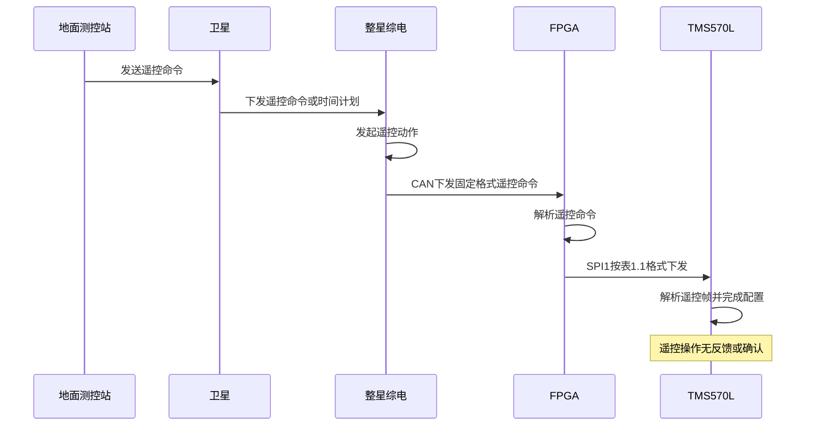
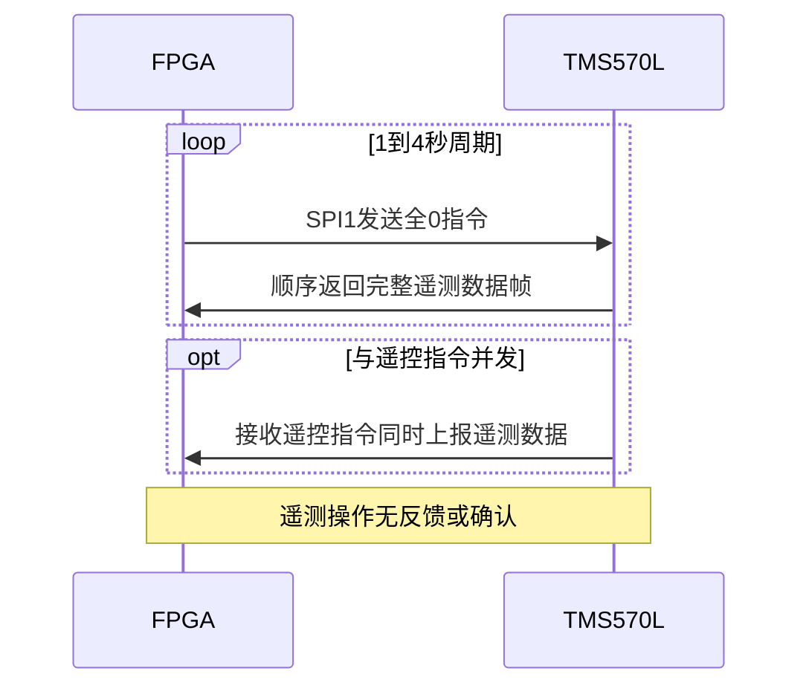
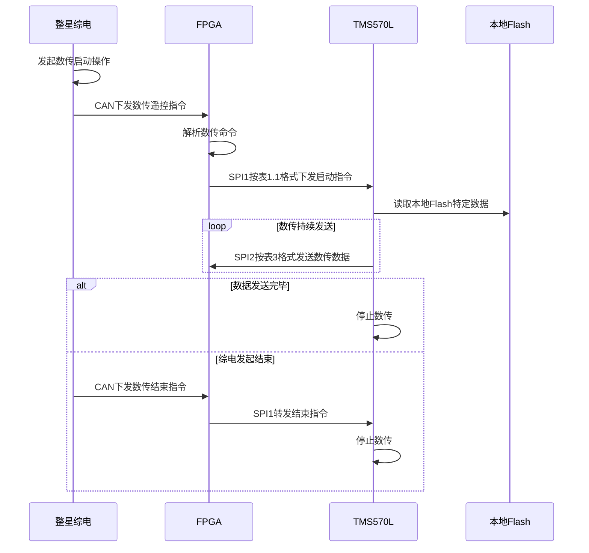
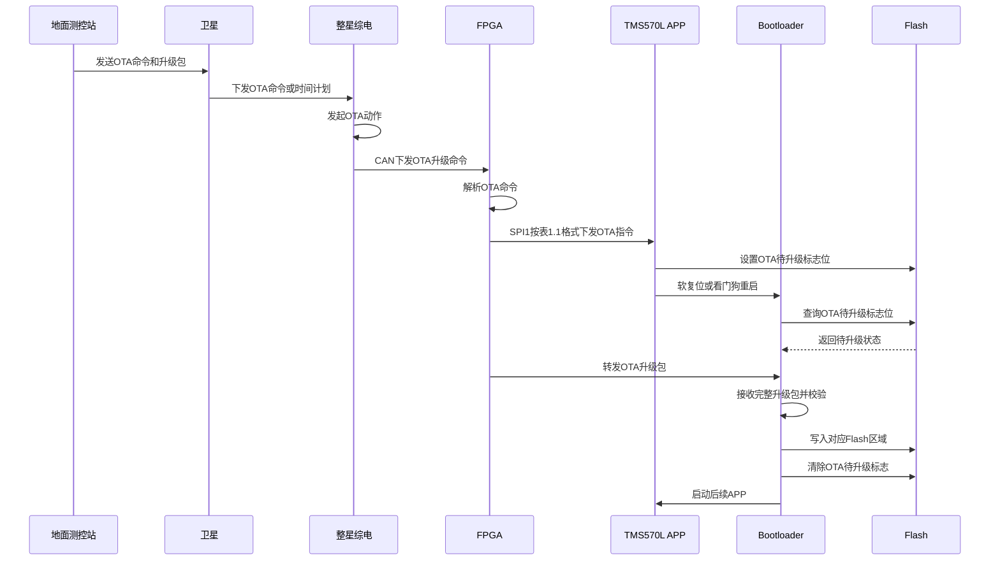
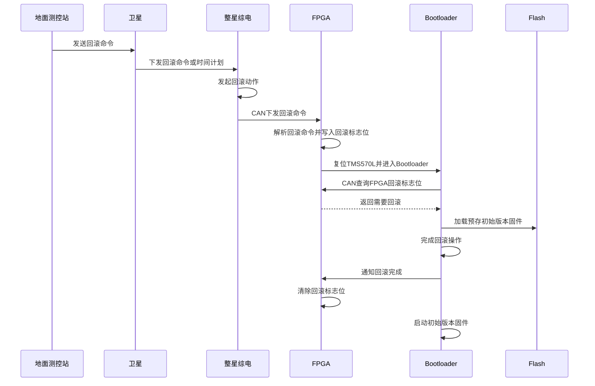

# TMS570L与FPGA通信协议

## 一、接口帧定义

### 1.1 遥控帧结构

遥控指令通过SPI1，FPGA作为SPI master，具体帧结构如下：

|  | Byte0 | Byte1 | Byte2 | Byte3 | Byte4 | Byte5 | Byte6 | Byte7 | Byte8 | Byte9 | 备注 |
| --- | --- | --- | --- | --- | --- | --- | --- | --- | --- | --- | --- |
| 指令内容 | 帧头1 | 帧头2 | 命令字 | 内容1 | 内容2 | 内容3 | 内容4 | 内容5 | 内容6 | 校验 |  |
| 工作模式 | 76H | 25H | 01H | 参数1 | AAH | AAH | AAH | AAH | AAH | B2~B8累加和 |  |
| 设置速率 | 76H | 25H | 02H | 参数1 | AAH | AAH | AAH | AAH | AAH | B2~B8累加和 |  |
| 设置时隙 | 76H | 25H | 03H | 参数1 | AAH | AAH | AAH | AAH | AAH | B2~B8累加和 |  |
| 发射功率 | 76H | 25H | 04H | 参数1 | AAH | AAH | AAH | AAH | AAH | B2~B8累加和 |  |
| 设置频率 | 76H | 25H | 05H | 参数1 | 参数2 | 参数3 | 参数4 | AAH | AAH | B2~B8累加和 |  |
| 设置射频通道 | 76H | 25H | 06H | 参数1 | AAH | AAH | AAH | AAH | AAH | B2~B8累加和 |  |
| 单机复位 | 76H | 25H | 07H | 参数1 | AAH | AAH | AAH | AAH | AAH | B2~B8累加和 |  |
| 固件升级 | 76H | 25H | 08H | 参数1 | 参数2 | 参数3 | 参数4 | 参数5 | 参数6 | B2~B8累加和 |  |
| 数据传送 | 76H | 25H | 09H | 参数1 | 参数2 | AAH | AAH | AAH | AAH | B2~B8累加和 |  |
| 写入寄存器 | 76H | 25H | 0AH | 参数1 | 参数2 | 参数3 | 参数4 | 参数5 | 参数6 | B2~B8累加和 |  |
| 读取寄存器 | 76H | 25H | 0BH | 参数1 | 参数2 | 参数3 | 参数4 | AAH | AAH | B2~B8累加和 |  |
| 版本回滚 | 76H | 25H | 0CH | 参数1 | 参数2 | 参数3 | 参数4 | 参数5 | 参数6 | B2~B8累加和 |  |
| UTC时间 | 76H | 25H | 0DH | 参数1 | 参数2 | 参数3 | 参数4 | AAH | AAH | B2~B8累加和 | 无符号整型，以UTC时间2009年1月1日0时0分0秒为起点的累积秒值整秒 |
| 配置直流参数 | 76H | 25H | 0EH | 参数1 | 参数2 | 参数3 | 参数4 | 参数5 | 参数6 | B2~B8累加和 |  |

​                                                                                                            表1 遥控指令表(MIBSPI1)

### 1.2 遥测帧结构

遥测数据指令通过SPI1，FPGA作为SPI master，FPGA发送全0数据，TMS570L作为SPI slave设备，回复完整遥测数据帧，具体帧结构如下：

| 遥测帧格式: | 遥测帧格式: | 遥测帧格式: | 遥测帧格式: | 遥测帧格式: | 遥测帧格式: |
| --- | --- | --- | --- | --- | --- |
| **数据域** | DATA0-1 | bit15~0 | 帧头 | EB90H | 备注 |
| **数据域** | DATA2-3 |  | 通道1背景噪声水平 | -255 ~0 单位dBm |  |
| **数据域** | DATA4-5 |  | 通道2背景噪声水平 | -255 ~0 单位dBm |  |
| **数据域** | DATA6-7 |  | 通道3背景噪声水平 | -255 ~0 单位dBm |  |
| **数据域** | DATA8-9 |  | 通道4背景噪声水平 | -255 ~0 单位dBm |  |
| **数据域** | DATA10-11 |  | 通道5背景噪声水平 | -255 ~0 单位dBm |  |
| **数据域** | DATA12-13 |  | 通道6背景噪声水平 | -255 ~0 单位dBm |  |
| **数据域** | DATA14-15 |  | 通道7背景噪声水平 | -255 ~0 单位dBm |  |
| **数据域** | DATA16-17 |  | 通道8背景噪声水平 | -255 ~0 单位dBm |  |
| **数据域** | DATA18-19 |  | 合路背景噪声水平 | -255 ~0 单位dBm |  |
| **数据域** | DATA20 |  | 工作模式 | 0-底噪检测、1-模式A、2-模式B、3-模式C、4-单tone模式、5-ACM校准、6-信号采集 |  |
| **数据域** | DATA21 |  | 速率配置 | 0-速率0、1-速率1、2-速率2 |  |
| **数据域** | DATA22 |  | 时隙配置 | 8bit，范围1~255，代表时隙数量 |  |
| **数据域** | DATA23 |  | 发射功率 | 8bit，范围0~255 例如：15-发射功率27dBm、14-发射功率24dBm、13-发射功率21dBm |  |
| **数据域** | DATA24-27 |  | 工作频率 | 32bit，范围0 ~ 4294967295（0~0xFFFFFFFF） 例如：503300000-代表频率506.3MHz |  |
| **数据域** | DATA28 |  | 射频通道 | 8bit，每bit对应射频通道1~8，bit=1，表示对应射频通道开启；bit=0，表示对应射频通道关闭 |  |
| **数据域** | DATA29-31 |  | 版本号 | 按照x.x.x规则定义版本号， 主版本号.次版本号.流水号 |  |
| **数据域** | DATA32-35 |  | 上电运行时间 | 32bit，范围0 ~ 4294967295，运行时间，单位秒 |  |
| **数据域** | DATA36-39 |  | 收包总数 | 32bit，范围0 ~ 4294967295，收包总数 |  |
| **数据域** | DATA40-43 |  | 发包总数 | 32bit，范围0 ~ 4294967295，发包总数 |  |
| **数据域** | DATA44 |  | 复位次数 | 8bit，范围0 ~ 255，复位次数 |  |
| **数据域** | DATA45 |  | 复位来源 | 8bit，范围0~255 |  |
| **数据域** | DATA46 |  | RAM占用率 | 8bit，范围0~99，RAM占用率（%） |  |
| **数据域** | DATA47 |  | Flash占用率 | 8bit，范围0~99，Flash占用率（%） |  |
| **数据域** | DATA48 |  | CPU占用率 | 8bit，范围0~99，CPU占用率（%） |  |
| **数据域** | DATA49-52 |  | 异常告警次数/类型 | 32bit，TBD（待定） |  |
| **数据域** | DATA53-60 |  | 终端用户接收状态 | 8bytes，TBD（待定） |  |
| **数据域** | DATA61-62 |  | TK8710终端计数器 | 16bit，范围0~65535，中断次数 |  |
| **数据域** | DATA63-70 |  | 寄存器读取结果 | 8bytes，包含设备（2B）、寄存器地址（2B）、寄存器内容（4B） |  |
| **数据域** | DATA71-74 |  | 通道1 ACM校准结果 | 32bit，通道1 ACM校准结果 |  |
| **数据域** | DATA75-78 |  | 通道2 ACM校准结果 | 32bit，通道2 ACM校准结果 |  |
| **数据域** | DATA79-82 |  | 通道3 ACM校准结果 | 32bit，通道3 ACM校准结果 |  |
| **数据域** | DATA83-86 |  | 通道4 ACM校准结果 | 32bit，通道4 ACM校准结果 |  |
| **数据域** | DATA87-90 |  | 通道5 ACM校准结果 | 32bit，通道5 ACM校准结果 |  |
| **数据域** | DATA91-94 |  | 通道6 ACM校准结果 | 32bit，通道6 ACM校准结果 |  |
| **数据域** | DATA95-98 |  | 通道7 ACM校准结果 | 32bit，通道7 ACM校准结果 |  |
| **数据域** | DATA99-102 |  | 通道8 ACM校准结果 | 32bit，通道8 ACM校准结果 |  |
| **数据域** | DATA103-104 |  | ADC1采集数据 | 16bit，ADC1采集结果 |  |
| **数据域** | DATA105-106 |  | ADC2采集数据 | 16bit，ADC2采集结果 |  |
| **数据域** | DATA107-108 |  | ADC3采集数据 | 16bit，ADC3采集结果 |  |
| **数据域** | DATA109-110 |  | ADC4采集数据 | 16bit，ADC4采集结果 |  |
| **数据域** | DATA111 |  | 遥测数据校验和 | DATA2-110的校验和 |  |

​                                                                                                                        表2 遥测信息表（MIBSPI1）

### 1.3 数传帧结构

数传帧固定最长512字节，数据内容最长502字节，具体格式如下：

| 包头 | 包头 | 包头 | 数据域 | 包尾 |
| --- | --- | --- | --- | --- |
| 数传包头 | 数据长度 | 包序号 | 数据 | 和校验 |
| 32bit | 16bit | 16bit | 长度可变，字节数为双字节，不足填充0x5A，一包数据最长502字节 | 16bit |
| 0x1ACFFC1D | 0x0001~0xFFFF | 0x0000~0xFFFF | 长度可变，字节数为双字节，不足填充0x5A，一包数据最长502字节 | 0x0000~0xFFFF |
| 固定值 | 数据域长度字节，不包含填充字节 | / | 长度可变，字节数为双字节，不足填充0x5A，一包数据最长502字节 | 包含包头、数 据域，双字节 求和取低16bit |

​                                                                                                                    表3 数传信息表（MIBSPI2）

## 二、协议交互流程

### 2.1 遥控流程

遥控基本流程，按照如下步骤进行：

（1）遥控命令，初始由地面测控站，发送给卫星

（2）接收到遥控命令/时间计划后，整星综电发起遥控动作

（3）综电通过CAN总线，按照固定格式下发给载荷的FPGA（格式在其他文档中另行定义）

（4）FPGA收到遥控命令解析后，按照本文表1.1定义的格式通过SPI1下发

（5）TMS570L作为SPI1的slave设备，接收遥控指令

（6）TMS570L解析遥控帧后，按照命令和参数进行相应配置，完成遥控操作

（7）遥控操作没有反馈或确认

### 2.2 遥测流程

遥测基本流程，按照如下步骤进行：

（1）FPGA根据预定的时间周期，例如1~4秒，启动遥测

（2）FPGA通过SPI1向TMS570L发送全0指令

（3）TMS570L接收到全0指令后，作为SPI slave设备，将遥测数据帧顺序发送给FPGA

（4）若此时正好有遥控指令操作，TMS570L也会在接收遥控指令的同时，将遥测数据上报

（5）遥测操作没有反馈或确认

### 2.3 数传流程

数传基本流程，按照如下步骤进行：

（1）整星综电发起数传启动操作

（2）综电通过CAN总线，按照固定格式（格式在其他文档中另行定义），下发数传遥控指令给FPGA

（3）FPGA收到数传命令解析后，按照本文表1.1定义的格式通过SPI1下发

（4）TMS570L作为SPI1的slave设备，接收到数传启动指令

（5）TMS570L按照本文表3定义的格式，持续将本地flash中存储的特定数据，通过SPI2发送给FPGA

（6）SPI2上，TMS570L作为master，FPGA作为slave

（7）数传的结束，可以由TMS570L决定（全部数据发送完毕，即可停止）；也可以由整星综电发起数传结束操作

### 2.4 OTA升级流程

OTA基本流程，按照如下步骤进行：

（1）OTA命令，初始由地面测控站，发送给卫星（OTA升级包，也同时上传给卫星）

（2）接收到OTA命令/时间计划后，整星综电发起OTA动作

（3）综电通过CAN总线，按照固定格式（格式在其他文档中另行定义），下发OTA升级命令给载荷的FPGA

（4）FPGA收到OTA命令解析后，按照本文表1.1定义的格式通过SPI1下发

（5）TMS570L作为SPI1的slave设备，接收OTA指令

（6）TMS570L正确解析OTA指令后，在内部flash特定标志位上，标明OTA待升级标志位，并重启TMS570L（可通过软复位或是看门狗）

（7）重启后，TMS570L的bootloader，查询flash上的标志位，获知OTA待升级后，通过CAN（TMS570L与FPGA之间），接收OTA升级包

（8）bootloader接收完整OTA升级包，并校验通过后，写入对应flash区域，然后清除OTA待升级标志，启动后续app

### 2.5 回滚流程

回滚基本流程，按照如下步骤进行：

（1）回滚命令，初始由地面测控站，发送给卫星

（2）接收到回滚命令/时间计划后，整星综电发起回滚动作

（3）综电通过CAN总线，按照固定格式（格式在其他文档中另行定义），下发回滚命令给载荷的FPGA

（4）FPGA收到回滚命令解析后，写入一个标志位，标明需要回滚（供bootloader通过CAN查询）

（5）FPGA复位TMS570L

（6）重启后，TMS570L的bootloader，通过CAN，查询FPGA上的标志位，获知需要回滚操作

（7）bootloader完成回滚操作，并通知FPGA回滚完成，清除标志位；加载flash中预存的初始版本固件启动，完成回滚

