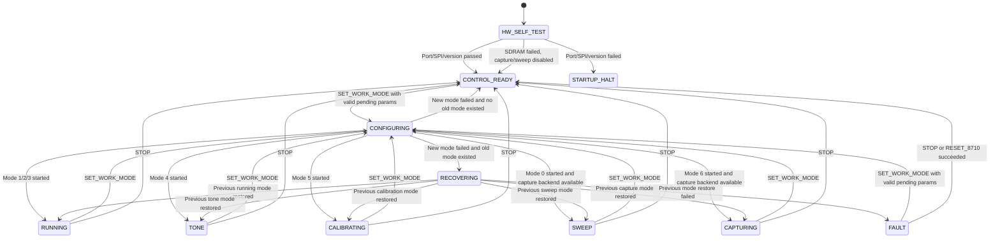
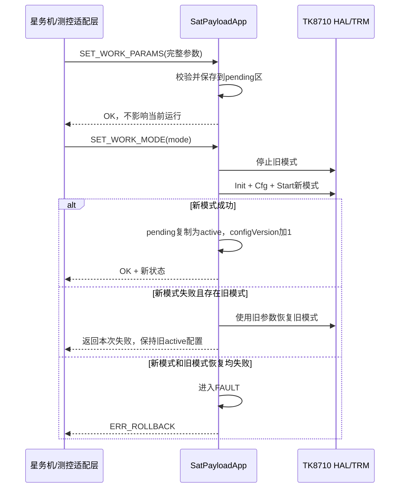

# TMS570卫星载荷遥控遥测接口说明

版本：v1.0
日期：2026-07-16
目标平台：TMS570LS3137 + TK8710
实现基线：当前TMS570卫星载荷工程

## 1. 文档范围

本文描述当前TMS570卫星载荷软件已经实现的对外控制接口，包括：

- 卫星载荷应用状态机；
- 传输无关的遥控C接口；
- 周期遥测快照C接口；
- 当前用于HDK联调的SCI AT命令；
- 尚未实现、需要在星务机通信接口确定后补充的能力。

当前尚未确定星务机与TMS570之间的物理通道和线协议。因此，本文不定义UART、CAN、SPI等具体帧格式。SCI AT命令只用于地面联调，不能直接作为最终星务遥控遥测协议。

### 1.1 软件分层

```text
星务机/地面测控系统
        |
        |  待实现：物理链路、帧格式、CRC、超时、重试、鉴权
        v
测控通信适配层
        |
        |  SatPayloadTelecommand / SatPayloadTelecommandResponse
        |  SatPayloadTelemetry
        v
tk8710_sat_payload_app
        |
        |  状态机、参数管理、模式切换、遥测快照
        v
TK8710 HAL / Payload-only TRM / Driver
        |
        v
TMS570端口层：MibSPI3/CS3、GIO、RTI、SCI、片内固定池和可选SDRAM采数区
```

当前主要实现文件：

- `../../include/tk8710_sat_payload_app.h`：对外数据类型和C接口；
- `../../source/tk8710_sat_payload_app.c`：状态机、遥控执行和遥测生成；
- `../../source/sys_main.c`：启动自检、主循环和SCI AT适配；
- `../port/tk8710_tms570.c`：TMS570硬件端口及资源统计。

## 2. 卫星载荷状态机

### 2.1 状态图



### 2.2 状态定义

状态图和表格使用不带前缀的短名称；对应C枚举均增加`SAT_PAYLOAD_STATE_`前缀，例如`FAULT`对应`SAT_PAYLOAD_STATE_FAULT`。

| 数值 | 状态 | 当前实现含义 |
| ---: | --- | --- |
| 0 | `BOOT` | 预留枚举。当前启动阶段尚未初始化应用上下文，因此遥测中通常不会看到该状态。 |
| 1 | `SELF_TEST` | 预留枚举。当前SDRAM、SPI和版本寄存器自检在`SatPayloadApp_Init()`之前执行；SDRAM失败时降级启动。 |
| 2 | `CONTROL_READY` | 自检通过或停止成功；可接收遥控，但HAL/TRM不一定正在运行。 |
| 3 | `CONFIGURING` | 正在同步停止旧模式并初始化新模式，属于短暂过渡状态。 |
| 4 | `RUNNING` | 模式A/B/C运行，实际速率、时隙和频率完全由当前工作参数决定。 |
| 5 | `SWEEP` | 从起始频率扫到结束频率；每个频点完成8天线采集和噪底计算，一轮结束后自动回到起始频率开始下一轮，直到停止或切换模式。 |
| 6 | `TONE` | 持续发送单Tone，直到停止或切换模式。 |
| 7 | `CALIBRATING` | 循环执行ACM天线校准。进入模式后立即请求一次，之后每累计10个S0且上一轮已结束时再次请求。 |
| 8 | `CAPTURING` | 周期采集8天线原始数据并计算噪底；首次等待1次MD_DATA，之后每次完整发布后等待2次MD_DATA再采集。 |
| 9 | `RECOVERING` | 新模式启动失败后，正在同步恢复旧参数和旧模式。 |
| 10 | `FAULT` | 停止失败或新旧模式均启动失败，需要遥控干预。 |

启动阶段存在独立的停机状态，不属于`SatPayloadState`：

| `g_tk8710BringupStage` | 含义 |
| ---: | --- |
| 1 | TMS570端口初始化失败 |
| 2 | SDRAM自检失败（仅保留为诊断编号；当前实现打印诊断后降级继续启动） |
| 3 | TK8710 SPI复位失败 |
| 4 | TK8710版本寄存器读取失败或值无效 |
| 5 | 已进入`CONTROL_READY` |

阶段1、3、4会进入`SatMainHalt()`死循环。阶段2不会停机：载荷继续进入`CONTROL_READY`，模式A/B/C、Tone、ACM和HAL/TRM收发仍可使用，但模式0扫频和模式6采数返回状态错误。

### 2.3 状态控制原则

1. 工作模式是持续目标状态，不会在单次动作后自动恢复默认模式。
2. 主循环在所有应用状态下持续处理GPIO中断轮询、Driver运行期看门狗、应用周期任务和遥控输入。
3. `CONFIGURING`和`RECOVERING`在当前实现中是同步过程，通常只会出现在调试器或并发回调观察中。
4. 模式A、B、C当前没有各自的内置参数表，三者的底层启动过程相同，仅保留模式编号供任务定义和遥测识别。

## 3. 遥控接口

### 3.1 对外C接口

```c
void SatPayloadApp_Init(void);
void SatPayloadApp_Process(void);

SatPayloadResult SatPayloadApp_HandleTelecommand(
    const SatPayloadTelecommand* request,
    SatPayloadTelecommandResponse* response);

SatPayloadResult SatPayloadApp_SetWorkParams(
    const SatPayloadWorkParams* params);
SatPayloadResult SatPayloadApp_SetWorkMode(uint8_t mode);
SatPayloadResult SatPayloadApp_Stop(void);
```

对外测控适配层应优先调用`SatPayloadApp_HandleTelecommand()`，以获得统一的请求号回传、执行结果和执行前后状态。后三个接口主要用于板级测试或同处理器内的直接调用。

`SatPayloadApp_Process()`必须由主循环持续调用，不能只在遥控到达时调用。它负责周期遥测、模式5循环ACM、模式C每10分钟自动ACM和循环采集任务。

### 3.2 遥控请求

```c
typedef struct {
    uint32_t requestId;
    SatPayloadTelecommandId commandId;
    SatPayloadTelecommandPayload payload;
} SatPayloadTelecommand;
```

| 字段 | 说明 |
| --- | --- |
| `requestId` | 由上位测控系统生成的请求号，用于应答匹配和重试去重。当前SCI适配未赋值，固定为0。 |
| `commandId` | 遥控命令编号。 |
| `payload` | 工作参数、工作模式或寄存器操作参数的联合体。 |

### 3.3 遥控命令表

表中命令短名称对应`SatPayloadTelecommandId`枚举，完整C名称增加`SAT_PAYLOAD_TC_`前缀，例如`SET_WORK_PARAMS`对应`SAT_PAYLOAD_TC_SET_WORK_PARAMS`，`SET_WORK_MODE`对应`SAT_PAYLOAD_TC_SET_WORK_MODE`。

| ID | 命令 | 请求参数 | 前置条件 | 当前行为 |
| ---: | --- | --- | --- | --- |
| 1 | `SET_WORK_PARAMS` | `workParams` | 参数校验通过 | 原子复制到pending区，不停止也不改变当前模式。 |
| 2 | `SET_WORK_MODE` | `workMode`，0~6 | 已存在有效pending参数 | 停止旧HAL，使用整套pending参数启动目标模式；成功后更新active参数。 |
| 3 | `STOP` | 无 | 无 | 停止扫频并复位HAL，成功后进入`CONTROL_READY`。pending参数保留。 |
| 4 | `RESET_8710` | 无 | 无 | 先执行`STOP`，再执行TK8710状态机和寄存器SPI复位；不会自动重启原模式。 |
| 5 | `REQUEST_ACM` | 无 | HAL已启动 | 提交一次异步ACM请求，成功返回`ACCEPTED`，完成结果通过遥测查询。 |
| 6 | `READ_REG` | `address` | 任意工作状态；SPI端口已初始化 | 读取8710全局寄存器，读值放入应答`value`；不切换或停止当前工作状态。 |
| 7 | `WRITE_REG` | `address, value` | 任意工作状态；SPI端口已初始化 | 写8710全局寄存器；不切换或停止当前工作状态。 |
| 8 | `READ_RF_REG` | `rfMask, address` | SPI和RF链路可用 | 读取选定RF通道寄存器，读值放入应答`value`。 |
| 9 | `WRITE_RF_REG` | `rfMask, address, value` | SPI和RF链路可用 | 写选定RF通道寄存器。 |
| 10 | `SELECT_PAYLOAD` | 预留 | 未实现 | 返回`ERR_UNSUPPORTED`。 |
| 11 | `SYSTEM_RESET` | 预留 | 未实现 | 返回`ERR_UNSUPPORTED`。 |
| 12 | `FIRMWARE_UPGRADE` | 预留 | 未实现 | 返回`ERR_UNSUPPORTED`。 |
| 13 | `SET_RF_TX_DC` | `antenna, iDc, qDc` | 天线号0~7，I/Q为16-bit | HAL运行时立即写对应天线`tx_config_29`；HAL未运行时保存到RAM，在下次初始化时生效。 |

寄存器写接口当前没有地址白名单，也不会检查是否处于运行时隙。它只适合受控调试。正式星务遥控协议应增加权限、地址白名单和危险寄存器互锁，避免运行中修改时钟、复位和中断寄存器。

### 3.4 两阶段参数生效



该机制保证速率、四时隙、频率、增益和通道掩码作为一组同时生效，避免多条独立参数命令形成混合配置。

注意：成功应用后`pendingParamsValid`仍保持1，表示系统中存在一套可用于后续`SET_WORK_MODE`的pending参数，不表示pending一定与active不同。

### 3.5 工作参数

`SatPayloadWorkParams`是应用层对象，不是线协议结构体。

| 字段 | 类型/范围 | 作用及当前校验 |
| --- | --- | --- |
| `centerFreqHz` | `uint32_t`，必须非0 | 8路RF中心频率，单位Hz；S0~S3共用。 |
| `rateCount` | 1~4 | 有效多速率配置数量。 |
| `rates[i].rateMode` | 5/6/7/8/9/10/11/18 | 8710 PHY速率模式。 |
| `rates[i].slots[0].byteLen` | 0~1023 | S0数据长度。 |
| `rates[i].slots[1].byteLen` | 0~1023 | S1数据长度。S1为0时，TMS570驱动在Master的S0回调后准备发送数据。 |
| `rates[i].slots[2].byteLen` | 0~1023 | S2数据长度。 |
| `rates[i].slots[3].byteLen` | 0~1023 | S3数据长度。 |
| `rates[i].slots[n].daM` | `uint32_t` | 兼容保留的输入字段。切换模式时根据速率、时隙字节数和超帧数自动计算并覆盖。 |
| `rxGain` | 0~255，当前无进一步校验 | RF接收增益原始值。 |
| `txGain` | 0~255，当前无进一步校验 | RF发射增益原始值。不是测控方案0~15功率等级。 |
| `antennaMask` | bit0~bit7 | 8路接收天线使能掩码。 |
| `rfMask` | bit0~bit7 | 8路RF通道选择掩码。 |
| `bcnBits` | 0~31 | BCN网络标识。 |
| `txBcnAntennaMask` | bit0~bit7 | BCN发射天线使能掩码。 |
| `plCrcEnable` | 0/1建议值 | Payload CRC使能；当前代码未显式限制为0/1。 |
| `localSync` | 0/1建议值 | 本地同步配置；当前代码未显式限制为0/1。 |
| `rxDelay` | `uint32_t` | RX延迟原始参数。 |
| `mdAgc` | `uint32_t` | 多用户数据AGC原始参数。 |
| `maxFrameCount` | 1~64 | TRM超帧帧数，同时用于自动时隙计算。 |
| `sweepStartFreqHz` | `uint32_t` | 扫频起始频率。起止频率同时为0时使用默认扫频范围。 |
| `sweepEndFreqHz` | `uint32_t` | 扫频结束频率；必须与起始频率同时配置或同时为0。 |
| `sweepMode` | 0~3 | 扫频模式；默认扫频范围固定使用模式1（125 kHz）。 |
| `toneFreq` | `uint32_t` | Driver单Tone频率原始值。 |
| `toneGain` | `uint8_t` | Driver单Tone增益原始值。 |
| `acmCalibCount` | `uint8_t` | 每次ACM请求的校准次数，0表示由TRM使用默认处理。 |
| `acmSnrThreshold` | `uint8_t` | ACM SNR门限，0表示由TRM使用默认处理。 |

当前程序还固定配置以下卫星载荷参数：

- 节点角色：`TRM_NODE_ROLE_SAT_PAYLOAD`；
- 波束用户上限：512；
- 普通波束超时：20秒；
- 地面站波束上限：5；
- 地面站波束超时：65秒；
- 终端上行缓存：128项；
- 硬件用户索引0保留，专用用户从索引1开始；
- 保留用户频偏：20000原始单位。

### 3.6 工作模式

| 模式值 | 名称 | 目标状态 | 当前TMS570支持情况 |
| ---: | --- | --- | --- |
| 0 | Sweep | `SWEEP` | 支持。结果保存在SDRAM，最多1024个频点；扫频速率模式限5~8；保持模式0时循环扫频。 |
| 1 | Mode A | `RUNNING` | 支持，参数由最近一次`SET_WORK_PARAMS`决定。 |
| 2 | Mode B | `RUNNING` | 支持，参数由最近一次`SET_WORK_PARAMS`决定。 |
| 3 | Mode C | `RUNNING` | 支持，参数由最近一次`SET_WORK_PARAMS`决定；进入后每10分钟自动提交一次ACM，上一轮未结束时顺延。 |
| 4 | Tone | `TONE` | 支持。HAL配置完成后进入持续单Tone，不执行常规`TK8710HalStart()`。 |
| 5 | Antenna calibration | `CALIBRATING` | 支持。启动常规HAL/TRM，并周期请求ACM。 |
| 6 | Capture | `CAPTURING` | 支持。使用双bank保存最新完整8天线快照，并周期更新。 |

### 3.7 遥控应答

```c
typedef struct {
    uint32_t requestId;
    SatPayloadTelecommandId commandId;
    SatPayloadResult result;
    SatPayloadState stateBefore;
    SatPayloadState stateAfter;
    uint32_t value;
} SatPayloadTelecommandResponse;
```

| 字段 | 说明 |
| --- | --- |
| `requestId` | 原样返回请求号。 |
| `commandId` | 原样返回命令号。 |
| `result` | 同步执行结果；`ACCEPTED`仅表示异步操作已受理。 |
| `stateBefore` | 执行命令前的应用状态。 |
| `stateAfter` | 执行命令后的应用状态。 |
| `value` | 全局寄存器或RF寄存器读取值；其他命令为0。 |

结果码：

| 值 | 名称 | 含义 |
| ---: | --- | --- |
| 0 | `SAT_PAYLOAD_OK` | 同步执行成功。 |
| 1 | `SAT_PAYLOAD_ACCEPTED` | 异步操作已受理，最终结果需查询遥测。 |
| -1 | `SAT_PAYLOAD_ERR_PARAM` | 空指针、未知命令或参数范围错误。 |
| -2 | `SAT_PAYLOAD_ERR_STATE` | 当前状态不满足，例如没有pending参数或HAL未启动。 |
| -3 | `SAT_PAYLOAD_ERR_DRIVER` | HAL、TRM、Driver、SPI或RF操作失败。 |
| -4 | `SAT_PAYLOAD_ERR_UNSUPPORTED` | 当前TMS570端口不支持该功能。 |
| -5 | `SAT_PAYLOAD_ERR_ROLLBACK` | 新模式失败且旧模式恢复也失败，系统进入`FAULT`。 |

## 4. 遥测接口

### 4.1 获取接口

```c
void SatPayloadApp_GetTelemetry(SatPayloadTelemetry* telemetry);
```

接口在临界区内复制完整快照，调用者获得的是副本。通信适配层应在临界区外完成序列化和发送，避免长时间关中断。

### 4.2 更新时机

- 应用初始化时生成首个快照；
- 正常主循环每1秒更新一次；
- `SET_WORK_MODE`和`STOP`结束后立即更新一次；
- `SET_WORK_PARAMS`、寄存器操作和单次ACM请求不会强制立即刷新，最迟在下一次1秒周期中反映到`lastResult`等字段。

因此，遥控完成确认应以`SatPayloadTelecommandResponse`为准，周期遥测用于状态监视，不应代替逐条遥控应答。

### 4.3 遥测字段

| 字段 | 单位/语义 | 数据源 |
| --- | --- | --- |
| `sequence` | 快照序号，每生成一次快照加1 | 应用层 |
| `uptimeMs` | 从`SatPayloadApp_Init()`开始的运行时间，ms | RTI Tick |
| `state` | 当前应用状态 | 应用状态机 |
| `activeMode` | 当前模式0~6；无活动模式时为`0xFF` | 应用状态机 |
| `pendingParamsValid` | 是否已保存过有效pending参数 | 参数管理 |
| `lastResult` | 最近一次应用遥控或周期动作结果 | 应用层 |
| `configVersion` | 成功切换模式并提交active参数的次数 | 参数管理 |
| `activeParams` | 当前成功启动的完整工作参数 | 参数管理 |
| `txCount` | TRM累计发送计数 | TRM |
| `txSuccessCount` | TRM累计发送成功计数 | TRM |
| `rxCount` | TRM累计接收计数 | TRM |
| `beamCount` | TRM当前波束数 | TRM |
| `txQueueRemaining` | 发送队列剩余可用项数，不是已排队数量 | TRM |
| `satelliteCacheCount` | 当前等待转发的终端上行缓存数，最大128 | Payload TRM |
| `satelliteGroundStationBeamCount` | 当前有效地面站波束数，最大5 | Payload TRM |
| `satelliteRouteCount` | 当前终端到地面站路由条目数，最大512 | Payload TRM |
| `satelliteBeamMissCount` | 波束未命中累计次数 | Payload TRM |
| `irqCounters[10]` | 10类TK8710中断累计次数 | Driver |
| `irqStatus` | 读取快照时的TK8710原始中断状态 | Driver寄存器 |
| `heapUsed` | 片内8 KiB应急固定堆当前已分配字节数；正常Payload路径应为0 | TMS570端口层 |
| `heapPeak` | 片内应急固定堆历史峰值字节数 | TMS570端口层 |
| `heapFailCount` | 片内应急固定堆分配失败累计次数 | TMS570端口层 |
| `spiErrorCount` | MibSPI事务失败累计次数 | TMS570端口层 |
| `gpioIrqCount` | GIOA3正常边沿和电平补偿触发总次数 | TMS570端口层 |
| `gpioIrqEdgeCount` | VIM9正常上升沿中断累计次数 | TMS570端口层 |
| `gpioIrqRecoveryCount` | 主循环检测GIOA3高电平后补偿触发累计次数 | TMS570端口层 |
| `irqStatusPollCount` | PAD_IRQ未输出时，通过1 ms周期读取`irq_res`补偿处理的累计次数 | TMS570端口层 |
| `gpioDin/gpioFlag/gpioEnable` | GIO输入、标志和中断使能寄存器快照 | TMS570端口层 |
| `vimReqMask0` | VIM 0~31通道使能快照，GIO high-level对应bit9 | TMS570端口层 |
| `gpioIrqLevel` | GIOA3当前电平 | TMS570端口层 |
| `gpioIrqCallbackConfigured` | Driver GPIO回调是否已经注册 | TMS570端口层 |
| `sdramAvailable` | 最近一次启动SDRAM自检结果：1可用，0不可用 | TMS570端口层 |
| `acmPending` | ACM请求等待执行标志 | TRM ACM |
| `acmRunning` | ACM正在执行标志 | TRM ACM |
| `acmCompletedCount` | ACM完成累计次数 | TRM ACM |
| `acmLastResult` | 最近一次ACM结果 | TRM ACM |
| `acmResult` | 片内RAM双Bank发布的最近一次完整有效校准结果，包含代次、时间戳、有效次数及8天线I/Q因子 | TRM ACM |
| `lastRx` | 最近一次上行中第一个CRC及数据读取均正确用户的片内RAM快照 | Payload应用回调 |
| `capture` | 采集状态、代次、长度、有效天线、8路噪底、错误和SPI/FFT耗时 | TMS570采集服务 |
| `sweep` | 扫频结果代次、总点数、完成点数、活动/完成状态和错误 | TRM扫频服务 |

`lastRx`字段：

| 字段 | 说明 |
| --- | --- |
| `valid` | 是否已经发布过正确用户快照；发布后为1。无正确用户的上行不会覆盖旧快照。 |
| `generation` | 正确用户快照代次；每次上行发布一个首个正确用户后加1。 |
| `userId` | 用户地址。 |
| `rateMode` | 接收速率模式。 |
| `rssi` | 接收RSSI。 |
| `snr` | 接收SNR。 |
| `freqOffset` | TRM/Driver频偏原始值。当前日志显示时会除以128转换为Hz，但遥测结构保存原值。 |
| `frequencyHz` | 接收绝对频率，按`centerFreqHz + freqOffset / 128`计算，单位Hz。 |
| `dataLen` | 用户数据长度。遥测不保存用户payload内容。 |
| `frameNo` | RX回调的超帧号。 |
| `timestampMs` | 收到该用户时的RTI Tick。 |

`lastRx`位于TMS570片内RAM，仅保存一份最新快照，不保存用户payload。下一次上行只有在
存在CRC正确且数据读取成功的用户时才覆盖；若同一次上行有多个正确用户，只保存回调顺序
中的第一个。复位或掉电后该快照丢失。

### 4.4 采集和扫频数据读取

```c
SatPayloadResult SatPayloadApp_GetCaptureInfo(TK8710CaptureInfo* info);
SatPayloadResult SatPayloadApp_ReadCaptureData(
    uint32_t generation, uint8_t antenna, uint32_t offset,
    void* data, uint32_t len);
SatPayloadResult SatPayloadApp_GetSweepResultInfo(TRM_SweepResultInfo* info);
SatPayloadResult SatPayloadApp_ReadSweepResults(
    uint32_t startIndex, TRM_SweepResultPoint* results,
    uint32_t capacity, uint32_t* resultCount);
```

- 天线编号为0~7；原始数据为小端、有符号16位I/Q交织数据，与RK3506的`AntennaDataN.bin`一致。
- Mode 5~8每根天线32768 bytes，Mode 9为16384 bytes，Mode 10为8192 bytes，Mode 11/18为4096 bytes。
- 读取原始数据时必须携带`generation`。如果采集服务已经发布新代次，旧代次读取返回参数错误，调用者应重新获取元数据。
- 每个扫频点包含`frequencyHz`和8路`float noiseDbmHz`；调用者通过起始索引和容量分块读取。
- 数据只保存在SDRAM中，复位或掉电后丢失；SDRAM自检失败时采数和扫频请求返回状态错误，当前尚未定义星务链路分包格式。

### 4.5 中断计数索引

| 索引 | 中断 |
| ---: | --- |
| 0 | `RX_BCN` |
| 1 | `BRD_UD` |
| 2 | `BRD_DATA` |
| 3 | `MD_UD` |
| 4 | `MD_DATA` |
| 5 | `S0` |
| 6 | `S1` |
| 7 | `S2` |
| 8 | `S3` |
| 9 | `ACM` |

### 4.6 当前未纳入遥测的数据

下列信息目前只存在于启动日志、调试器变量或尚无硬件数据源，未包含在`SatPayloadTelemetry`中：

| 项目 | 当前情况 | 后续建议 |
| --- | --- | --- |
| MCU软件版本、FPGA版本 | FPGA版本只在启动时打印 | 增加静态版本遥测字段 |
| 复位来源和复位次数 | `g_tk8710ResetCause`只在启动时打印 | 由启动模块持久化并加入遥测 |
| 启动自检阶段和故障详情 | 仅有bring-up变量和串口日志 | 增加启动故障保留区，供星务机读取 |
| SDRAM自检和EMIF诊断 | 启动失败时打印 | 增加最近自检结果和失败地址遥测 |
| MCU CPU负载、片内RAM/栈峰值 | 未实现采集 | 增加RTI空闲率和栈水位统计 |
| 电压、电流、温度 | 尚未接入ADC/传感器 | 在载荷平台监控层统一采集 |
| RF每通道锁定/告警状态 | 当前没有汇总遥测 | 增加8路RF状态数组 |
| 接收用户完整payload | 当前只保留摘要 | 通过业务数据通道转发，不建议塞入周期遥测 |
| 原始采集数据内容 | 已驻留SDRAM，但不放入周期遥测结构 | 通过分块读取API接入星务分包回传通道 |

## 5. SCI AT联调接口

SCI AT命令是`SatPayloadTelecommand`的板级适配，不是最终星务协议。

### 5.1 命令列表

```text
AT
AT+HELP
AT+SETPARAM=<rate>,<s0len>,<s0gap>,<s1len>,<s1gap>,<s2len>,<s2gap>,<s3len>,<s3gap>,<freq>,<rxgain>,<txgain>,<antmask>,<rfmask>
AT+SETSWEEP=<startHz>,<endHz>,<sweepMode>
AT+SWEEPRESULT=<startIndex>,<count>
AT+SETMODE=<0..6>
AT+STOP
AT+STATE
AT+TM
AT+ACM
AT+RREG=<addr>
AT+WREG=<addr>,<value>
AT+RRF=<rfmask>,<addr>
AT+WRF=<rfmask>,<addr>,<value>
AT+SETTXDC=<antenna>,<i16>,<q16>
```

十进制和`0x`前缀十六进制参数均可解析。

`AT+SETTXDC`按天线修改发射I/Q直流补偿。例如：

```text
AT+SETTXDC=0,0x0400,0x0350
```

I/Q参数按16-bit二进制补码解释，负值建议使用`0x0000`~`0xFFFF`原始值输入。成功输出中的`value`按`I[31:16] | Q[15:0]`打包。修改结果只保存在TMS570内部RAM和当前8710寄存器中，复位或掉电后恢复固件内的默认值。

### 5.2 `AT+SETPARAM`映射

SCI命令只支持单速率，固定`rateCount=1`。14个输入参数之外的字段采用以下默认值：

`s0gap`~`s3gap`参数为兼容旧调试命令而保留；执行`AT+SETMODE`时会调用卫星时隙计算器，并用计算结果覆盖这4个输入值。block数根据时隙字节数向上取整：模式18每block为40字节，其他速率模式每block为26字节。

| 字段 | SCI默认值 |
| --- | ---: |
| `bcnBits` | 0 |
| `txBcnAntennaMask` | 等于`antennaMask` |
| `plCrcEnable` | 0 |
| `localSync` | 0 |
| `rxDelay` | 0 |
| `mdAgc` | 1024 |
| `maxFrameCount` | 10 |
| `sweepStartFreqHz` | 0；进入扫频模式时解析为`centerFreqHz` |
| `sweepEndFreqHz` | 0；进入扫频模式时解析为`centerFreqHz + 875000` |
| `sweepMode` | 1（125 kHz） |
| `toneFreq` | 335544 |
| `toneGain` | 64 (`0x40`) |
| `acmCalibCount` | 1 |
| `acmSnrThreshold` | 28 |

当前卫星载荷联调示例：

```text
AT+SETPARAM=7,0,0,0,0,52,0,52,0,477800000,126,46,255,255
AT+SETMODE=2
AT+TM
```

上述Mode 7参数中，S2和S3各52字节，分别换算为2个block。时隙计算器输出的
`S0/S1/S2/S3 da_m`为`21000/0/12000/18143 us`，最终帧周期为`400000 us`。

### 5.3 扫频调试命令

多频点扫频必须先用`AT+SETPARAM`设置速率、时隙、增益和RF掩码，再设置扫频范围并进入模式0：

```text
AT+SETPARAM=7,0,0,0,0,52,0,52,0,477800000,126,46,255,255
AT+SETSWEEP=477800000,478300000,1
AT+SETMODE=0
```

`sweepMode`与步进对应关系为：0=62.5 kHz、1=125 kHz、2=250 kHz、3=500 kHz。
扫频点数按`floor((endHz-startHz)/stepHz)+1`计算，最多1024点。

如果不执行`AT+SETSWEEP`，`AT+SETPARAM`会将扫频起止频率保持为0。进入模式0时自动采用
125 kHz步进，从工作中心频率向上扫描8点，即
`centerFreqHz + {0, 125, 250, 375, 500, 625, 750, 875} kHz`。这8个频点覆盖
`[centerFreqHz, centerFreqHz + 1 MHz)`频段，并按模式0的既有行为持续循环扫频。

扫频过程中可以读取已完成结果，单次最多返回8点：

```text
AT+SWEEPRESULT=0,5
```

首行返回扫频代次、实际返回点数、完成进度、活动/完成状态和最后错误；随后每个频点一行，
格式为`POINT index=<n> freqHz=<频率> noiseDbmHz=<天线1>,...,<天线8>`。如果请求数量超过当前
已完成点数，只返回当前可用结果。分页读取时，下一次`startIndex`应等于上一次起始索引加实际返回点数。

模式0为持续扫频模式。一轮到达终止频率后不会退出`SWEEP`。本轮结束时`active`保持1、
`complete`短暂置1并保留完整结果；下一轮首次采集前将扫频`generation`加1、清零
`completedPoints`，然后从索引0开始覆盖上一轮结果。如需完整保存某一轮，通信端应在下一轮
开始前及时分页读取，或先执行`AT+STOP`。轮次完成还可通过串口的
`Frequency sweep round <n> completed`日志判断。

### 5.4 `AT+TM`输出范围

当前串口输出只展示遥测结构的一部分：

- 快照序号、运行时间、状态、模式、配置版本和最近结果；
- TRM收发、队列、缓存、路由和地面站波束统计；
- 固定堆、SPI错误和GPIO中断统计；
- 10类中断计数；
- 最近接收用户的地址、RSSI、SNR和频偏；
- ACM pending、running和完成次数；
- Capture状态、代次、有效天线、长度、错误、SPI/FFT耗时和8路噪底；
- Sweep结果代次、活动状态和完成点数。

完整遥测应通过`SatPayloadApp_GetTelemetry()`获取，不能以当前AT打印字段作为最终遥测字段全集。

## 6. 星务通信适配要求

未来确定星务机接口后，应在测控通信适配层完成以下工作，`tk8710_sat_payload_app`不直接依赖具体物理通道：

1. 明确定长帧或TLV帧格式、协议版本、命令号、载荷长度和CRC。
2. 明确多字节字段大小端。TMS570当前为TI CGT big-endian，但线协议不能依赖C结构体内存布局。
3. 必须逐字段序列化`SatPayloadWorkParams`、遥控请求、应答和遥测，禁止直接`memcpy`结构体上链路。
4. 使用`requestId`完成应答匹配、超时重试和重复命令识别。
5. `SET_WORK_PARAMS`必须作为完整参数原子下发；校验通过后，再单独下发`SET_WORK_MODE`。
6. 区分`OK`和`ACCEPTED`。异步ACM的最终状态通过周期遥测读取。
7. 通信接收中断只负责收帧入队，遥控执行应放在主循环任务上下文，不得在ISR中执行HAL初始化、SPI长事务或日志格式化。
8. 周期遥测建议由通信适配层主动读取最新快照；不同遥测通道可以读取同一快照，不应反向驱动遥测生成。
9. 对寄存器写、整机复位和固件升级增加权限校验、危险操作二次确认和操作审计。

## 7. 当前资源和能力边界

| 项目 | 当前TMS570实现 |
| --- | --- |
| SPI | MibSPI3/CS3，16 MHz，8-bit，MSB first，当前工程时钟模式 |
| TK8710中断 | J11 GIOA3 |
| TK8710硬件复位 | J11 GIOA1 |
| 外部SDRAM | 8 MiB，顶部64 KiB用于启动自检；自检失败不阻止核心业务启动 |
| 片内应急固定堆 | 8 KiB；当前Payload核心路径使用静态池，正常运行时`heapUsed/heapPeak`应为0 |
| TRM角色 | 仅`TRM_NODE_ROLE_SAT_PAYLOAD` |
| 发送队列 | 单队列，128项，按优先级值在同一队列中排序 |
| 单项发送数据 | 最大64 bytes |
| 波束释放队列 | 512项 |
| 终端上行缓存 | 128项，每项最大64 bytes |
| 终端路由表 | 512项 |
| 地面站波束 | 最大5项 |
| 卫星广播 | 不支持 |
| 文件持久化 | `StorageRead/Write/Erase`当前返回不支持 |
| Capture原始数据 | 2个ping-pong bank，每bank为8×32768 bytes，发布最新完整代次 |
| Capture FFT工作区 | 固定SDRAM约160 KiB，不使用堆和大栈数组 |
| Sweep结果 | SDRAM固定1024点，每点包含频率和8路浮点噪底 |
| ACM校准结果 | TMS570片内RAM双Bank；每Bank保存8天线I/Q因子和发布元数据，新结果完整后切换Bank |
| 当前片内RAM占用 | map为`0x341E0`，约208.5 KiB；应用RAM剩余`0xA920`，约42.3 KiB，另有5.25 KiB独立栈区 |
| 当前SDRAM占用 | map为`0xB1000`，708 KiB：Capture 672 KiB、Sweep结果36 KiB；占应用SDRAM约8.71% |
| SDRAM启动访问 | `.tk8710_sdram`为`NOINIT`，C运行库在`main()`前不清零或读取该段 |
| Capture持久化/回传 | 掉电不保存；星务分包协议和外部Flash后端尚未实现 |
| 主备切换/整机复位/升级 | 命令ID已预留，平台动作未实现 |

## 8. 接口使用约束总结

1. 上电必须通过端口、SPI和TK8710版本自检；SDRAM失败时仍具备核心遥控遥测和Payload HAL/TRM能力，但不具备采数、FFT和扫频能力。
2. 正常配置顺序固定为“完整设置工作参数”再“设置工作模式”。
3. 工作参数和遥测C结构体都不是线协议，星务适配层必须显式编解码。
4. 模式0和模式6已支持SDRAM采集；星务适配层必须使用代次和分块接口读取，不能直接访问SDRAM地址。
5. 寄存器接口属于调试能力，正式遥控必须加安全限制。
6. 遥控应答用于确认单次命令；遥测快照用于周期监控，两者不能互相替代。
7. 端口、SPI或版本自检失败会停在bring-up阶段；SDRAM失败会降级启动，并通过`sdramAvailable=0`和串口启动日志上报。
