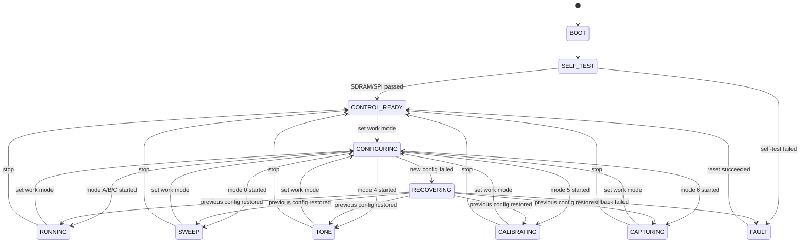

# 卫星载荷8710对外接口说明

版本：v0.3  
日期：2026-07-15  
目标平台：TMS570LS3137 + TK8710

## 1. 软件边界

卫星载荷应用由三层组成：

1. 测控通信适配层：负责未来星务机接口的收发帧、CRC、大小端和分包。
2. `tk8710_sat_payload_app`：负责状态机、遥控执行、参数管理和遥测快照。
3. TK8710 HAL/TRM/Driver：负责芯片、射频、时隙、波束和卫星转发。

当前尚未确定星务机与TMS570之间的物理通道，因此本版本只定义传输无关C接口。SCI AT命令仅用于地面验证，不是最终星务协议。

## 2. 载荷状态图



工作模式是持续状态。进入模式0~6后不会自动恢复到先前模式，只有新的设置工作模式、停止或复位遥控才能改变状态。所有非启动故障状态都继续接受允许的遥控和遥测查询。

## 3. 遥控接口

### 3.1 两阶段生效规则

遥控配置按以下顺序执行：

1. `SAT_PAYLOAD_TC_SET_WORK_PARAMS`一次下发完整工作参数，应用校验后写入待生效区，不影响当前运行。
2. `SAT_PAYLOAD_TC_SET_WORK_MODE`下发模式0~6，应用使用待生效参数停止旧模式并配置新模式。
3. 全部初始化、时隙配置和启动成功后，待生效参数才成为当前参数。
4. 新配置失败时尝试恢复旧配置；恢复成功则保持旧模式并返回本次遥控失败，恢复失败进入`FAULT`。

这种方式避免频率、速率和时隙分多条命令立即生效造成混合配置。

### 3.2 工作参数

`SatPayloadWorkParams`包含：

| 字段 | 范围 | 说明 |
| --- | --- | --- |
| `centerFreqHz` | 非0，Hz | 4个时隙共用中心频率 |
| `rateCount` | 1~4 | 多速率数量 |
| `rates[i].rateMode` | 5/6/7/8/9/10/11/18 | 8710速率模式 |
| `rates[i].slots[0..3].byteLen` | 0~1023 | S0~S3字节长度 |
| `rates[i].slots[0..3].daM` | `uint32_t` | S0~S3间隔参数 |
| `rxGain` | 0~255 | 8710 RF接收增益原始值 |
| `txGain` | 0~255 | 8710 RF发射增益原始值 |
| `antennaMask` | bit0~bit7 | 8天线接收使能 |
| `rfMask` | bit0~bit7 | 8路RF选择 |
| `bcnBits` | 0~31 | BCN网络标识 |
| `maxFrameCount` | 大于0 | 超帧帧数 |
| `sweepStartFreqHz/endFreqHz` | Hz | 模式0扫频范围 |
| `toneFreq/toneGain` | 驱动原始值 | 模式4单Tone配置 |
| `acmCalibCount/acmSnrThreshold` | 0使用TRM默认 | 模式5循环校准参数 |

测控方案中的发射功率等级为0~15且15代表27 dBm，目前缺少等级到`txGain`的射频标定表。本版本不猜测换算关系，先使用已验证的原始`txGain`；取得标定表后由通信适配层或独立换算接口完成转换。

### 3.3 工作模式

| 模式 | 状态 | 行为 |
| --- | --- | --- |
| 0 | `SWEEP` | 循环扫频；TMS570采集存储后端未接入前返回不支持 |
| 1 | `RUNNING` | 模式A，具体参数由工作参数决定 |
| 2 | `RUNNING` | 模式B，具体参数由工作参数决定 |
| 3 | `RUNNING` | 模式C，具体参数由工作参数决定 |
| 4 | `TONE` | 持续单Tone，直到收到其他模式或停止 |
| 5 | `CALIBRATING` | 按配置周期性请求ACM校准 |
| 6 | `CAPTURING` | 循环原始信号采集；存储/回传后端未接入前返回不支持 |

模式A/B/C没有在测控方案中给出固定时隙表，因此程序不内置猜测值，完全使用最近一次工作参数。

### 3.4 C接口

```c
void SatPayloadApp_Init(void);
void SatPayloadApp_Process(void);

SatPayloadResult SatPayloadApp_SetWorkParams(
    const SatPayloadWorkParams* params);

SatPayloadResult SatPayloadApp_SetWorkMode(uint8_t mode);
SatPayloadResult SatPayloadApp_Stop(void);

SatPayloadResult SatPayloadApp_HandleTelecommand(
    const SatPayloadTelecommand* request,
    SatPayloadTelecommandResponse* response);
```

`SatPayloadTelecommandResponse`返回请求号、命令号、结果、执行前状态、执行后状态和寄存器读取值。未来通信适配层必须逐字段编解码，禁止直接将C结构体作为线协议发送。

主备切换、整机OC复位和固件升级保留命令ID，当前返回`SAT_PAYLOAD_ERR_UNSUPPORTED`，后续由载荷平台控制模块接管。

## 4. 遥测接口

应用每1秒生成一次`SatPayloadTelemetry`快照，通过以下接口获取：

```c
void SatPayloadApp_GetTelemetry(SatPayloadTelemetry* telemetry);
```

遥测快照包含：

- 当前状态、工作模式、运行时间、配置版本和最近执行结果。
- 当前频率、速率、S0~S3参数、RF增益及天线/RF掩码。
- TRM收发次数、发送队列、上行缓存、终端路由、地面站波束和波束未命中次数。
- 10类8710中断计数、当前中断状态、GPIO中断次数和SPI错误次数。
- SDRAM固定堆当前值、峰值和分配失败次数。
- 最近一个接收用户的地址、速率、RSSI、SNR、频偏、长度、帧号和时间戳。
- ACM pending/running、完成次数和最近结果。

电压、电流、温度、整机CPU负载不属于8710驱动数据源，待载荷ADC和平台监控接口确定后再并入整机遥测。

## 5. TMS570资源限制

TMS570卫星载荷编译路径当前限制如下：

| 项目 | 限制 |
| --- | --- |
| TRM发送队列 | 1级，共128项 |
| 单个发送/缓存数据 | 最大64 bytes |
| 卫星上行缓存 | 128项 |
| 终端路由表 | 512项 |
| 地面站波束 | 最多5项 |
| 广播发送 | 不支持 |
| 采集文件输出 | 未实现，等待星务回传或外部Flash接口 |

## 6. SCI验证命令

SCI命令只用于当前HDK联调：

```text
AT+SETPARAM=<rate>,<s0len>,<s0gap>,<s1len>,<s1gap>,<s2len>,<s2gap>,<s3len>,<s3gap>,<freq>,<rxgain>,<txgain>,<antmask>,<rfmask>
AT+SETMODE=<0..6>
AT+STOP
AT+STATE
AT+TM
AT+ACM
AT+RREG=<addr>
AT+WREG=<addr>,<value>
AT+RRF=<rfmask>,<addr>
AT+WRF=<rfmask>,<addr>,<value>
```

示例：

```text
AT+SETPARAM=6,0,0,0,19728,22,19728,22,19728,503100000,126,42,255,255
AT+SETMODE=2
```
